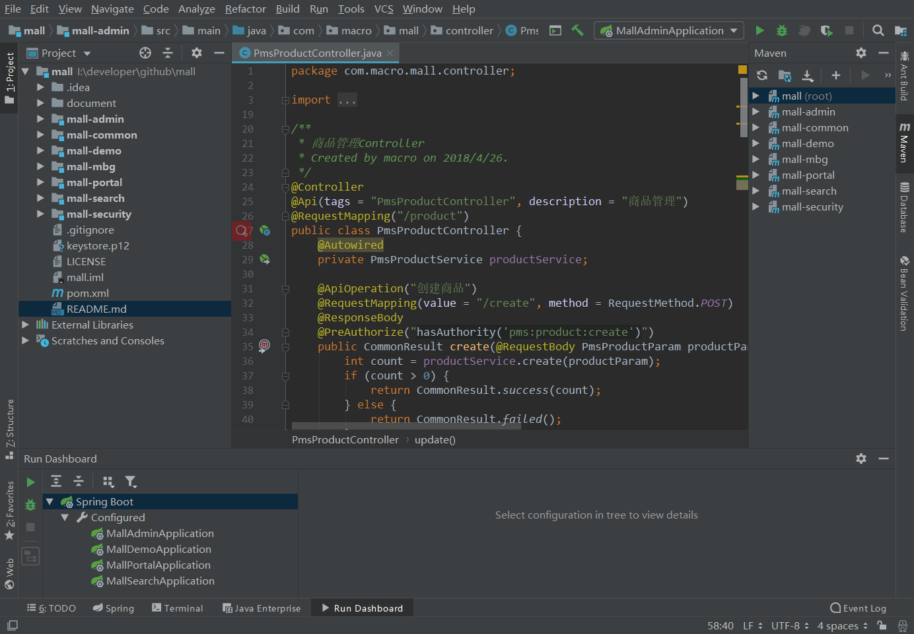
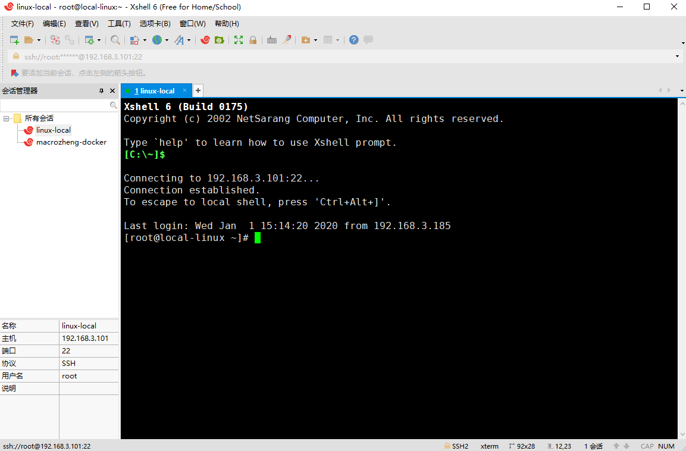
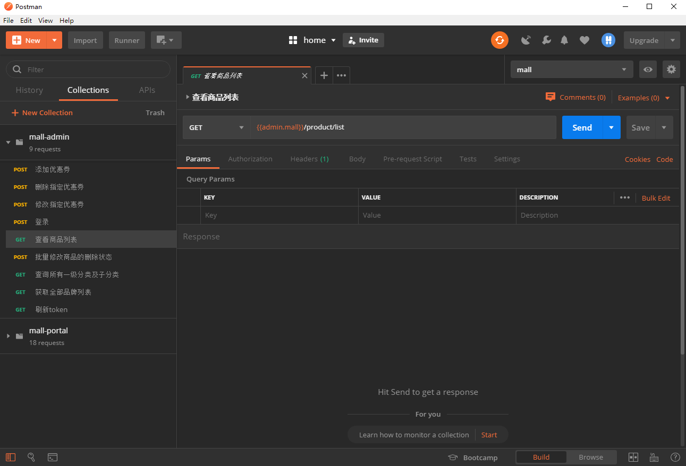
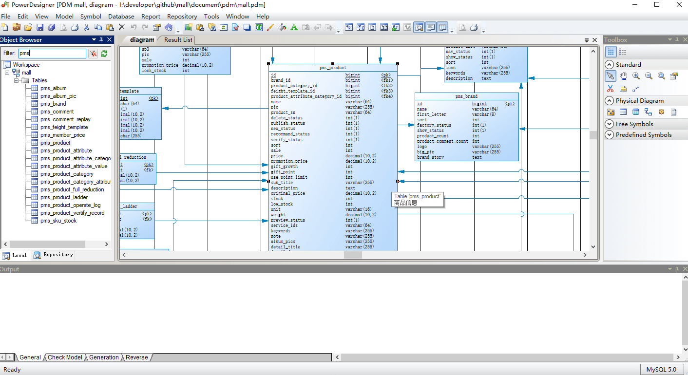
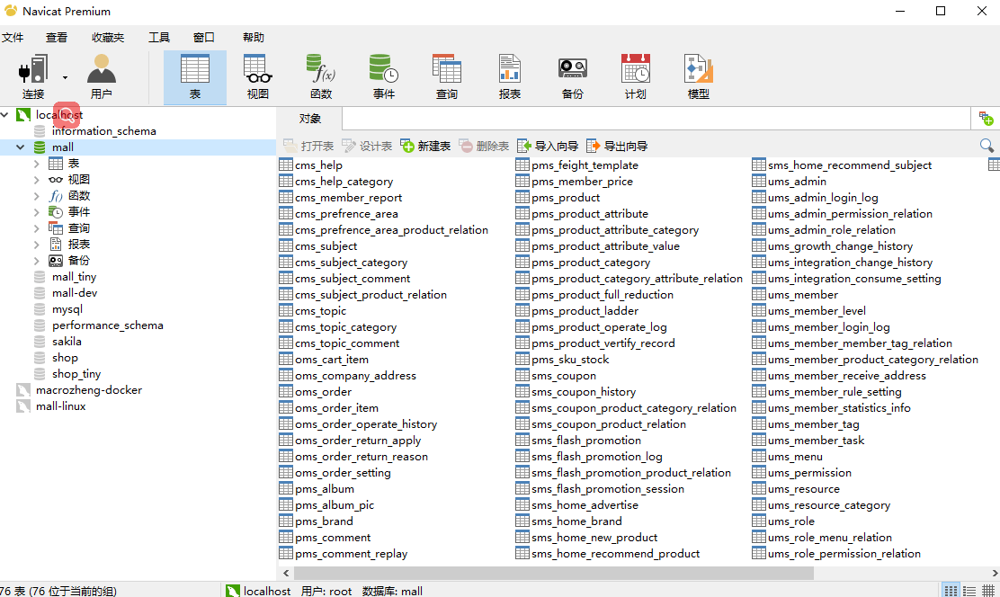
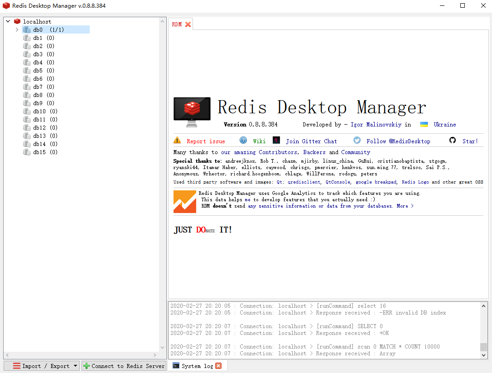
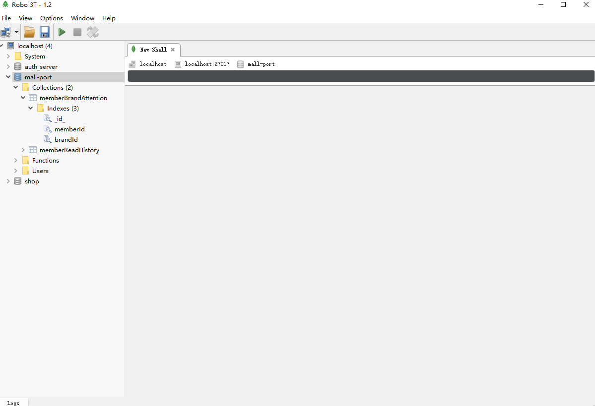
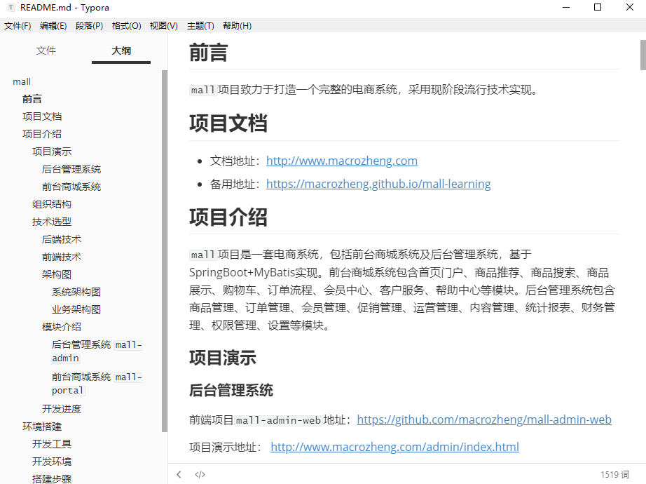
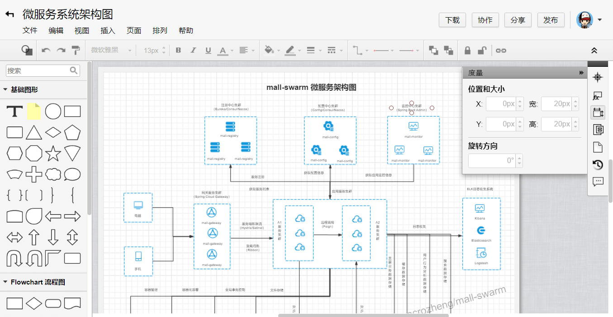
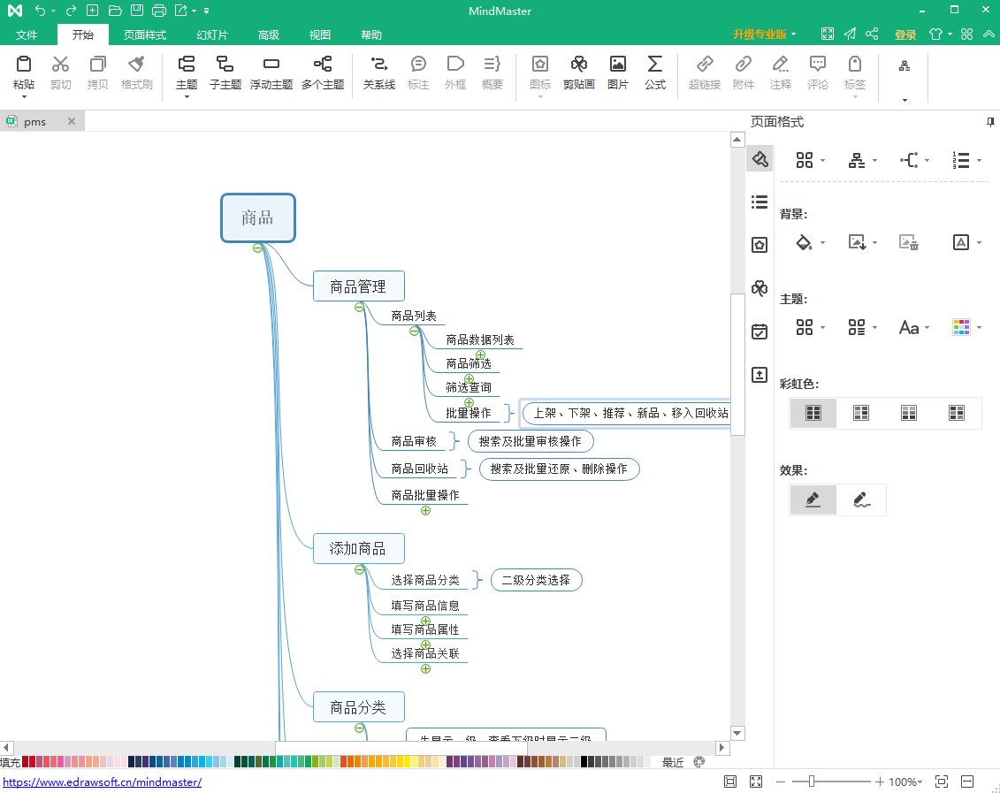

mall项目全套学习教程连载中，[关注公众号](#公众号)第一时间获取。

# 盘点下我用的顺手的那些工具！

> 之前经常有朋友问我一些常用的工具，比如我的架构图是用什么工具做的？我的数据库是用什么工具设计的？今天给大家介绍下我用的顺手的工具！

## IntelliJ IDEA

业界公认最好的Java开发工具，平时用的最多。可以安装大量插件丰富功能，开发前端应用也不在话下！

## X-shell

一款强大的安全终端模拟软件，可以用来连接和管理远程Linux服务器。

## Postman

API接口调试工具，平时用来测试开发好的接口，有时也用来格式化下JSON字符串。

## PowerDesigner

数据库设计工具，平时用来设计数据库表，设计完成之后可以直接导出数据库表。

## Navicat

数据库可视化工具，支持多种数据库，平时用来连接并管理数据库，项目上线的时候可以用来同步表结构。

## RedisDesktop

Redis可视化工具，平时用来查看和管理Redis缓存中的数据，有时候需要清空缓存的时候就用到它了。

## Robomongo

MongoDB可视化工具，平时用来查看和管理MongoDB中的数据。

## Typora

平时用来写文章的Markdown编辑器，编辑与预览二合一，界面简洁且功能强大！

## ProcessOn

作图工具，可以用来制作思维导图和流程图，mall项目的架构图就是用这个画的！

## MindMaster

好用的思维导图制作工具，设计功能的时候可以用来整理下思路。

## Snipaste

一款好用的截屏工具，文章中很多图片都是用这个截的。

## ScreenToGif

用来制作Gif的工具，mall项目功能演示的Gif就是用这个做的。

## 官网地址

- IntelliJ IDEA：https://www.jetbrains.com/idea/download
- X-shell：http://www.netsarang.com/download/software.html
- Postman：https://www.postman.com/
- PowerDesigner：http://powerdesigner.de/
- Navicat：http://www.formysql.com/xiazai.html
- RedisDesktop：https://redisdesktop.com/download
- Robomongo：https://robomongo.org/download
- Typora：https://typora.io/
- ProcessOn：https://processon.com/
- MindMaster：http://www.edrawsoft.cn/mindmaster
- Snipaste：https://www.snipaste.com/
- ScreenToGif：https://www.screentogif.com

## 公众号

