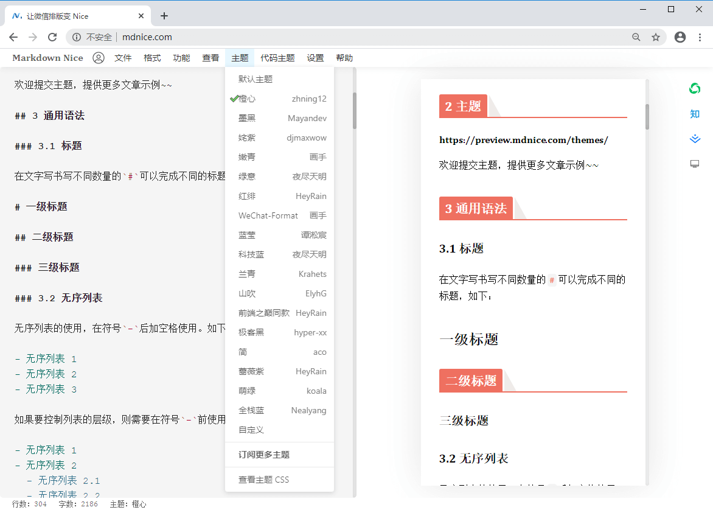
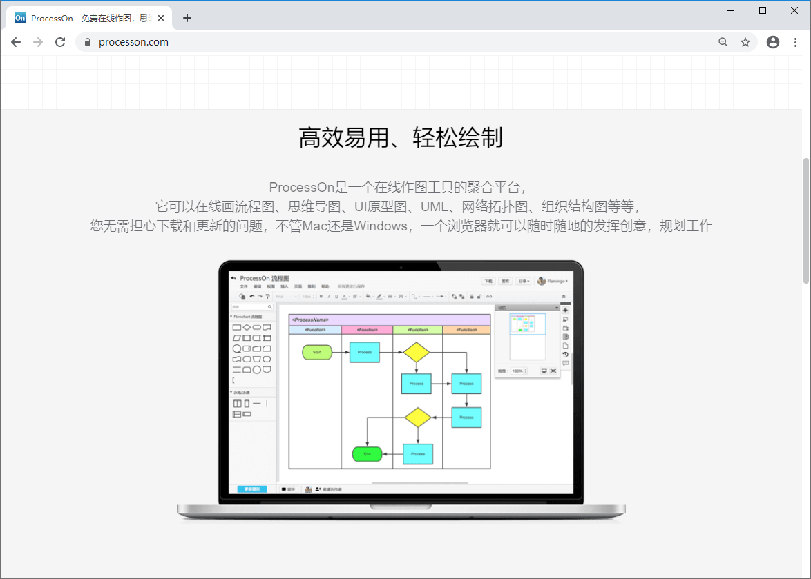
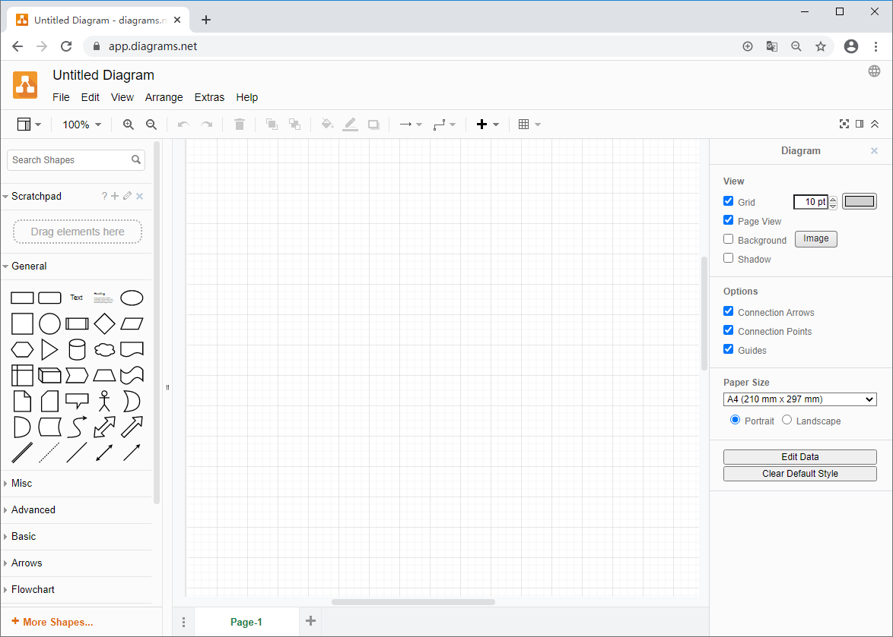
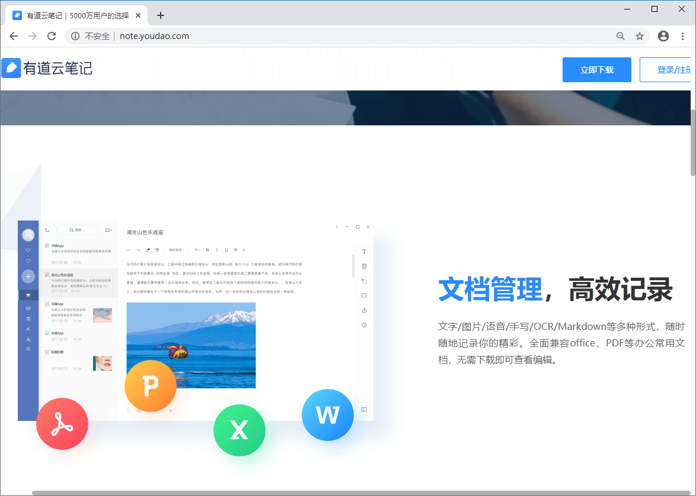
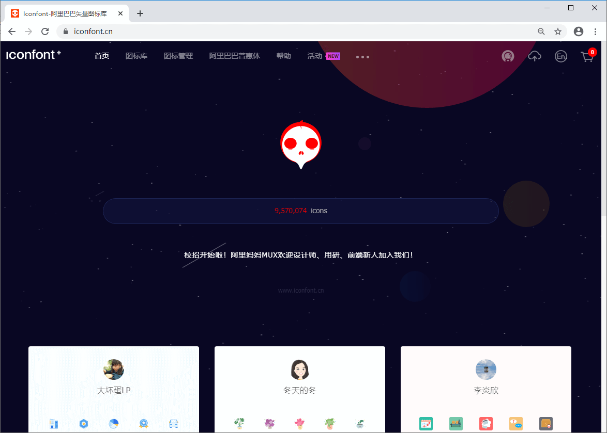
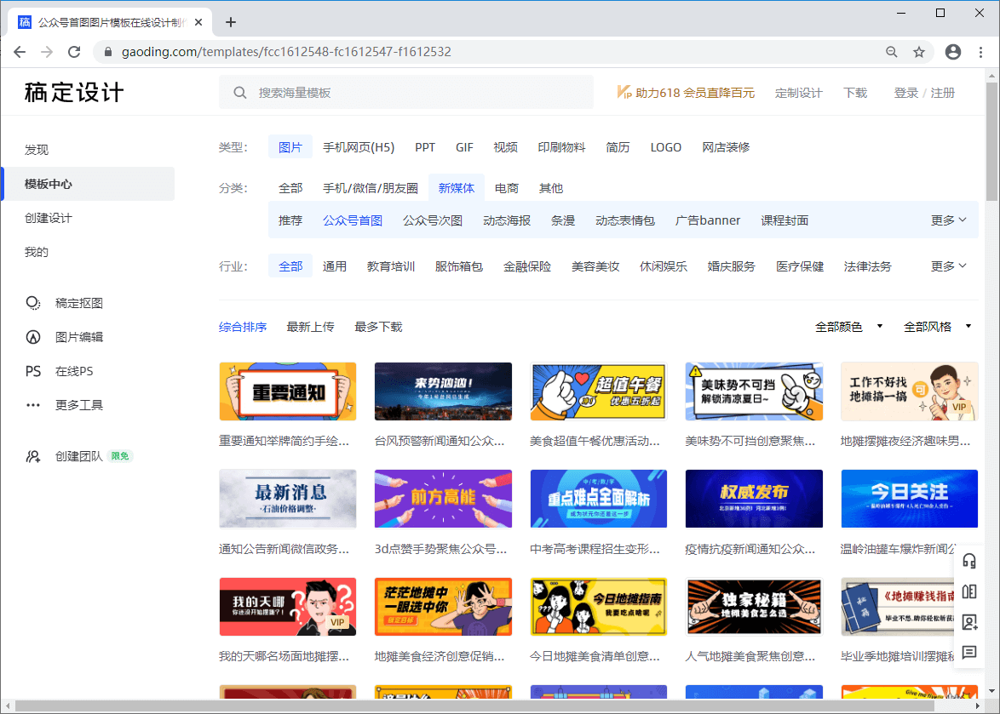
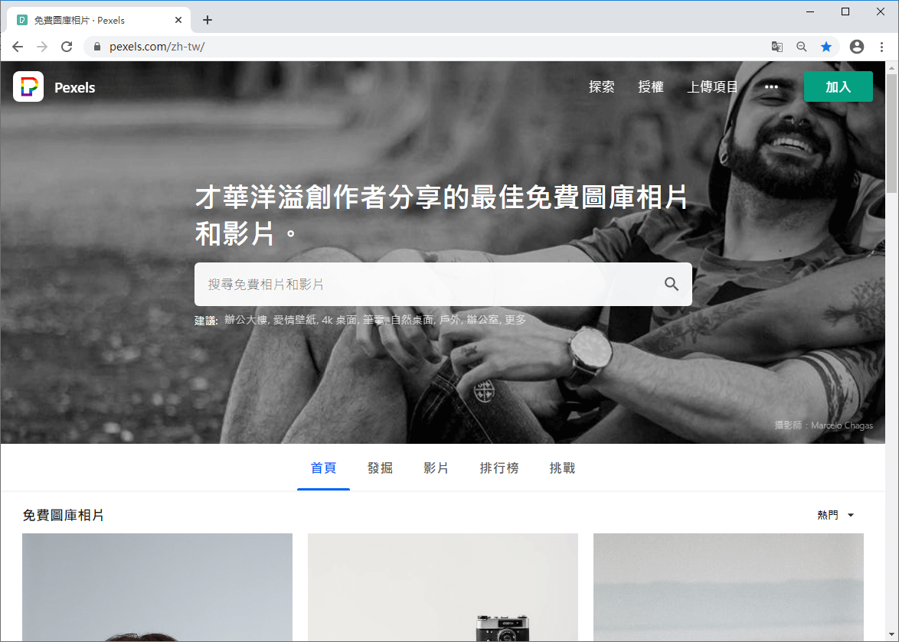
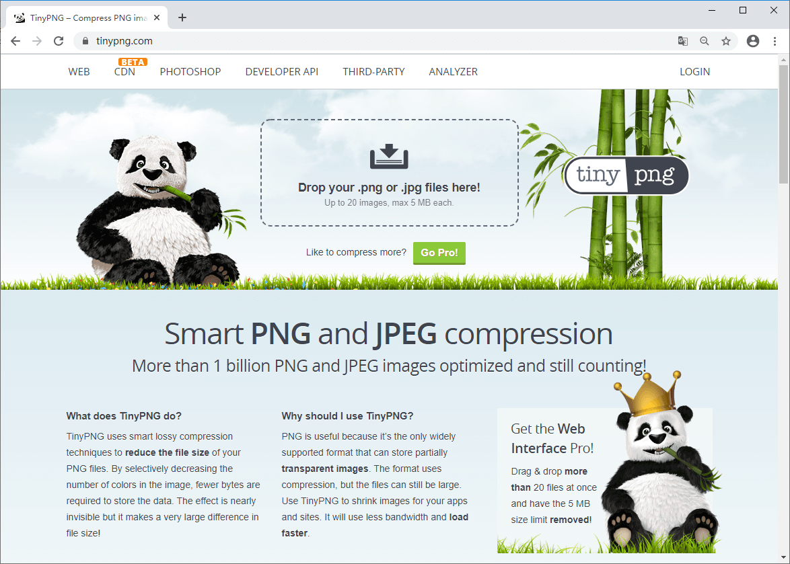
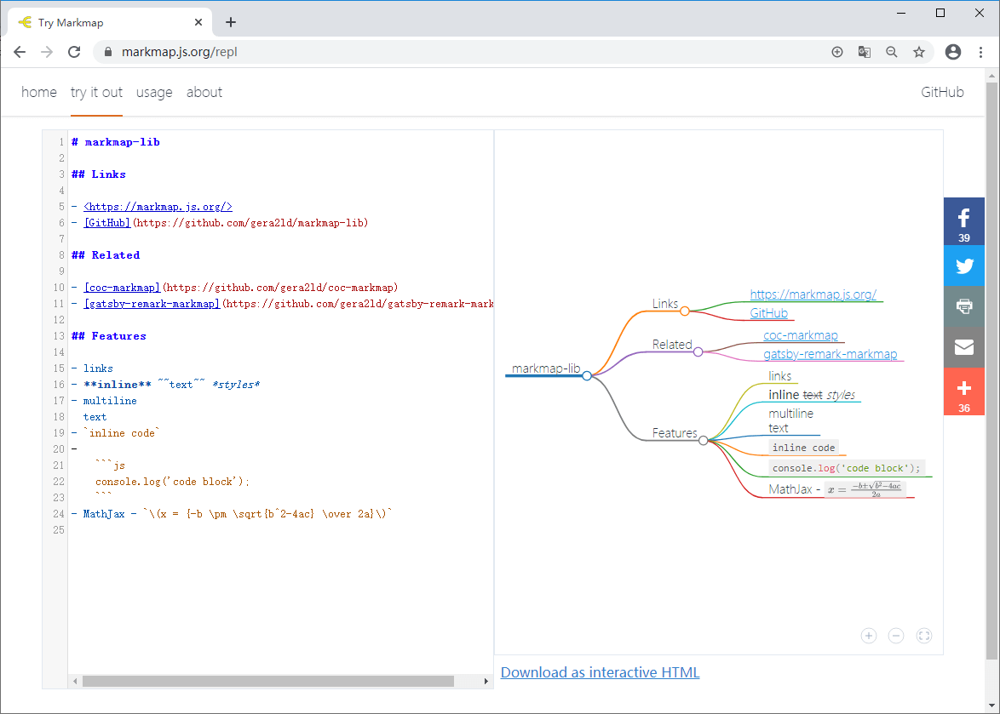
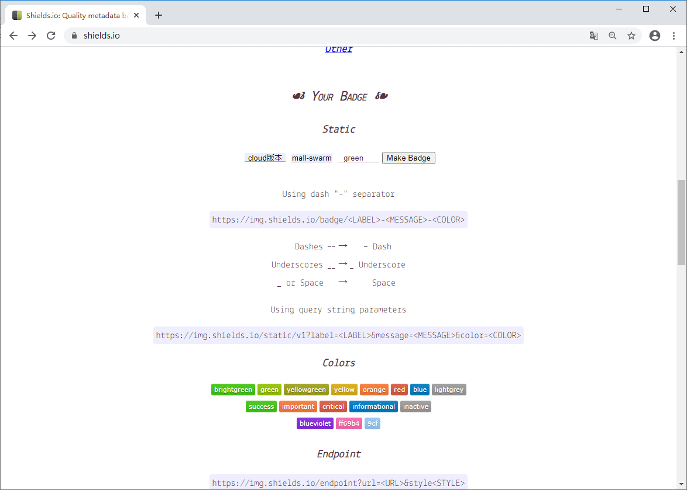

mall项目全套学习教程连载中，[关注公众号](#公众号)第一时间获取。

# 写了100多篇原创文章，我常用的在线工具网站推荐给大家！

> 不知不觉写博客已经一年多了，累计写了100多篇原创文章，今天给大家分享下我经常使用的在线工具网站，希望对大家有所帮助！

## Markdown Nice

支持自定义样式的在线Markdown编辑器，编辑完成后可以一键复制富文本到微信公众号、知乎和掘金等平台。多达17种主题，总有一种适合你的！平时用`Typora`写完文章以后，我都会用这个排版，然后复制到公众号，非常好用！

地址：https://mdnice.com/

## Process On

一款在线作图工具，支持流程图、思维导图、原型图、UML、网络拓扑图、组织结构图等。平时文章中的流程图和思维导图，我都是用这个工具画的！

地址：https://www.processon.com/

## draw.io

又一款在线作图工具，平时用来画画流程图还是很不错的，最大优点是可以将图片存储到不同的网络位置。

地址：https://www.draw.io/

## 有道云笔记

文档管理，高效记录，它还有电脑客户端和手机端，使用方便。有个在线笔记工具还是很有必要的，比如平时搜索到的一些有用的文章，我会保存到笔记中去，方便以后查阅。平时有一些想学习的技术或者需要办理的事情我也会记录下来，毕竟好记性不如烂笔头。

地址：http://note.youdao.com/

## Iconfont

阿里巴巴矢量图标库，可以根据关键字搜索的图标库。写过前端的朋友肯定很熟悉，需要图标的时候上去找就对了！还记得`mall-swarm`中的微服务架构图么，图标就是从上面找的。

地址：https://www.iconfont.cn/

## 稿定设计

做图做视频必备，在线作图神器。平时公众号的头图就是用这个做的，当然它的功能远不止这个，在线抠图、编辑图片、在线PS也都支持！

地址：https://www.gaoding.com

## Pexels

Pexels是一个提供海量共享图片素材的网站，每周都会定量更新一些图片，图片质量很不错，有时候会在上面找点图片做公众号头图。

地址：https://www.pexels.com/zh-tw/

## Tinypng

图片无损压缩网站，平时文章里面的图片我都会放到这个网站上压缩下，因为有时候公众号图片太大上传会模糊！

地址：https://tinypng.com/

## Docsmall

不仅仅能压缩图片的压缩网站，还支持GIF、PDF的压缩。打开网站看下界面，非常美观的一个网站！

地址：https://docsmall.com/

## Markmap-lib

Markdown笔记转思维导图工具，你值得拥有！

地址：https://markmap.js.org/

## Shields

徽章制作工具，很多开源项目顶部都有一些表示特定意义的徽章，其实都是用这个网站做的。

地址：https://shields.io/

## 小码短连接

简单易用的渠道短链接统计工具，可以有效缩短访问链接长度，看起来更美观，还可以统计链接访问次数，非常方便！

地址：https://xiaomark.com/

## 公众号

