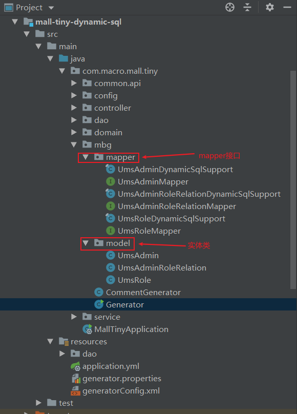

学习不走弯路，[关注公众号](#公众号) 回复「学习路线」，获取mall项目专属学习路线！

# 干掉mapper.xml！MyBatis新特性动态SQL真香！

> 当我们使用MyBatis的时候，需要在mapper.xml中书写大量的SQL语句。当我们使用MyBatis Generator（MBG）作为代码生成器时，也会生成大量的mapper.xml文件。其实从MBG 1.3.6版本以后，MyBatis官方已经推荐使用Dynamic SQL，使用这一新特性基本就不用写mapper.xml文件了，使用起来非常方便，推荐给大家！

## Dynamic SQL简介

在我们使用Spring的时候，有XML和Java两种配置方式。在使用SpringBoot时，已经推荐使用Java配置，基本不用xml配置了。使用Dynamic SQL就好比是使用Java的方式来操作MyBatis。Dynamic SQL是用于生成动态SQL语句的框架，提倡使用Java API的方式来实现SQL操作，支持复杂查询和多表查询。

Dynamic SQL具有如下特性：

- 类型安全：可以确保参数类型和数据库字段类型相匹配；
- 富有表现力：语句的构建方式可以清楚地传达其含义； 
- 使用灵活：可以使用and，or和nested条件的任意组合来构建where子句；
- 扩展性强：可以同时为MyBatis3, Spring JDBC和纯JDBC框架生成SQL语句；
- 轻量级：只需添加一个小的依赖项，没有传递依赖。

## 开始使用

> 首先我们通过一个入门示例将Dynamic SQL用起来，该示例会包含基础的CRUD操作。对MBG使用不了解的朋友可以先看下之前的文章[《解放双手！MyBatis官方代码生成工具给力！》](https://mp.weixin.qq.com/s/Wqstw_YTUBSi3sGIHZZmLQ)

### 集成Dynamic SQL

- 在`pom.xml`中添加如下依赖，对比之前使用MBG，仅仅多添加了MyBatis的动态SQL依赖；

```xml
<dependencies>
    <!--SpringBoot整合MyBatis-->
    <dependency>
        <groupId>org.mybatis.spring.boot</groupId>
        <artifactId>mybatis-spring-boot-starter</artifactId>
        <version>2.1.3</version>
    </dependency>
    <!--MyBatis分页插件-->
    <dependency>
        <groupId>com.github.pagehelper</groupId>
        <artifactId>pagehelper-spring-boot-starter</artifactId>
        <version>1.3.0</version>
    </dependency>
    <!--集成druid连接池-->
    <dependency>
        <groupId>com.alibaba</groupId>
        <artifactId>druid-spring-boot-starter</artifactId>
        <version>1.1.10</version>
    </dependency>
    <!-- MyBatis 生成器 -->
    <dependency>
        <groupId>org.mybatis.generator</groupId>
        <artifactId>mybatis-generator-core</artifactId>
        <version>1.4.0</version>
    </dependency>
    <!-- MyBatis 动态SQL支持 -->
    <dependency>
        <groupId>org.mybatis.dynamic-sql</groupId>
        <artifactId>mybatis-dynamic-sql</artifactId>
        <version>1.2.1</version>
    </dependency>
    <!--Mysql数据库驱动-->
    <dependency>
        <groupId>mysql</groupId>
        <artifactId>mysql-connector-java</artifactId>
        <version>8.0.15</version>
    </dependency>
</dependencies>
```

- 在`application.yml`中对数据源和MyBatis的`mapper.xml`文件路径进行配置，只需配置自定义mapper.xml路径即可；

```yaml
spring:
  datasource:
    url: jdbc:mysql://localhost:3306/mall?useUnicode=true&characterEncoding=utf-8&serverTimezone=Asia/Shanghai
    username: root
    password: root

mybatis:
  mapper-locations:
    - classpath:dao/*.xml
```

- 添加Java配置，用于扫描Mapper接口路径，MBG生成的放在`mapper`包下，自定义的放在`dao`包下。

```java
/**
 * MyBatis配置类
 * Created by macro on 2019/4/8.
 */
@Configuration
@MapperScan({"com.macro.mall.tiny.mbg.mapper","com.macro.mall.tiny.dao"})
public class MyBatisConfig {
}
```

### 使用代码生成器

- 在使用MBG生成代码前，我们还需要对其进行一些配置，首先在`generator.properties`文件中配置好数据库连接信息；

```
jdbc.driverClass=com.mysql.cj.jdbc.Driver
jdbc.connectionURL=jdbc:mysql://localhost:3306/mall?useUnicode=true&characterEncoding=utf-8&serverTimezone=Asia/Shanghai
jdbc.userId=root
jdbc.password=root
```

- 然后在`generatorConfig.xml`文件中对MBG进行配置，配置属性说明直接参考注释即可；

```xml
<?xml version="1.0" encoding="UTF-8"?>
<!DOCTYPE generatorConfiguration
        PUBLIC "-//mybatis.org//DTD MyBatis Generator Configuration 1.0//EN"
        "http://mybatis.org/dtd/mybatis-generator-config_1_0.dtd">

<generatorConfiguration>
    <properties resource="generator.properties"/>
    <context id="MySqlContext" targetRuntime="MyBatis3DynamicSQL">
        <property name="beginningDelimiter" value="`"/>
        <property name="endingDelimiter" value="`"/>
        <property name="javaFileEncoding" value="UTF-8"/>
        <!-- 为模型生成序列化方法-->
        <plugin type="org.mybatis.generator.plugins.SerializablePlugin"/>
        <!-- 为生成的Java模型创建一个toString方法 -->
        <plugin type="org.mybatis.generator.plugins.ToStringPlugin"/>
        <!--可以自定义生成model的代码注释-->
        <commentGenerator type="com.macro.mall.tiny.mbg.CommentGenerator">
            <!-- 是否去除自动生成的注释 true：是 ： false:否 -->
            <property name="suppressAllComments" value="true"/>
            <property name="suppressDate" value="true"/>
            <property name="addRemarkComments" value="true"/>
        </commentGenerator>
        <!--配置数据库连接-->
        <jdbcConnection driverClass="${jdbc.driverClass}"
                        connectionURL="${jdbc.connectionURL}"
                        userId="${jdbc.userId}"
                        password="${jdbc.password}">
            <!--解决mysql驱动升级到8.0后不生成指定数据库代码的问题-->
            <property name="nullCatalogMeansCurrent" value="true" />
        </jdbcConnection>
        <!--指定生成model的路径-->
        <javaModelGenerator targetPackage="com.macro.mall.tiny.mbg.model" targetProject="mall-tiny-dynamic-sql\src\main\java"/>
        <!--指定生成mapper接口的的路径-->
        <javaClientGenerator type="XMLMAPPER" targetPackage="com.macro.mall.tiny.mbg.mapper"
                             targetProject="mall-tiny-dynamic-sql\src\main\java"/>
        <!--生成全部表tableName设为%-->
        <table tableName="ums_admin">
            <generatedKey column="id" sqlStatement="MySql" identity="true"/>
        </table>
        <table tableName="ums_role">
            <generatedKey column="id" sqlStatement="MySql" identity="true"/>
        </table>
        <table tableName="ums_admin_role_relation">
            <generatedKey column="id" sqlStatement="MySql" identity="true"/>
        </table>
    </context>
</generatorConfiguration>
```

- 与之前使用MBG有所不同，`targetRuntime`需要改为`MyBatis3DynamicSql`，用于配置生成mapper.xml路径的`sqlMapGenerator`标签也不需要配置了；

- 之前使用MBG时自定义了实体类注解的生成，写了个类CommentGenerator继承DefaultCommentGenerator，在`addFieldComment`方法中将Swagger注解写入到了实体类的属性上；

```java
/**
 * 自定义注释生成器
 * Created by macro on 2018/4/26.
 */
public class CommentGenerator extends DefaultCommentGenerator {
    /**
     * 给字段添加注释
     */
    @Override
    public void addFieldComment(Field field, IntrospectedTable introspectedTable,
                                IntrospectedColumn introspectedColumn) {
        String remarks = introspectedColumn.getRemarks();
        //根据参数和备注信息判断是否添加备注信息
        if(addRemarkComments&&StringUtility.stringHasValue(remarks)){
            //数据库中特殊字符需要转义
            if(remarks.contains("\"")){
                remarks = remarks.replace("\"","'");
            }
            //给model的字段添加swagger注解
            field.addJavaDocLine("@ApiModelProperty(value = \""+remarks+"\")");
        }
    }
}
```

- 在使用Dynamic SQL的时候，这种方法已经无用，需要在`addFieldAnnotation`中将Swagger注解写入到了实体类的属性上；

```java
/**
 * 自定义注释生成器
 * Created by macro on 2018/4/26.
 */
public class CommentGenerator extends DefaultCommentGenerator {

    @Override
    public void addFieldAnnotation(Field field, IntrospectedTable introspectedTable, IntrospectedColumn introspectedColumn, Set<FullyQualifiedJavaType> imports) {
        if (!addRemarkComments || CollUtil.isEmpty(imports)) return;
        long count = imports.stream()
                .filter(item -> API_MODEL_PROPERTY_FULL_CLASS_NAME.equals(item.getFullyQualifiedName()))
                .count();
        if (count <= 0L) {
            return;
        }
        String remarks = introspectedColumn.getRemarks();
        //根据参数和备注信息判断是否添加备注信息
        if (StringUtility.stringHasValue(remarks)) {
            //数据库中特殊字符需要转义
            if (remarks.contains("\"")) {
                remarks = remarks.replace("\"", "'");
            }
            //给model的字段添加swagger注解
            field.addJavaDocLine("@ApiModelProperty(value = \"" + remarks + "\")");
        }
    }
}
```

- 一切准备就绪，执行Generator类的main方法，生成代码结构信息如下，可以发现已经不再生成mapper.xml文件和Example类，取而代之的是生成了DynamicSqlSupport类。



### 实现基本的CRUD操作

> 这里使用的是`mall-tiny`项目中权限管理功能相关表，具体可以参考[《还在从零开始搭建项目？手撸了款快速开发脚手架！》](https://mp.weixin.qq.com/s/tN3zjoKQxg1U19D4Slih8w)。

- 查看下MBG生成的Mapper接口，比之前使用MBG时增加了很多方法，并且有了一些默认的方法实现，可见之前在mapper.xml中的实现都已经转移到Mapper接口中去了，单表CRUD直接调用对应方法即可；

```java
@Mapper
public interface UmsAdminMapper {
    @Generated("org.mybatis.generator.api.MyBatisGenerator")
    BasicColumn[] selectList = BasicColumn.columnList(id, username, password, icon, email, nickName, note, createTime, loginTime, status);

    @Generated("org.mybatis.generator.api.MyBatisGenerator")
    @SelectProvider(type=SqlProviderAdapter.class, method="select")
    long count(SelectStatementProvider selectStatement);

    @Generated("org.mybatis.generator.api.MyBatisGenerator")
    @DeleteProvider(type=SqlProviderAdapter.class, method="delete")
    int delete(DeleteStatementProvider deleteStatement);

    @Generated("org.mybatis.generator.api.MyBatisGenerator")
    @InsertProvider(type=SqlProviderAdapter.class, method="insert")
    @SelectKey(statement="SELECT LAST_INSERT_ID()", keyProperty="record.id", before=false, resultType=Long.class)
    int insert(InsertStatementProvider<UmsAdmin> insertStatement);

    @Generated("org.mybatis.generator.api.MyBatisGenerator")
    @SelectProvider(type=SqlProviderAdapter.class, method="select")
    @ResultMap("UmsAdminResult")
    Optional<UmsAdmin> selectOne(SelectStatementProvider selectStatement);

    @Generated("org.mybatis.generator.api.MyBatisGenerator")
    @SelectProvider(type=SqlProviderAdapter.class, method="select")
    @Results(id="UmsAdminResult", value = {
        @Result(column="id", property="id", jdbcType=JdbcType.BIGINT, id=true),
        @Result(column="username", property="username", jdbcType=JdbcType.VARCHAR),
        @Result(column="password", property="password", jdbcType=JdbcType.VARCHAR),
        @Result(column="icon", property="icon", jdbcType=JdbcType.VARCHAR),
        @Result(column="email", property="email", jdbcType=JdbcType.VARCHAR),
        @Result(column="nick_name", property="nickName", jdbcType=JdbcType.VARCHAR),
        @Result(column="note", property="note", jdbcType=JdbcType.VARCHAR),
        @Result(column="create_time", property="createTime", jdbcType=JdbcType.TIMESTAMP),
        @Result(column="login_time", property="loginTime", jdbcType=JdbcType.TIMESTAMP),
        @Result(column="status", property="status", jdbcType=JdbcType.INTEGER)
    })
    List<UmsAdmin> selectMany(SelectStatementProvider selectStatement);

    @Generated("org.mybatis.generator.api.MyBatisGenerator")
    @UpdateProvider(type=SqlProviderAdapter.class, method="update")
    int update(UpdateStatementProvider updateStatement);

    @Generated("org.mybatis.generator.api.MyBatisGenerator")
    default long count(CountDSLCompleter completer) {
        return MyBatis3Utils.countFrom(this::count, umsAdmin, completer);
    }

    @Generated("org.mybatis.generator.api.MyBatisGenerator")
    default int delete(DeleteDSLCompleter completer) {
        return MyBatis3Utils.deleteFrom(this::delete, umsAdmin, completer);
    }

    @Generated("org.mybatis.generator.api.MyBatisGenerator")
    default int deleteByPrimaryKey(Long id_) {
        return delete(c -> 
            c.where(id, isEqualTo(id_))
        );
    }

    @Generated("org.mybatis.generator.api.MyBatisGenerator")
    default int insert(UmsAdmin record) {
        return MyBatis3Utils.insert(this::insert, record, umsAdmin, c ->
            c.map(username).toProperty("username")
            .map(password).toProperty("password")
            .map(icon).toProperty("icon")
            .map(email).toProperty("email")
            .map(nickName).toProperty("nickName")
            .map(note).toProperty("note")
            .map(createTime).toProperty("createTime")
            .map(loginTime).toProperty("loginTime")
            .map(status).toProperty("status")
        );
    }

    @Generated("org.mybatis.generator.api.MyBatisGenerator")
    default int insertSelective(UmsAdmin record) {
        return MyBatis3Utils.insert(this::insert, record, umsAdmin, c ->
            c.map(username).toPropertyWhenPresent("username", record::getUsername)
            .map(password).toPropertyWhenPresent("password", record::getPassword)
            .map(icon).toPropertyWhenPresent("icon", record::getIcon)
            .map(email).toPropertyWhenPresent("email", record::getEmail)
            .map(nickName).toPropertyWhenPresent("nickName", record::getNickName)
            .map(note).toPropertyWhenPresent("note", record::getNote)
            .map(createTime).toPropertyWhenPresent("createTime", record::getCreateTime)
            .map(loginTime).toPropertyWhenPresent("loginTime", record::getLoginTime)
            .map(status).toPropertyWhenPresent("status", record::getStatus)
        );
    }

    @Generated("org.mybatis.generator.api.MyBatisGenerator")
    default Optional<UmsAdmin> selectOne(SelectDSLCompleter completer) {
        return MyBatis3Utils.selectOne(this::selectOne, selectList, umsAdmin, completer);
    }

    @Generated("org.mybatis.generator.api.MyBatisGenerator")
    default List<UmsAdmin> select(SelectDSLCompleter completer) {
        return MyBatis3Utils.selectList(this::selectMany, selectList, umsAdmin, completer);
    }

    @Generated("org.mybatis.generator.api.MyBatisGenerator")
    default List<UmsAdmin> selectDistinct(SelectDSLCompleter completer) {
        return MyBatis3Utils.selectDistinct(this::selectMany, selectList, umsAdmin, completer);
    }

    @Generated("org.mybatis.generator.api.MyBatisGenerator")
    default Optional<UmsAdmin> selectByPrimaryKey(Long id_) {
        return selectOne(c ->
            c.where(id, isEqualTo(id_))
        );
    }

    @Generated("org.mybatis.generator.api.MyBatisGenerator")
    default int update(UpdateDSLCompleter completer) {
        return MyBatis3Utils.update(this::update, umsAdmin, completer);
    }

    @Generated("org.mybatis.generator.api.MyBatisGenerator")
    static UpdateDSL<UpdateModel> updateAllColumns(UmsAdmin record, UpdateDSL<UpdateModel> dsl) {
        return dsl.set(username).equalTo(record::getUsername)
                .set(password).equalTo(record::getPassword)
                .set(icon).equalTo(record::getIcon)
                .set(email).equalTo(record::getEmail)
                .set(nickName).equalTo(record::getNickName)
                .set(note).equalTo(record::getNote)
                .set(createTime).equalTo(record::getCreateTime)
                .set(loginTime).equalTo(record::getLoginTime)
                .set(status).equalTo(record::getStatus);
    }

    @Generated("org.mybatis.generator.api.MyBatisGenerator")
    static UpdateDSL<UpdateModel> updateSelectiveColumns(UmsAdmin record, UpdateDSL<UpdateModel> dsl) {
        return dsl.set(username).equalToWhenPresent(record::getUsername)
                .set(password).equalToWhenPresent(record::getPassword)
                .set(icon).equalToWhenPresent(record::getIcon)
                .set(email).equalToWhenPresent(record::getEmail)
                .set(nickName).equalToWhenPresent(record::getNickName)
                .set(note).equalToWhenPresent(record::getNote)
                .set(createTime).equalToWhenPresent(record::getCreateTime)
                .set(loginTime).equalToWhenPresent(record::getLoginTime)
                .set(status).equalToWhenPresent(record::getStatus);
    }

    @Generated("org.mybatis.generator.api.MyBatisGenerator")
    default int updateByPrimaryKey(UmsAdmin record) {
        return update(c ->
            c.set(username).equalTo(record::getUsername)
            .set(password).equalTo(record::getPassword)
            .set(icon).equalTo(record::getIcon)
            .set(email).equalTo(record::getEmail)
            .set(nickName).equalTo(record::getNickName)
            .set(note).equalTo(record::getNote)
            .set(createTime).equalTo(record::getCreateTime)
            .set(loginTime).equalTo(record::getLoginTime)
            .set(status).equalTo(record::getStatus)
            .where(id, isEqualTo(record::getId))
        );
    }

    @Generated("org.mybatis.generator.api.MyBatisGenerator")
    default int updateByPrimaryKeySelective(UmsAdmin record) {
        return update(c ->
            c.set(username).equalToWhenPresent(record::getUsername)
            .set(password).equalToWhenPresent(record::getPassword)
            .set(icon).equalToWhenPresent(record::getIcon)
            .set(email).equalToWhenPresent(record::getEmail)
            .set(nickName).equalToWhenPresent(record::getNickName)
            .set(note).equalToWhenPresent(record::getNote)
            .set(createTime).equalToWhenPresent(record::getCreateTime)
            .set(loginTime).equalToWhenPresent(record::getLoginTime)
            .set(status).equalToWhenPresent(record::getStatus)
            .where(id, isEqualTo(record::getId))
        );
    }
}
```

- 生成代码中有一些DynamicSqlSupport类，比如UmsAdminDynamicSqlSupport，主要是把数据库表和字段抽象成了SqlTable和SqlColumn对象，估计是为了防止我们硬编码；

```java
public final class UmsAdminDynamicSqlSupport {
    @Generated("org.mybatis.generator.api.MyBatisGenerator")
    public static final UmsAdmin umsAdmin = new UmsAdmin();

    public static final SqlColumn<Long> id = umsAdmin.id;

    public static final SqlColumn<String> username = umsAdmin.username;

    public static final SqlColumn<String> password = umsAdmin.password;

    public static final SqlColumn<String> icon = umsAdmin.icon;

    public static final SqlColumn<String> email = umsAdmin.email;

    public static final SqlColumn<String> nickName = umsAdmin.nickName;

    public static final SqlColumn<String> note = umsAdmin.note;

    public static final SqlColumn<Date> createTime = umsAdmin.createTime;

    public static final SqlColumn<Date> loginTime = umsAdmin.loginTime;

    public static final SqlColumn<Integer> status = umsAdmin.status;

    @Generated("org.mybatis.generator.api.MyBatisGenerator")
    public static final class UmsAdmin extends SqlTable {
        public final SqlColumn<Long> id = column("id", JDBCType.BIGINT);

        public final SqlColumn<String> username = column("username", JDBCType.VARCHAR);

        public final SqlColumn<String> password = column("password", JDBCType.VARCHAR);

        public final SqlColumn<String> icon = column("icon", JDBCType.VARCHAR);

        public final SqlColumn<String> email = column("email", JDBCType.VARCHAR);

        public final SqlColumn<String> nickName = column("nick_name", JDBCType.VARCHAR);

        public final SqlColumn<String> note = column("note", JDBCType.VARCHAR);

        public final SqlColumn<Date> createTime = column("create_time", JDBCType.TIMESTAMP);

        public final SqlColumn<Date> loginTime = column("login_time", JDBCType.TIMESTAMP);

        public final SqlColumn<Integer> status = column("status", JDBCType.INTEGER);

        public UmsAdmin() {
            super("ums_admin");
        }
    }
}
```

- 利用好MBG生成的代码即可完成单表的CRUD操作了，比如下面最常见的操作。

```java
/**
 * 后台用户管理Service实现类
 * Created by macro on 2020/12/8.
 */
@Service
public class UmsAdminServiceImpl implements UmsAdminService {
    @Autowired
    private UmsAdminMapper adminMapper;

    @Override
    public void create(UmsAdmin entity) {
        adminMapper.insert(entity);
    }

    @Override
    public void update(UmsAdmin entity) {
        adminMapper.updateByPrimaryKeySelective(entity);
    }

    @Override
    public void delete(Long id) {
        adminMapper.deleteByPrimaryKey(id);
    }

    @Override
    public UmsAdmin select(Long id) {
        Optional<UmsAdmin> optionalEntity = adminMapper.selectByPrimaryKey(id);
        return optionalEntity.orElse(null);
    }

    @Override
    public List<UmsAdmin> listAll(Integer pageNum, Integer pageSize) {
        PageHelper.startPage(pageNum, pageSize);
        return adminMapper.select(SelectDSLCompleter.allRows());
    }
}
```

## 进阶使用

> 想要用好Dynamic SQL，上面的基础操作是不够的，还需要一些进阶的使用技巧。

### SqlBuilder

SqlBuilder是一个非常有用的类，使用它可以灵活地构建SQL语句的条件，一些常用的条件构建方法如下。

| 条件           | 例子                                | 对应SQL                                      |
| -------------- | ----------------------------------- | -------------------------------------------- |
| Between        | where(foo, isBetween(x).and(y))     | where foo between ? and ?                    |
| Equals         | where(foo, isEqualTo(x))            | where foo = ?                                |
| Greater Than   | where(foo, isGreaterThan(x))        | where foo > ?                                |
| In             | where(foo, isIn(x, y))              | where foo in (?,?)                           |
| Like           | where(foo, isLike(x))               | where foo like ?                             |
| Not Equals     | where(foo, isNotEqualTo(x))         | where foo <> ?                               |
| Null           | where(foo, isNull())                | where foo is null                            |
| Present Equals | where(foo, isEqualToWhenPresent(x)) | where foo = ? (will render if x is non-null) |

### StatementProvider

回想一下之前我们在mapper.xml中定义select标签的方式，各个select标签相当于Statement。而这里的StatementProvider好比是Statement中参数和SQL语句的封装，方便以Java的方式创建Statement。

### 条件查询

> 使用SqlBuilder类构建StatementProvider，然后调用Mapper接口中的方法即可。

- 这里以按用户名和状态查询后台用户并按创建时间降序排列为例，SQL实现如下；

```sql
SELECT
	id,
	username,
	PASSWORD,
	icon,
	email,
	nick_name,
	note,
	create_time,
	login_time,
STATUS 
FROM
	ums_admin 
WHERE
	( username = 'macro' AND STATUS IN ( 0, 1 ) ) 
ORDER BY
	create_time DESC;
```

- 使用Dynamic SQL对应的Java代码实现如下，使用SqlBuilder的select方法可以指定查询列，使用from方法可以指定查询表，使用where方法可以构建查询条件，使用orderBy方法可以指定排序。

```java
/**
 * 后台用户管理Service实现类
 * Created by macro on 2020/12/8.
 */
@Service
public class UmsAdminServiceImpl implements UmsAdminService {
    @Override
    public List<UmsAdmin> list(Integer pageNum, Integer pageSize, String username, List<Integer> statusList) {
        PageHelper.startPage(pageNum, pageSize);
        SelectStatementProvider selectStatement = SqlBuilder.select(UmsAdminMapper.selectList)
                .from(UmsAdminDynamicSqlSupport.umsAdmin)
                .where(UmsAdminDynamicSqlSupport.username, isEqualToWhenPresent(username))
                .and(UmsAdminDynamicSqlSupport.status, isIn(statusList))
                .orderBy(UmsAdminDynamicSqlSupport.createTime.descending())
                .build()
                .render(RenderingStrategies.MYBATIS3);
        return adminMapper.selectMany(selectStatement);
    }
}
```

### Lambda条件查询

> 使用Lambda表达式实现单表条件查询更加简单，实现上面的条件查询，对应Java代码实现如下。

```java
/**
 * 后台用户管理Service实现类
 * Created by macro on 2020/12/8.
 */
@Service
public class UmsAdminServiceImpl implements UmsAdminService {
    @Override
    public List<UmsAdmin> lambdaList(Integer pageNum, Integer pageSize, String username, List<Integer> statusList) {
        PageHelper.startPage(pageNum, pageSize);
        List<UmsAdmin> list = adminMapper.select(c -> c.where(UmsAdminDynamicSqlSupport.username, isEqualToWhenPresent(username))
                .and(UmsAdminDynamicSqlSupport.status, isIn(statusList))
                .orderBy(UmsAdminDynamicSqlSupport.createTime.descending()));
        return list;
    }
}
```

### 子查询

> 之前使用MBG需要在mapper.xml中手写SQL才能实现子查询，使用Dynamic SQL可以直接在Java代码中实现。

- 这里以按角色ID查询后台用户为例，SQL实现如下；

```sql
SELECT
	* 
FROM
	ums_admin 
WHERE
	id IN ( SELECT admin_id FROM ums_admin_role_relation WHERE role_id = 1 )
```

- 使用Dynamic SQL对应的Java代码实现如下，可以发现SqlBuilder的条件构造方法isIn中还可以嵌套SqlBuilder的查询。

```java
/**
 * 后台用户管理Service实现类
 * Created by macro on 2020/12/8.
 */
@Service
public class UmsAdminServiceImpl implements UmsAdminService {
    @Override
    public List<UmsAdmin> subList(Long roleId) {
        SelectStatementProvider selectStatement = SqlBuilder.select(UmsAdminMapper.selectList)
                .from(UmsAdminDynamicSqlSupport.umsAdmin)
                .where(UmsAdminDynamicSqlSupport.id, isIn(SqlBuilder.select(UmsAdminRoleRelationDynamicSqlSupport.adminId)
                        .from(UmsAdminRoleRelationDynamicSqlSupport.umsAdminRoleRelation)
                        .where(UmsAdminRoleRelationDynamicSqlSupport.roleId, isEqualTo(roleId))))
                .build()
                .render(RenderingStrategies.MYBATIS3);
        return adminMapper.selectMany(selectStatement);
    }
}
```

### Group和Join查询

> 涉及到多表查询，之前使用MBG的时候基本只能在mapper.xml中手写SQL实现，使用Dynamic SQL可以支持多表查询。

- 这里以按角色统计后台用户数量为例，SQL实现如下；

```sql
SELECT
	ur.id AS roleId,
	ur.NAME AS roleName,
	count( ua.id ) AS count 
FROM
	ums_role ur
	LEFT JOIN ums_admin_role_relation uarr ON ur.id = uarr.role_id
	LEFT JOIN ums_admin ua ON uarr.admin_id = ua.id 
GROUP BY
	ur.id;
```

- 先在Dao中添加一个`groupList`方法，然后使用`@Results`注解定义好resultMap；

```java
/**
 * Created by macro on 2020/12/9.
 */
public interface UmsAdminDao {
    @SelectProvider(type = SqlProviderAdapter.class, method = "select")
    @Results(id = "RoleStatResult", value = {
            @Result(column = "roleId", property = "roleId", jdbcType = JdbcType.BIGINT, id = true),
            @Result(column = "roleName", property = "roleName", jdbcType = JdbcType.VARCHAR),
            @Result(column = "count", property = "count", jdbcType = JdbcType.INTEGER)
    })
    List<RoleStatDto> groupList(SelectStatementProvider selectStatement);
}
```

- 然后在Service中调用`groupList`方法传入StatementProvider即可，对应的Java代码实现如下。

```java
/**
 * 后台用户管理Service实现类
 * Created by macro on 2020/12/8.
 */
@Service
public class UmsAdminServiceImpl implements UmsAdminService {
    @Override
    public List<RoleStatDto> groupList() {
        SelectStatementProvider selectStatement = SqlBuilder.select(UmsRoleDynamicSqlSupport.id.as("roleId"), UmsRoleDynamicSqlSupport.name.as("roleName"), count(UmsAdminDynamicSqlSupport.id).as("count"))
                .from(UmsRoleDynamicSqlSupport.umsRole)
                .leftJoin(UmsAdminRoleRelationDynamicSqlSupport.umsAdminRoleRelation)
                .on(UmsRoleDynamicSqlSupport.id, equalTo(UmsAdminRoleRelationDynamicSqlSupport.roleId))
                .leftJoin(UmsAdminDynamicSqlSupport.umsAdmin)
                .on(UmsAdminRoleRelationDynamicSqlSupport.adminId, equalTo(UmsAdminDynamicSqlSupport.id))
                .groupBy(UmsRoleDynamicSqlSupport.id)
                .build()
                .render(RenderingStrategies.MYBATIS3);
        return adminDao.groupList(selectStatement);
    }
}
```

### 条件删除

> 使用Dynamic SQL实现条件删除，直接调用Mapper接口中生成好的delete方法即可。

- 这里以按用户名删除后台用户为例，SQL实现如下；

```sql
DELETE 
FROM
	ums_admin 
WHERE
	username = 'andy';
```

- 使用Dynamic SQL对应Java中的实现如下。

```java
/**
 * 后台用户管理Service实现类
 * Created by macro on 2020/12/8.
 */
@Service
public class UmsAdminServiceImpl implements UmsAdminService {
    @Override
    public void deleteByUsername(String username) {
        DeleteStatementProvider deleteStatement = SqlBuilder.deleteFrom(UmsAdminDynamicSqlSupport.umsAdmin)
                .where(UmsAdminDynamicSqlSupport.username, isEqualTo(username))
                .build()
                .render(RenderingStrategies.MYBATIS3);
        adminMapper.delete(deleteStatement);
    }
}
```

### 条件修改

> 使用Dynamic SQL实现条件修改，直接调用Mapper接口中生成好的update方法即可。

- 这里以按指定ID修改后台用户的状态为例，SQL实现如下；

```sql
UPDATE ums_admin 
SET STATUS = 1 
WHERE
	id IN ( 1, 2 );
```

- 使用Dynamic SQL对应Java中的实现如下。

```java
/**
 * 后台用户管理Service实现类
 * Created by macro on 2020/12/8.
 */
@Service
public class UmsAdminServiceImpl implements UmsAdminService {
    @Override
    public void updateByIds(List<Long> ids, Integer status) {
        UpdateStatementProvider updateStatement = SqlBuilder.update(UmsAdminDynamicSqlSupport.umsAdmin)
                .set(UmsAdminDynamicSqlSupport.status).equalTo(status)
                .where(UmsAdminDynamicSqlSupport.id, isIn(ids))
                .build()
                .render(RenderingStrategies.MYBATIS3);
        adminMapper.update(updateStatement);
    }
}
```

### 一对多查询

> 使用Dynamic SQL也可以实现一对多查询，只是由于Java注解无法实现循环引用，所以一对多的resultMap只能在mapper.xml来配置，这可能是唯一需要使用mapper.xml的地方。

- 这里以按ID查询后台用户信息（包含对应角色列表）为例，SQL实现如下；

```sql
SELECT
	ua.*,
	ur.id AS role_id,
	ur.NAME AS role_name,
	ur.description AS role_description,
	ur.create_time AS role_create_time,
	ur.STATUS AS role_status,
	ur.sort AS role_sort 
FROM
	ums_admin ua
	LEFT JOIN ums_admin_role_relation uarr ON ua.id = uarr.admin_id
	LEFT JOIN ums_role ur ON uarr.role_id = ur.id 
WHERE
	ua.id = 1
```

- 然后在Dao接口中添加`selectWithRoleList`方法，这里使用`@ResultMap`注解引用mapper.xml中定义的resultMap；

```java
/**
 * Created by macro on 2020/12/9.
 */
public interface UmsAdminDao {

    @SelectProvider(type = SqlProviderAdapter.class, method = "select")
    @ResultMap("AdminRoleResult")
    AdminRoleDto selectWithRoleList(SelectStatementProvider selectStatement);
}
```

- 在mapper.xml中添加名称为`AdminRoleResult`的resultMap，这里有个小技巧，可以直接引用在Mapper接口中定义好的resultMap；

```xml
<resultMap id="AdminRoleResult" type="com.macro.mall.tiny.domain.AdminRoleDto"
           extends="com.macro.mall.tiny.mbg.mapper.UmsAdminMapper.UmsAdminResult">
    <collection property="roleList" resultMap="com.macro.mall.tiny.mbg.mapper.UmsRoleMapper.UmsRoleResult" columnPrefix="role_">
    </collection>
</resultMap>
```

- 然后在Service实现类中调用即可，为了方便结果集映射给查询列取了别名。

```java
/**
 * 后台用户管理Service实现类
 * Created by macro on 2020/12/8.
 */
@Service
public class UmsAdminServiceImpl implements UmsAdminService {   
    @Override
    public AdminRoleDto selectWithRoleList(Long id) {
        List<BasicColumn> columnList = new ArrayList<>(CollUtil.toList(UmsAdminMapper.selectList));
        columnList.add(UmsRoleDynamicSqlSupport.id.as("role_id"));
        columnList.add(UmsRoleDynamicSqlSupport.name.as("role_name"));
        columnList.add(UmsRoleDynamicSqlSupport.description.as("role_description"));
        columnList.add(UmsRoleDynamicSqlSupport.createTime.as("role_create_time"));
        columnList.add(UmsRoleDynamicSqlSupport.status.as("role_status"));
        columnList.add(UmsRoleDynamicSqlSupport.sort.as("role_sort"));
        SelectStatementProvider selectStatement = SqlBuilder.select(columnList)
                .from(UmsAdminDynamicSqlSupport.umsAdmin)
                .leftJoin(UmsAdminRoleRelationDynamicSqlSupport.umsAdminRoleRelation)
                .on(UmsAdminDynamicSqlSupport.id, equalTo(UmsAdminRoleRelationDynamicSqlSupport.adminId))
                .leftJoin(UmsRoleDynamicSqlSupport.umsRole)
                .on(UmsAdminRoleRelationDynamicSqlSupport.roleId, equalTo(UmsRoleDynamicSqlSupport.id))
                .where(UmsAdminDynamicSqlSupport.id, isEqualTo(id))
                .build()
                .render(RenderingStrategies.MYBATIS3);
        return adminDao.selectWithRoleList(selectStatement);
    }
}
```

## 总结

当我们使用MyBatis官方代码生成器MBG时，配置的targetRuntime决定了使用它的使用方式。Dynamic SQL更倾向于使用Java API来实现SQL操作，传统的方式更倾向于在mapper.xml中手写SQL来实现SQL操作。虽然MyBatis官方推荐使用Dynamic SQL，但选择那种方式全看个人习惯了！

## 参考资料

官方文档：https://mybatis.org/mybatis-dynamic-sql/docs/introduction.html

## 项目源码地址

https://github.com/macrozheng/mall-learning/tree/master/mall-tiny-dynamic-sql

## 公众号

