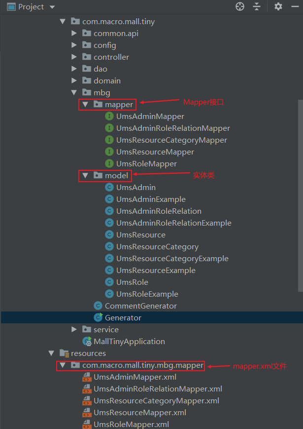
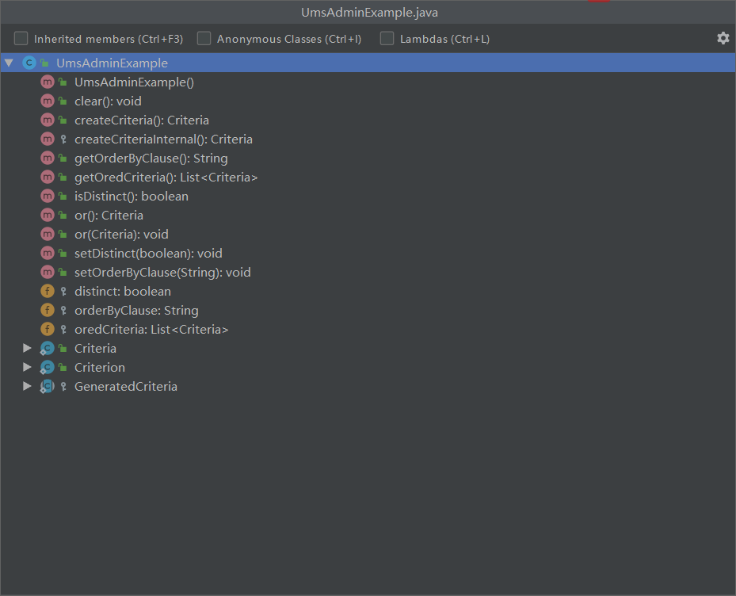

学习不走弯路，[关注公众号](#公众号) 回复「学习路线」，获取mall项目专属学习路线！

# 解放双手！MyBatis官方代码生成工具给力！

> 在我们使用MyBatis的过程中，如果所有实体类和单表CRUD代码都需要手写，那将会是一件相当麻烦的事情。MyBatis官方代码生成器MyBatis Generator可以帮助我们解决这个问题，在我的开源项目mall中也是使用的这个代码生成器，用习惯了也挺不错的。本文将介绍MyBatis Generator的使用方法及使用技巧，希望对大家有所帮助！

## 简介

MyBatis Generator（简称MBG）是MyBatis官方提供的代码生成工具。可以通过数据库表直接生成实体类、单表CRUD代码、mapper.xml文件，从而解放我们的双手！

## 开始使用

> 首先我们通过一个入门示例将MBG用起来，该示例会包含基础的CRUD操作。

### 集成MBG

- 在`pom.xml`中添加如下依赖，主要添加了MyBatis、PageHelper、Druid、MBG和MySQL驱动等依赖；

```xml
<dependencies>
    <!--SpringBoot整合MyBatis-->
    <dependency>
        <groupId>org.mybatis.spring.boot</groupId>
        <artifactId>mybatis-spring-boot-starter</artifactId>
        <version>2.1.3</version>
    </dependency>
    <!--MyBatis分页插件-->
    <dependency>
        <groupId>com.github.pagehelper</groupId>
        <artifactId>pagehelper-spring-boot-starter</artifactId>
        <version>1.3.0</version>
    </dependency>
    <!--集成druid连接池-->
    <dependency>
        <groupId>com.alibaba</groupId>
        <artifactId>druid-spring-boot-starter</artifactId>
        <version>1.1.10</version>
    </dependency>
    <!-- MyBatis 生成器 -->
    <dependency>
        <groupId>org.mybatis.generator</groupId>
        <artifactId>mybatis-generator-core</artifactId>
        <version>1.4.0</version>
    </dependency>
    <!--Mysql数据库驱动-->
    <dependency>
        <groupId>mysql</groupId>
        <artifactId>mysql-connector-java</artifactId>
        <version>8.0.15</version>
    </dependency>
</dependencies>
```

- 在`application.yml`中对数据源和MyBatis的`mapper.xml`文件路径进行配置，这里做个约定，MBG生成的放在`resources/com/**/mapper`目录下，自定义的放在`resources/dao`目录下；

```yaml
# 数据源配置
spring:
  datasource:
    url: jdbc:mysql://localhost:3306/mall?useUnicode=true&characterEncoding=utf-8&serverTimezone=Asia/Shanghai
    username: root
    password: root

# MyBatis mapper.xml路径配置
mybatis:
  mapper-locations:
    - classpath:dao/*.xml
    - classpath*:com/**/mapper/*.xml
```

- 添加Java配置，用于扫码Mapper接口路径，这里还有个约定，MBG生成的放在`mapper`包下，自定义的放在`dao`包下。

```java
/**
 * MyBatis配置类
 * Created by macro on 2019/4/8.
 */
@Configuration
@MapperScan({"com.macro.mall.tiny.mbg.mapper","com.macro.mall.tiny.dao"})
public class MyBatisConfig {
}
```

### 使用代码生成器

- 在使用MBG生成代码前，我们还需要对其进行一些配置，首先在`generator.properties`文件中配置好数据库连接信息；

```
jdbc.driverClass=com.mysql.cj.jdbc.Driver
jdbc.connectionURL=jdbc:mysql://localhost:3306/mall?useUnicode=true&characterEncoding=utf-8&serverTimezone=Asia/Shanghai
jdbc.userId=root
jdbc.password=root
```

- 然后在`generatorConfig.xml`文件中对MBG进行配置，配置属性说明直接参考注释即可；

```xml
<?xml version="1.0" encoding="UTF-8"?>
<!DOCTYPE generatorConfiguration
        PUBLIC "-//mybatis.org//DTD MyBatis Generator Configuration 1.0//EN"
        "http://mybatis.org/dtd/mybatis-generator-config_1_0.dtd">

<generatorConfiguration>
    <properties resource="generator.properties"/>
    <context id="MySqlContext" targetRuntime="MyBatis3" defaultModelType="flat">
        <property name="beginningDelimiter" value="`"/>
        <property name="endingDelimiter" value="`"/>
        <property name="javaFileEncoding" value="UTF-8"/>
        <!--生成mapper.xml时覆盖原文件-->
        <plugin type="org.mybatis.generator.plugins.UnmergeableXmlMappersPlugin" />
        <!-- 为模型生成序列化方法-->
        <plugin type="org.mybatis.generator.plugins.SerializablePlugin"/>
        <!-- 为生成的Java模型创建一个toString方法 -->
        <plugin type="org.mybatis.generator.plugins.ToStringPlugin"/>
        <!--可以自定义生成model的代码注释-->
        <commentGenerator type="com.macro.mall.tiny.mbg.CommentGenerator">
            <!-- 是否去除自动生成的注释 true：是 ： false:否 -->
            <property name="suppressAllComments" value="true"/>
            <property name="suppressDate" value="true"/>
            <property name="addRemarkComments" value="true"/>
        </commentGenerator>
        <!--配置数据库连接-->
        <jdbcConnection driverClass="${jdbc.driverClass}"
                        connectionURL="${jdbc.connectionURL}"
                        userId="${jdbc.userId}"
                        password="${jdbc.password}">
            <!--解决mysql驱动升级到8.0后不生成指定数据库代码的问题-->
            <property name="nullCatalogMeansCurrent" value="true" />
        </jdbcConnection>
        <!--指定生成model的路径-->
        <javaModelGenerator targetPackage="com.macro.mall.tiny.mbg.model" targetProject="mall-tiny-generator\src\main\java"/>
        <!--指定生成mapper.xml的路径-->
        <sqlMapGenerator targetPackage="com.macro.mall.tiny.mbg.mapper" targetProject="mall-tiny-generator\src\main\resources"/>
        <!--指定生成mapper接口的的路径-->
        <javaClientGenerator type="XMLMAPPER" targetPackage="com.macro.mall.tiny.mbg.mapper"
                             targetProject="mall-tiny-generator\src\main\java"/>
        <!--生成全部表tableName设为%-->
        <table tableName="ums_admin">
            <generatedKey column="id" sqlStatement="MySql" identity="true"/>
        </table>
        <table tableName="ums_role">
            <generatedKey column="id" sqlStatement="MySql" identity="true"/>
        </table>
        <table tableName="ums_admin_role_relation">
            <generatedKey column="id" sqlStatement="MySql" identity="true"/>
        </table>
        <table tableName="ums_resource">
            <generatedKey column="id" sqlStatement="MySql" identity="true"/>
        </table>
        <table tableName="ums_resource_category">
            <generatedKey column="id" sqlStatement="MySql" identity="true"/>
        </table>
    </context>
</generatorConfiguration>
```

- 这里值得一提的是`targetRuntime`这个属性，设置不同的属性生成的代码和生成代码的使用方式会有所不同，常用的有`MyBatis3`和`MyBatis3DynamicSql`两种，这里使用的是`MyBatis3`；

- 如果你想自定义MBG生成的代码的话，可以自己写一个CommentGenerator来继承DefaultCommentGenerator，这里我自定义了实体类代码的生成，添加了Swagger注解的支持；

```java
package com.macro.mall.tiny.mbg;

import org.mybatis.generator.api.IntrospectedColumn;
import org.mybatis.generator.api.IntrospectedTable;
import org.mybatis.generator.api.dom.java.CompilationUnit;
import org.mybatis.generator.api.dom.java.Field;
import org.mybatis.generator.api.dom.java.FullyQualifiedJavaType;
import org.mybatis.generator.internal.DefaultCommentGenerator;
import org.mybatis.generator.internal.util.StringUtility;

import java.util.Properties;

/**
 * 自定义注释生成器
 * Created by macro on 2018/4/26.
 */
public class CommentGenerator extends DefaultCommentGenerator {
    private boolean addRemarkComments = false;
    private static final String EXAMPLE_SUFFIX="Example";
    private static final String MAPPER_SUFFIX="Mapper";
    private static final String API_MODEL_PROPERTY_FULL_CLASS_NAME="io.swagger.annotations.ApiModelProperty";

    /**
     * 设置用户配置的参数
     */
    @Override
    public void addConfigurationProperties(Properties properties) {
        super.addConfigurationProperties(properties);
        this.addRemarkComments = StringUtility.isTrue(properties.getProperty("addRemarkComments"));
    }

    /**
     * 给字段添加注释
     */
    @Override
    public void addFieldComment(Field field, IntrospectedTable introspectedTable,
                                IntrospectedColumn introspectedColumn) {
        String remarks = introspectedColumn.getRemarks();
        //根据参数和备注信息判断是否添加备注信息
        if(addRemarkComments&&StringUtility.stringHasValue(remarks)){
            //数据库中特殊字符需要转义
            if(remarks.contains("\"")){
                remarks = remarks.replace("\"","'");
            }
            //给model的字段添加swagger注解
            field.addJavaDocLine("@ApiModelProperty(value = \""+remarks+"\")");
        }
    }

    @Override
    public void addJavaFileComment(CompilationUnit compilationUnit) {
        super.addJavaFileComment(compilationUnit);
        //只在model中添加swagger注解类的导入
        String fullyQualifiedName = compilationUnit.getType().getFullyQualifiedName();
        if(!fullyQualifiedName.contains(MAPPER_SUFFIX)&&!fullyQualifiedName.contains(EXAMPLE_SUFFIX)){
            compilationUnit.addImportedType(new FullyQualifiedJavaType(API_MODEL_PROPERTY_FULL_CLASS_NAME));
        }
    }
}
```

- 最后我们写个Generator类用于生成代码，直接运行main方法即可生成所有代码；

```java
/**
 * 用于生产MBG的代码
 * Created by macro on 2018/4/26.
 */
public class Generator {
    public static void main(String[] args) throws Exception {
        //MBG 执行过程中的警告信息
        List<String> warnings = new ArrayList<String>();
        //当生成的代码重复时，覆盖原代码
        boolean overwrite = true;
        //读取我们的 MBG 配置文件
        InputStream is = Generator.class.getResourceAsStream("/generatorConfig.xml");
        ConfigurationParser cp = new ConfigurationParser(warnings);
        Configuration config = cp.parseConfiguration(is);
        is.close();

        DefaultShellCallback callback = new DefaultShellCallback(overwrite);
        //创建 MBG
        MyBatisGenerator myBatisGenerator = new MyBatisGenerator(config, callback, warnings);
        //执行生成代码
        myBatisGenerator.generate(null);
        //输出警告信息
        for (String warning : warnings) {
            System.out.println(warning);
        }
    }
}
```

- 一切准备就绪，执行main方法，生成代码结构信息如下。



### 实现基本的CRUD操作

> 这里使用的是`mall-tiny`项目中权限管理功能相关表，具体可以参考[《还在从零开始搭建项目？手撸了款快速开发脚手架！》](https://mp.weixin.qq.com/s/tN3zjoKQxg1U19D4Slih8w)。

- 查看下MBG生成的Mapper接口，发现已经包含了基本的CRUD方法，具体SQL实现也已经在mapper.xml中生成了，单表CRUD直接调用对应方法即可；

```java
public interface UmsAdminMapper {
    long countByExample(UmsAdminExample example);

    int deleteByExample(UmsAdminExample example);

    int deleteByPrimaryKey(Long id);

    int insert(UmsAdmin record);

    int insertSelective(UmsAdmin record);

    List<UmsAdmin> selectByExample(UmsAdminExample example);

    UmsAdmin selectByPrimaryKey(Long id);

    int updateByExampleSelective(@Param("record") UmsAdmin record, @Param("example") UmsAdminExample example);

    int updateByExample(@Param("record") UmsAdmin record, @Param("example") UmsAdminExample example);

    int updateByPrimaryKeySelective(UmsAdmin record);

    int updateByPrimaryKey(UmsAdmin record);
}
```

- 生成代码中有一些Example类，比如UmsAdminExample，我们可以把它理解为一个条件构建器，用于构建SQL语句中的各种条件；



- 利用好MBG生成的代码即可完成单表的CRUD操作了，比如下面最常见的操作。

```java
/**
 * 后台用户管理Service实现类
 * Created by macro on 2020/12/8.
 */
@Service
public class UmsAdminServiceImpl implements UmsAdminService {
    @Autowired
    private UmsAdminMapper adminMapper;
    @Autowired
    private UmsAdminDao adminDao;

    @Override
    public void create(UmsAdmin entity) {
        adminMapper.insert(entity);
    }

    @Override
    public void update(UmsAdmin entity) {
        adminMapper.updateByPrimaryKeySelective(entity);
    }

    @Override
    public void delete(Long id) {
        adminMapper.deleteByPrimaryKey(id);
    }

    @Override
    public UmsAdmin select(Long id) {
        return adminMapper.selectByPrimaryKey(id);
    }

    @Override
    public List<UmsAdmin> listAll(Integer pageNum, Integer pageSize) {
        PageHelper.startPage(pageNum, pageSize);
        return adminMapper.selectByExample(new UmsAdminExample());
    }
}
```

## 进阶使用

> 想要用好MBG，上面的基础操作是不够的，还需要一些进阶的使用技巧。

### 条件查询

> 使用Example类构建查询条件可以很方便地实现条件查询。

- 这里以按用户名和状态查询后台用户并按创建时间降序排列为例，SQL实现如下；

```sql
SELECT
	id,
	username,
	PASSWORD,
	icon,
	email,
	nick_name,
	note,
	create_time,
	login_time,
STATUS 
FROM
	ums_admin 
WHERE
	( username = 'macro' AND STATUS IN ( 0, 1 ) ) 
ORDER BY
	create_time DESC;
```

- 对应的Java代码实现如下。

```java
/**
 * 后台用户管理Service实现类
 * Created by macro on 2020/12/8.
 */
@Service
public class UmsAdminServiceImpl implements UmsAdminService {
    
    @Override
    public List<UmsAdmin> list(Integer pageNum, Integer pageSize, String username, List<Integer> statusList) {
        PageHelper.startPage(pageNum, pageSize);
        UmsAdminExample umsAdminExample = new UmsAdminExample();
        UmsAdminExample.Criteria criteria = umsAdminExample.createCriteria();
        if(StrUtil.isNotEmpty(username)){
            criteria.andUsernameEqualTo(username);
        }
        criteria.andStatusIn(statusList);
        umsAdminExample.setOrderByClause("create_time desc");
        return adminMapper.selectByExample(umsAdminExample);
    }
}
```

### 子查询

> 使用MBG生成的代码并不能实现子查询，需要自己手写SQL实现。

- 这里以按角色ID查询后台用户为例，首先定义一个UmsAdminDao接口，这里约定下Dao里面存放的方法都是自定义SQL实现的方法，首先在Dao接口中添加`subList`方法；

```java
/**
 * Created by macro on 2020/12/9.
 */
public interface UmsAdminDao {

    List<UmsAdmin> subList(@Param("roleId") Long roleId);
}
```

- 然后创建一个UmsAdminDao.xml文件，对应UmsAdminDao接口的SQL实现，写好对应的SQL实现，注意使用的resultMap MBG已经帮我们生成好了，无需自己手写。

```xml
<select id="subList" resultMap="com.macro.mall.tiny.mbg.mapper.UmsAdminMapper.BaseResultMap">
    SELECT *
    FROM ums_admin
    WHERE id IN (SELECT admin_id FROM ums_admin_role_relation WHERE role_id = #{roleId})
</select>
```

### Group和Join查询

> Group和Join查询也不能使用MBG生成的代码实现。

- 这里以按角色统计后台用户数量为例，首先在Dao接口中添加`groupList`方法；

```java
public interface UmsAdminDao {

    List<RoleStatDto> groupList();
}
```

- 然后在mapper.xml中添加对应的SQL实现，我们可以通过给查询出来的列起别名，直接把列映射到resultType所定义的对象中去。

```xml
<select id="groupList" resultType="com.macro.mall.tiny.domain.RoleStatDto">
    SELECT ur.id        AS roleId,
           ur.NAME      AS roleName,
           count(ua.id) AS count
    FROM ums_role ur
             LEFT JOIN ums_admin_role_relation uarr ON ur.id = uarr.role_id
             LEFT JOIN ums_admin ua ON uarr.admin_id = ua.id
    GROUP BY ur.id;
</select>
```

### 条件删除

> 条件删除很简单，直接使用Example类构造删除条件即可。

- 这里以按用户名删除后台用户为例，SQL实现如下；

```sql
DELETE 
FROM
	ums_admin 
WHERE
	username = 'andy';
```

- 对应Java中的实现为。

```java
/**
 * 后台用户管理Service实现类
 * Created by macro on 2020/12/8.
 */
@Service
public class UmsAdminServiceImpl implements UmsAdminService {
    @Override
    public void deleteByUsername(String username) {
        UmsAdminExample example = new UmsAdminExample();
        example.createCriteria().andUsernameEqualTo(username);
        adminMapper.deleteByExample(example);
    }
}
```

### 条件修改

> 条件删除很简单，直接使用Example类构造修改条件，然后传入修改参数即可。

- 这里以按指定ID修改后台用户的状态为例，SQL实现如下；

```sql
UPDATE ums_admin 
SET STATUS = 1 
WHERE
	id IN ( 1, 2 );
```

- 对应Java中的实现为。

```java
/**
 * 后台用户管理Service实现类
 * Created by macro on 2020/12/8.
 */
@Service
public class UmsAdminServiceImpl implements UmsAdminService {
    @Override
    public void updateByIds(List<Long> ids, Integer status) {
        UmsAdmin record = new UmsAdmin();
        record.setStatus(status);
        UmsAdminExample example = new UmsAdminExample();
        example.createCriteria().andIdIn(ids);
        adminMapper.updateByExampleSelective(record,example);
    }
}
```

### 一对多查询

> 一对多查询无法直接使用MBG生成的代码实现，需要手写SQL实现，并使用resultMap来进行结果集映射。

- 这里以按ID查询后台用户信息（包含对应角色列表）为例，先在Dao接口中添加`selectWithRoleList`方法；

```java
/**
 * Created by macro on 2020/12/9.
 */
public interface UmsAdminDao {

    AdminRoleDto selectWithRoleList(@Param("id") Long id);
}
```

- 然后在mapper.xml中添加对应的SQL实现，这里有个小技巧，可以给角色表查询出来的列取个别名，添加一个`role_`前缀；

```xml
<select id="selectWithRoleList" resultMap="AdminRoleResult">
    SELECT ua.*,
           ur.id          AS role_id,
           ur.NAME        AS role_name,
           ur.description AS role_description,
           ur.create_time AS role_create_time,
           ur.STATUS      AS role_status,
           ur.sort        AS role_sort
    FROM ums_admin ua
             LEFT JOIN ums_admin_role_relation uarr ON ua.id = uarr.admin_id
             LEFT JOIN ums_role ur ON uarr.role_id = ur.id
    WHERE ua.id = #{id}
</select>
```

- 然后定义一个叫做`AdminRoleResult`的ResultMap，通过`collection`标签直接将以`role_`开头的列映射到UmsRole对象中去即可。

```xml
<resultMap id="AdminRoleResult" type="com.macro.mall.tiny.domain.AdminRoleDto"
           extends="com.macro.mall.tiny.mbg.mapper.UmsAdminMapper.BaseResultMap">
    <collection property="roleList" resultMap="com.macro.mall.tiny.mbg.mapper.UmsRoleMapper.BaseResultMap"
                columnPrefix="role_">
    </collection>
</resultMap>
```

### 一对一查询

> 一对一查询无法直接使用MBG生成的代码实现，需要手写SQL实现，并使用resultMap来进行结果集映射。

- 这里以按ID查询资源信息（包括分类信息）为例，先在Dao接口中添加`selectResourceWithCate`方法；

```java
/**
 * Created by macro on 2020/12/9.
 */
public interface UmsAdminDao {

    ResourceWithCateDto selectResourceWithCate(@Param("id")Long id);
}
```

- 然后在mapper.xml中添加对应的SQL实现，可以给分类表查询出来的列取个别名，添加一个`cate_`前缀；

```xml
<select id="selectResourceWithCate" resultMap="ResourceWithCateResult">
    SELECT ur.*,
           urc.id          AS cate_id,
           urc.`name`      AS cate_name,
           urc.create_time AS cate_create_time,
           urc.sort        AS cate_sort
    FROM ums_resource ur
             LEFT JOIN ums_resource_category urc ON ur.category_id = urc.id
    WHERE ur.id = #{id}
</select>
```

- 然后定义一个叫做`ResourceWithCateResult`的ResultMap，通过`association`标签直接将以`cate_`开头的列映射到UmsResourceCategory对象中去即可。

```xml
<resultMap id="ResourceWithCateResult" type="com.macro.mall.tiny.domain.ResourceWithCateDto"
           extends="com.macro.mall.tiny.mbg.mapper.UmsResourceMapper.BaseResultMap">
    <association property="resourceCategory"
                 resultMap="com.macro.mall.tiny.mbg.mapper.UmsResourceCategoryMapper.BaseResultMap"
                 columnPrefix="cate_">
    </association>
</resultMap>
```

## 总结

总的来说MyBatis官方代码生成器MBG还是很强大的，可以生成一些常用的单表CRUD方法，减少了我们的工作量。但是对于子查询、多表查询和一些复杂查询支持有点偏弱，依然需要在mapper.xml中手写SQL实现。

## 参考资料

官方文档：https://mybatis.org/generator/index.html

## 项目源码地址

https://github.com/macrozheng/mall-learning/tree/master/mall-tiny-generator

## 公众号

