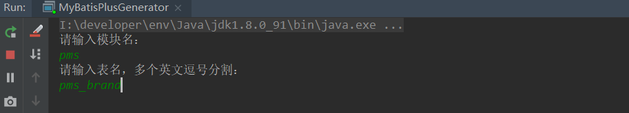
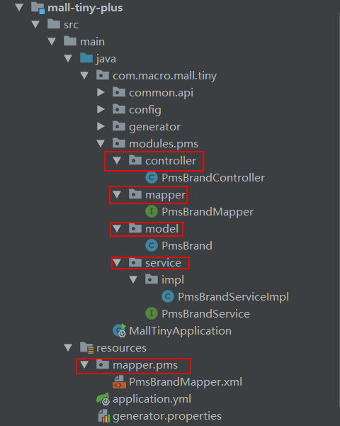
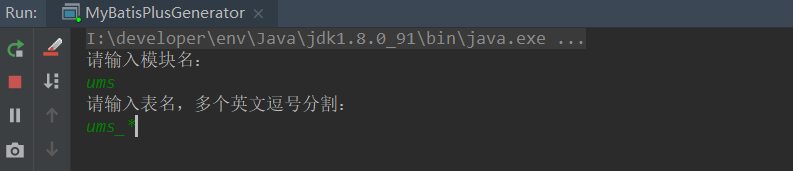
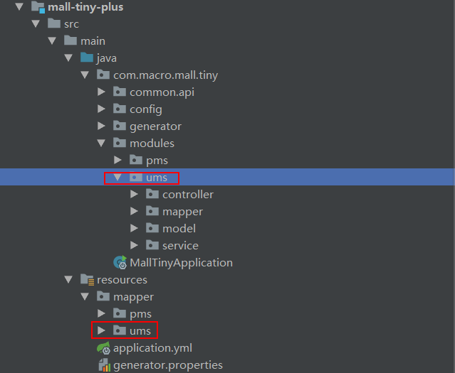
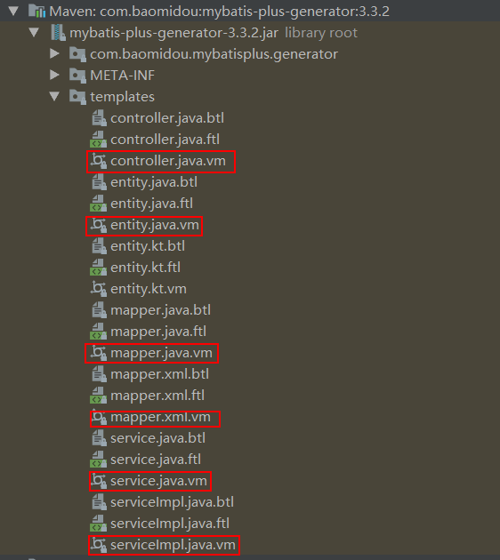
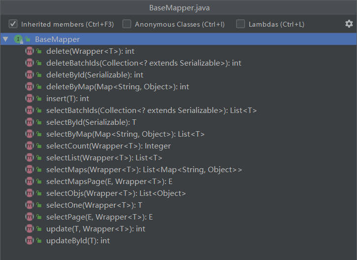
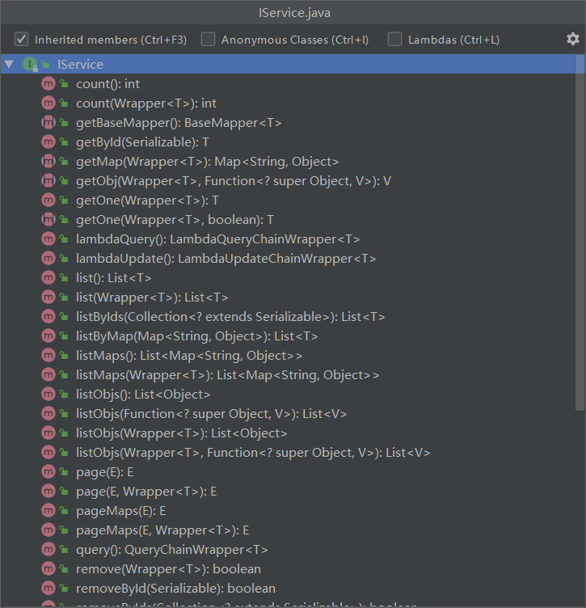

学习不走弯路，[关注公众号](#公众号) 回复「学习路线」，获取mall项目专属学习路线！

# 还在手写CRUD代码？这款开源框架助你解放双手！

> 相信很多朋友在项目中使用的ORM框架都是MyBatis，如果单用MyBatis来操作数据库的话，需要手写很多单表查询的SQL实现。这时候我们往往会选择一个增强工具来实现这些单表CRUD操作，这里推荐一款好用的工具MyBatis-Plus！

## MyBatis-Plus简介

MyBatis-Plus（简称 MP）是一个 MyBatis 的增强工具，在 MyBatis 的基础上只做增强不做改变，为简化开发、提高效率而生。MyBatis-Plus 提供了代码生成器，可以一键生成controller、service、mapper、model、mapper.xml代码，同时提供了丰富的CRUD操作方法，助我们解放双手！

## MyBatis-Plus集成

> 首先我们需要在SpringBoot项目中集成MyBatis-Plus，之后我们再详细介绍它的使用方法！

- 在`pom.xml`中添加相关依赖，主要是MyBatis-Plus、MyBatis-Plus Generator和Velocity模板引擎；

```xml
<dependencies>
    <!--Mybatis-Plus依赖-->
    <dependency>
        <groupId>com.baomidou</groupId>
        <artifactId>mybatis-plus-boot-starter</artifactId>
        <version>3.3.2</version>
    </dependency>
    <!--Mybatis-Plus代码生成器-->
    <dependency>
        <groupId>com.baomidou</groupId>
        <artifactId>mybatis-plus-generator</artifactId>
        <version>3.3.2</version>
    </dependency>
    <!--Velocity模板生成引擎-->
    <dependency>
        <groupId>org.apache.velocity</groupId>
        <artifactId>velocity-engine-core</artifactId>
        <version>2.2</version>
    </dependency>
</dependencies>
```

- 在SpringBoot配置文件`application.yml`添加如下配置，配置好数据源和MyBatis-Plus；

```yaml
spring:
  datasource:
    url: jdbc:mysql://localhost:3306/mall?useUnicode=true&characterEncoding=utf-8&serverTimezone=Asia/Shanghai
    username: root
    password: root

mybatis-plus:
  mapper-locations: classpath:/mapper/**/*.xml #指定mapper.xml路径
  global-config:
    db-config:
      id-type: auto #全局默认主键类型设置为自增
  configuration:
    auto-mapping-behavior: partial #只对非嵌套的 resultMap 进行自动映射
    map-underscore-to-camel-case: true #开启自动驼峰命名规则映射
```

- 添加MyBatis-Plus的Java配置，使用`@MapperScan`注解配置好需要扫码的Mapper接口路径，MyBatis-Plus自带分页功能，需要配置好分页插件`PaginationInterceptor`。

```java
/**
 * MyBatis配置类
 * Created by macro on 2019/4/8.
 */
@Configuration
@MapperScan("com.macro.mall.tiny.modules.*.mapper")
public class MyBatisConfig {
    @Bean
    public PaginationInterceptor paginationInterceptor() {
        PaginationInterceptor paginationInterceptor = new PaginationInterceptor();
        paginationInterceptor.setCountSqlParser(new JsqlParserCountOptimize(true));
        return paginationInterceptor;
    }
}
```

## 代码生成器

> MyBatis-Plus 提供了代码生成器，可以一键生成controller、service、mapper、model、mapper.xml代码，非常方便！

- 首先我们创建代码生成器类`MyBatisPlusGenerator`，直接运行其`main`方法即可生成相关代码；

```java
/**
 * MyBatisPlus代码生成器
 * Created by macro on 2020/8/20.
 */
public class MyBatisPlusGenerator {

    public static void main(String[] args) {
        String projectPath = System.getProperty("user.dir") + "/mall-tiny-plus";
        String moduleName = scanner("模块名");
        String[] tableNames = scanner("表名，多个英文逗号分割").split(",");
        // 代码生成器
        AutoGenerator autoGenerator = new AutoGenerator();
        autoGenerator.setGlobalConfig(initGlobalConfig(projectPath));
        autoGenerator.setDataSource(initDataSourceConfig());
        autoGenerator.setPackageInfo(initPackageConfig(moduleName));
        autoGenerator.setCfg(initInjectionConfig(projectPath, moduleName));
        autoGenerator.setTemplate(initTemplateConfig());
        autoGenerator.setStrategy(initStrategyConfig(tableNames));
        autoGenerator.setTemplateEngine(new VelocityTemplateEngine());
        autoGenerator.execute();
    }

    /**
     * 读取控制台内容信息
     */
    private static String scanner(String tip) {
        Scanner scanner = new Scanner(System.in);
        System.out.println(("请输入" + tip + "："));
        if (scanner.hasNext()) {
            String next = scanner.next();
            if (StrUtil.isNotEmpty(next)) {
                return next;
            }
        }
        throw new MybatisPlusException("请输入正确的" + tip + "！");
    }

    /**
     * 初始化全局配置
     */
    private static GlobalConfig initGlobalConfig(String projectPath) {
        GlobalConfig globalConfig = new GlobalConfig();
        globalConfig.setOutputDir(projectPath + "/src/main/java");
        globalConfig.setAuthor("macro");
        globalConfig.setOpen(false);
        globalConfig.setSwagger2(true);
        globalConfig.setBaseResultMap(true);
        globalConfig.setFileOverride(true);
        globalConfig.setDateType(DateType.ONLY_DATE);
        globalConfig.setEntityName("%s");
        globalConfig.setMapperName("%sMapper");
        globalConfig.setXmlName("%sMapper");
        globalConfig.setServiceName("%sService");
        globalConfig.setServiceImplName("%sServiceImpl");
        globalConfig.setControllerName("%sController");
        return globalConfig;
    }

    /**
     * 初始化数据源配置
     */
    private static DataSourceConfig initDataSourceConfig() {
        Props props = new Props("generator.properties");
        DataSourceConfig dataSourceConfig = new DataSourceConfig();
        dataSourceConfig.setUrl(props.getStr("dataSource.url"));
        dataSourceConfig.setDriverName(props.getStr("dataSource.driverName"));
        dataSourceConfig.setUsername(props.getStr("dataSource.username"));
        dataSourceConfig.setPassword(props.getStr("dataSource.password"));
        return dataSourceConfig;
    }

    /**
     * 初始化包配置
     */
    private static PackageConfig initPackageConfig(String moduleName) {
        Props props = new Props("generator.properties");
        PackageConfig packageConfig = new PackageConfig();
        packageConfig.setModuleName(moduleName);
        packageConfig.setParent(props.getStr("package.base"));
        packageConfig.setEntity("model");
        return packageConfig;
    }

    /**
     * 初始化模板配置
     */
    private static TemplateConfig initTemplateConfig() {
        TemplateConfig templateConfig = new TemplateConfig();
        //可以对controller、service、entity模板进行配置
        //mapper.xml模板需单独配置
        templateConfig.setXml(null);
        return templateConfig;
    }

    /**
     * 初始化策略配置
     */
    private static StrategyConfig initStrategyConfig(String[] tableNames) {
        StrategyConfig strategyConfig = new StrategyConfig();
        strategyConfig.setNaming(NamingStrategy.underline_to_camel);
        strategyConfig.setColumnNaming(NamingStrategy.underline_to_camel);
        strategyConfig.setEntityLombokModel(true);
        strategyConfig.setRestControllerStyle(true);
        //当表名中带*号时可以启用通配符模式
        if (tableNames.length == 1 && tableNames[0].contains("*")) {
            String[] likeStr = tableNames[0].split("_");
            String likePrefix = likeStr[0] + "_";
            strategyConfig.setLikeTable(new LikeTable(likePrefix));
        } else {
            strategyConfig.setInclude(tableNames);
        }
        return strategyConfig;
    }

    /**
     * 初始化自定义配置
     */
    private static InjectionConfig initInjectionConfig(String projectPath, String moduleName) {
        // 自定义配置
        InjectionConfig injectionConfig = new InjectionConfig() {
            @Override
            public void initMap() {
                // 可用于自定义属性
            }
        };
        // 模板引擎是Velocity
        String templatePath = "/templates/mapper.xml.vm";
        // 自定义输出配置
        List<FileOutConfig> focList = new ArrayList<>();
        // 自定义配置会被优先输出
        focList.add(new FileOutConfig(templatePath) {
            @Override
            public String outputFile(TableInfo tableInfo) {
                // 自定义输出文件名 ， 如果你 Entity 设置了前后缀、此处注意 xml 的名称会跟着发生变化！！
                return projectPath + "/src/main/resources/mapper/" + moduleName
                        + "/" + tableInfo.getEntityName() + "Mapper" + StringPool.DOT_XML;
            }
        });
        injectionConfig.setFileOutConfigList(focList);
        return injectionConfig;
    }

}
```

- 然后在`resources`目录下添加配置文件`generator.properties`，添加代码生成器的数据源配置及存放业务代码的基础包名称；

```properties
dataSource.url=jdbc:mysql://localhost:3306/mall?useUnicode=true&characterEncoding=utf-8&serverTimezone=Asia/Shanghai
dataSource.driverName=com.mysql.cj.jdbc.Driver
dataSource.username=root
dataSource.password=root
package.base=com.macro.mall.tiny.modules
```

- 细心的朋友可以发现`MyBatisPlusGenerator`中很多配置代码都没添加注释，其实MyBatis-Plus源码中的中文注释非常完善，只需查看源码即可，这里摘抄一段`DataSourceConfig`中的源码；

```java
/**
 * 数据库配置
 *
 * @author YangHu, hcl
 * @since 2016/8/30
 */
@Data
@Accessors(chain = true)
public class DataSourceConfig {

    /**
     * 数据库信息查询
     */
    private IDbQuery dbQuery;
    /**
     * 数据库类型
     */
    private DbType dbType;
    /**
     * PostgreSQL schemaName
     */
    private String schemaName;
    /**
     * 类型转换
     */
    private ITypeConvert typeConvert;
    /**
     * 关键字处理器
     * @since 3.3.2
     */
    private IKeyWordsHandler keyWordsHandler;
    /**
     * 驱动连接的URL
     */
    private String url;
    /**
     * 驱动名称
     */
    private String driverName;
    /**
     * 数据库连接用户名
     */
    private String username;
    /**
     * 数据库连接密码
     */
    private String password;
    
    //省略若干代码......

}
```

- 代码生成器支持两种模式，一种生成单表的代码，比如只生成`pms_brand`表代码可以先输入`pms`，后输入`pms_brand`；



- 生成单表代码结构一览；



- 另一种直接生成整个模块的代码，需要带通配符`*`，比如生成`ums`模块代码可以先输入`ums`，后输入`ums_*`；



- 生成整个模块代码结构一览。



## 自定义生成模板

> MyBatis-Plus 使用模板引擎来生成代码，支持 Velocity（默认）、Freemarker、Beetl模板引擎，这里以Velocity为了来介绍下如何自定义生成模板。

- 首先我们可以从 MyBatis-Plus Generator依赖包的源码中找到默认模板，拷贝到项目的`resources/templates`目录下；



- 在`MyBatisPlusGenerator`类中对`TemplateConfig`进行配置，配置好各个模板的路径；

```java
/**
 * MyBatisPlus代码生成器
 * Created by macro on 2020/8/20.
 */
public class MyBatisPlusGenerator {
    
    /**
     * 初始化模板配置
     */
    private static TemplateConfig initTemplateConfig() {
        TemplateConfig templateConfig = new TemplateConfig();
        //可以对controller、service、entity模板进行配置
        templateConfig.setEntity("templates/entity.java");
        templateConfig.setMapper("templates/mapper.java");
        templateConfig.setController("templates/controller.java");
        templateConfig.setService("templates/service.java");
        templateConfig.setServiceImpl("templates/serviceImpl.java");
        //mapper.xml模板需单独配置
        templateConfig.setXml(null);
        return templateConfig;
    }
}
```

- 对模板进行定制，在定制过程中我们可以发现很多内置变量，用于输出到模板中去，这里以`service.java.vm`模板为例子，比如`package`、`table`这些变量；

```
package ${package.Service};

import ${package.Entity}.${entity};
import ${superServiceClassPackage};

/**
 * <p>
 * $!{table.comment} 服务类
 * </p>
 *
 * @author ${author}
 * @since ${date}
 */
#if(${kotlin})
interface ${table.serviceName} : ${superServiceClass}<${entity}>
#else
public interface ${table.serviceName} extends ${superServiceClass}<${entity}> {

}
#end
```

- 搞懂这些变量从哪来的，对我们定制模板很有帮助，其实这些变量都来着于`AbstractTemplateEngine`的`getObjectMap`方法，具体变量作用可以参考源码。

```java
/**
 * 模板引擎抽象类
 *
 * @author hubin
 * @since 2018-01-10
 */
public abstract class AbstractTemplateEngine {
        /**
         * 渲染对象 MAP 信息
         *
         * @param tableInfo 表信息对象
         * @return ignore
         */
        public Map<String, Object> getObjectMap(TableInfo tableInfo) {
            Map<String, Object> objectMap = new HashMap<>(30);
            ConfigBuilder config = getConfigBuilder();
            if (config.getStrategyConfig().isControllerMappingHyphenStyle()) {
                objectMap.put("controllerMappingHyphenStyle", config.getStrategyConfig().isControllerMappingHyphenStyle());
                objectMap.put("controllerMappingHyphen", StringUtils.camelToHyphen(tableInfo.getEntityPath()));
            }
            objectMap.put("restControllerStyle", config.getStrategyConfig().isRestControllerStyle());
            objectMap.put("config", config);
            objectMap.put("package", config.getPackageInfo());
            GlobalConfig globalConfig = config.getGlobalConfig();
            objectMap.put("author", globalConfig.getAuthor());
            objectMap.put("idType", globalConfig.getIdType() == null ? null : globalConfig.getIdType().toString());
            objectMap.put("logicDeleteFieldName", config.getStrategyConfig().getLogicDeleteFieldName());
            objectMap.put("versionFieldName", config.getStrategyConfig().getVersionFieldName());
            objectMap.put("activeRecord", globalConfig.isActiveRecord());
            objectMap.put("kotlin", globalConfig.isKotlin());
            objectMap.put("swagger2", globalConfig.isSwagger2());
            objectMap.put("date", new SimpleDateFormat("yyyy-MM-dd").format(new Date()));
            objectMap.put("table", tableInfo);
            objectMap.put("enableCache", globalConfig.isEnableCache());
            objectMap.put("baseResultMap", globalConfig.isBaseResultMap());
            objectMap.put("baseColumnList", globalConfig.isBaseColumnList());
            objectMap.put("entity", tableInfo.getEntityName());
            objectMap.put("entitySerialVersionUID", config.getStrategyConfig().isEntitySerialVersionUID());
            objectMap.put("entityColumnConstant", config.getStrategyConfig().isEntityColumnConstant());
            objectMap.put("entityBuilderModel", config.getStrategyConfig().isEntityBuilderModel());
            objectMap.put("chainModel", config.getStrategyConfig().isChainModel());
            objectMap.put("entityLombokModel", config.getStrategyConfig().isEntityLombokModel());
            objectMap.put("entityBooleanColumnRemoveIsPrefix", config.getStrategyConfig().isEntityBooleanColumnRemoveIsPrefix());
            objectMap.put("superEntityClass", getSuperClassName(config.getSuperEntityClass()));
            objectMap.put("superMapperClassPackage", config.getSuperMapperClass());
            objectMap.put("superMapperClass", getSuperClassName(config.getSuperMapperClass()));
            objectMap.put("superServiceClassPackage", config.getSuperServiceClass());
            objectMap.put("superServiceClass", getSuperClassName(config.getSuperServiceClass()));
            objectMap.put("superServiceImplClassPackage", config.getSuperServiceImplClass());
            objectMap.put("superServiceImplClass", getSuperClassName(config.getSuperServiceImplClass()));
            objectMap.put("superControllerClassPackage", verifyClassPacket(config.getSuperControllerClass()));
            objectMap.put("superControllerClass", getSuperClassName(config.getSuperControllerClass()));
            return Objects.isNull(config.getInjectionConfig()) ? objectMap : config.getInjectionConfig().prepareObjectMap(objectMap);
        }
}
```

## CRUD操作

> MyBatis-Plus的强大之处不止在于它的代码生成功能，还在于它提供了丰富的CRUD方法，让我们实现单表CRUD几乎不用手写SQL实现！

- 我们之前生成的`PmsBrandMapper`接口由于继承了`BaseMapper`接口，直接拥有了各种CRUD方法；

```java
/**
 * <p>
 * 品牌表 Mapper 接口
 * </p>
 *
 * @author macro
 * @since 2020-08-20
 */
public interface PmsBrandMapper extends BaseMapper<PmsBrand> {

}
```

- 我们来看下`BaseMapper`中的方法，是不是基本可以满足我们的日常所需了；



- 我们之前生成的`PmsBrandService`接口由于继承了`IService`接口，也拥有了各种CRUD方法；

```java
/**
 * <p>
 * 品牌表 服务类
 * </p>
 *
 * @author macro
 * @since 2020-08-20
 */
public interface PmsBrandService extends IService<PmsBrand> {

}
```

- 可以看下比`BaseMapper`中的更加丰富；



- 有了这些`IService`和`BaseMapper`中提供的这些方法，我们单表查询就几乎不用手写SQL实现了，使用MyBatis-Plus实现以前`PmsBrandController`的方法更轻松了！

```java
/**
 * <p>
 * 品牌表 前端控制器
 * </p>
 *
 * @author macro
 * @since 2020-08-20
 */
@Api(tags = "PmsBrandController", description = "商品品牌管理")
@RestController
@RequestMapping("/brand")
public class PmsBrandController {

    private static final Logger LOGGER = LoggerFactory.getLogger(PmsBrandController.class);

    @Autowired
    private PmsBrandService brandService;

    @ApiOperation("获取所有品牌列表")
    @RequestMapping(value = "/listAll", method = RequestMethod.GET)
    @ResponseBody
    public CommonResult<List<PmsBrand>> getBrandList() {
        return CommonResult.success(brandService.list());
    }

    @ApiOperation("添加品牌")
    @RequestMapping(value = "/create", method = RequestMethod.POST)
    @ResponseBody
    public CommonResult createBrand(@RequestBody PmsBrand pmsBrand) {
        CommonResult commonResult;
        boolean result = brandService.save(pmsBrand);
        if (result) {
            commonResult = CommonResult.success(pmsBrand);
            LOGGER.debug("createBrand success:{}", pmsBrand);
        } else {
            commonResult = CommonResult.failed("操作失败");
            LOGGER.debug("createBrand failed:{}", pmsBrand);
        }
        return commonResult;
    }

    @ApiOperation("更新指定id品牌信息")
    @RequestMapping(value = "/update", method = RequestMethod.POST)
    @ResponseBody
    public CommonResult updateBrand(@RequestBody PmsBrand pmsBrand) {
        CommonResult commonResult;
        boolean result = brandService.updateById(pmsBrand);
        if (result) {
            commonResult = CommonResult.success(pmsBrand);
            LOGGER.debug("updateBrand success:{}", pmsBrand);
        } else {
            commonResult = CommonResult.failed("操作失败");
            LOGGER.debug("updateBrand failed:{}", pmsBrand);
        }
        return commonResult;
    }

    @ApiOperation("删除指定id的品牌")
    @RequestMapping(value = "/delete/{id}", method = RequestMethod.GET)
    @ResponseBody
    public CommonResult deleteBrand(@PathVariable("id") Long id) {
        boolean result = brandService.removeById(id);
        if (result) {
            LOGGER.debug("deleteBrand success :id={}", id);
            return CommonResult.success(null);
        } else {
            LOGGER.debug("deleteBrand failed :id={}", id);
            return CommonResult.failed("操作失败");
        }
    }

    @ApiOperation("分页查询品牌列表")
    @RequestMapping(value = "/list", method = RequestMethod.GET)
    @ResponseBody
    public CommonResult<CommonPage<PmsBrand>> listBrand(@RequestParam(value = "pageNum", defaultValue = "1")
                                                        @ApiParam("页码") Integer pageNum,
                                                        @RequestParam(value = "pageSize", defaultValue = "3")
                                                        @ApiParam("每页数量") Integer pageSize) {
        Page<PmsBrand> page = new Page<>(pageNum, pageSize);
        Page<PmsBrand> pageResult = brandService.page(page);
        return CommonResult.success(CommonPage.restPage(pageResult));
    }

    @ApiOperation("获取指定id的品牌详情")
    @RequestMapping(value = "/{id}", method = RequestMethod.GET)
    @ResponseBody
    public CommonResult<PmsBrand> brand(@PathVariable("id") Long id) {
        return CommonResult.success(brandService.getById(id));
    }

}
```

## 项目源码地址

https://github.com/macrozheng/mall-learning/tree/master/mall-tiny-plus

## 公众号


