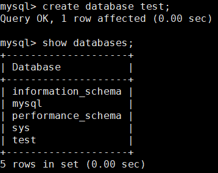
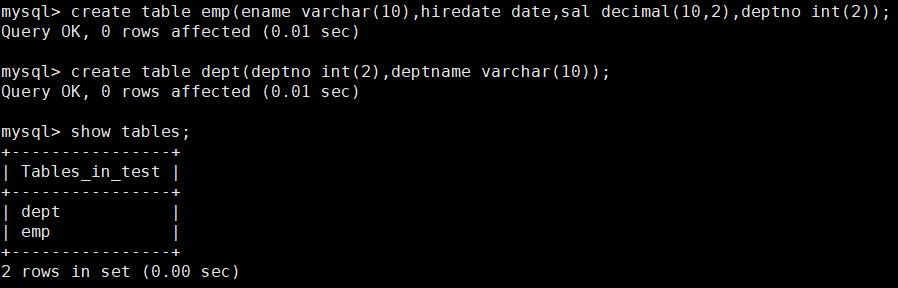
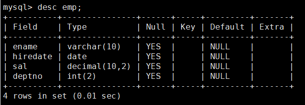
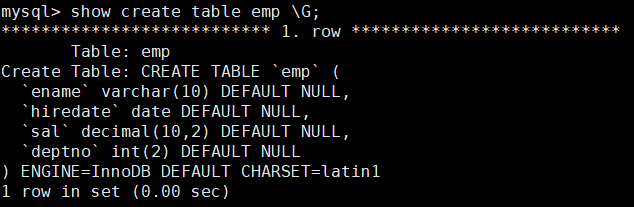
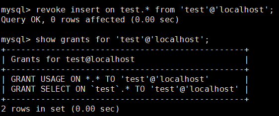
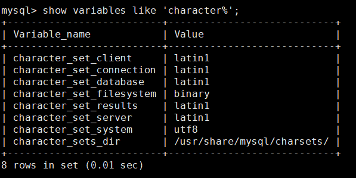
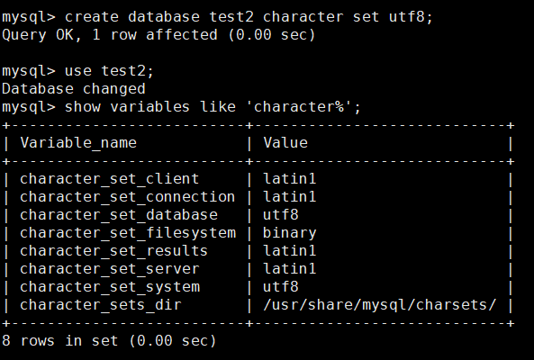
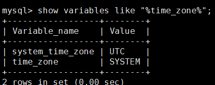
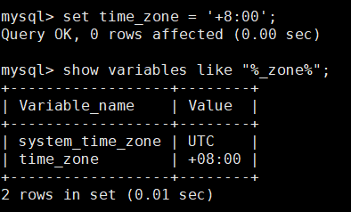

mall项目全套学习教程连载中，[关注公众号](#公众号)第一时间获取。

# 开发者必备Mysql命令

> 开发者必备Mysql常用命令，涵盖了数据定义语句、数据操纵语句及数据控制语句，基于Mysql5.7。

## 数据定义语句(DDL)

### 数据库操作

- 登录数据库：
```shell
mysql -uroot -proot
```
- 创建数据库：
```sql
create database test
```
- 查看所有数据库：
```sql
show databases
```

- 选择数据库并使用：
```sql
use test
```
- 查看所有数据表：
```sql
show tables
```
- 删除数据库：
```sql
drop database test
```

### 表操作

- 创建表：
```sql
create table emp(ename varchar(10),hiredate date,sal decimal(10,2),deptno int(2))  
```
```sql
create table dept(deptno int(2),deptname varchar(10))
```

- 查看表的定义：
```sql
desc emp
```

- 查看表定义（详细）：
```sql
show create table emp \G
```

- 删除表：
```sql
drop table emp
```
- 修改表字段：
```sql
alter table emp modify ename varchar(20)
```
- 添加表字段：
```sql
alter table emp add column age int(3)
```
- 删除表字段：
```sql
alter table emp drop column age
```
- 字段改名；
```sql
alter table emp change age age1 int(4)
```
- 修改表名：
```sql
alter table emp rename emp1
```

## 数据操纵语句(DML)

### 插入记录

- 指定名称插入：
```sql
insert into emp (ename,hiredate,sal,deptno) values ('zhangsan','2018-01-01','2000',1)
```
- 不指定名称插入：
```sql
insert into emp values ('lisi','2018-01-01','2000',1)
```
- 批量插入数据：
```sql
insert into dept values(1,'dept1'),(2,'dept2')
```

### 修改记录
```sql
update emp set sal='4000',deptno=2 where ename='zhangsan'
```

### 删除记录
```sql
delete from emp where ename='zhangsan'
```

### 查询记录

- 查询所有记录：
```sql
select * from emp
```
- 查询不重复的记录：
```sql
select distinct deptno from emp
```
- 条件查询：
```sql
select * from emp where deptno=1 and sal<3000
```
- 排序和限制：
```sql
select * from emp order by deptno desc limit 2
```
- 分页查询(查询从第0条记录开始10条)：
```sql
select * from emp order by deptno desc limit 0,10
```
- 聚合(查询部门人数大于1的部门编号)：
```sql
select deptno,count(1) from emp group by deptno having count(1) > 1
```
- 连接查询：
```sql
select * from emp e left join dept d on e.deptno=d.deptno
```
- 子查询：
```sql
select * from emp where deptno in (select deptno from dept)
```
- 记录联合：
```sql
select deptno from emp union select deptno from dept
```

## 数据控制语句(DCL)

### 权限相关
- 授予操作权限(将test数据库中所有表的select和insert权限授予test用户)：
```sql
grant select,insert on test.* to 'test'@'localhost' identified by '123'
```
- 查看账号权限：
```sql
show grants for 'test'@'localhost'
```

- 收回操作权限：
```sql
revoke insert on test.* from 'test'@'localhost'
```

- 授予所有数据库的所有权限：
```sql
grant all privileges on *.* to 'test'@'localhost'
```
- 授予所有数据库的所有权限(包括grant)：
```sql
grant all privileges on *.* to 'test'@'localhost' with grant option
```
- 授予SUPER PROCESS FILE权限（系统权限不能指定数据库）：
```sql
grant super,process,file on *.* to 'test'@'localhost'
```
- 只授予登录权限：
```sql
grant usage on *.* to 'test'@'localhost'
```

### 帐号相关
- 删除账号：
```sql
drop user 'test'@'localhost'
```
- 修改自己的密码：
```sql
set password = password('123')
```
- 管理员修改他人密码：
```sql
set password for 'test'@'localhost' = password('123')
```

## 其他

### 字符集相关
- 查看字符集：
```sql
show variables like 'character%'
```

- 创建数据库时指定字符集：
```sql
create database test2 character set utf8
```


### 时区相关
- 查看当前时区（UTC为世界统一时间，中国为UTC+8）：
```sql
show variables like "%time_zone%"
```

- 修改mysql全局时区为北京时间，即我们所在的东8区：
```sql
set global time_zone = '+8:00';
```
- 修改当前会话时区：
```sql
set time_zone = '+8:00'
```

- 立即生效：
```sql
flush privileges
```

## 公众号


