mall项目全套学习教程连载中，[关注公众号](#公众号)第一时间获取。

# Navicat实用功能：数据备份与结构同步

> 当我们要对数据库做有风险的操作时需要对数据库备份，每次上线项目时，线上与线下数据库结构总会有不一致的情况，本文将讲解如何利用Navicat来方便的解决这两个问题。

## Navicat

> Navicat是一套快速、可靠的数据库管理工具，专为简化数据库的管理及降低系统管理成本而设。它的设计符合数据库管理员、开发人员及中小企业的需要。Navicat 是以直觉化的图形用户界面而建的，让你可以以安全并且简单的方式创建、组织、访问并共用信息。

注意：本教程采用的时Navicat12版本，下载地址：[https://www.navicat.com.cn/download/navicat-premium](https://www.navicat.com.cn/download/navicat-premium)

### 使用数据库介绍

> 现在数据库中有两个数据库，mall-test表示测试环境数据库，mall-prod表示线上环境数据库。

### 数据备份

> 现在我们先对mall-test数据库备份，备份完成后，删除商品表的数据，然后利用备份进行数据还原。

#### mall-test中的数据概览
> 目前数据库中只有商品模块的数据库表，pms_product表中有一定的数据。

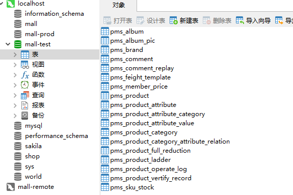

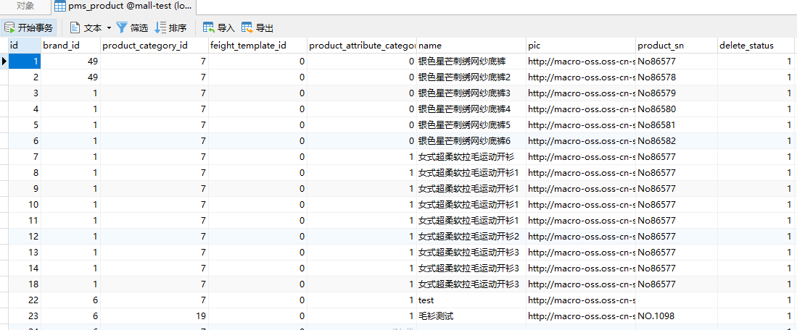

#### 进行数据备份

- 先点击顶部工具栏的备份图标，再点击新建备份按钮

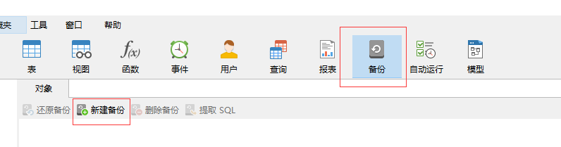

- 点击开始按钮开始备份

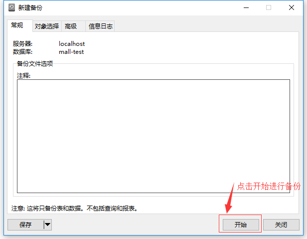

- 备份完成后会生成一个备份文件

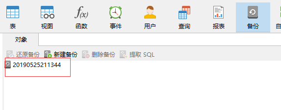

#### 清空pms_product表的数据

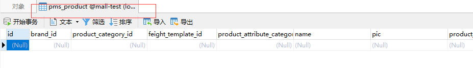

#### 从备份中还原数据

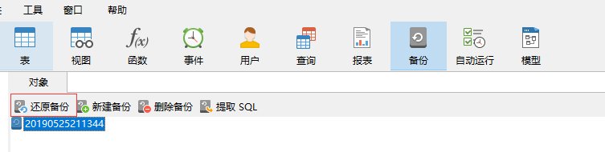

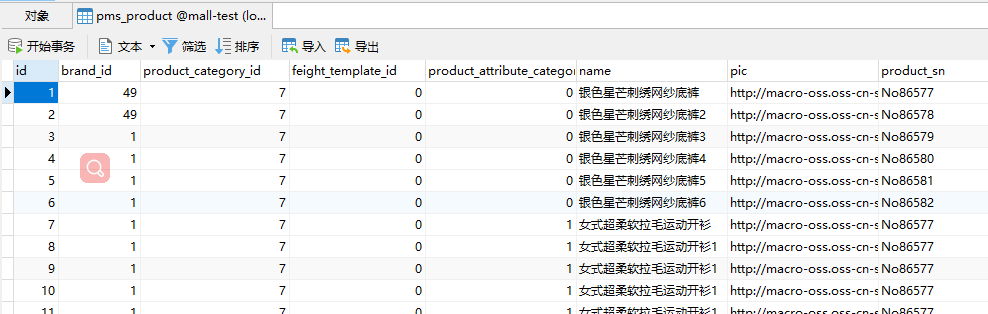

### 结构同步

#### 相关背景说明

原来的mall-test模块中只有商品模块的表，现在我们经过了一段时间的开发，新增了订单模块，同时删除和修改了商品模块的一些表，而mall-prod表中还是原来的商品模块表，我们现在要做的是把mall-test的数据库表结构同步到mall-prod。

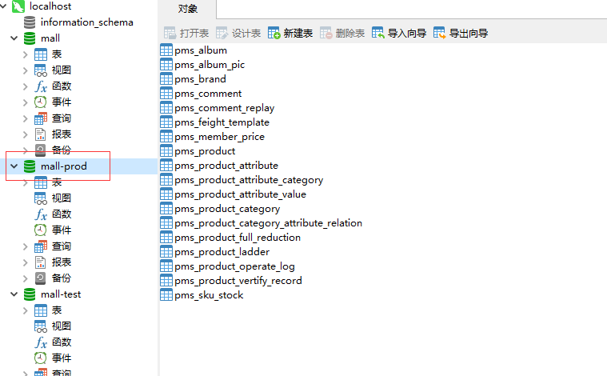

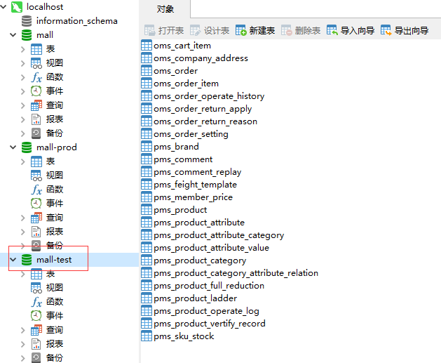

#### 进行结构同步

- 选择结构同步功能

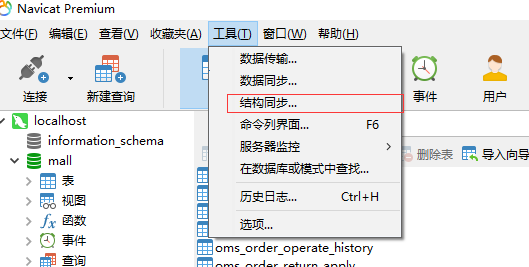

- 选择源数据库和目标数据库，点击比对按钮

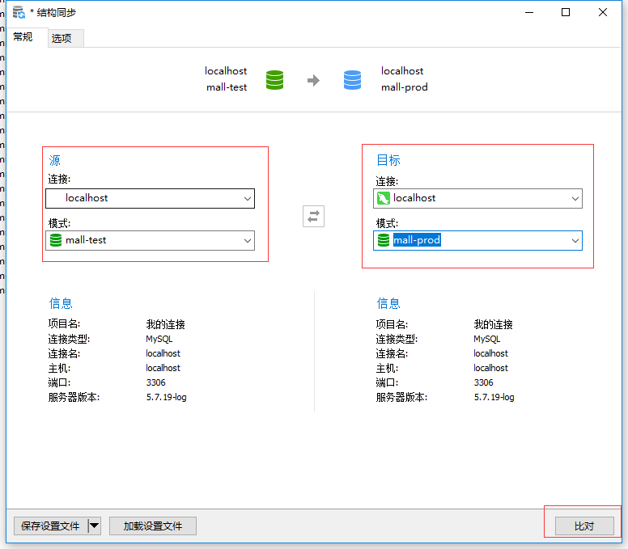

- 可以看到修改、新增和删除的表信息，点击部署会出现sql脚本的预览

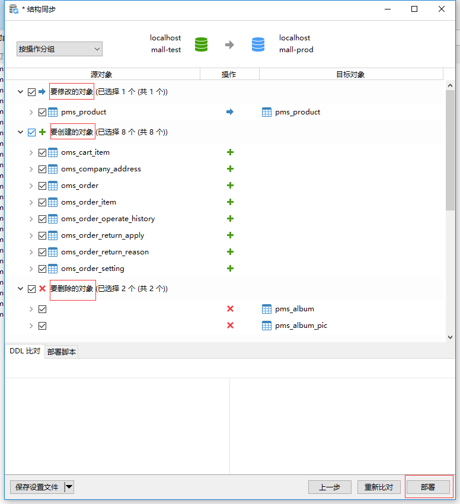

- 确认了部署脚本信息后，点击运行会进行数据结构的同步

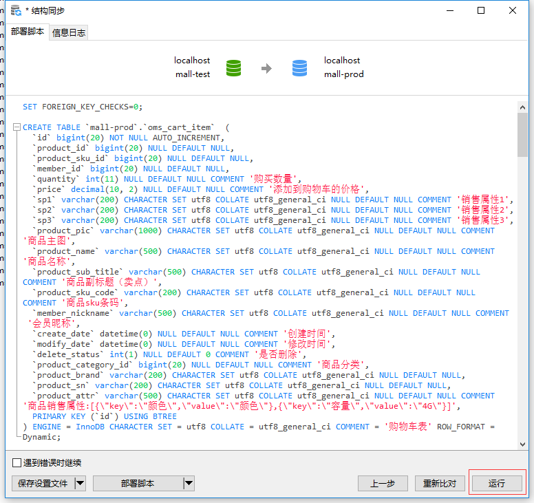

- 再次进行结构同步时，已经发现两个数据库结构已经完全一致

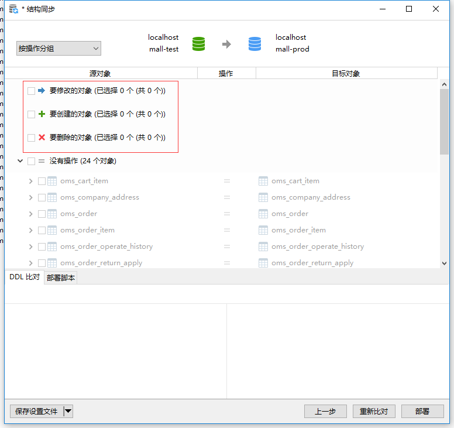

## 公众号

