mall项目全套学习教程连载中，[关注公众号](#公众号)第一时间获取。

# 我用起来顺手的数据库设计工具，这次推荐给大家！

> 好的数据库设计工具，可以帮助我们进行思考并提高我们的设计效率。以前一直使用的是PowerDesigner，最近发现Navicat的数据库设计功能也很不错，界面简洁且容易使用，特此推荐给大家。

## Navicat

> Navicat是一套快速、可靠的数据库管理工具，专为简化数据库的管理及降低系统管理成本而设。它的设计符合数据库管理员、开发人员及中小企业的需要。Navicat 是以直觉化的图形用户界面而建的，让你可以以安全并且简单的方式创建、组织、访问并共用信息。

注意：本教程采用的时Navicat12版本，下载地址：https://www.navicat.com.cn/download/navicat-premium

## 数据库设计

> 下面我们来讲下如何使用Navicat来设计数据库，以`mall`项目的权限管理模块为例。

### 打开模型

首先我们需要打开Navicat的数据库设计功能，该功能在工具栏中的`模型`按钮下，直接打开即可。

### 新建表

- 通过工具栏中的`表`按钮新建一张表；

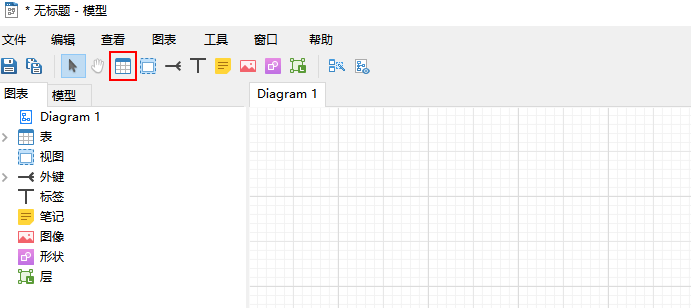

- 新建完成后通过双击`设计表`的界面，然后添加对应字段，这里新建了一张`ums_admin`表；

### 建立外键关系

> 如果我们的表没有外键，当表越来越多，关系越来越复杂时，我们就无法理清表与表之间的关系了，所以我们在设计的时候需要通过外键来标注表与表之间的关系。

- 我们再新建两张表`ums_role`和`ums_admin_role_relation`用于演示建立多对多关系，并通过工具栏的`外键`按钮建立外键；

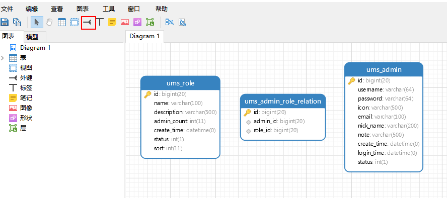

- 点击`外键`按钮后直接点击需要建立外键的字段，这里点击的是`admin_id`，之后你会发现多了一个`小连线`；

- 双击这个`小连线`进行外键的编辑操作，修改参考表为`ums_admin`，参考字段为`id`；

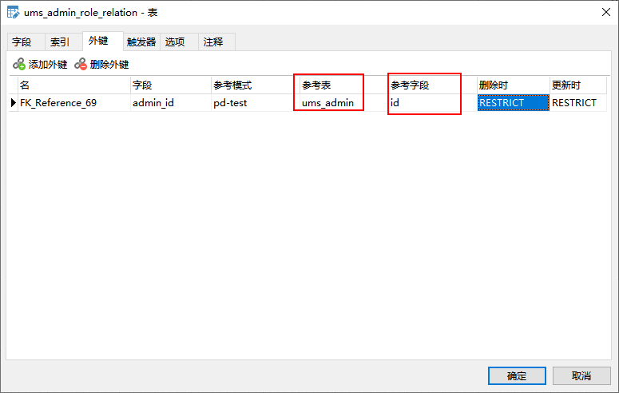

- 编辑完成后就会出现表示外键关系的连线了；

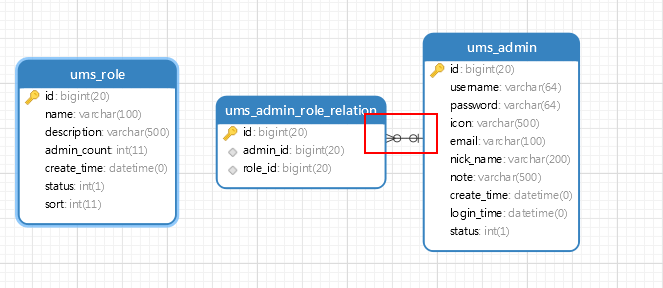

- 之后可以把整个`mall`项目权限管理模块的表都建立起来练习下，下面是建立完成后的效果；

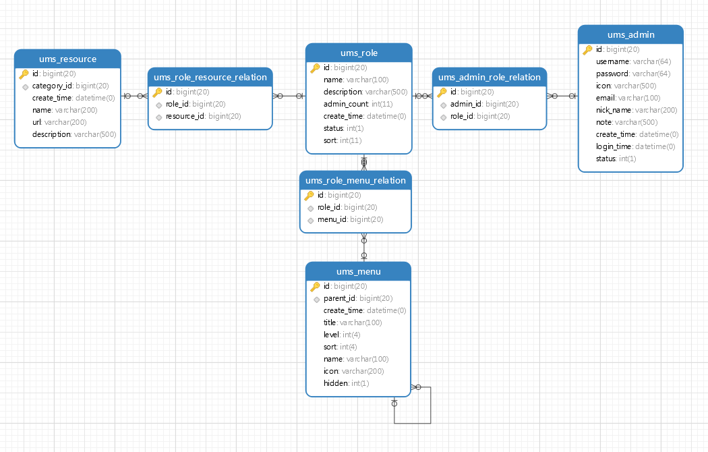

- 如何你觉得排版不好的话，可以点击下工具栏的`自动调整版面功能`，是不是个很贴心的功能呢！

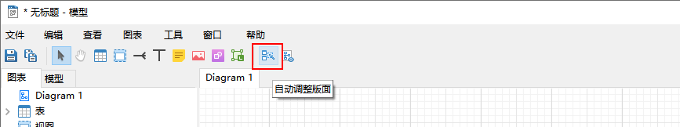

### 导出SQL

> 我们一般在设计数据库的时候通过`外键`来建立关系，但是在数据库中往往不使用外键，通常通过逻辑来关联，所以在我们导出SQL的时候需要设置去除外键的生成。

- 导出SQL功能在工具菜单下面；

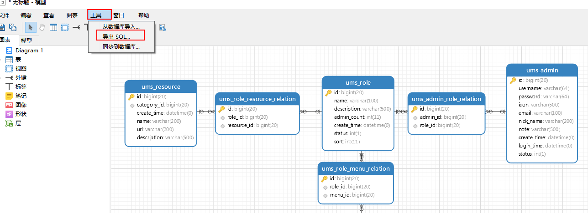

- 导出时需要在`高级`中去除外键的生成，点击确定就可以成功导出SQL语句了。

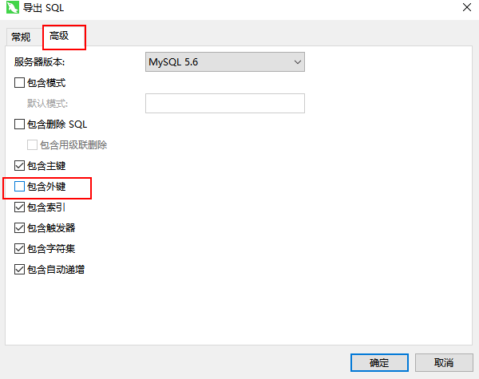

## 逆向工程

> 之前有些朋友反馈`mall`中的PowerDesigner数据库设计文件无法打开，这里提供另一种方法，通过Navicat来查看数据库设计。

- 首先我们需要一份有外键关系的SQL文件，这里我已经生成好了，下载地址：https://github.com/macrozheng/mall-learning/blob/master/document/navicat/mall-ref.sql

- 之后将该SQL文件导入到数据库中，这里导入的是`pd-test`数据库；

- 然后通过逆向工程从数据库中去生成数据库设计图，该功能在工具目录下面；

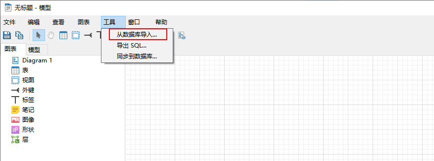

- 之后选择需要导入的数据库`pd-test`；

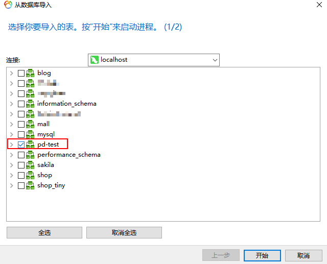

- 导入成功后就可以看到完整、有关系的数据库设计图了，大家可以按自己的喜好修改表的位置。

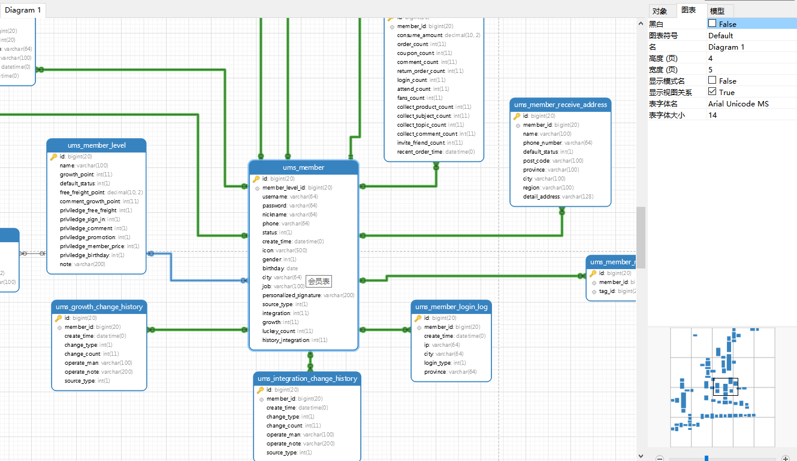

## 总结

总的来说Navicat的数据库设计功能还是相当不错的，简洁易用，界面也很漂亮。设计数据库在PowerDesigner中只是一个功能，使用起来未免太沉重，而Navicat的数据库设计功能更轻巧！

## 公众号

