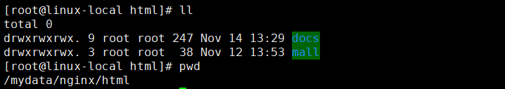
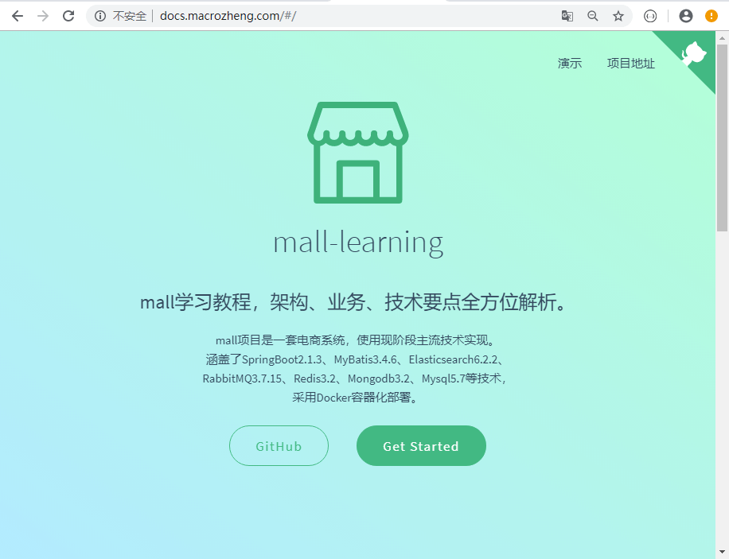
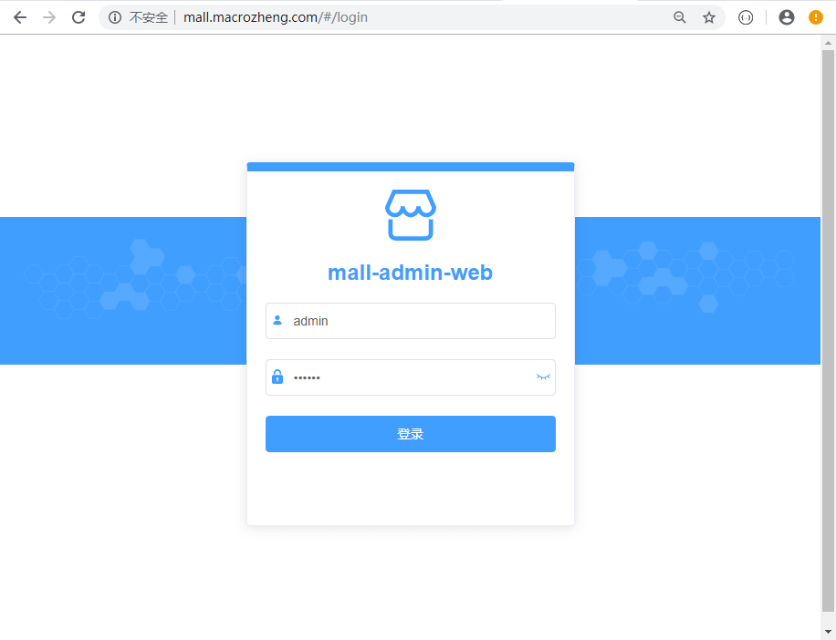
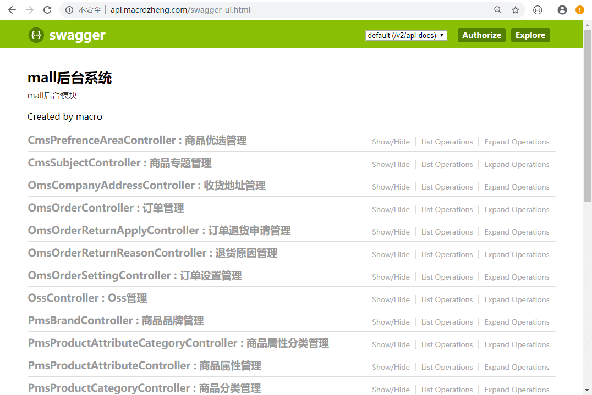
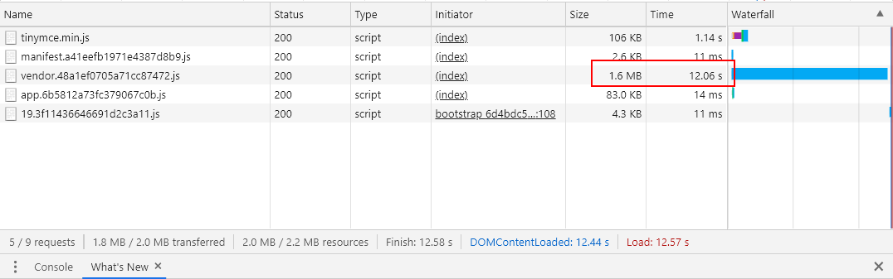
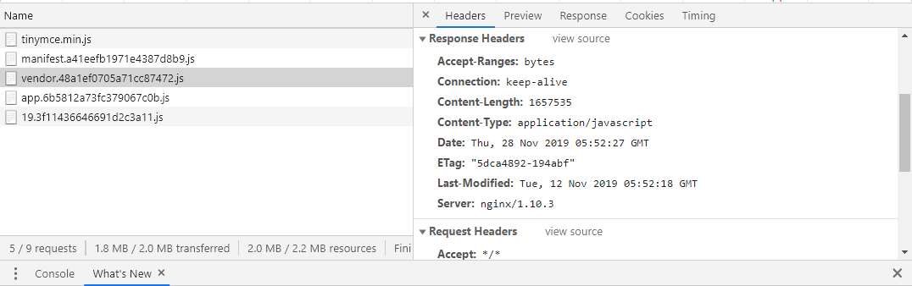
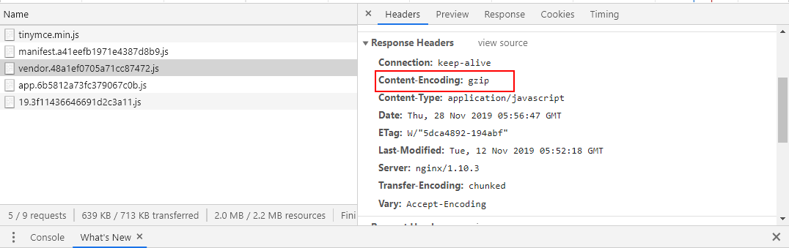

mall项目全套学习教程连载中，[关注公众号](#公众号)第一时间获取。
# Nginx的这些妙用，你肯定有不知道的！

> 本文将从反向代理、文件压缩、地址重写三方面来讲解Nginx在Docker环境下的使用技巧！

## 在Docker环境下的安装

### 下载nginx的docker镜像

```bash
docker pull nginx:1.10
```

### 从容器中拷贝nginx配置

- 先运行一次容器（为了拷贝配置文件）：

```bash
docker run -p 80:80 --name nginx \
-v /mydata/nginx/html:/usr/share/nginx/html \
-v /mydata/nginx/logs:/var/log/nginx  \
-d nginx:1.10
```

- 将容器内的配置文件拷贝到指定目录：

```bash
docker container cp nginx:/etc/nginx /mydata/nginx/
```

- 修改文件名称：

```bash
mv nginx conf
```

- 终止并删除容器：

```bash
docker stop nginx
docker rm nginx
```

### 使用docker命令启动

```bash
docker run -p 80:80 --name nginx \
-v /mydata/nginx/html:/usr/share/nginx/html \
-v /mydata/nginx/logs:/var/log/nginx  \
-v /mydata/nginx/conf:/etc/nginx \
-d nginx:1.10
```

## 反向代理

> 反向代理就是当请求访问你的代理服务器时，代理服务器会对你的请求进行转发，可以转发到静态的资源路径上去，也可以转发到动态的服务接口上去。下面我们以对域名进行代理为例，来讲讲如何进行静态代理和动态代理。

### 静态代理

> 静态代理就是将请求代理到不同的静态资源路径上去，这里我们将对`docs.macrozheng.com`的请求代理到我的文档项目中，对`mall.macrozheng.com`的请求代理到mall的前端项目中。

- 首先我们修改下本机的host文件：

```
192.168.6.132 docs.macrozheng.com
192.168.6.132 mall.macrozheng.com
```

- 然后将我们的文档项目和mall前端项目上传到nginx的html目录中去，并进行解压操作：



- 在`/mydata/nginx/conf/conf.d`文件夹中添加配置文件docs.conf对文档项目进行反向代理：

```
server {
    listen       80;
    server_name  docs.macrozheng.com; #修改域名

    location / {
        root   /usr/share/nginx/html/docs; #代理到docs文件夹中
        index  index.html index.htm;
    }

    error_page   500 502 503 504  /50x.html;
    location = /50x.html {
        root   /usr/share/nginx/html;
    }

}
```

- 在`/mydata/nginx/conf/conf.d`文件夹中添加配置文件mall.conf对mall的前端项目进行反向代理：

```
server {
    listen       80;
    server_name  mall.macrozheng.com; #修改域名

    location / {
        root   /usr/share/nginx/html/mall; #代理到mall文件夹中
        index  index.html index.htm;
    }

    error_page   500 502 503 504  /50x.html;
    location = /50x.html {
        root   /usr/share/nginx/html;
    }

}
```

- 重启nginx服务：

```bash
docker restart nginx
```

- 通过`docs.macrozheng.com`即可访问到我们的文档项目了：



- 通过`mall.macrozheng.com`即可访问到mall的前端项目了：



### 动态代理

> 动态代理就是把代理服务器的请求转发到另一个服务上去，这里我们将对`api.macrozheng.com`的请求代理到mall-admin的后台服务上去。

- 首先我们修改下本机的host文件，添加如下规则：

```
192.168.6.132 api.macrozheng.com
```

- 在`/mydata/nginx/conf/conf.d`文件夹中添加配置文件api.conf对将请求代理到远程的mall-admin服务上去：

```
server {
    listen       80;
    server_name  api.macrozheng.com; #修改域名

    location / {
    	proxy_pass   http://120.27.63.9:8080; #修改为代理服务地址
        index  index.html index.htm;
    }

    error_page   500 502 503 504  /50x.html;
    location = /50x.html {
        root   /usr/share/nginx/html;
    }

}
```

- 重启动nginx服务后，通过`api.macrozheng.com/swagger-ui.html`即可访问到mall-admin的API文档页面了：



## 文件压缩

> 如果我们租用了一个带宽很低的服务器，网站访问速度会很慢，这时我们可以通过让nginx开启GZIP压缩来提高网站的访问速度。这里我们以mall的前端项目为例来演示下它的提速效果。

- 首先我们对nginx进行限速操作，限制每个连接的访问速度为128K来建立一个比较慢的访问场景；

- 修改mall.conf配置文件，进行限速操作：

```
server {
    listen       80;
    server_name  mall.macrozheng.com;
    
    limit_rate 128k; #限制网速为128K

    location / {
        root   /usr/share/nginx/html/mall;
        index  index.html index.htm;
    }

    error_page   500 502 503 504  /50x.html;
    location = /50x.html {
        root   /usr/share/nginx/html;
    }

}
```

- 对mall的前端项目`mall.macrozheng.com`进行访问，我们可以发现网站中有个js文件比较大，需要加载12s：



- nginx返回请求头信息如下：



- 修改`/mydata/nginx/conf`目录下的`nginx.conf`配置文件，开启GZIP压缩；

```
http {

    gzip on; #开启gzip
    gzip_disable "msie6"; #IE6不使用gzip
    gzip_vary on; #设置为on会在Header里增加 "Vary: Accept-Encoding"
    gzip_proxied any; #代理结果数据的压缩
    gzip_comp_level 6; #gzip压缩比（1~9），越小压缩效果越差，但是越大处理越慢，所以一般取中间值
    gzip_buffers 16 8k; #获取多少内存用于缓存压缩结果
    gzip_http_version 1.1; #识别http协议的版本
    gzip_min_length 1k; #设置允许压缩的页面最小字节数，超过1k的文件会被压缩
    gzip_types application/javascript text/css; #对特定的MIME类型生效,js和css文件会被压缩

    include /etc/nginx/conf.d/*.conf;
}

```

- 再次对mall的前端项目`mall.macrozheng.com`进行访问，我们可以发现js文件已经被压缩，加载时间缩短到3.88s，提速3倍左右：


- nginx返回请求头中添加了`Content-Encoding: gzip`的信息：



## 地址重写

> 有的时候我们的网站更换了域名，但还有用户在使用老的域名访问，这时可以通过nginx的地址重写来让用户跳转到新的域名进行访问。

- 比如说原来我们用的`docs.macrozheng.com`这个域名不用了，现在改成`www.macrozheng.com`了来访问文档项目了；

- 修改docs.conf配置文件，将地址带参数重写到新地址：

```
server {
    listen       80;
    server_name  docs.macrozheng.com; 
    
    rewrite "^/(.*)$" http://www.macrozheng.com/$1; #地址重写到新地址

    location / {
        root   /usr/share/nginx/html/docs; 
        index  index.html index.htm;
    }

    error_page   500 502 503 504  /50x.html;
    location = /50x.html {
        root   /usr/share/nginx/html;
    }

}

```

- 此时访问旧域名`docs.macrozheng.com`会直接跳转到`www.macrozheng.com`去。

## 公众号

