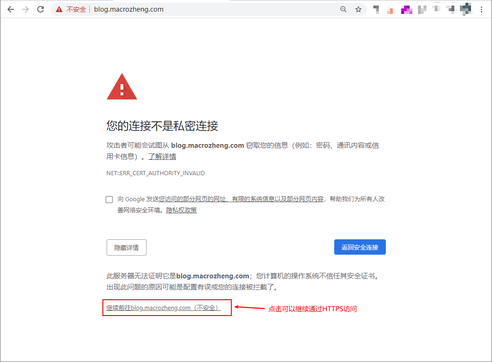
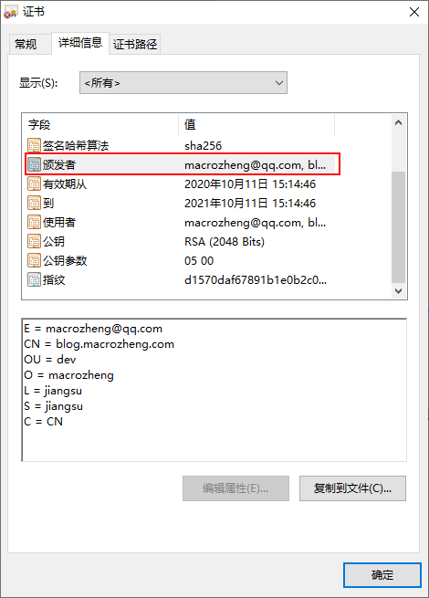
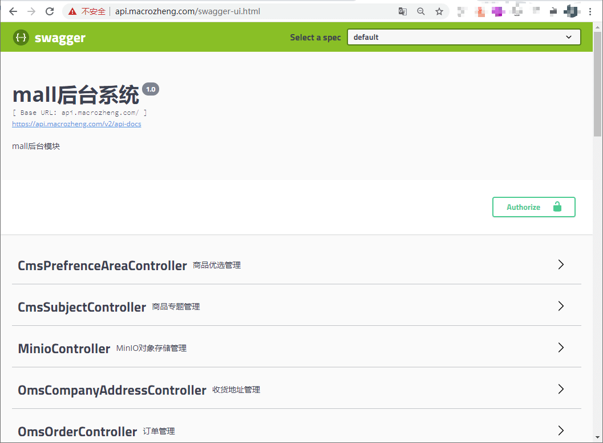
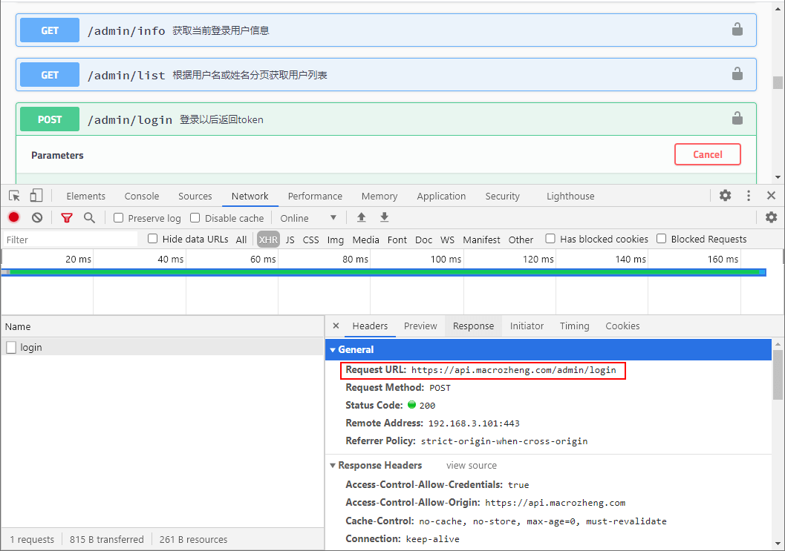
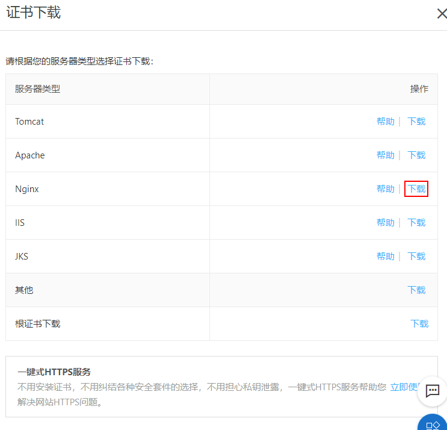
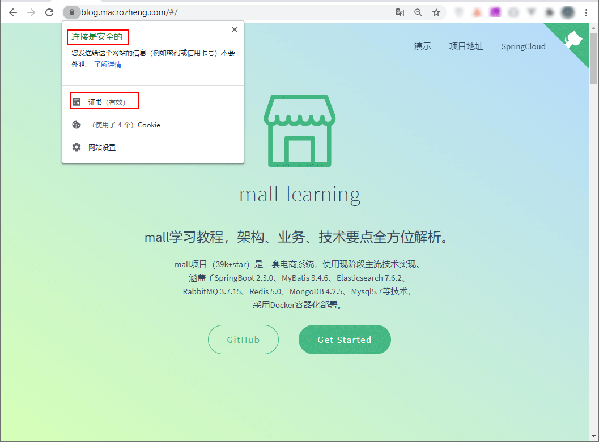
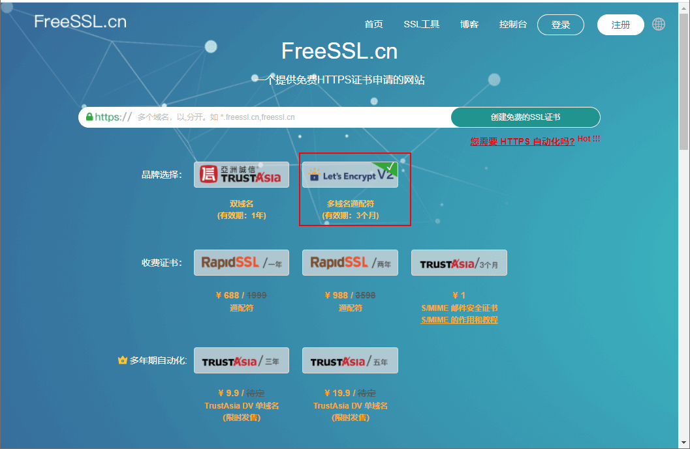
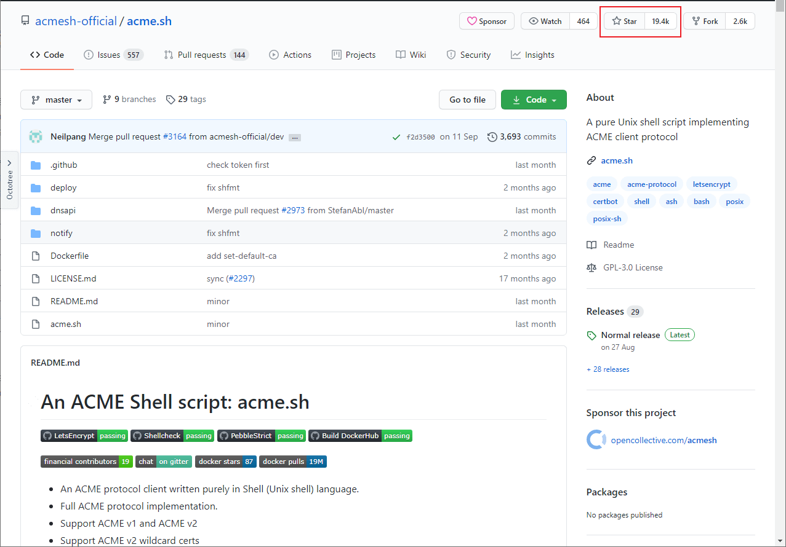

学习不走弯路，[关注公众号](#公众号) 回复「学习路线」，获取mall项目专属学习路线！

# Nginx如何支持HTTPS？手把手教贼简单！

> 随着我们网站用户的增多，我们会逐渐意识到HTTPS加密的重要性。在不修改现有代码的情况下，要从HTTP升级到HTTPS，让Nginx支持HTTPS是个很好的选择。今天我们来讲下如何从Nginx入手，从HTTP升级到HTTPS，同时支持静态网站和SpringBoot应用，希望对大家有所帮助！

## 生成SSL自签名证书

> 虽然自签名证书浏览器认为并不是安全的，但是学习下SSL证书的生成还是很有必要的！

- 首先创建SSL证书私钥，期间需要输入两次用户名和密码，生成文件为`blog.key`；

```bash
openssl genrsa -des3 -out blog.key 2048
```

- 利用私钥生成一个不需要输入密码的密钥文件，生成文件为`blog_nopass.key`；

```bash
openssl rsa -in blog.key -out blog_nopass.key
```

- 创建SSL证书签名请求文件，生成SSL证书时需要使用到，生成文件为`blog.csr`；

```bash
openssl req -new -key blog.key -out blog.csr
```

- 在生成过程中，我们需要输入一些信息，需要注意的是`Common Name`需要和网站域名一致；

```
Enter pass phrase for blog.key:
-----
Country Name (2 letter code) [XX]:CN                                         # 国家代码
State or Province Name (full name) []:jiangsu                                # 省份
Locality Name (eg, city) [Default City]:jiangsu                              # 城市
Organization Name (eg, company) [Default Company Ltd]:macrozheng             # 机构名称
Organizational Unit Name (eg, section) []:dev                                # 单位名称
Common Name (eg, your name or your server's hostname) []:blog.macrozheng.com # 网站域名
Email Address []:macrozheng@qq.com                                           # 邮箱

Please enter the following 'extra' attributes
to be sent with your certificate request
A challenge password []:                                                     # 私钥保护密码,可以不输入直接回车
An optional company name []:                                                 # 可选公司名称，可以不输入直接回车
```

- 生成SSL证书，有效期为365天，生成文件为`blog.crt`；

```bash
openssl x509 -req -days 365 -in blog.csr -signkey blog.key -out blog.crt
```

- 其实最终有用的文件是两个，一个是证书文件`blog.crt`，另一个是不需要输入密码的证书私钥文件`blog_nopass.key`。

## Nginx支持HTTPS

> SSL证书生成好了，接下来我们就可以配置Nginx来支持HTTPS了！

### 安装Nginx

- 我们还是使用在Docker容器中安装Nginx的方式，先下载Nginx的Docker镜像；

```bash
docker pull nginx:1.10
```

- 下载完成后先运行一次Nginx，由于之后我们要把宿主机的Nginx配置文件映射到Docker容器中去，运行一次方便我们拷贝默认配置；

```bash
docker run -p 80:80 --name nginx \
-v /mydata/nginx/html:/usr/share/nginx/html \
-v /mydata/nginx/logs:/var/log/nginx  \
-d nginx:1.10
```

- 运行成功后将容器中的Nginx配置目录拷贝到宿主机上去；

```bash
docker container cp nginx:/etc/nginx /mydata/nginx/
```

- 将宿主机上的`nginx`目录改名为`conf`，要不然`/mydata/nginx/nginx`这个配置文件目录看着有点别扭；

```bash
mv /mydata/nginx/nginx /mydata/nginx/conf
```

- 创建的Nginx容器复制完配置后就没用了，停止并删除容器；

```bash
docker stop nginx
docker rm nginx
```

- 使用Docker命令重新启动Nginx服务，需要映射好配置文件，由于我们要支持HTTPS，还需要开放`443`端口。

```bash
docker run -p 80:80 -p 443:443 --name nginx \
-v /mydata/nginx/html:/usr/share/nginx/html \
-v /mydata/nginx/logs:/var/log/nginx  \
-v /mydata/nginx/conf:/etc/nginx \
-d nginx:1.10
```

### 配置支持HTTPS

- 将我们生成好的SSL证书和私钥拷贝到Nginx的`html/ssl`目录下；

```bash
cp blog_nopass.key /mydata/nginx/html/ssl/
cp blog.crt /mydata/nginx/html/ssl/
```

- 接下来我们需要给`blog.macrozheng.com`这个域名添加HTTPS支持，在`/mydata/nginx/conf/conf.d/`目录下添加Nginx配置文件`blog.conf`，配置文件内容如下；

```
server {
    listen       80; # 同时支持HTTP
    listen       443 ssl; # 添加HTTPS支持
    server_name  blog.macrozheng.com;
  
    #SSL配置
    ssl_certificate      /usr/share/nginx/html/ssl/blog/blog.crt; # 配置证书
    ssl_certificate_key  /usr/share/nginx/html/ssl/blog/blog_nopass.key; # 配置证书私钥
    ssl_protocols        TLSv1 TLSv1.1 TLSv1.2; # 配置SSL协议版本
    ssl_ciphers          ECDHE-RSA-AES128-GCM-SHA256:HIGH:!aNULL:!MD5:!RC4:!DHE; # 配置SSL加密算法
    ssl_prefer_server_ciphers  on; # 优先采取服务器算法
    ssl_session_cache    shared:SSL:10m; # 配置共享会话缓存大小
    ssl_session_timeout  10m; # 配置会话超时时间

    location / {
        root   /usr/share/nginx/html/www;
        index  index.html index.htm;
    }

    location /admin {
        alias   /usr/share/nginx/html/admin;
        index  index.html index.htm;
    }

    location /app {
        alias   /usr/share/nginx/html/app;
        index  index.html index.htm;
    }

    error_page   500 502 503 504  /50x.html;
    location = /50x.html {
        root   /usr/share/nginx/html;
    }
}
```

- 通过`HTTPS`访问`blog.macrozheng.com`这个域名，由于我们使用的是自己签名的SSL证书，浏览器会提示`您的连接不是私密连接`，点击继续前往可以通过HTTPS正常访问；



- 我们可以查看下证书的`颁发者`信息，可以发现正好是之前我们创建SSL证书签名请求文件时录入的信息；



- 接下来我们需要给`api.macrozheng.com`这个域名添加HTTPS支持，通过这个域名可以使用HTTPS访问我们的SpringBoot应用，`api.crt`和`api_nopass.key`文件需要自行生成，在`/mydata/nginx/conf/conf.d/`目录下添加Nginx配置文件`api.conf`，配置文件内容如下；

```
server {
    listen       80; # 同时支持HTTP
    listen       443 ssl; # 添加HTTPS支持
    server_name  api.macrozheng.com; #修改域名

    #ssl配置
    ssl_certificate      /usr/share/nginx/html/ssl/api/api.crt; # 配置证书
    ssl_certificate_key  /usr/share/nginx/html/ssl/api/api_nopass.key; # 配置证书私钥
    ssl_protocols        TLSv1 TLSv1.1 TLSv1.2; # 配置SSL协议版本 # 配置SSL加密算法
    ssl_ciphers          ECDHE-RSA-AES128-GCM-SHA256:HIGH:!aNULL:!MD5:!RC4:!DHE;
    ssl_prefer_server_ciphers  on; # 优先采取服务器算法
    ssl_session_cache    shared:SSL:10m; # 配置共享会话缓存大小
    ssl_session_timeout  10m; # 配置会话超时时间

    location / {
        proxy_pass   http://192.168.3.101:8080; # 设置代理服务访问地址
        proxy_set_header  Host $http_host; # 设置客户端真实的域名（包括端口号）
        proxy_set_header  X-Real-IP  $remote_addr; # 设置客户端真实IP
        proxy_set_header  X-Forwarded-For $proxy_add_x_forwarded_for; # 设置在多层代理时会包含真实客户端及中间每个代理服务器的IP
        proxy_set_header X-Forwarded-Proto $scheme; # 设置客户端真实的协议（http还是https）
        index  index.html index.htm;
    }

    error_page   500 502 503 504  /50x.html;
    location = /50x.html {
        root   /usr/share/nginx/html;
    }
}
```

- 通过`HTTPS`访问`api.macrozheng.com`这个域名，访问地址为：https://api.macrozheng.com/swagger-ui.html



- 任意调用一个接口测试下，比如说登录接口，可以发现已经可以通过HTTPS正常访问SpringBoot应用提供的接口。



## 使用受信任的证书

> 之前我们使用的是自签名的SSL证书，对于浏览器来说是无效的。使用权威机构颁发的SSL证书浏览器才会认为是有效的，这里给大家推荐两种申请免费SSL证书的方法，一种是从阿里云申请，另一种是从FreeSSL申请。

### 阿里云证书

- 阿里云上可以申请的免费证书目前只有支持单个域名的DV级SSL证书。比如说你有`blog.macrozheng.com`和`api.macrozheng.com`两个二级域名需要使用HTTPS，就需要申请两个SSL证书。


- 申请成功后点击下载Nginx证书即可；



- 下载完成后解压会有下面两个文件；

```bash
blog.macrozheng.com.key # 证书私钥文件
blog.macrozheng.com.pem # 证书文件
```

- 拷贝证书文件到Nginx的指定目录下，然后修改配置文件`blog.conf`，只要修改证书配置路径即可，修改完成后重启Nginx；

```
#SSL配置
ssl_certificate      /usr/share/nginx/html/ssl/blog/blog.macrozheng.com.pem; # 配置证书
ssl_certificate_key  /usr/share/nginx/html/ssl/blog/blog.macrozheng.com.key; # 配置证书私钥
```

- 再次通过HTTPS访问`blog.macrozheng.com`这个域名，发现证书已经有效了，连接也是安全的了。



### FreeSSL证书

- 如果你有使用通配符域名的需求，可以上`FreeSSL`申请SSL证书，不过免费的有效期只有3个月，这就意味着你过3个月就要重新申请一次了。



- 附上官网地址：https://freessl.cn/

### 使用`acme.sh`自动申请证书

- `acme.sh`脚本实现了`acme`协议, 可以从`letsencrypt`生成免费的证书。一般我们申请的证书有效期都是1年，过期就要重新申请了，使用`acme.sh`脚本可以实现到期自动申请，再也不用担心证书过期了！



- 附上官网地址：https://github.com/acmesh-official/acme.sh

## 公众号

