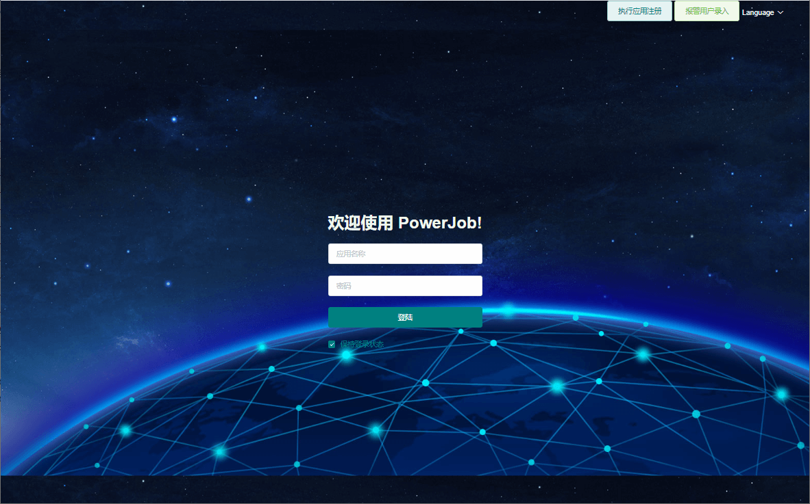
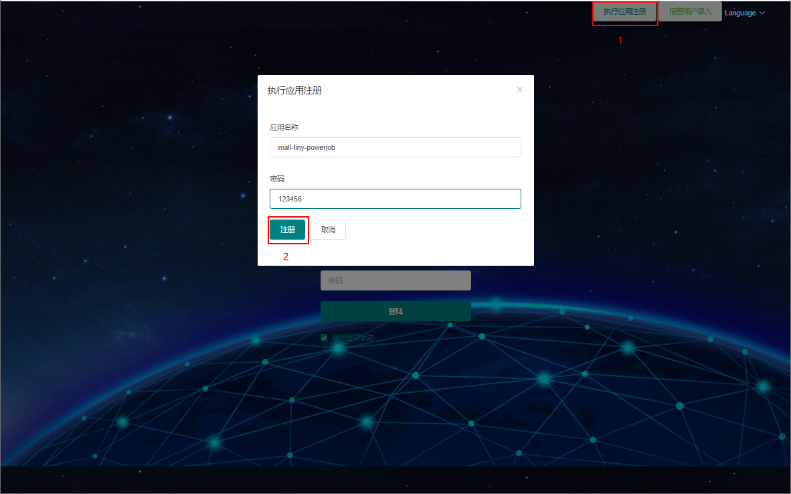
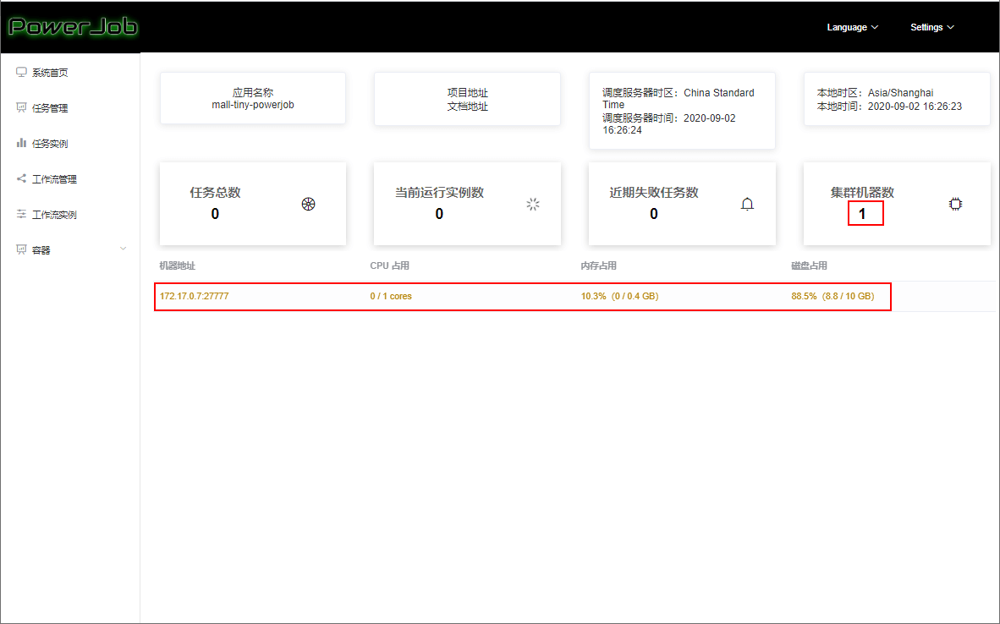
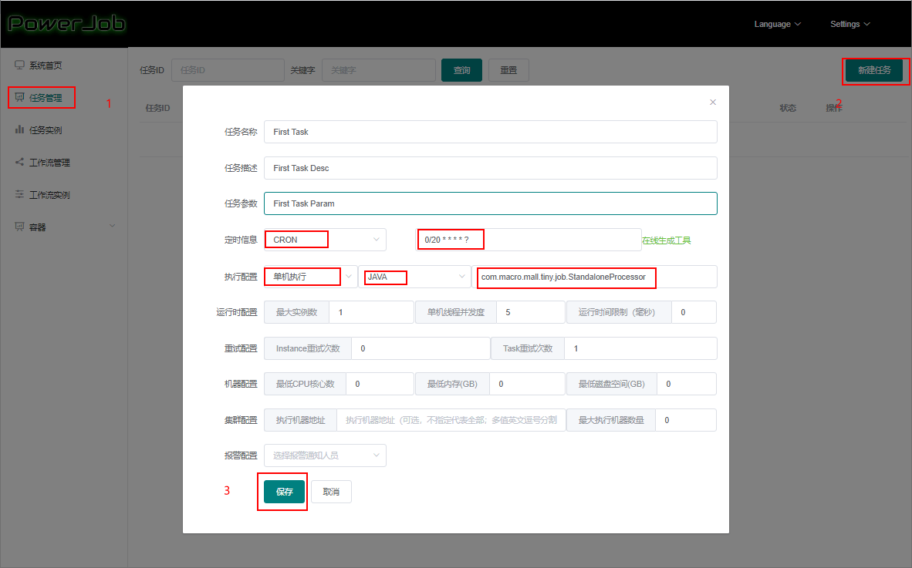
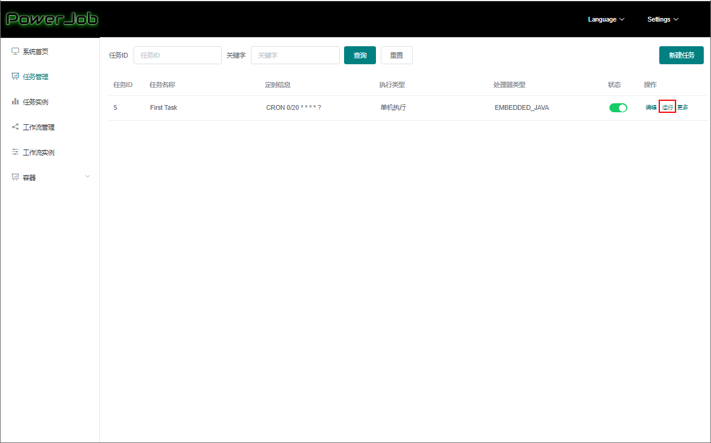
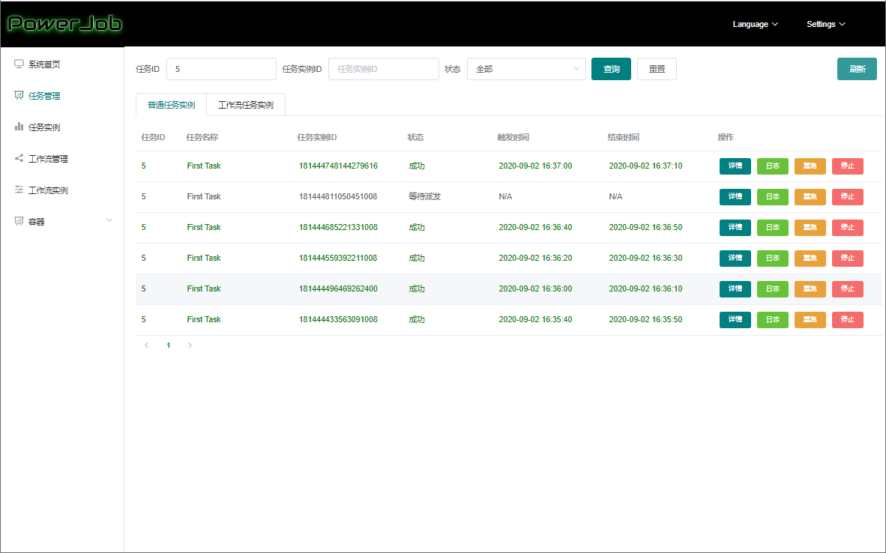
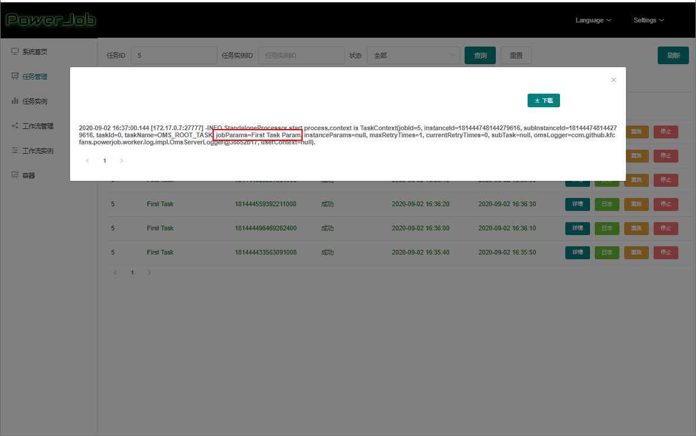
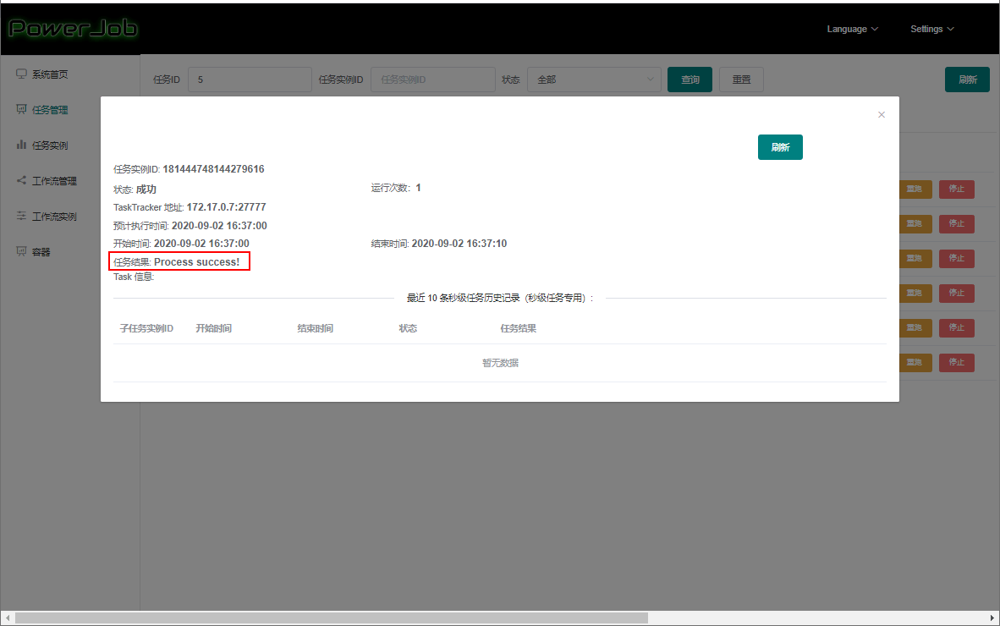

学习不走弯路，[关注公众号](#公众号) 回复「学习路线」，获取mall项目专属学习路线！

# 还在手写任务调度代码？试试这款可视化分布式调度框架！

> 在微服务系统中，经常会有用到任务调度的场景。比如每天定时同步数据、定时生成业务报表、定期清理日志等。今天给大家推荐一个分布式调度框架，助你你轻松完成任务调度工作！

## PowerJob 简介

PowerJob是全新一代分布式调度与计算框架，能让你轻松完成任务的调度与繁杂任务的分布式计算。

主要特性：

- 使用简单：提供前端Web界面，允许开发者可视化完成调度任务的管理及查看任务运行状态和日志。
- 定时策略完善：支持CRON表达式、固定频率、固定延迟和API四种定时调度策略。
- 执行模式丰富：支持单机、广播、Map、MapReduce四种执行模式。
- 依赖精简：最小仅依赖关系型数据库（MySQL等），扩展依赖为MongoDB（用于存储庞大的在线日志）。

## 为什么要有调度中心

一般情况下我们会使用`QuartZ`或`Spring Task`这些框架在应用中实现定时任务来进行任务调度，但是在微服务架构下，如果很多应用都充斥着这种任务调度代码就显得有些不合适。合理的方案应该是这样的，任务的执行方法存在于应用中，而我们有一个调度中心，调度中心负责调度这些方法，我们只需在调度中心配置好任务即可，PowerJob正是这样一个分布式调度框架。

## 安装准备

> 由于PowerJob的调度中心（powerjob-server）需要使用MySQL存储数据，使用MongoDB存储日志，所以我们先安装并启动这两个服务。

- 在Docker容器中启动MySQL服务；

```bash
docker run -p 3306:3306 --name mysql \
-v /mydata/mysql/log:/var/log/mysql \
-v /mydata/mysql/data:/var/lib/mysql \
-v /mydata/mysql/conf:/etc/mysql \
-e MYSQL_ROOT_PASSWORD=root  \
-d mysql:5.7
```

- 在MySQL中创建PowerJob需要的数据库`powerjob-product`；

```sql
CREATE DATABASE IF NOT EXISTS `powerjob-product` DEFAULT CHARSET utf8mb4
```

- 在Docker容器中启动MongoDB服务。

```bash
docker run -p 27017:27017 --name mongo \
-v /mydata/mongo/db:/data/db \
-d mongo:4.2.5
```

## 安装调度中心

> 在Docker环境下安装PowerJob的调度中心非常简单，分分钟搞定！

- 下载镜像`powerjob-server`的Docker镜像：

```bash
docker pull tjqq/powerjob-server:latest
```

- 在Docker容器中运行`powerjob-server`服务：

```bash
docker run -p 7700:7700 -p 10086:10086 --name powerjob-server \
--link mysql:db \
--link mongo:mongo \
-e TZ="Asia/Shanghai" \
-e JVMOPTIONS="" \
-e PARAMS="--spring.profiles.active=product --spring.datasource.core.jdbc-url=jdbc:mysql://db:3306/powerjob-product?useUnicode=true&characterEncoding=UTF-8 --spring.datasource.core.username=root --spring.datasource.core.password=root --spring.data.mongodb.uri=mongodb://mongo:27017/powerjob-product" \
-v ~/docker/powerjob-server:/mydata/powerjob/powerjob-server \
-v ~/.m2:/mydata/powerjob/.m2 \
-d tjqq/powerjob-server:latest
```

- 运行成功后即可访问`powerjob-server`的Web界面，注意Linux防火墙需要开放`7700`和`10086`两个端口，访问地址：http://192.168.3.101:7700/



## 在应用中初始化执行器

> 安装完调度中心后，我们需要在SpringBoot应用中初始化PowerJob的执行器（powerjob-worker）。

- 首先在`pom.xml`中添加`powerjob-worker`的相关依赖：

```xml
<dependency>
    <groupId>com.github.kfcfans</groupId>
    <artifactId>powerjob-worker-spring-boot-starter</artifactId>
    <version>3.2.3</version>
</dependency>
```

- 之后在`application.yml`配置文件中添加`powerjob-worker`相关配置，注意`powerjob.worker.app-name`这个配置；

```yaml
powerjob:
  worker:
    akka-port: 27777 # akka 工作端口
    app-name: mall-tiny-powerjob # 接入应用名称，用于分组隔离
    server-address: 192.168.3.101:7700 # 调度服务器地址
    store-strategy: disk # 持久化方式
```

- 添加一个单机处理器`StandaloneProcessor`，只需继承`BasicProcessor`接口并实现`process`方法即可；

```java
package com.macro.mall.tiny.job;

@Slf4j
@Component
public class StandaloneProcessor implements BasicProcessor {

    @Override
    public ProcessResult process(TaskContext context){
        //OmsLogger可以直接将日志上报到powerjob-server
        OmsLogger omsLogger = context.getOmsLogger();
        omsLogger.info("StandaloneProcessor start process,context is {}.", context);
        log.info("jobParams is {}", context.getJobParams());
        return new ProcessResult(true, "Process success!");
    }
}
```

- 打包上传好镜像后，在Docker容器中运行SpringBoot应用服务，注意配置好时区要和调度中心一致。

```bash
docker run -p 8080:8080 --name mall-tiny-powerjob \
--link mysql:db \
-v /etc/localtime:/etc/localtime \
-v /mydata/app/mall-tiny-powerjob/logs:/var/logs \
-e TZ="Asia/Shanghai" \
-d mall-tiny/mall-tiny-powerjob:1.0-SNAPSHOT
```

## 任务的配置与执行

> 有了执行器和调度中心，我们只需在调度中心中配置好任务即可实现任务调度。

- 首先我们需要在调度中心注册好应用（集成执行器的），应用名称为`application.yml`中的`powerjob.worker.app-name`属性，这里使用的是`mall-tiny-powerjob:123456`；



- 之后我们可以在首页看见一台机器信息；



- 之后在`任务管理`功能中添加一个任务，这里我们用`CRON`方式设置`每20秒`执行执行器中的处理方法；



- 在任务列表中点击`运行`开始执行任务；



- 在任务列表中点击`更多->运行记录`可以查看任务的运行日志；



- 点击`日志`可以查看处理器中上报的日志，`jobParams`为之前我们创建任务时设置的参数；



- 点击`详情`可以查看此次触发任务的结果，即我们在`ProcessResult`中返回的信息。



## 参考资料

官方文档：https://github.com/KFCFans/PowerJob

## 项目源码地址

https://github.com/macrozheng/mall-learning/tree/master/mall-tiny-powerjob

## 公众号

