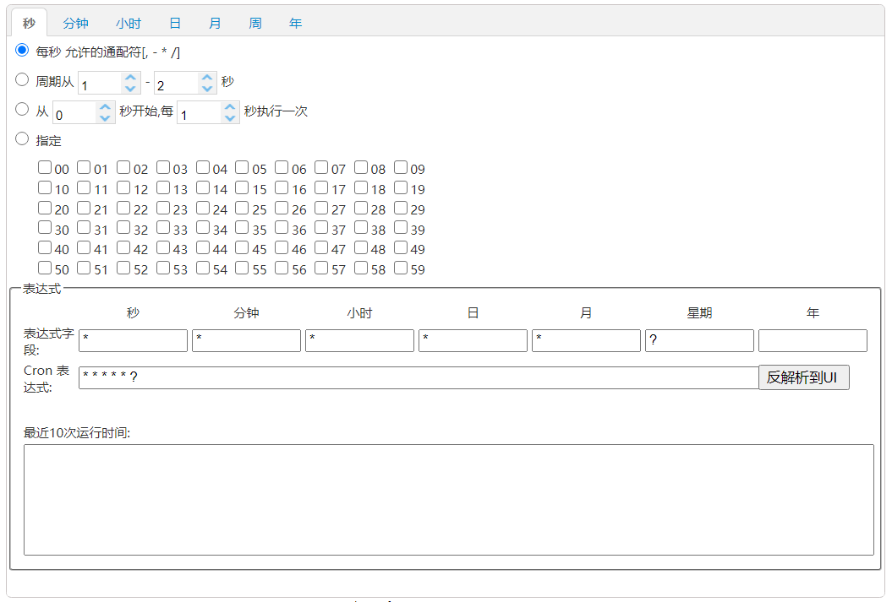
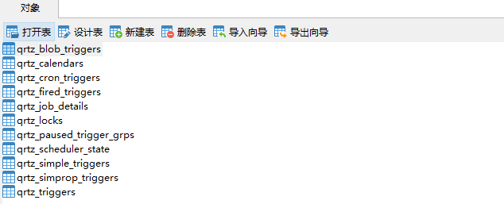
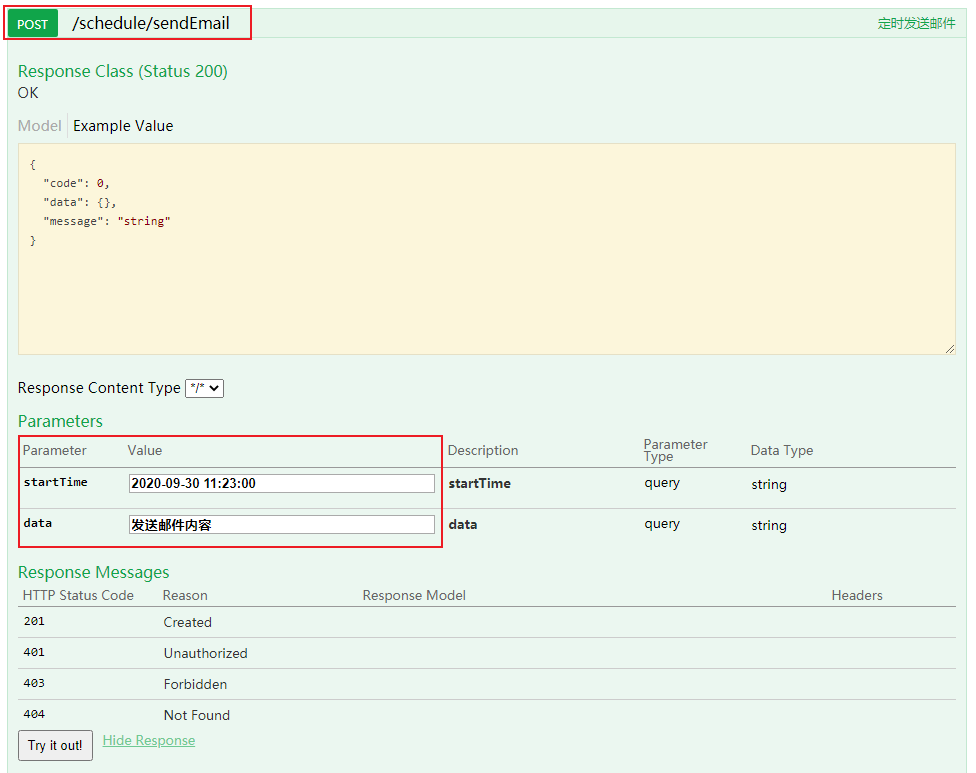
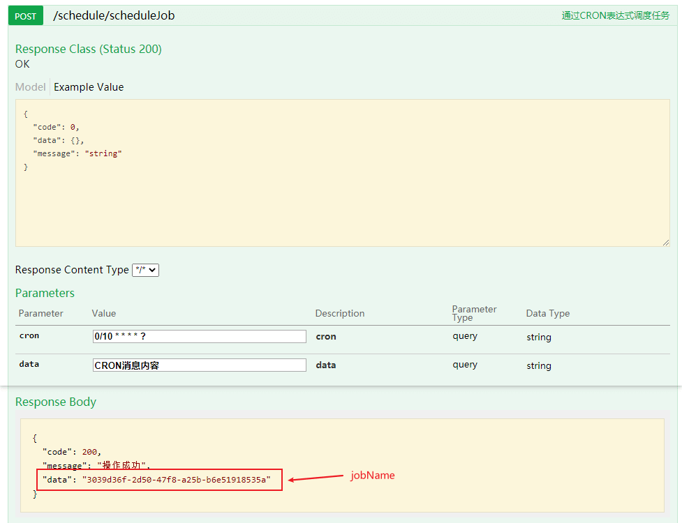
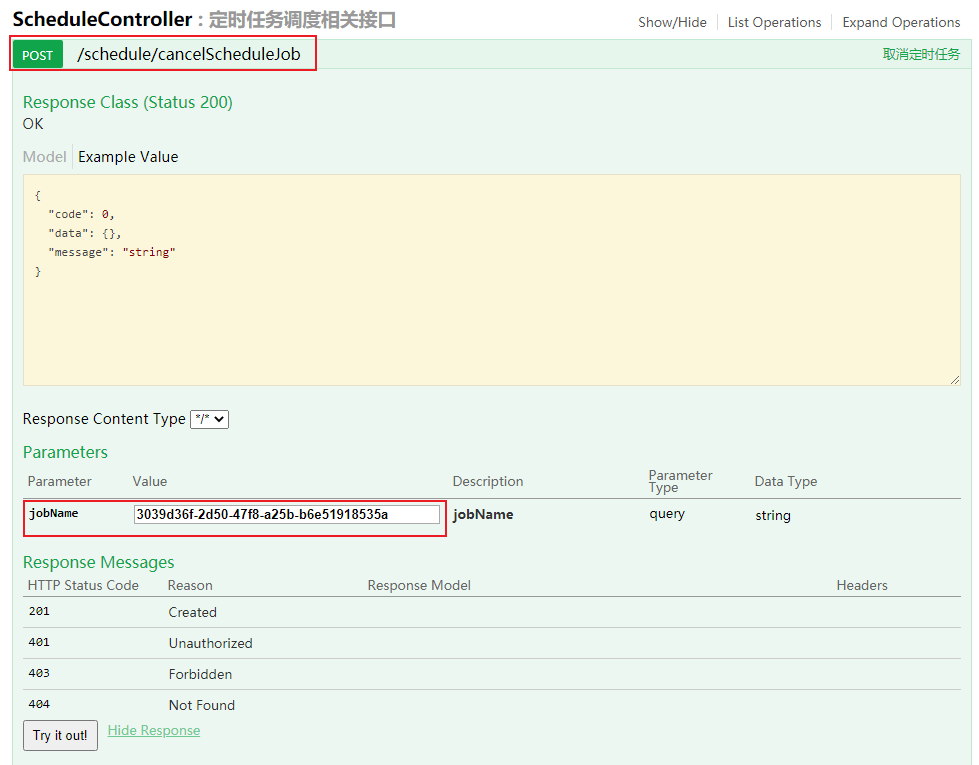

学习不走弯路，[关注公众号](#公众号) 回复「学习路线」，获取mall项目专属学习路线！

# SpringBoot官方支持任务调度框架，轻量级用起来也挺香！

> 之前我们讲过一个分布式任务调度框架PowerJob，可以通过可视化的方式来进行任务调度。但是有时候我们只是需要一个轻量级的任务调度功能，而PowerJob需要搭建调度中心未免有些重，这时候SpringBoot官方支持的任务调度框架Quartz就派上用场了！本文主要介绍Quartz在SpringBoot中的使用，让你在实现任务调度上有更多的选择！

## Quartz简介

Quartz是一款功能强大的开源任务调度框架，几乎可以集成到任何Java应用程序中（小到单机应用，大到分布式应用）。Quartz可用于创建简单或复杂的任务调度，用以执行数以万计的任务。任务被定义为标准化的Java组件，Java编写的任务都可以被执行。

## 核心概念

> Quartz中有一些比较核心的概念，理解它们对使用Quartz很有帮助！

- Scheduler（调度器）：Quartz中的任务调度器，通过Trigger和JobDetail可以用来调度、暂停和删除任务。
- Trigger（触发器）：Quartz中的触发器，可以通过CRON表达式来指定任务执行的时间，时间到了会自动触发任务执行。
- JobDetail（任务详情）：Quartz中需要执行的任务详情，包括了任务的唯一标识和具体要执行的任务，可以通过JobDataMap往任务中传递数据。
- Job（任务）：Quartz中具体的任务，包含了执行任务的具体方法。

## CRON表达式

> Cron表达式是一个字符串，包括6~7个时间元素，在Quartz中可以用于指定任务的执行时间。

### CRON的语法格式

```
Seconds Minutes Hours DayofMonth Month DayofWeek
```

### CRON格式中每个时间元素的说明

| 时间元素   | 可出现的字符  | 有效数值范围 |
| ---------- | ------------- | ------------ |
| Seconds    | , - * /       | 0-59         |
| Minutes    | , - * /       | 0-59         |
| Hours      | , - * /       | 0-23         |
| DayofMonth | , - * / ? L W | 0-31         |
| Month      | , - * /       | 1-12         |
| DayofWeek  | , - * / ? L # | 1-7或SUN-SAT |

### CRON格式中特殊字符说明

| 字符 | 作用                                      | 举例                                                         |
| ---- | ----------------------------------------- | ------------------------------------------------------------ |
| ,    | 列出枚举值                                | 在Minutes域使用5,10，表示在5分和10分各触发一次               |
| \-   | 表示触发范围                              | 在Minutes域使用5-10，表示从5分到10分钟每分钟触发一次         |
| \*   | 匹配任意值                                | 在Minutes域使用*, 表示每分钟都会触发一次                     |
| /    | 起始时间开始触发，每隔固定时间触发一次    | 在Minutes域使用5/10,表示5分时触发一次，每10分钟再触发一次    |
| ?    | 在DayofMonth和DayofWeek中，用于匹配任意值 | 在DayofMonth域使用?,表示每天都触发一次                       |
| \#   | 在DayofMonth中，确定第几个星期几          | 1#3表示第三个星期日                                          |
| L    | 表示最后                                  | 在DayofWeek中使用5L,表示在最后一个星期四触发                 |
| W    | 表示有效工作日(周一到周五)                | 在DayofMonth使用5W，如果5日是星期六，则将在最近的工作日4日触发一次 |

### 在线CRON表达式生成器

其实CRON表达式无需多记，需要使用的时候直接使用在线生成器就可以了，地址：https://cron.qqe2.com/



## 整合SpringBoot使用

> 接下来我们讲下如何在SpringBoot中使用Quartz来实现任务调度，在电商系统中往往会有需要定时发送邮件或者站内信的需求，我们以此为场景来实现下！

- Quartz存储任务信息有两种方式，使用内存或者使用数据库来存储，这里我们采用数据库存储的方式，首先需要新建Quartz的相关表，建表脚本在项目的`resources`目录下，名称为`tables_mysql.sql`，创建成功后数据库中多出11张表；



- 接下来在`pom.xml`中添加Quartz的相关依赖即可，SpringBoot官方已经给我们提供好了相关Starter；

```xml
<!--SpringBoot集成QuartZ-->
<dependency>
    <groupId>org.springframework.boot</groupId>
    <artifactId>spring-boot-starter-quartz</artifactId>
</dependency>
```

- 在`application.yml`中添加Quartz相关配置，配置说明直接看注释就好了，主要是对`scheduler`、`jobStore`和`threadPool`进行配置；

```yaml
spring:
  quartz:
    job-store-type: jdbc # quartz任务存储类型：jdbc或memory
    wait-for-jobs-to-complete-on-shutdown: true # 关闭时等待任务完成
    overwrite-existing-jobs: true # 可以覆盖已有的任务
    properties: # quartz原生配置
      org:
        quartz:
          scheduler:
            instanceName: scheduler # 调度器实例名称
            instanceId: AUTO # 调度器实例ID自动生成
          jobStore:
            class: org.quartz.impl.jdbcjobstore.JobStoreTX # 调度信息存储处理类
            driverDelegateClass: org.quartz.impl.jdbcjobstore.StdJDBCDelegate # 使用完全兼容JDBC的驱动
            tablePrefix: QRTZ_ # quartz相关表前缀
            useProperties: false # 是否将JobDataMap中的属性转为字符串存储
          threadPool:
            class: org.quartz.simpl.SimpleThreadPool # 指定线程池实现类，对调度器提供固定大小的线程池
            threadCount: 10 # 设置并发线程数量
            threadPriority: 5 # 指定线程优先级
```

- 创建任务调度业务接口，定义好三个方法，分别为通过CRON表达式调度任务、调度指定时间的任务和取消定时任务；

```java
/**
 * Quartz定时任务操作类
 * Created by macro on 2020/9/27.
 */
public interface ScheduleService {
    /**
     * 通过CRON表达式调度任务
     */
    String scheduleJob(Class<? extends Job> jobBeanClass, String cron, String data);

    /**
     * 调度指定时间的任务
     */
    String scheduleFixTimeJob(Class<? extends Job> jobBeanClass, Date startTime, String data);

    /**
     * 取消定时任务
     */
    Boolean cancelScheduleJob(String jobName);
}
```

- 创建任务调度业务实现类，通过`Scheduler`、`CronTrigger`、`JobDetail`的API实现相关方法；

```java
/**
 * Quartz定时任务操作实现类
 * Created by macro on 2020/9/27.
 */
@Slf4j
@Service
public class ScheduleServiceImpl implements ScheduleService {
    @Autowired
    private Scheduler scheduler;
    private String defaultGroup = "default_group";

    @Override
    public String scheduleJob(Class<? extends Job> jobBeanClass, String cron, String data) {
        // 创建需要执行的任务
        String jobName = UUID.fastUUID().toString();
        JobDetail jobDetail = JobBuilder.newJob(jobBeanClass)
                .withIdentity(jobName, defaultGroup)
                .usingJobData("data", data)
                .build();
        //创建触发器，指定任务执行时间
        CronTrigger cronTrigger = TriggerBuilder.newTrigger()
                .withIdentity(jobName, defaultGroup)
                .withSchedule(CronScheduleBuilder.cronSchedule(cron))
                .build();
        //使用调度器进行任务调度
        try {
            scheduler.scheduleJob(jobDetail, cronTrigger);
        } catch (SchedulerException e) {
            e.printStackTrace();
            log.info("创建定时任务失败！");
        }
        return jobName;
    }

    @Override
    public String scheduleFixTimeJob(Class<? extends Job> jobBeanClass, Date startTime, String data) {
        //日期转CRON表达式
        String startCron = String.format("%d %d %d %d %d ? %d",
                DateUtil.second(startTime),
                DateUtil.minute(startTime),
                DateUtil.hour(startTime, true),
                DateUtil.dayOfMonth(startTime),
                DateUtil.month(startTime) + 1,
                DateUtil.year(startTime));
        return scheduleJob(jobBeanClass, startCron, data);
    }

    @Override
    public Boolean cancelScheduleJob(String jobName) {
        boolean success = false;
        try {
            // 暂停触发器
            scheduler.pauseTrigger(new TriggerKey(jobName, defaultGroup));
            // 移除触发器中的任务
            scheduler.unscheduleJob(new TriggerKey(jobName, defaultGroup));
            // 删除任务
            scheduler.deleteJob(new JobKey(jobName, defaultGroup));
            success = true;
        } catch (SchedulerException e) {
            e.printStackTrace();
        }
        return success;
    }
}
```

- 定义好需要执行的任务，继承`QuartzJobBean`类，实现`executeInternal`方法即可，这里定义了三个任务，定时发送邮件、定时发送站内信和执行CRON表达式任务；

```java
/**
 * 发送邮件定时任务执行器
 * Created by macro on 2020/9/27.
 */
@Slf4j
@Component
public class SendEmailJob extends QuartzJobBean {
    @Autowired
    private ScheduleService scheduleService;

    @Override
    protected void executeInternal(JobExecutionContext jobExecutionContext) throws JobExecutionException {
        Trigger trigger = jobExecutionContext.getTrigger();
        JobDetail jobDetail = jobExecutionContext.getJobDetail();
        JobDataMap jobDataMap = jobDetail.getJobDataMap();
        String data = jobDataMap.getString("data");
        log.info("定时发送邮件操作：{}",data);
        //完成后删除触发器和任务
        scheduleService.cancelScheduleJob(trigger.getKey().getName());
    }
}
```

```java
/**
 * 发送站内信定时任务执行器
 * Created by macro on 2020/9/27.
 */
@Slf4j
@Component
public class SendMessageJob extends QuartzJobBean {
    @Autowired
    private ScheduleService scheduleService;

    @Override
    protected void executeInternal(JobExecutionContext jobExecutionContext) throws JobExecutionException {
        Trigger trigger = jobExecutionContext.getTrigger();
        JobDetail jobDetail = jobExecutionContext.getJobDetail();
        JobDataMap jobDataMap = jobDetail.getJobDataMap();
        String data = jobDataMap.getString("data");
        log.info("定时发送站内信操作：{}",data);
        //完成后删除触发器和任务
        scheduleService.cancelScheduleJob(trigger.getKey().getName());
    }
}
```

```java
/**
 * 使用CRON表达式的任务执行器
 * Created by macro on 2020/9/29.
 */
@Slf4j
@Component
public class CronProcessJob extends QuartzJobBean {
    @Override
    protected void executeInternal(JobExecutionContext jobExecutionContext) throws JobExecutionException {
        JobDetail jobDetail = jobExecutionContext.getJobDetail();
        JobDataMap jobDataMap = jobDetail.getJobDataMap();
        String data = jobDataMap.getString("data");
        log.info("CRON表达式任务执行：{}",data);
    }
}
```

- 最后创建好任务调度相关接口，调用任务调度业务类即可。

```java
/**
 * 定时任务调度相关接口
 * Created by macro on 2020/9/29.
 */
@Api(tags = "ScheduleController", description = "定时任务调度相关接口")
@RestController
@RequestMapping("/schedule")
public class ScheduleController {
    @Autowired
    private ScheduleService scheduleService;

    @ApiOperation("定时发送邮件")
    @PostMapping("/sendEmail")
    public CommonResult sendEmail(@RequestParam String startTime,@RequestParam String data) {
        Date date = DateUtil.parse(startTime, DatePattern.NORM_DATETIME_FORMAT);
        String jobName = scheduleService.scheduleFixTimeJob(SendEmailJob.class, date, data);
        return CommonResult.success(jobName);
    }

    @ApiOperation("定时发送站内信")
    @PostMapping("/sendMessage")
    public CommonResult sendMessage(@RequestParam String startTime,@RequestParam String data) {
        Date date = DateUtil.parse(startTime, DatePattern.NORM_DATETIME_FORMAT);
        String jobName = scheduleService.scheduleFixTimeJob(SendMessageJob.class, date, data);
        return CommonResult.success(jobName);
    }

    @ApiOperation("通过CRON表达式调度任务")
    @PostMapping("/scheduleJob")
    public CommonResult scheduleJob(@RequestParam String cron, @RequestParam String data) {
        String jobName = scheduleService.scheduleJob(CronProcessJob.class, cron, data);
        return CommonResult.success(jobName);
    }

    @ApiOperation("取消定时任务")
    @PostMapping("/cancelScheduleJob")
    public CommonResult cancelScheduleJob(@RequestParam String jobName) {
        Boolean success = scheduleService.cancelScheduleJob(jobName);
        return CommonResult.success(success);
    }
}
```

## 运行测试

- 调用定时发送邮件接口测试；



- 到点之后发现控制台已经打印任务执行信息；

```bash
2020-09-30 11:23:00.035  INFO 10160 --- [eduler_Worker-1] com.macro.mall.tiny.job.SendEmailJob     : 定时发送邮件操作：发送邮件内容
```

- 使用CRON表达式来启动一个定时任务，从0s开始，每隔10s执行一次；



- 控制台每隔10s打印任务执行信息；

```bash
2020-09-30 11:26:30.024  INFO 10160 --- [eduler_Worker-2] com.macro.mall.tiny.job.CronProcessJob   : CRON表达式任务执行：CRON消息内容
2020-09-30 11:26:40.025  INFO 10160 --- [eduler_Worker-3] com.macro.mall.tiny.job.CronProcessJob   : CRON表达式任务执行：CRON消息内容
2020-09-30 11:26:50.017  INFO 10160 --- [eduler_Worker-4] com.macro.mall.tiny.job.CronProcessJob   : CRON表达式任务执行：CRON消息内容
2020-09-30 11:27:00.023  INFO 10160 --- [eduler_Worker-5] com.macro.mall.tiny.job.CronProcessJob   : CRON表达式任务执行：CRON消息内容
2020-09-30 11:27:10.019  INFO 10160 --- [eduler_Worker-6] com.macro.mall.tiny.job.CronProcessJob   : CRON表达式任务执行：CRON消息内容
```

- 我们可以通过启动任务返回的`jobName`，调用取消定时任务的接口来取消任务，调用成功后定时任务不在执行。



## 参考资料

官方文档：http://www.quartz-scheduler.org/documentation/

## 项目源码地址

https://github.com/macrozheng/mall-learning/tree/master/mall-tiny-quartz

## 公众号


