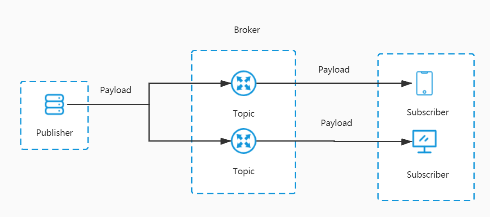
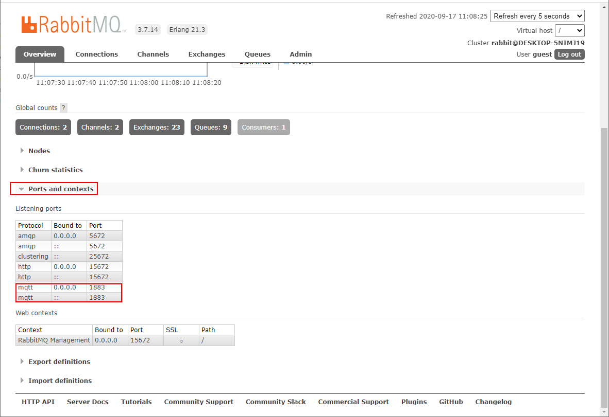
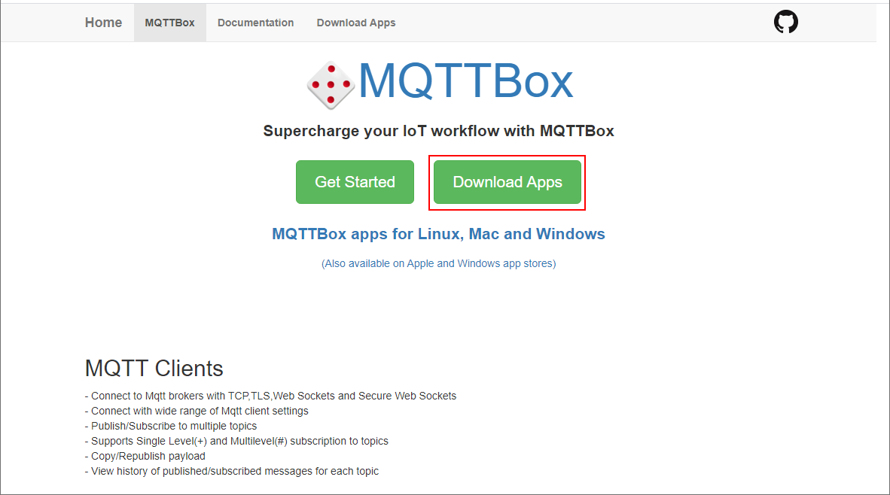
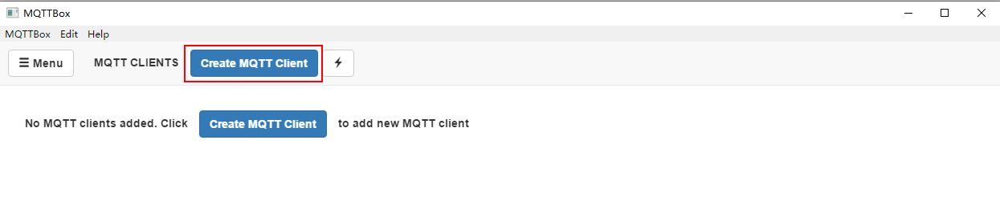
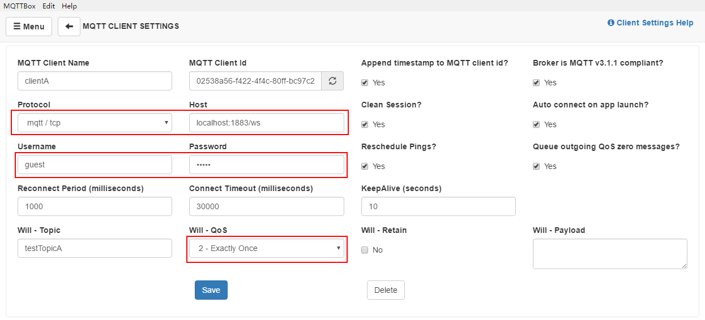
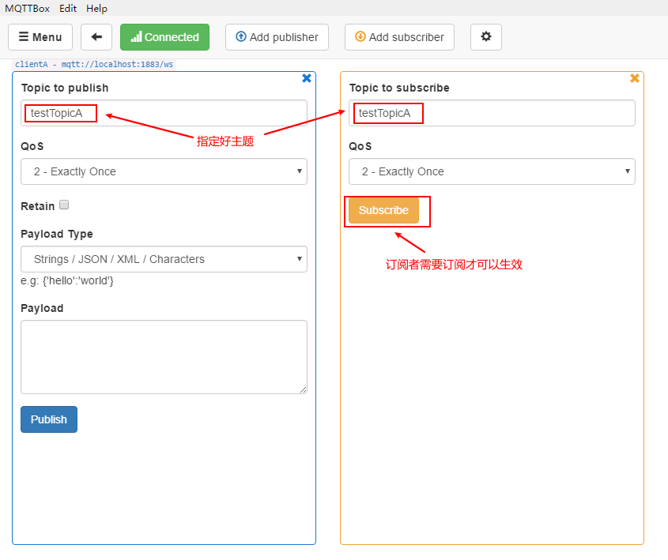
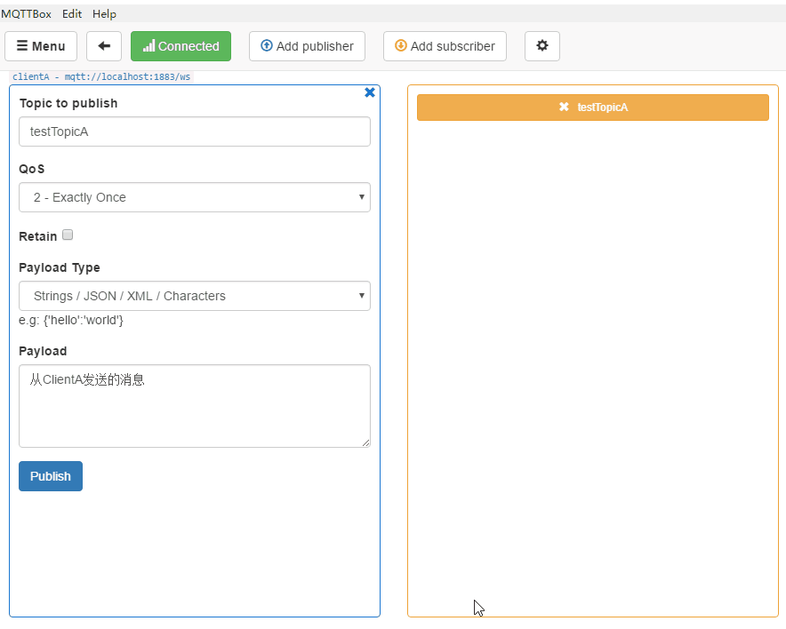
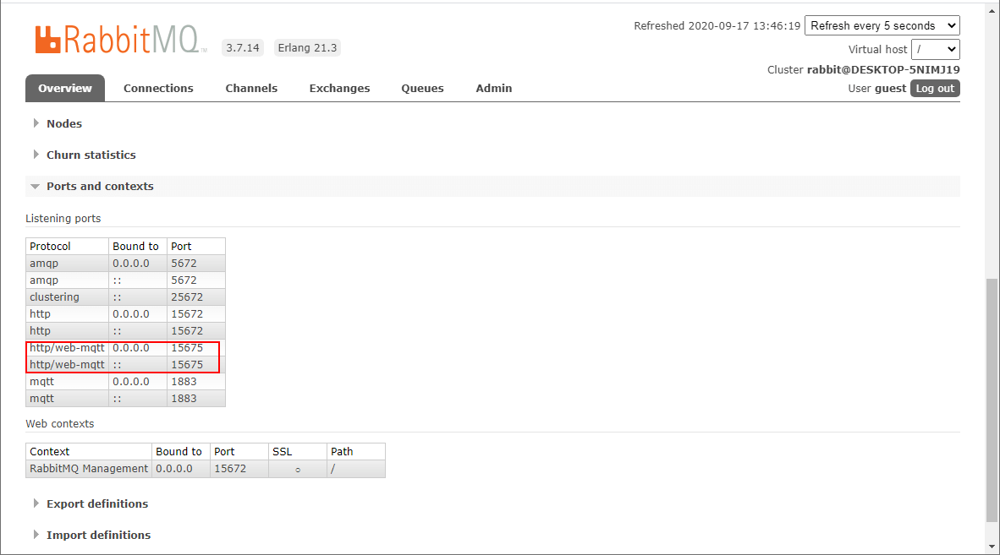
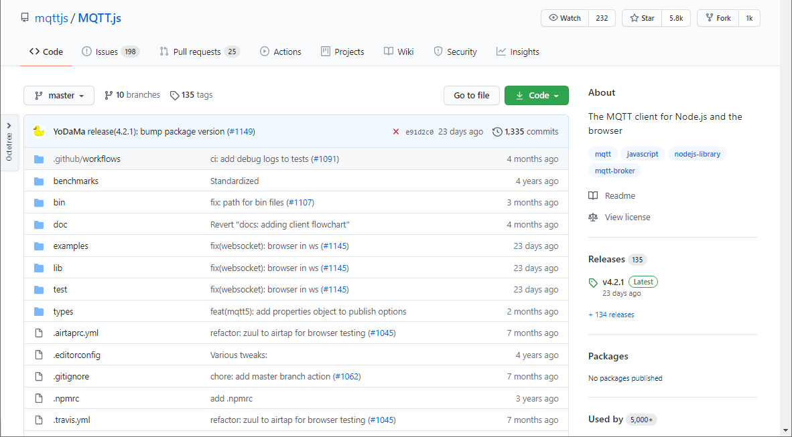
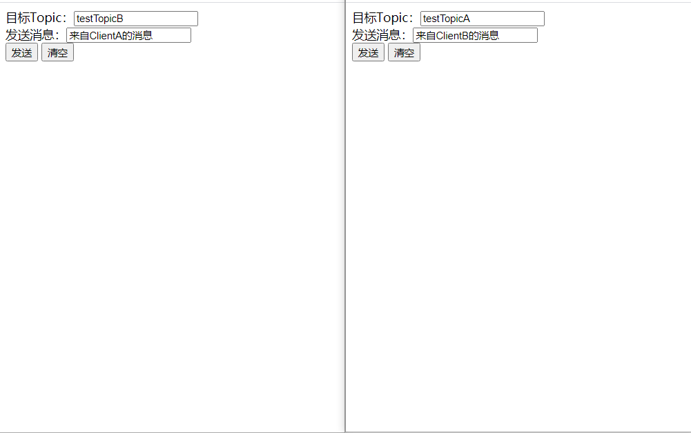

学习不走弯路，[关注公众号](#公众号) 回复「学习路线」，获取mall项目专属学习路线！

# RabbitMQ实现即时通讯居然如此简单！连后端代码都省得写了？

> 有时候我们的项目中会用到`即时通讯`功能，比如电商系统中的客服聊天功能，还有在支付过程中，当用户支付成功后，第三方支付服务会回调我们的回调接口，此时我们需要通知前端支付成功。最近发现RabbitMQ可以很方便的实现`即时通讯`功能，如果你没有特殊的业务需求，甚至可以不写后端代码，今天给大家讲讲如何使用RabbitMQ来实现`即时通讯`！

## MQTT协议

MQTT（Message Queuing Telemetry Transport，消息队列遥测传输协议），是一种基于发布/订阅（publish/subscribe）模式的`轻量级`通讯协议，该协议构建于`TCP/IP`协议上。MQTT最大优点在于，可以以极少的代码和有限的带宽，为连接远程设备提供实时可靠的消息服务。



## MQTT相关概念

- Publisher（发布者）：消息的发出者，负责发送消息。
- Subscriber（订阅者）：消息的订阅者，负责接收并处理消息。
- Broker（代理）：消息代理，位于消息发布者和订阅者之间，各类支持MQTT协议的消息中间件都可以充当。
- Topic（主题）：可以理解为消息队列中的路由，订阅者订阅了主题之后，就可以收到发送到该主题的消息。
- Payload（负载）；可以理解为发送消息的内容。
- QoS（消息质量）：全称Quality of Service，即消息的发送质量，主要有`QoS 0`、`QoS 1`、`QoS 2`三个等级，下面分别介绍下：
    - QoS 0（Almost Once）：至多一次，只发送一次，会发生消息丢失或重复；
    - QoS 1（Atleast Once）：至少一次，确保消息到达，但消息重复可能会发生；
    - QoS 2（Exactly Once）：只有一次，确保消息只到达一次。

## RabbitMQ启用MQTT功能

> RabbitMQ启用MQTT功能，需要先安装然RabbitMQ然后再启用MQTT插件。

- 首先我们需要安装并启动RabbitMQ，对RabbitMQ不了解的朋友可以参考[《花了3天总结的RabbitMQ实用技巧，有点东西！》](https://mp.weixin.qq.com/s/qGg3etLnI38i-G8aFbulWw)；

- 接下来就是启用RabbitMQ的MQTT插件了，默认是不启用的，使用如下命令开启即可；

```bash
rabbitmq-plugins enable rabbitmq_mqtt
```

- 开启成功后，查看管理控制台，我们可以发现MQTT服务运行在`1883`端口上了。



## MQTT客户端

> 我们可以使用MQTT客户端来测试MQTT的即时通讯功能，这里使用的是`MQTTBox`这个客户端工具。

- 首先下载并安装好`MQTTBox`，下载地址：http://workswithweb.com/mqttbox.html



- 点击`Create MQTT Client`按钮来创建一个MQTT客户端；



- 接下来对MQTT客户端进行配置，主要是配置好协议端口、连接用户名密码和QoS即可；



- 再配置一个订阅者，订阅者订阅`testTopicA`这个主题，我们会向这个主题发送消息；



- 发布者向主题中发布消息，订阅者可以实时接收到。



## 前端直接实现即时通讯

> 既然`MQTTBox`客户端可以直接通过RabbitMQ实现即时通讯，那我们是不是直接使用前端技术也可以实现即时通讯？答案是肯定的！下面我们将通过`html+javascript`实现一个简单的聊天功能，真正不写一行后端代码实现即时通讯！

- 由于RabbitMQ与Web端交互底层使用的是WebSocket，所以我们需要开启RabbitMQ的MQTT WEB支持，使用如下命令开启即可；

```bash
rabbitmq-plugins enable rabbitmq_web_mqtt
```

- 开启成功后，查看管理控制台，我们可以发现MQTT的WEB服务运行在`15675`端口上了；



- WEB端与MQTT服务进行通讯需要使用一个叫`MQTT.js`的库，项目地址：https://github.com/mqttjs/MQTT.js



- 实现的功能非常简单，一个单聊功能，需要注意的是配置好MQTT服务的访问地址为：ws://localhost:15675/ws

```html
<!DOCTYPE html>
<html lang="en">
<head>
    <meta charset="UTF-8">
    <title>Title</title>
</head>
<body>
<div>
    <label>目标Topic：<input id="targetTopicInput" type="text"></label><br>
    <label>发送消息：<input id="messageInput" type="text"></label><br>
    <button onclick="sendMessage()">发送</button>
    <button onclick="clearMessage()">清空</button>
    <div id="messageDiv"></div>
</div>
</body>
<script src="https://unpkg.com/mqtt/dist/mqtt.min.js"></script>
<script>
    //RabbitMQ的web-mqtt连接地址
    const url = 'ws://localhost:15675/ws';
    //获取订阅的topic
    const topic = getQueryString("topic");
    //连接到消息队列
    let client = mqtt.connect(url);
    client.on('connect', function () {
        //连接成功后订阅topic
        client.subscribe(topic, function (err) {
            if (!err) {
                showMessage("订阅topic：" + topic + "成功！");
            }
        });
    });
    //获取订阅topic中的消息
    client.on('message', function (topic, message) {
        showMessage("收到消息：" + message.toString());
    });

    //发送消息
    function sendMessage() {
        let targetTopic = document.getElementById("targetTopicInput").value;
        let message = document.getElementById("messageInput").value;
        //向目标topic中发送消息
        client.publish(targetTopic, message);
        showMessage("发送消息给" + targetTopic + "的消息：" + message);
    }

    //从URL中获取参数
    function getQueryString(name) {
        let reg = new RegExp("(^|&)" + name + "=([^&]*)(&|$)", "i");
        let r = window.location.search.substr(1).match(reg);
        if (r != null) {
            return decodeURIComponent(r[2]);
        }
        return null;
    }

    //在消息列表中展示消息
    function showMessage(message) {
        let messageDiv = document.getElementById("messageDiv");
        let messageEle = document.createElement("div");
        messageEle.innerText = message;
        messageDiv.appendChild(messageEle);
    }

    //清空消息列表
    function clearMessage() {
        let messageDiv = document.getElementById("messageDiv");
        messageDiv.innerHTML = "";
    }
</script>
</html>
```

- 接下来我们订阅不同的主题开启两个页面测试下功能（页面放在了SpringBoot应用的resource目录下了，需要先启动应用再访问）：
    - 第一个订阅主题`testTopicA`，访问地址：http://localhost:8088/page/index?topic=testTopicA
    - 第二个订阅主题`testTopicB`，访问地址：http://localhost:8088/page/index?topic=testTopicB

- 之后互相发送消息，让我们来看看效果吧！



## 在SpringBoot中使用

> 没有特殊业务需求的时候，前端可以直接和RabbitMQ对接实现即时通讯。但是有时候我们需要通过服务端去通知前端，此时就需要在应用中集成MQTT了，接下来我们来讲讲如何在SpringBoot应用中使用MQTT。

- 首先我们需要在`pom.xml`中添加MQTT相关依赖；

```xml
<!--Spring集成MQTT-->
<dependency>
    <groupId>org.springframework.integration</groupId>
    <artifactId>spring-integration-mqtt</artifactId>
</dependency>
```

- 在`application.yml`中添加MQTT相关配置，主要是访问地址、用户名密码、默认主题信息；

```yaml
rabbitmq:
  mqtt:
    url: tcp://localhost:1883
    username: guest
    password: guest
    defaultTopic: testTopic
```

- 编写一个Java配置类从配置文件中读取配置便于使用；

```java
/**
 * MQTT相关配置
 * Created by macro on 2020/9/15.
 */
@Data
@EqualsAndHashCode(callSuper = false)
@Component
@ConfigurationProperties(prefix = "rabbitmq.mqtt")
public class MqttConfig {
    /**
     * RabbitMQ连接用户名
     */
    private String username;
    /**
     * RabbitMQ连接密码
     */
    private String password;
    /**
     * RabbitMQ的MQTT默认topic
     */
    private String defaultTopic;
    /**
     * RabbitMQ的MQTT连接地址
     */
    private String url;
}
```

- 添加MQTT消息订阅者相关配置，使用`@ServiceActivator`注解声明一个服务激活器，通过`MessageHandler`来处理订阅消息；

```java
/**
 * MQTT消息订阅者相关配置
 * Created by macro on 2020/9/15.
 */
@Slf4j
@Configuration
public class MqttInboundConfig {
    @Autowired
    private MqttConfig mqttConfig;

    @Bean
    public MessageChannel mqttInputChannel() {
        return new DirectChannel();
    }

    @Bean
    public MessageProducer inbound() {
        MqttPahoMessageDrivenChannelAdapter adapter =
                new MqttPahoMessageDrivenChannelAdapter(mqttConfig.getUrl(), "subscriberClient",
                        mqttConfig.getDefaultTopic());
        adapter.setCompletionTimeout(5000);
        adapter.setConverter(new DefaultPahoMessageConverter());
        //设置消息质量：0->至多一次；1->至少一次；2->只有一次
        adapter.setQos(1);
        adapter.setOutputChannel(mqttInputChannel());
        return adapter;
    }

    @Bean
    @ServiceActivator(inputChannel = "mqttInputChannel")
    public MessageHandler handler() {
        return new MessageHandler() {

            @Override
            public void handleMessage(Message<?> message) throws MessagingException {
                //处理订阅消息
                log.info("handleMessage : {}",message.getPayload());
            }

        };
    }
}
```

- 添加MQTT消息发布者相关配置；

```java
/**
 * MQTT消息发布者相关配置
 * Created by macro on 2020/9/15.
 */
@Configuration
public class MqttOutboundConfig {

    @Autowired
    private MqttConfig mqttConfig;

    @Bean
    public MqttPahoClientFactory mqttClientFactory() {
        DefaultMqttPahoClientFactory factory = new DefaultMqttPahoClientFactory();
        MqttConnectOptions options = new MqttConnectOptions();
        options.setServerURIs(new String[] { mqttConfig.getUrl()});
        options.setUserName(mqttConfig.getUsername());
        options.setPassword(mqttConfig.getPassword().toCharArray());
        factory.setConnectionOptions(options);
        return factory;
    }

    @Bean
    @ServiceActivator(inputChannel = "mqttOutboundChannel")
    public MessageHandler mqttOutbound() {
        MqttPahoMessageHandler messageHandler =
                new MqttPahoMessageHandler("publisherClient", mqttClientFactory());
        messageHandler.setAsync(true);
        messageHandler.setDefaultTopic(mqttConfig.getDefaultTopic());
        return messageHandler;
    }

    @Bean
    public MessageChannel mqttOutboundChannel() {
        return new DirectChannel();
    }
}
```

- 添加MQTT网关，用于向主题中发送消息；

```java
/**
 * MQTT网关，通过接口将数据传递到集成流
 * Created by macro on 2020/9/15.
 */
@Component
@MessagingGateway(defaultRequestChannel = "mqttOutboundChannel")
public interface MqttGateway {
    /**
     * 发送消息到默认topic
     */
    void sendToMqtt(String payload);

    /**
     * 发送消息到指定topic
     */
    void sendToMqtt(String payload, @Header(MqttHeaders.TOPIC) String topic);

    /**
     * 发送消息到指定topic并设置QOS
     */
    void sendToMqtt(@Header(MqttHeaders.TOPIC) String topic, @Header(MqttHeaders.QOS) int qos, String payload);
}
```

- 添加MQTT测试接口，使用MQTT网关向特定主题中发送消息；

```java
/**
 * MQTT测试接口
 * Created by macro on 2020/9/15.
 */
@Api(tags = "MqttController", description = "MQTT测试接口")
@RestController
@RequestMapping("/mqtt")
public class MqttController {

    @Autowired
    private MqttGateway mqttGateway;

    @PostMapping("/sendToDefaultTopic")
    @ApiOperation("向默认主题发送消息")
    public CommonResult sendToDefaultTopic(String payload) {
        mqttGateway.sendToMqtt(payload);
        return CommonResult.success(null);
    }

    @PostMapping("/sendToTopic")
    @ApiOperation("向指定主题发送消息")
    public CommonResult sendToTopic(String payload, String topic) {
        mqttGateway.sendToMqtt(payload, topic);
        return CommonResult.success(null);
    }
}
```

- 调用接口向主题中发送消息进行测试；


- 后台成功接收到消息并进行打印。

```bash
2020-09-17 14:29:01.689  INFO 11192 --- [ubscriberClient] c.m.mall.tiny.config.MqttInboundConfig   : handleMessage : 来自网页上的消息
2020-09-17 14:29:06.101  INFO 11192 --- [ubscriberClient] c.m.mall.tiny.config.MqttInboundConfig   : handleMessage : 来自网页上的消息
2020-09-17 14:29:07.384  INFO 11192 --- [ubscriberClient] c.m.mall.tiny.config.MqttInboundConfig   : handleMessage : 来自网页上的消息
```

## 总结

消息中间件应用越来越广泛，不仅可以实现可靠的异步通信，还可以实现即时通讯，掌握一个消息中间件还是很有必要的。如果没有特殊业务需求，客户端或者前端直接使用MQTT对接消息中间件即可实现即时通讯，有特殊需求的时候也可以使用SpringBoot集成MQTT的方式来实现，总之消息中间件是实现即时通讯的一个好选择！

## 项目源码地址

https://github.com/macrozheng/mall-learning/tree/master/mall-tiny-mqtt

## 公众号

