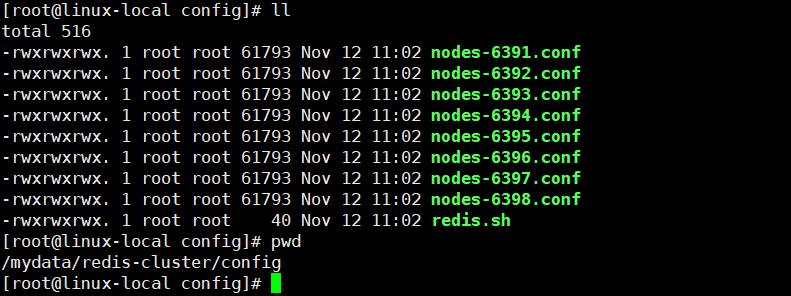
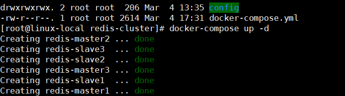
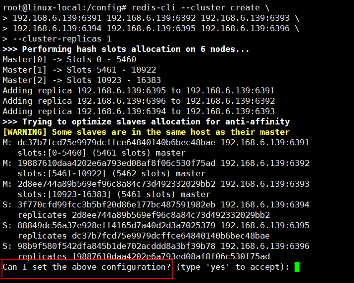
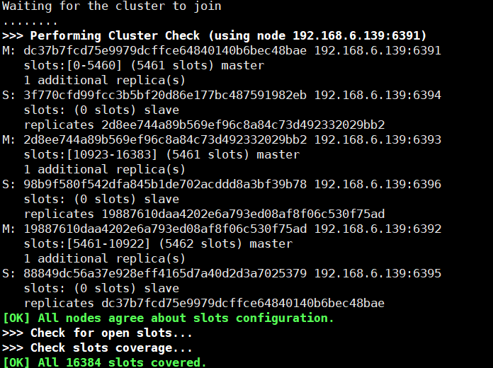
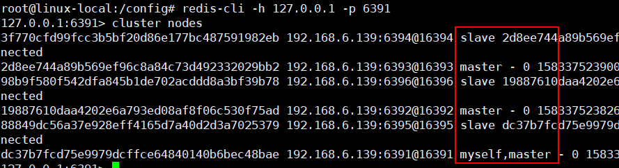
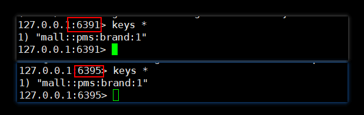

mall项目全套学习教程连载中，[关注公众号](#公众号)第一时间获取。

# Docker环境下秒建Redis集群，连SpringBoot也整上了！

> 为了提高Redis的存储容量和响应速度，有时候我们需要搭建Redis集群。本文主要讲述Redis集群环境的搭建步骤以及如何在SpringBoot中整合使用Redis集群。

## Redis集群搭建

> 这里我们使用最方便的搭建方式，使用Docker Compose来搭建，对Docker Compose不了解的朋友可以参考下[《使用Docker Compose部署SpringBoot应用》](https://mp.weixin.qq.com/s/iMl9bJ4SxUsNHBbiS5VUcw)。我们将搭建一个6节点的Redis集群，包括3个主节点和3个从节点。

- 在搭建Redis集群之前，我们需要修改下Redis的配置文件`redis.conf`，该文件的下载地址：https://github.com/antirez/redis/blob/5.0/redis.conf

- 需要修改的属性如下，主要是修改了一些集群配置和运行端口，端口号需要按需修改为6391~6396：

```
# 开启集群功能
cluster-enabled yes
# 设置运行端口
port 6391
# 设置节点超时时间，单位毫秒
cluster-node-timeout 15000
# 集群内部配置文件
cluster-config-file "nodes-6391.conf"
```

- 然后我们需要编写docker-compose.yml文件用于编排6个Redis容器，具体属性的作用可以参考下面的注释；

```yaml
version: "3"
services:
  redis-master1:
    image: redis:5.0 # 基础镜像
    container_name: redis-master1 # 容器名称
    working_dir: /config # 切换工作目录
    environment: # 环境变量
      - PORT=6391 # 会使用config/nodes-${PORT}.conf这个配置文件
    ports: # 映射端口，对外提供服务
      - 6391:6391 # redis的服务端口
      - 16391:16391 # redis集群监控端口
    stdin_open: true # 标准输入打开
    tty: true # 后台运行不退出
    network_mode: host # 使用host模式
    privileged: true # 拥有容器内命令执行的权限
    volumes:
      - /mydata/redis-cluster/config:/config #配置文件目录映射到宿主机
    entrypoint: # 设置服务默认的启动程序
      - /bin/bash
      - redis.sh
  redis-master2:
    image: redis:5.0
    working_dir: /config
    container_name: redis-master2
    environment:
      - PORT=6392
    ports:
      - 6392:6392
      - 16392:16392
    stdin_open: true
    network_mode: host
    tty: true
    privileged: true
    volumes:
      - /mydata/redis-cluster/config:/config
    entrypoint:
      - /bin/bash
      - redis.sh
  redis-master3:
    image: redis:5.0
    container_name: redis-master3
    working_dir: /config
    environment:
      - PORT=6393
    ports:
      - 6393:6393
      - 16393:16393
    stdin_open: true
    network_mode: host
    tty: true
    privileged: true
    volumes:
      - /mydata/redis-cluster/config:/config
    entrypoint:
      - /bin/bash
      - redis.sh
  redis-slave1:
    image: redis:5.0
    container_name: redis-slave1
    working_dir: /config
    environment:
      - PORT=6394
    ports:
      - 6394:6394
      - 16394:16394
    stdin_open: true
    network_mode: host
    tty: true
    privileged: true
    volumes:
      - /mydata/redis-cluster/config:/config
    entrypoint:
      - /bin/bash
      - redis.sh
  redis-slave2:
    image: redis:5.0
    working_dir: /config
    container_name: redis-slave2
    environment:
      - PORT=6395
    ports:
      - 6395:6395
      - 16395:16395
    stdin_open: true
    network_mode: host
    tty: true
    privileged: true
    volumes:
      - /mydata/redis-cluster/config:/config
    entrypoint:
      - /bin/bash
      - redis.sh
  redis-slave3:
    image: redis:5.0
    container_name: redis-slave3
    working_dir: /config
    environment:
      - PORT=6396
    ports:
      - 6396:6396
      - 16396:16396
    stdin_open: true
    network_mode: host
    tty: true
    privileged: true
    volumes:
      - /mydata/redis-cluster/config:/config
    entrypoint:
      - /bin/bash
      - redis.sh
```

- 从docker-compose.yml文件中我们可以看到，我们的Redis容器分别运行在6391~6396这6个端口之上，
将容器中的`/config`配置目录映射到了宿主机的`/mydata/redis-cluster/config`目录，同时还以`redis.sh`脚本作为该容器的启动脚本；

- `redis.sh`脚本的作用是根据environment环境变量中的`PORT`属性，以指定配置文件来启动Redis容器；

```bash
redis-server  /config/nodes-${PORT}.conf
```

- 接下来我们需要把Redis的配置文件和`redis.sh`上传到Linux服务器的`/mydata/redis-cluster/config`目录下；



- 接下来上传我们的docker-compose.yml文件到Linux服务器，并使用docker-compose命令来启动所有容器；

```bash
docker-compose up -d
```

- 启动过程中会输出如下信息；



- 此时进入其中一个Redis容器之中，初始化Redis集群；

```bash
# 进入Redis容器
docker exec -it redis-master1 /bin/bash
# 初始化Redis集群命令
redis-cli --cluster create \
192.168.6.139:6391 192.168.6.139:6392 192.168.6.139:6393 \
192.168.6.139:6394 192.168.6.139:6395 192.168.6.139:6396 \
--cluster-replicas 1
```

- 集群创建过程中会让你确认配置，输入`yes`确认即可；



- Redis集群创建成功后会输出如下信息；



- 创建成功后我们可以使用`redis-cli`命令连接到其中一个Redis服务；

```bash
# 单机模式启动
redis-cli -h 127.0.0.1 -p 6391
# 集群模式启动
redis-cli -c -h 127.0.0.1 -p 6391
```

- 之后通过`cluster nodes`命令可以查看节点信息，发现符合原来3主3从的预期。



## SpringBoot中使用Redis集群

> 我们在[《Spring Data Redis 最佳实践！》](https://mp.weixin.qq.com/s/9j3exBtZ9FWWlyZkxlWaOA)中讲到了在SpringBoot中如何使用Redis，用的是单节点的Redis服务，这次我们讲下如何使用Redis集群服务。

- 我们在原来代码的基础上进行改造，修改application.yml配置文件，添加Redis集群配置；

```yaml
spring:
  redis:
#    host: 192.168.6.139 # Redis服务器地址
#    database: 0 # Redis数据库索引（默认为0）
#    port: 6379 # Redis服务器连接端口
    password: # Redis服务器连接密码（默认为空）
    timeout: 3000ms # 连接超时时间
    lettuce:
      pool:
        max-active: 8 # 连接池最大连接数
        max-idle: 8 # 连接池最大空闲连接数
        min-idle: 0 # 连接池最小空闲连接数
        max-wait: -1ms # 连接池最大阻塞等待时间，负值表示没有限制
    cluster:
      nodes:
        - 192.168.6.139:6391
        - 192.168.6.139:6392
        - 192.168.6.139:6393
        - 192.168.6.139:6394
        - 192.168.6.139:6395
        - 192.168.6.139:6396
```

- 此时我们再次调用获取品牌详情的接口，就会把品牌信息缓存到Redis集群中去了；

- 由于Redis容器`redis-master1`和`redis-slave2`互为主从，所以里面都缓存了相同的品牌详情信息。



## 配置文件地址

[https://github.com/macrozheng/mall-learning/tree/master/document/redis-cluster](https://github.com/macrozheng/mall-learning/tree/master/document/redis-cluster)

## 项目源码地址

[https://github.com/macrozheng/mall-learning/tree/master/mall-tiny-redis](https://github.com/macrozheng/mall-learning/tree/master/mall-tiny-redis)

## 公众号

