学习不走弯路，[关注公众号](#公众号) 回复「学习路线」，获取mall项目专属学习路线！

# Github标星 8K+，免费又好用的Redis客户端工具！

> 最近在寻找一款免费又好用的Redis客户端工具，于是找到了`AnotherRedisDesktopManager`，界面漂亮而且支持Redis集群，推荐给大家！

## RedisDesktopManager

以前一直使用的是RedisDesktopManager这款Redis客户端工具，由于很久没更新界面有点古老，最近想更新升级下，进到官网一看，发现收费了......

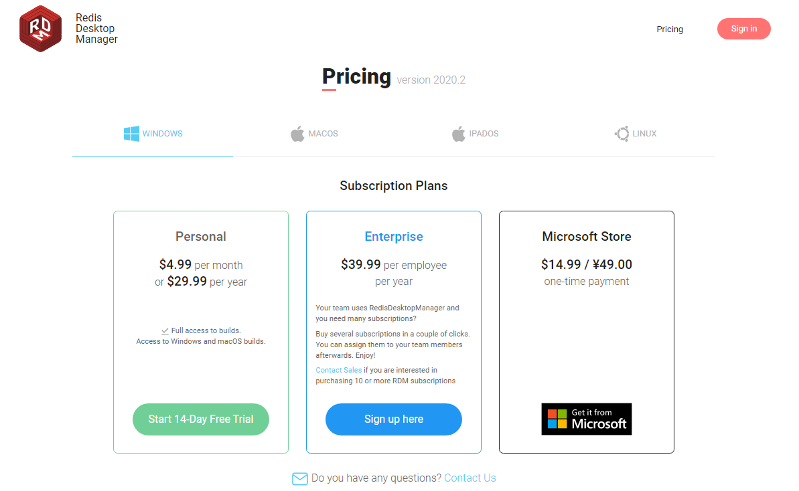

## AnotherRedisDesktopManager

于是就去Github上找了下，发现了`另一个`RedisDesktopManager，界面漂亮而且免费，一看Star数量8K+，有点厉害！就决定用它了。

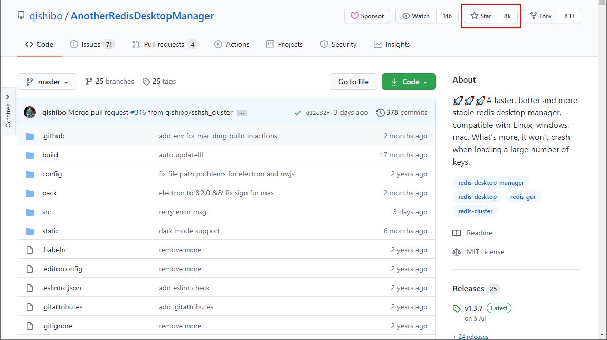

## 使用

### 安装

- 首先我们需要下载安装包，然后双击安装即可，下载地址：https://github.com/qishibo/AnotherRedisDesktopManager/releases

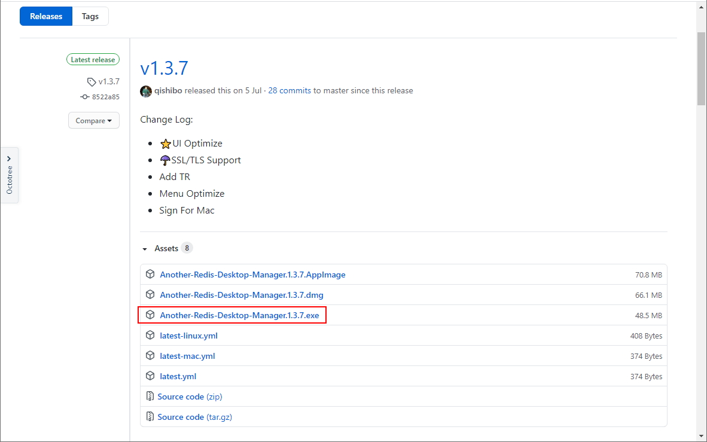

- 安装完成后，点击`新建连接`可以连接到Redis，可以发现`Cluster`这个选项，之前使用的旧版RedisDesktopManager并不支持Redis集群，这个工具支持了很不错！

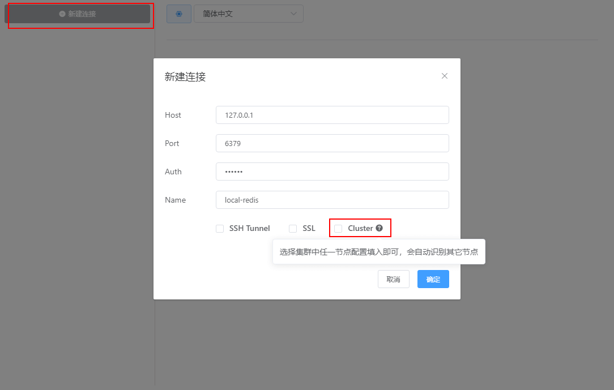

### 深色模式

我们现在使用的界面模式为浅色模式，可以从设置中打开深色模式，还是很炫酷的！

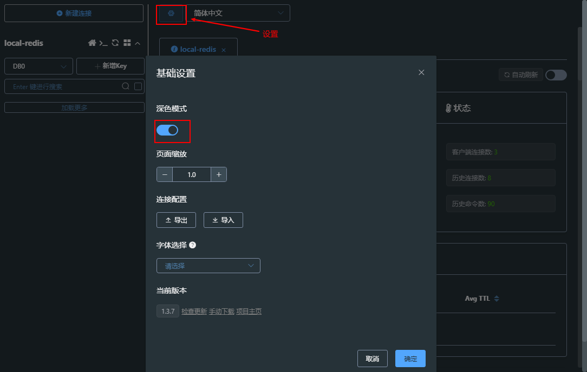

### 命令行

支持使用Redis命令行，点击`Redis控制台`按钮即可打开。

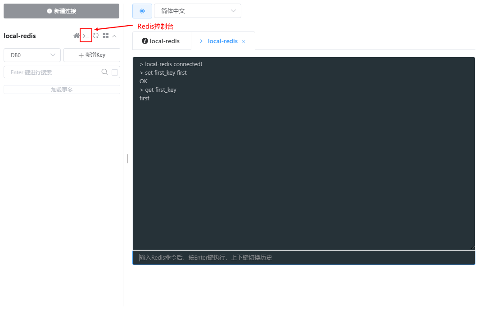

### Redis数据操作

- 使用`新增Key`功能可以往Redis中存储键值对数据，目前支持5种数据结构；

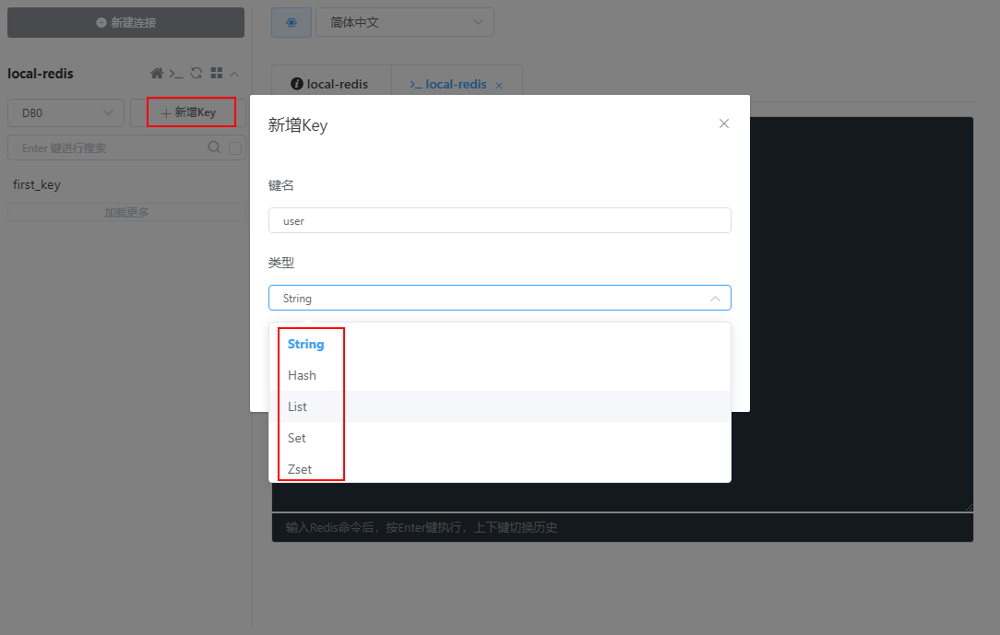

- 我们先来存储`String`类型的键值对数据，可以发现支持文本、JSON、反序列化三种显示，而且JSON支持效果不错；

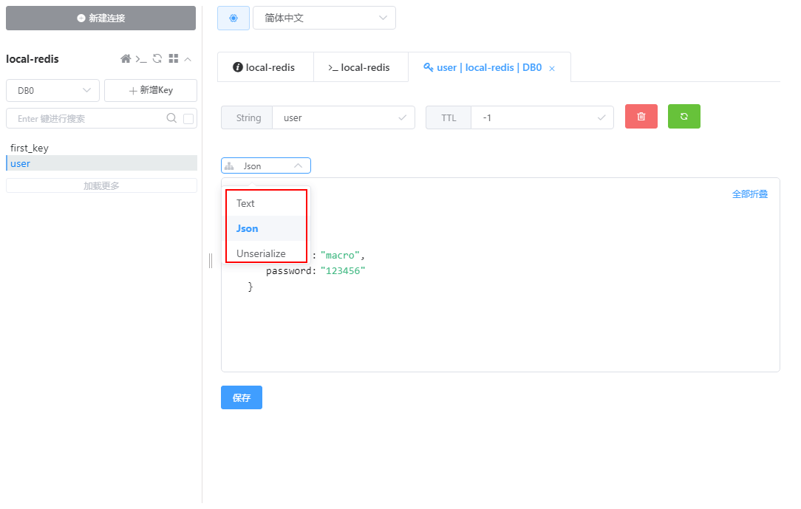

- 再来存储`List`类型的键值对，发现可以像操作表格一样操作List中的数据；

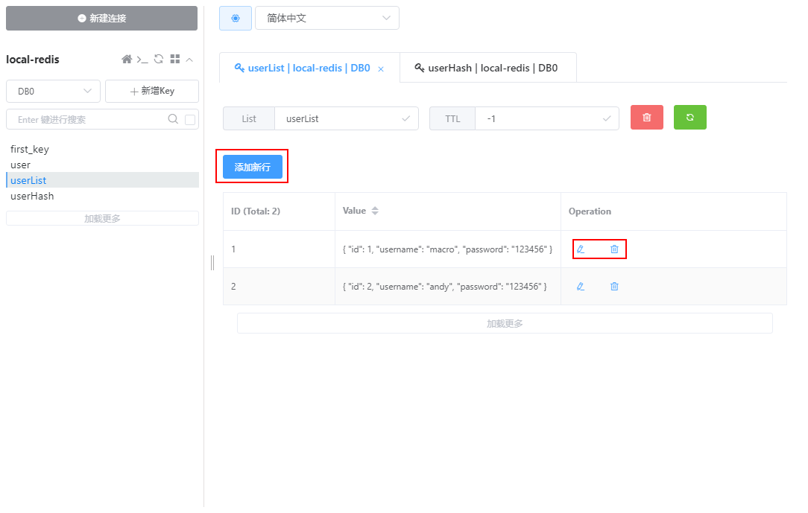

- 再来存储`Hash`类型的键值对，依然可以像操作表格一样操作HashMap中的数据。

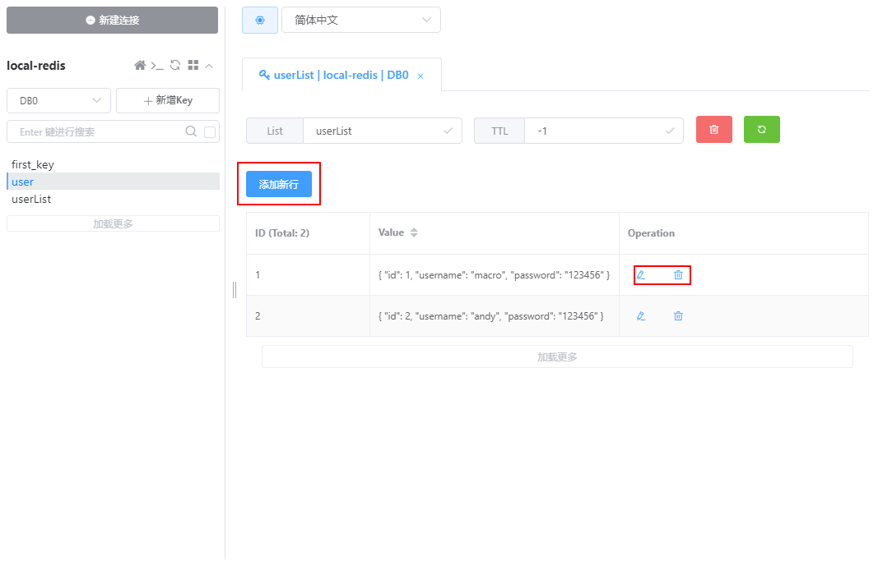

### 集群模式

- 既然该客户端支持了集群模式，那我们也来试试吧，首先需要搭建一个Redis集群，搭建方式可以参考[《Docker环境下秒建Redis集群，连SpringBoot也整上了！》](https://mp.weixin.qq.com/s/Vg8WCsyA1arLUoKENoNJQw)；

- 创建好Redis集群之后，连接任意一个Redis服务即可访问集群，注意我们的Redis服务运行端口为`6391~6396`，我们先连接到`6391`的服务；

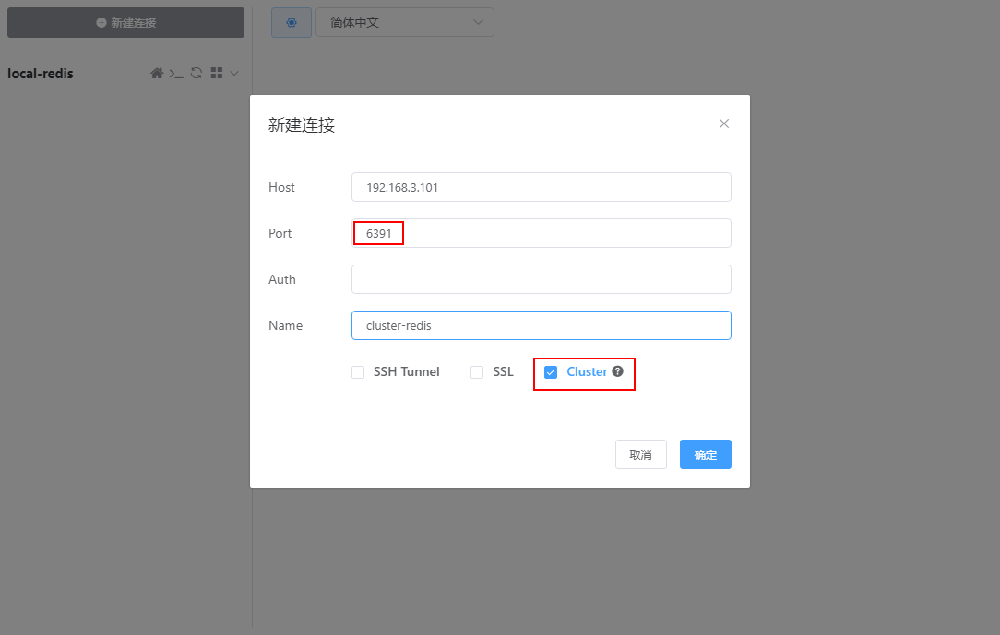

- 往Redis集群中存储一个键值对数据后，连接另一个Redis服务`6392`，发现依然可以查看到该数据；

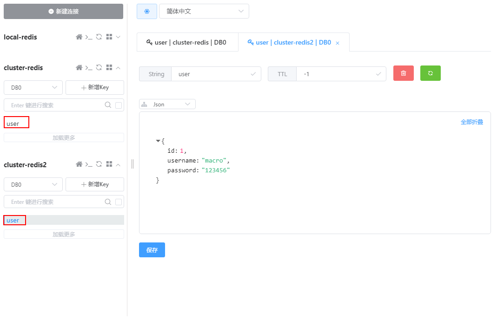

- 删除该数据后，两个连接都已经看不见该数据了，证明可以正常操作Redis集群；

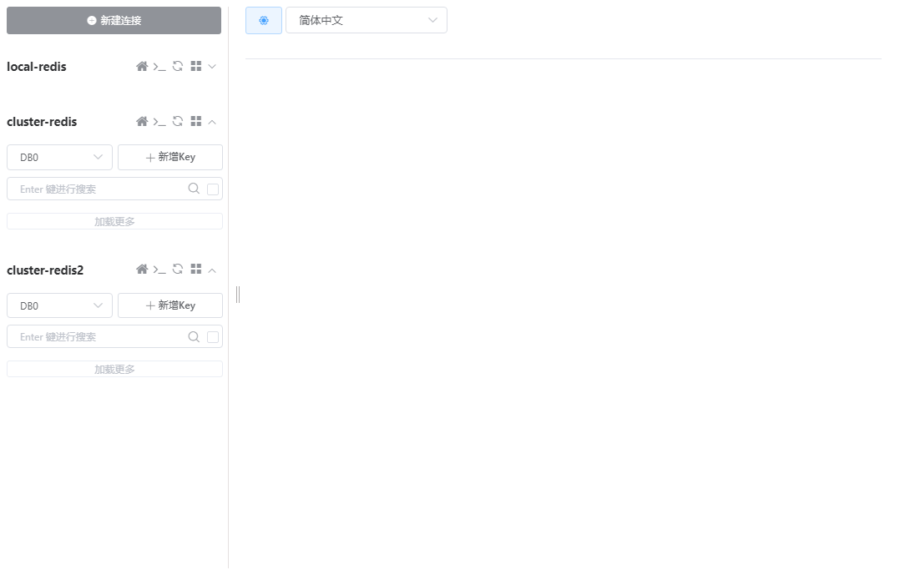

## 公众号

