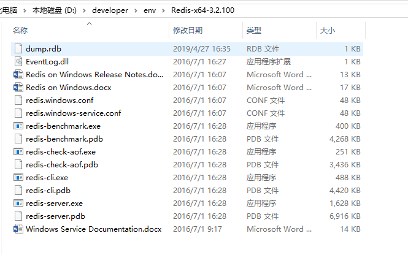
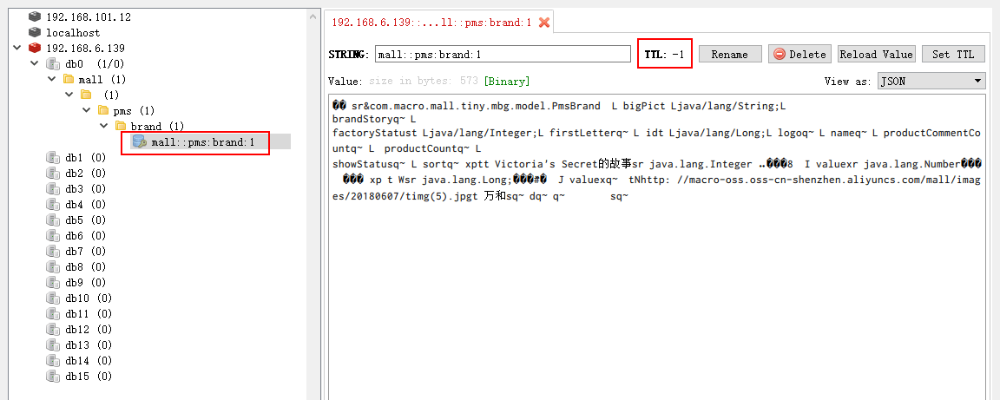
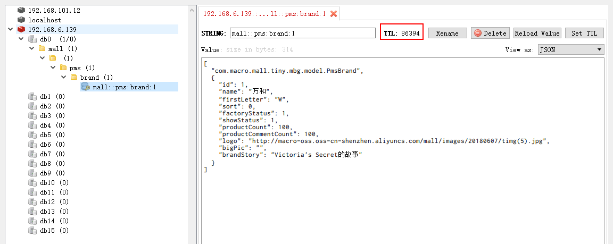

mall项目全套学习教程连载中，[关注公众号](#公众号)第一时间获取。

# Spring Data Redis 最佳实践！

> Spring Data Redis 是Spring 框架提供的用于操作Redis的方式，最近整理了下它的用法，解决了使用过程中遇到的一些难点与坑点，希望对大家有所帮助。本文涵盖了Redis的安装、Spring Cache结合Redis的使用、Redis连接池的使用和RedisTemplate的使用等内容。

## Redis安装

> 这里提供Linux和Windows两种安装方式，由于Windows下的版本最高只有3.2版本，所以推荐使用Linux下的版本，目前最新稳定版本为5.0，也是本文中使用的版本。

### Linux

> 这里我们使用Docker环境下的安装方式。

- 下载Redis5.0的Docker镜像；

```bash
docker pull redis:5.0
```

- 使用Docker命令启动Redis容器；

```bash
docker run -p 6379:6379 --name redis \
-v /mydata/redis/data:/data \
-d redis:5.0 redis-server --appendonly yes
```

### Windows

> 想使用Windows版本的朋友可以使用以下安装方式。

- 下载Windows版本的Redis,下载地址：https://github.com/MicrosoftArchive/redis/releases


- 下载完后解压到指定目录；



- 在当前地址栏输入cmd后，执行redis的启动命令：redis-server.exe redis.windows.conf


- 将Redis注册为服务的命令：

```bash
# 注册服务
redis-server --service-install redis.windows.conf
# 启动服务
redis-server --service-start
# 停止服务
redis-server --service-stop
# 删除服务
redis-server --service-uninstall
```

## Spring Cache 操作Redis

### Spring Cache 简介

> 当Spring Boot 结合Redis来作为缓存使用时，最简单的方式就是使用Spring Cache了，使用它我们无需知道Spring中对Redis的各种操作，仅仅通过它提供的@Cacheable 、@CachePut 、@CacheEvict 、@EnableCaching等注解就可以实现缓存功能。

### 常用注解

#### @EnableCaching

开启缓存功能，一般放在启动类上。

#### @Cacheable

使用该注解的方法当缓存存在时，会从缓存中获取数据而不执行方法，当缓存不存在时，会执行方法并把返回结果存入缓存中。`一般使用在查询方法上`，可以设置如下属性：

- value：缓存名称（必填），指定缓存的命名空间；
- key：用于设置在命名空间中的缓存key值，可以使用SpEL表达式定义；
- unless：条件符合则不缓存；
- condition：条件符合则缓存。

#### @CachePut

使用该注解的方法每次执行时都会把返回结果存入缓存中。`一般使用在新增方法上`，可以设置如下属性：

- value：缓存名称（必填），指定缓存的命名空间；
- key：用于设置在命名空间中的缓存key值，可以使用SpEL表达式定义；
- unless：条件符合则不缓存；
- condition：条件符合则缓存。

#### @CacheEvict

使用该注解的方法执行时会清空指定的缓存。`一般使用在更新或删除方法上`，可以设置如下属性：

- value：缓存名称（必填），指定缓存的命名空间；
- key：用于设置在命名空间中的缓存key值，可以使用SpEL表达式定义；
- condition：条件符合则缓存。

### 使用步骤

- 在pom.xml中添加项目依赖：

```xml
<!--redis依赖配置-->
<dependency>
    <groupId>org.springframework.boot</groupId>
    <artifactId>spring-boot-starter-data-redis</artifactId>
</dependency>
```

- 修改配置文件application.yml，添加Redis的连接配置；

```yaml
spring:
  redis:
    host: 192.168.6.139 # Redis服务器地址
    database: 0 # Redis数据库索引（默认为0）
    port: 6379 # Redis服务器连接端口
    password: # Redis服务器连接密码（默认为空）
    timeout: 1000ms # 连接超时时间
```

- 在启动类上添加@EnableCaching注解启动缓存功能；

```java
@EnableCaching
@SpringBootApplication
public class MallTinyApplication {

    public static void main(String[] args) {
        SpringApplication.run(MallTinyApplication.class, args);
    }

}
```

- 接下来在PmsBrandServiceImpl类中使用相关注解来实现缓存功能，可以发现我们获取品牌详情的方法中使用了@Cacheable注解，在修改和删除品牌的方法上使用了@CacheEvict注解；

```java
/**
 * PmsBrandService实现类
 * Created by macro on 2019/4/19.
 */
@Service
public class PmsBrandServiceImpl implements PmsBrandService {
    @Autowired
    private PmsBrandMapper brandMapper;

    @CacheEvict(value = RedisConfig.REDIS_KEY_DATABASE, key = "'pms:brand:'+#id")
    @Override
    public int update(Long id, PmsBrand brand) {
        brand.setId(id);
        return brandMapper.updateByPrimaryKeySelective(brand);
    }

    @CacheEvict(value = RedisConfig.REDIS_KEY_DATABASE, key = "'pms:brand:'+#id")
    @Override
    public int delete(Long id) {
        return brandMapper.deleteByPrimaryKey(id);
    }

    @Cacheable(value = RedisConfig.REDIS_KEY_DATABASE, key = "'pms:brand:'+#id", unless = "#result==null")
    @Override
    public PmsBrand getItem(Long id) {
        return brandMapper.selectByPrimaryKey(id);
    }

}
```

- 我们可以调用获取品牌详情的接口测试下效果，此时发现Redis中存储的数据有点像乱码，并且没有设置过期时间；



## 存储JSON格式数据

> 此时我们就会想到有没有什么办法让Redis中存储的数据变成标准的JSON格式，然后可以设置一定的过期时间，不设置过期时间容易产生很多不必要的缓存数据。

- 我们可以通过给RedisTemplate设置JSON格式的序列化器，并通过配置RedisCacheConfiguration设置超时时间来实现以上需求，此时别忘了去除启动类上的@EnableCaching注解，具体配置类RedisConfig代码如下；

```java
/**
 * Redis配置类
 * Created by macro on 2020/3/2.
 */
@EnableCaching
@Configuration
public class RedisConfig extends CachingConfigurerSupport {

    /**
     * redis数据库自定义key
     */
    public  static final String REDIS_KEY_DATABASE="mall";

    @Bean
    public RedisTemplate<String, Object> redisTemplate(RedisConnectionFactory redisConnectionFactory) {
        RedisSerializer<Object> serializer = redisSerializer();
        RedisTemplate<String, Object> redisTemplate = new RedisTemplate<>();
        redisTemplate.setConnectionFactory(redisConnectionFactory);
        redisTemplate.setKeySerializer(new StringRedisSerializer());
        redisTemplate.setValueSerializer(serializer);
        redisTemplate.setHashKeySerializer(new StringRedisSerializer());
        redisTemplate.setHashValueSerializer(serializer);
        redisTemplate.afterPropertiesSet();
        return redisTemplate;
    }

    @Bean
    public RedisSerializer<Object> redisSerializer() {
        //创建JSON序列化器
        Jackson2JsonRedisSerializer<Object> serializer = new Jackson2JsonRedisSerializer<>(Object.class);
        ObjectMapper objectMapper = new ObjectMapper();
        objectMapper.setVisibility(PropertyAccessor.ALL, JsonAutoDetect.Visibility.ANY);
        objectMapper.enableDefaultTyping(ObjectMapper.DefaultTyping.NON_FINAL);
        serializer.setObjectMapper(objectMapper);
        return serializer;
    }

    @Bean
    public RedisCacheManager redisCacheManager(RedisConnectionFactory redisConnectionFactory) {
        RedisCacheWriter redisCacheWriter = RedisCacheWriter.nonLockingRedisCacheWriter(redisConnectionFactory);
        //设置Redis缓存有效期为1天
        RedisCacheConfiguration redisCacheConfiguration = RedisCacheConfiguration.defaultCacheConfig()
                .serializeValuesWith(RedisSerializationContext.SerializationPair.fromSerializer(redisSerializer())).entryTtl(Duration.ofDays(1));
        return new RedisCacheManager(redisCacheWriter, redisCacheConfiguration);
    }

}
```

- 此时我们再次调用获取商品详情的接口进行测试，会发现Redis中已经缓存了标准的JSON格式数据，并且超时时间被设置为了1天。



## 使用Redis连接池

> SpringBoot 1.5.x版本Redis客户端默认是Jedis实现的，SpringBoot 2.x版本中默认客户端是用Lettuce实现的，我们先来了解下Jedis和Lettuce客户端。

### Jedis vs Lettuce

Jedis在实现上是直连Redis服务，多线程环境下非线程安全，除非使用连接池，为每个 RedisConnection 实例增加物理连接。

Lettuce是一种可伸缩，线程安全，完全非阻塞的Redis客户端，多个线程可以共享一个RedisConnection，它利用Netty NIO框架来高效地管理多个连接，从而提供了异步和同步数据访问方式，用于构建非阻塞的反应性应用程序。

### 使用步骤

- 修改application.yml添加Lettuce连接池配置，用于配置线程数量和阻塞等待时间；

```yaml
spring:
  redis:
    lettuce:
      pool:
        max-active: 8 # 连接池最大连接数
        max-idle: 8 # 连接池最大空闲连接数
        min-idle: 0 # 连接池最小空闲连接数
        max-wait: -1ms # 连接池最大阻塞等待时间，负值表示没有限制
```

- 由于SpringBoot 2.x中默认并没有使用Redis连接池，所以需要在pom.xml中添加commons-pool2的依赖；

```xml
<dependency>
    <groupId>org.apache.commons</groupId>
    <artifactId>commons-pool2</artifactId>
</dependency>
```

- 如果你没添加以上依赖的话，启动应用的时候就会产生如下错误；

```bash
Caused by: java.lang.NoClassDefFoundError: org/apache/commons/pool2/impl/GenericObjectPoolConfig
	at org.springframework.data.redis.connection.lettuce.LettucePoolingClientConfiguration$LettucePoolingClientConfigurationBuilder.<init>(LettucePoolingClientConfiguration.java:84) ~[spring-data-redis-2.1.5.RELEASE.jar:2.1.5.RELEASE]
	at org.springframework.data.redis.connection.lettuce.LettucePoolingClientConfiguration.builder(LettucePoolingClientConfiguration.java:48) ~[spring-data-redis-2.1.5.RELEASE.jar:2.1.5.RELEASE]
	at org.springframework.boot.autoconfigure.data.redis.LettuceConnectionConfiguration$PoolBuilderFactory.createBuilder(LettuceConnectionConfiguration.java:149) ~[spring-boot-autoconfigure-2.1.3.RELEASE.jar:2.1.3.RELEASE]
	at org.springframework.boot.autoconfigure.data.redis.LettuceConnectionConfiguration.createBuilder(LettuceConnectionConfiguration.java:107) ~[spring-boot-autoconfigure-2.1.3.RELEASE.jar:2.1.3.RELEASE]
	at org.springframework.boot.autoconfigure.data.redis.LettuceConnectionConfiguration.getLettuceClientConfiguration(LettuceConnectionConfiguration.java:93) ~[spring-boot-autoconfigure-2.1.3.RELEASE.jar:2.1.3.RELEASE]
	at org.springframework.boot.autoconfigure.data.redis.LettuceConnectionConfiguration.redisConnectionFactory(LettuceConnectionConfiguration.java:74) ~[spring-boot-autoconfigure-2.1.3.RELEASE.jar:2.1.3.RELEASE]
	at org.springframework.boot.autoconfigure.data.redis.LettuceConnectionConfiguration$$EnhancerBySpringCGLIB$$5caa7e47.CGLIB$redisConnectionFactory$0(<generated>) ~[spring-boot-autoconfigure-2.1.3.RELEASE.jar:2.1.3.RELEASE]
	at org.springframework.boot.autoconfigure.data.redis.LettuceConnectionConfiguration$$EnhancerBySpringCGLIB$$5caa7e47$$FastClassBySpringCGLIB$$b8ae2813.invoke(<generated>) ~[spring-boot-autoconfigure-2.1.3.RELEASE.jar:2.1.3.RELEASE]
	at org.springframework.cglib.proxy.MethodProxy.invokeSuper(MethodProxy.java:244) ~[spring-core-5.1.5.RELEASE.jar:5.1.5.RELEASE]
	at org.springframework.context.annotation.ConfigurationClassEnhancer$BeanMethodInterceptor.intercept(ConfigurationClassEnhancer.java:363) ~[spring-context-5.1.5.RELEASE.jar:5.1.5.RELEASE]
	at org.springframework.boot.autoconfigure.data.redis.LettuceConnectionConfiguration$$EnhancerBySpringCGLIB$$5caa7e47.redisConnectionFactory(<generated>) ~[spring-boot-autoconfigure-2.1.3.RELEASE.jar:2.1.3.RELEASE]
	at sun.reflect.NativeMethodAccessorImpl.invoke0(Native Method) ~[na:1.8.0_91]
	at sun.reflect.NativeMethodAccessorImpl.invoke(NativeMethodAccessorImpl.java:62) ~[na:1.8.0_91]
	at sun.reflect.DelegatingMethodAccessorImpl.invoke(DelegatingMethodAccessorImpl.java:43) ~[na:1.8.0_91]
	at java.lang.reflect.Method.invoke(Method.java:498) ~[na:1.8.0_91]
	at org.springframework.beans.factory.support.SimpleInstantiationStrategy.instantiate(SimpleInstantiationStrategy.java:154) ~[spring-beans-5.1.5.RELEASE.jar:5.1.5.RELEASE]
	... 111 common frames omitted
```

## 自由操作Redis

> Spring Cache 给我们提供了操作Redis缓存的便捷方法，但是也有很多局限性。比如说我们想单独设置一个缓存值的有效期怎么办？我们并不想缓存方法的返回值，我们想缓存方法中产生的中间值怎么办？此时我们就需要用到RedisTemplate这个类了，接下来我们来讲下如何通过RedisTemplate来自由操作Redis中的缓存。


### RedisService

> 定义Redis操作业务类，在Redis中有几种数据结构，比如普通结构（对象），Hash结构、Set结构、List结构，该接口中定义了大多数常用操作方法。

```java
/**
 * redis操作Service
 * Created by macro on 2020/3/3.
 */
public interface RedisService {

    /**
     * 保存属性
     */
    void set(String key, Object value, long time);

    /**
     * 保存属性
     */
    void set(String key, Object value);

    /**
     * 获取属性
     */
    Object get(String key);

    /**
     * 删除属性
     */
    Boolean del(String key);

    /**
     * 批量删除属性
     */
    Long del(List<String> keys);

    /**
     * 设置过期时间
     */
    Boolean expire(String key, long time);

    /**
     * 获取过期时间
     */
    Long getExpire(String key);

    /**
     * 判断是否有该属性
     */
    Boolean hasKey(String key);

    /**
     * 按delta递增
     */
    Long incr(String key, long delta);

    /**
     * 按delta递减
     */
    Long decr(String key, long delta);

    /**
     * 获取Hash结构中的属性
     */
    Object hGet(String key, String hashKey);

    /**
     * 向Hash结构中放入一个属性
     */
    Boolean hSet(String key, String hashKey, Object value, long time);

    /**
     * 向Hash结构中放入一个属性
     */
    void hSet(String key, String hashKey, Object value);

    /**
     * 直接获取整个Hash结构
     */
    Map<Object, Object> hGetAll(String key);

    /**
     * 直接设置整个Hash结构
     */
    Boolean hSetAll(String key, Map<String, Object> map, long time);

    /**
     * 直接设置整个Hash结构
     */
    void hSetAll(String key, Map<String, Object> map);

    /**
     * 删除Hash结构中的属性
     */
    void hDel(String key, Object... hashKey);

    /**
     * 判断Hash结构中是否有该属性
     */
    Boolean hHasKey(String key, String hashKey);

    /**
     * Hash结构中属性递增
     */
    Long hIncr(String key, String hashKey, Long delta);

    /**
     * Hash结构中属性递减
     */
    Long hDecr(String key, String hashKey, Long delta);

    /**
     * 获取Set结构
     */
    Set<Object> sMembers(String key);

    /**
     * 向Set结构中添加属性
     */
    Long sAdd(String key, Object... values);

    /**
     * 向Set结构中添加属性
     */
    Long sAdd(String key, long time, Object... values);

    /**
     * 是否为Set中的属性
     */
    Boolean sIsMember(String key, Object value);

    /**
     * 获取Set结构的长度
     */
    Long sSize(String key);

    /**
     * 删除Set结构中的属性
     */
    Long sRemove(String key, Object... values);

    /**
     * 获取List结构中的属性
     */
    List<Object> lRange(String key, long start, long end);

    /**
     * 获取List结构的长度
     */
    Long lSize(String key);

    /**
     * 根据索引获取List中的属性
     */
    Object lIndex(String key, long index);

    /**
     * 向List结构中添加属性
     */
    Long lPush(String key, Object value);

    /**
     * 向List结构中添加属性
     */
    Long lPush(String key, Object value, long time);

    /**
     * 向List结构中批量添加属性
     */
    Long lPushAll(String key, Object... values);

    /**
     * 向List结构中批量添加属性
     */
    Long lPushAll(String key, Long time, Object... values);

    /**
     * 从List结构中移除属性
     */
    Long lRemove(String key, long count, Object value);
}
```

### RedisServiceImpl

> RedisService的实现类，使用RedisTemplate来自由操作Redis中的缓存数据。

```java
/**
 * redis操作实现类
 * Created by macro on 2020/3/3.
 */
@Service
public class RedisServiceImpl implements RedisService {
    @Autowired
    private RedisTemplate<String, Object> redisTemplate;

    @Override
    public void set(String key, Object value, long time) {
        redisTemplate.opsForValue().set(key, value, time, TimeUnit.SECONDS);
    }

    @Override
    public void set(String key, Object value) {
        redisTemplate.opsForValue().set(key, value);
    }

    @Override
    public Object get(String key) {
        return redisTemplate.opsForValue().get(key);
    }

    @Override
    public Boolean del(String key) {
        return redisTemplate.delete(key);
    }

    @Override
    public Long del(List<String> keys) {
        return redisTemplate.delete(keys);
    }

    @Override
    public Boolean expire(String key, long time) {
        return redisTemplate.expire(key, time, TimeUnit.SECONDS);
    }

    @Override
    public Long getExpire(String key) {
        return redisTemplate.getExpire(key, TimeUnit.SECONDS);
    }

    @Override
    public Boolean hasKey(String key) {
        return redisTemplate.hasKey(key);
    }

    @Override
    public Long incr(String key, long delta) {
        return redisTemplate.opsForValue().increment(key, delta);
    }

    @Override
    public Long decr(String key, long delta) {
        return redisTemplate.opsForValue().increment(key, -delta);
    }

    @Override
    public Object hGet(String key, String hashKey) {
        return redisTemplate.opsForHash().get(key, hashKey);
    }

    @Override
    public Boolean hSet(String key, String hashKey, Object value, long time) {
        redisTemplate.opsForHash().put(key, hashKey, value);
        return expire(key, time);
    }

    @Override
    public void hSet(String key, String hashKey, Object value) {
        redisTemplate.opsForHash().put(key, hashKey, value);
    }

    @Override
    public Map<Object, Object> hGetAll(String key) {
        return redisTemplate.opsForHash().entries(key);
    }

    @Override
    public Boolean hSetAll(String key, Map<String, Object> map, long time) {
        redisTemplate.opsForHash().putAll(key, map);
        return expire(key, time);
    }

    @Override
    public void hSetAll(String key, Map<String, Object> map) {
        redisTemplate.opsForHash().putAll(key, map);
    }

    @Override
    public void hDel(String key, Object... hashKey) {
        redisTemplate.opsForHash().delete(key, hashKey);
    }

    @Override
    public Boolean hHasKey(String key, String hashKey) {
        return redisTemplate.opsForHash().hasKey(key, hashKey);
    }

    @Override
    public Long hIncr(String key, String hashKey, Long delta) {
        return redisTemplate.opsForHash().increment(key, hashKey, delta);
    }

    @Override
    public Long hDecr(String key, String hashKey, Long delta) {
        return redisTemplate.opsForHash().increment(key, hashKey, -delta);
    }

    @Override
    public Set<Object> sMembers(String key) {
        return redisTemplate.opsForSet().members(key);
    }

    @Override
    public Long sAdd(String key, Object... values) {
        return redisTemplate.opsForSet().add(key, values);
    }

    @Override
    public Long sAdd(String key, long time, Object... values) {
        Long count = redisTemplate.opsForSet().add(key, values);
        expire(key, time);
        return count;
    }

    @Override
    public Boolean sIsMember(String key, Object value) {
        return redisTemplate.opsForSet().isMember(key, value);
    }

    @Override
    public Long sSize(String key) {
        return redisTemplate.opsForSet().size(key);
    }

    @Override
    public Long sRemove(String key, Object... values) {
        return redisTemplate.opsForSet().remove(key, values);
    }

    @Override
    public List<Object> lRange(String key, long start, long end) {
        return redisTemplate.opsForList().range(key, start, end);
    }

    @Override
    public Long lSize(String key) {
        return redisTemplate.opsForList().size(key);
    }

    @Override
    public Object lIndex(String key, long index) {
        return redisTemplate.opsForList().index(key, index);
    }

    @Override
    public Long lPush(String key, Object value) {
        return redisTemplate.opsForList().rightPush(key, value);
    }

    @Override
    public Long lPush(String key, Object value, long time) {
        Long index = redisTemplate.opsForList().rightPush(key, value);
        expire(key, time);
        return index;
    }

    @Override
    public Long lPushAll(String key, Object... values) {
        return redisTemplate.opsForList().rightPushAll(key, values);
    }

    @Override
    public Long lPushAll(String key, Long time, Object... values) {
        Long count = redisTemplate.opsForList().rightPushAll(key, values);
        expire(key, time);
        return count;
    }

    @Override
    public Long lRemove(String key, long count, Object value) {
        return redisTemplate.opsForList().remove(key, count, value);
    }
}

```

### RedisController

> 测试RedisService中缓存操作的Controller，大家可以调用测试下。

```java
/**
 * Redis测试Controller
 * Created by macro on 2020/3/3.
 */
@Api(tags = "RedisController", description = "Redis测试")
@Controller
@RequestMapping("/redis")
public class RedisController {
    @Autowired
    private RedisService redisService;
    @Autowired
    private PmsBrandService brandService;

    @ApiOperation("测试简单缓存")
    @RequestMapping(value = "/simpleTest", method = RequestMethod.GET)
    @ResponseBody
    public CommonResult<PmsBrand> simpleTest() {
        List<PmsBrand> brandList = brandService.list(1, 5);
        PmsBrand brand = brandList.get(0);
        String key = "redis:simple:" + brand.getId();
        redisService.set(key, brand);
        PmsBrand cacheBrand = (PmsBrand) redisService.get(key);
        return CommonResult.success(cacheBrand);
    }

    @ApiOperation("测试Hash结构的缓存")
    @RequestMapping(value = "/hashTest", method = RequestMethod.GET)
    @ResponseBody
    public CommonResult<PmsBrand> hashTest() {
        List<PmsBrand> brandList = brandService.list(1, 5);
        PmsBrand brand = brandList.get(0);
        String key = "redis:hash:" + brand.getId();
        Map<String, Object> value = BeanUtil.beanToMap(brand);
        redisService.hSetAll(key, value);
        Map<Object, Object> cacheValue = redisService.hGetAll(key);
        PmsBrand cacheBrand = BeanUtil.mapToBean(cacheValue, PmsBrand.class, true);
        return CommonResult.success(cacheBrand);
    }

    @ApiOperation("测试Set结构的缓存")
    @RequestMapping(value = "/setTest", method = RequestMethod.GET)
    @ResponseBody
    public CommonResult<Set<Object>> setTest() {
        List<PmsBrand> brandList = brandService.list(1, 5);
        String key = "redis:set:all";
        redisService.sAdd(key, (Object[]) ArrayUtil.toArray(brandList, PmsBrand.class));
        redisService.sRemove(key, brandList.get(0));
        Set<Object> cachedBrandList = redisService.sMembers(key);
        return CommonResult.success(cachedBrandList);
    }

    @ApiOperation("测试List结构的缓存")
    @RequestMapping(value = "/listTest", method = RequestMethod.GET)
    @ResponseBody
    public CommonResult<List<Object>> listTest() {
        List<PmsBrand> brandList = brandService.list(1, 5);
        String key = "redis:list:all";
        redisService.lPushAll(key, (Object[]) ArrayUtil.toArray(brandList, PmsBrand.class));
        redisService.lRemove(key, 1, brandList.get(0));
        List<Object> cachedBrandList = redisService.lRange(key, 0, 3);
        return CommonResult.success(cachedBrandList);
    }
}
```

## 项目源码地址

[https://github.com/macrozheng/mall-learning/tree/master/mall-tiny-redis](https://github.com/macrozheng/mall-learning/tree/master/mall-tiny-redis)

## 公众号

