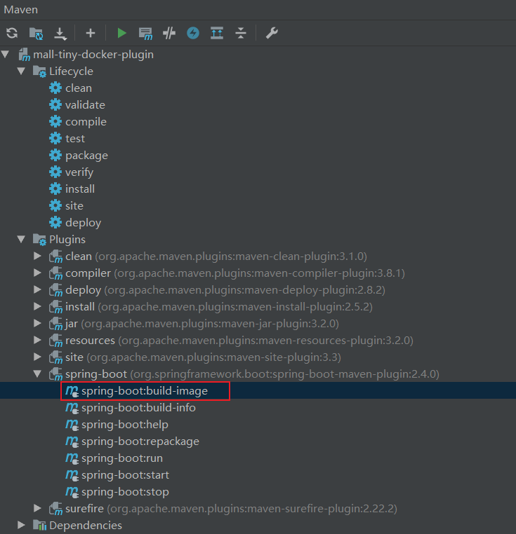
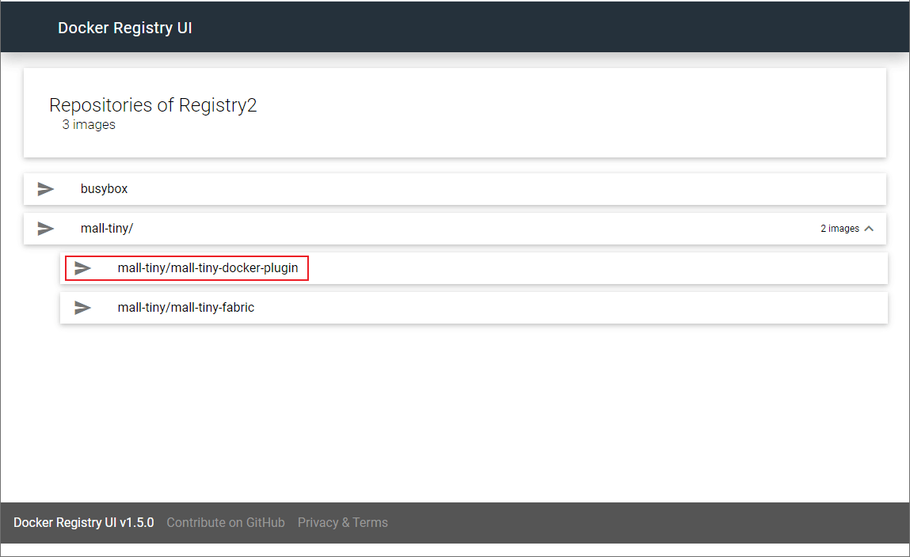
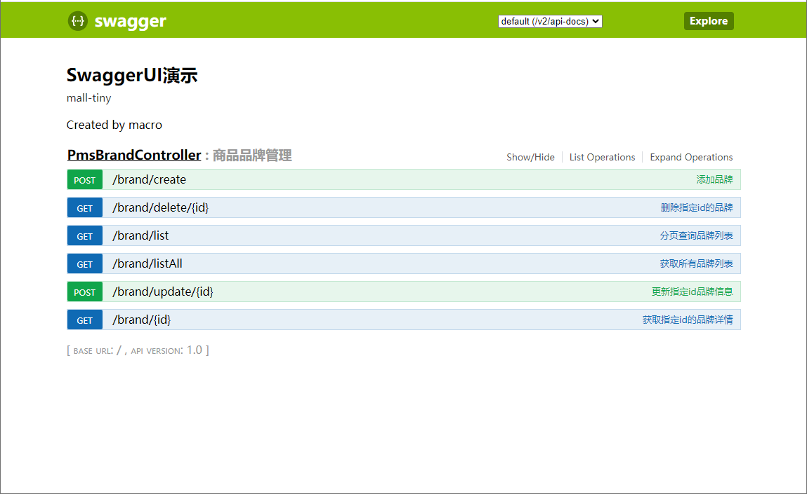

学习不走弯路，[关注公众号](#公众号) 回复「学习路线」，获取mall项目专属学习路线！

# 还在使用第三方Docker插件？SpringBoot官方插件真香！

> 为了方便为SpringBoot应用构建Docker镜像，我们经常会使用Maven插件来打包镜像。之前一直使用的是第三方插件，有`spotify`和`fabric8`出品的两种`docker-maven-plugin`。最近SpringBoot 2.4.0发布了，官方插件也增加了对Docker的支持，体验了一把发现也很好用，推荐给大家！

## 第三方插件使用

> 我们先了解下第三方插件的使用，方便和官方插件做对比，`fabric8`插件使用具体可以参考[《还在手动部署SpringBoot应用？试试这个自动化插件！》](https://mp.weixin.qq.com/s/3X6vVdWmjmWCyiLm35jpVw)。

- 值得注意的是，在我们使用插件时，需要自己定义镜像构建过程，比如在`pom.xml`中使用如下配置，`<images>`标签下的配置为镜像构建过程的配置；

```xml
<build>
    <plugins>
        <plugin>
            <groupId>io.fabric8</groupId>
            <artifactId>docker-maven-plugin</artifactId>
            <version>0.33.0</version>
            <configuration>
                <!-- Docker 远程管理地址-->
                <dockerHost>http://192.168.3.101:2375</dockerHost>
                <!-- Docker 推送镜像仓库地址-->
                <pushRegistry>http://192.168.3.101:5000</pushRegistry>
                <images>
                    <image>
                        <!--由于推送到私有镜像仓库，镜像名需要添加仓库地址-->
                        <name>192.168.3.101:5000/mall-tiny/${project.name}:${project.version}</name>
                        <!--定义镜像构建行为-->
                        <build>
                            <!--定义基础镜像-->
                            <from>java:8</from>
                            <args>
                                <JAR_FILE>${project.build.finalName}.jar</JAR_FILE>
                            </args>
                            <!--定义哪些文件拷贝到容器中-->
                            <assembly>
                                <!--定义拷贝到容器的目录-->
                                <targetDir>/</targetDir>
                                <!--只拷贝生成的jar包-->
                                <descriptorRef>artifact</descriptorRef>
                            </assembly>
                            <!--定义容器启动命令-->
                            <entryPoint>["java", "-jar","/${project.build.finalName}.jar"]</entryPoint>
                            <!--定义维护者-->
                            <maintainer>macrozheng</maintainer>
                        </build>
                    </image>
                </images>
            </configuration>
        </plugin>
    </plugins>
</build>
```

- 或者先在Dockerfile文件中定义好镜像构建过程；

```dockerfile
# 该镜像需要依赖的基础镜像
FROM java:8
# 将当前maven目录生成的文件复制到docker容器的/目录下
COPY maven /
# 声明服务运行在8080端口
EXPOSE 8080
# 指定docker容器启动时运行jar包
ENTRYPOINT ["java", "-jar","/mall-tiny-fabric-0.0.1-SNAPSHOT.jar"]
# 指定维护者的名字
MAINTAINER macrozheng
```

- 然后在插件中引用Dockerfile文件，用于构建镜像；

```xml
<build>
     <dockerFileDir>${project.basedir}</dockerFileDir>
</build>
```

- 其实对于SpringBoot应用来说，如何从应用Jar包构建Docker镜像，做法基本是差不多的，为什么非要自己定义镜像的构建过程呢？


## 官方插件使用

> SpringBoot官方插件解决了上面的问题，无需自己编写Docker镜像构建过程，直接自动构建，是不是很方便！接下来我们来体验下它的强大之处！

- 由于我们需要把镜像推送到镜像仓库，首先我们安装好私有镜像仓库`Registry`和可视化镜像管理工具`docker-registry-ui`，具体可以参考[《还在手动部署SpringBoot应用？试试这个自动化插件！》](https://mp.weixin.qq.com/s/3X6vVdWmjmWCyiLm35jpVw)；

```bash
[root@linux-local ~]# docker ps
CONTAINER ID        IMAGE                                                                COMMAND                  CREATED             STATUS              PORTS                                            NAMES
9ffec08467ac        joxit/docker-registry-ui:static                                      "/bin/sh -c entrypoi…"   2 hours ago         Up 2 hours          0.0.0.0:8280->80/tcp                             registry-ui
a809535ee2a2        registry:2                                                           "/entrypoint.sh /etc…"   3 months ago        Up 7 hours          0.0.0.0:5000->5000/tcp                           registry2
```

- 然后我们需要把应用的版本升级到SpringBoot 2.4.0，之前的版本Docker支持没有这个完善；

```xml
<parent>
    <groupId>org.springframework.boot</groupId>
    <artifactId>spring-boot-starter-parent</artifactId>
    <version>2.4.0</version>
    <relativePath/> <!-- lookup parent from repository -->
</parent>
```

- 然后修改`pom.xml`文件，对官方Maven插件进行配置，主要是对Docker相关功能进行配置；

```xml
<plugin>
    <groupId>org.springframework.boot</groupId>
    <artifactId>spring-boot-maven-plugin</artifactId>
    <configuration>
        <image>
            <!--配置镜像名称-->
            <name>192.168.3.101:5000/mall-tiny/${project.name}:${project.version}</name>
            <!--镜像打包完成后自动推送到镜像仓库-->
            <publish>true</publish>
        </image>
        <docker>
            <!--Docker远程管理地址-->
            <host>http://192.168.3.101:2375</host>
            <!--不使用TLS访问-->
            <tlsVerify>false</tlsVerify>
            <!--Docker推送镜像仓库配置-->
            <publishRegistry>
                <!--推送镜像仓库用户名-->
                <username>test</username>
                <!--推送镜像仓库密码-->
                <password>test</password>
                <!--推送镜像仓库地址-->
                <url>http://192.168.3.101:5000</url>
            </publishRegistry>
        </docker>
    </configuration>
</plugin>
```

- 如果你使用的是IDEA的话，直接双击SpringBoot插件的`build-image`命令即可一键打包并推送到镜像仓库；



- 也可以在命令行使用如下Maven命令来打包构建镜像；

```bash
mvn spring-boot:build-image
```

- 镜像构建过程中会输出如下信息，由于很多依赖会从Github上下载，网络不好的情况下会下载失败，多试几次就好：


```bash
[INFO]  > Pulling builder image 'docker.io/paketobuildpacks/builder:base' 100%
[INFO]  > Pulled builder image 'paketobuildpacks/builder@sha256:9d377230ba8ee74d8619178fd318b1b87a7da1a88bdb198afd14dd7de9e8ea6a'
[INFO]  > Pulling run image 'docker.io/paketobuildpacks/run:base-cnb' 100%
[INFO]  > Pulled run image 'paketobuildpacks/run@sha256:33d37fc9ba16e220f071805eaeed881a508ceee5c8909db5710aaed7e97e4fc2'
[INFO]  > Executing lifecycle version v0.9.3
[INFO]  > Using build cache volume 'pack-cache-5641f846df6.build'
[INFO] 
[INFO]  > Running creator
[INFO]     [creator]     ===> DETECTING
[INFO]     [creator]     5 of 18 buildpacks participating
[INFO]     [creator]     paketo-buildpacks/ca-certificates   1.0.1
[INFO]     [creator]     paketo-buildpacks/bellsoft-liberica 5.2.1
[INFO]     [creator]     paketo-buildpacks/executable-jar    3.1.3
[INFO]     [creator]     paketo-buildpacks/dist-zip          2.2.2
[INFO]     [creator]     paketo-buildpacks/spring-boot       3.5.0
[INFO]     [creator]     ===> ANALYZING
[INFO]     [creator]     Restoring metadata for "paketo-buildpacks/ca-certificates:helper" from app image
[INFO]     [creator]     Restoring metadata for "paketo-buildpacks/bellsoft-liberica:helper" from app image
[INFO]     [creator]     Restoring metadata for "paketo-buildpacks/bellsoft-liberica:java-security-properties" from app image
[INFO]     [creator]     Restoring metadata for "paketo-buildpacks/bellsoft-liberica:jre" from app image
[INFO]     [creator]     Restoring metadata for "paketo-buildpacks/bellsoft-liberica:jvmkill" from app image
[INFO]     [creator]     Restoring metadata for "paketo-buildpacks/executable-jar:class-path" from app image
[INFO]     [creator]     Restoring metadata for "paketo-buildpacks/spring-boot:helper" from app image
[INFO]     [creator]     Restoring metadata for "paketo-buildpacks/spring-boot:spring-cloud-bindings" from app image
[INFO]     [creator]     Restoring metadata for "paketo-buildpacks/spring-boot:web-application-type" from app image
[INFO]     [creator]     ===> RESTORING
[INFO]     [creator]     ===> BUILDING
[INFO]     [creator]     
[INFO]     [creator]     Paketo CA Certificates Buildpack 1.0.1
[INFO]     [creator]       https://github.com/paketo-buildpacks/ca-certificates
[INFO]     [creator]       Launch Helper: Reusing cached layer
[INFO]     [creator]     
[INFO]     [creator]     Paketo BellSoft Liberica Buildpack 5.2.1
[INFO]     [creator]       https://github.com/paketo-buildpacks/bellsoft-liberica
[INFO]     [creator]       Build Configuration:
[INFO]     [creator]         $BP_JVM_VERSION              8.*             the Java version
[INFO]     [creator]       Launch Configuration:
[INFO]     [creator]         $BPL_JVM_HEAD_ROOM           0               the headroom in memory calculation
[INFO]     [creator]         $BPL_JVM_LOADED_CLASS_COUNT  35% of classes  the number of loaded classes in memory calculation
[INFO]     [creator]         $BPL_JVM_THREAD_COUNT        250             the number of threads in memory calculation
[INFO]     [creator]         $JAVA_TOOL_OPTIONS                           the JVM launch flags
[INFO]     [creator]       BellSoft Liberica JRE 8.0.275: Reusing cached layer
[INFO]     [creator]       Launch Helper: Reusing cached layer
[INFO]     [creator]       JVMKill Agent 1.16.0: Reusing cached layer
[INFO]     [creator]       Java Security Properties: Reusing cached layer
[INFO]     [creator]     
[INFO]     [creator]     Paketo Executable JAR Buildpack 3.1.3
[INFO]     [creator]       https://github.com/paketo-buildpacks/executable-jar
[INFO]     [creator]       Process types:
[INFO]     [creator]         executable-jar: java org.springframework.boot.loader.JarLauncher
[INFO]     [creator]         task:           java org.springframework.boot.loader.JarLauncher
[INFO]     [creator]         web:            java org.springframework.boot.loader.JarLauncher
[INFO]     [creator]     
[INFO]     [creator]     Paketo Spring Boot Buildpack 3.5.0
[INFO]     [creator]       https://github.com/paketo-buildpacks/spring-boot
[INFO]     [creator]       Creating slices from layers index
[INFO]     [creator]         dependencies
[INFO]     [creator]         spring-boot-loader
[INFO]     [creator]         snapshot-dependencies
[INFO]     [creator]         application
[INFO]     [creator]       Launch Helper: Reusing cached layer
[INFO]     [creator]       Web Application Type: Contributing to layer
[INFO]     [creator]         Servlet web application detected
[INFO]     [creator]         Writing env.launch/BPL_JVM_THREAD_COUNT.default
[INFO]     [creator]       Spring Cloud Bindings 1.7.0: Reusing cached layer
[INFO]     [creator]       4 application slices
[INFO]     [creator]       Image labels:
[INFO]     [creator]         org.opencontainers.image.title
[INFO]     [creator]         org.opencontainers.image.version
[INFO]     [creator]         org.springframework.boot.spring-configuration-metadata.json
[INFO]     [creator]         org.springframework.boot.version
[INFO]     [creator]     ===> EXPORTING
[INFO]     [creator]     Reusing layer 'paketo-buildpacks/ca-certificates:helper'
[INFO]     [creator]     Reusing layer 'paketo-buildpacks/bellsoft-liberica:helper'
[INFO]     [creator]     Reusing layer 'paketo-buildpacks/bellsoft-liberica:java-security-properties'
[INFO]     [creator]     Reusing layer 'paketo-buildpacks/bellsoft-liberica:jre'
[INFO]     [creator]     Reusing layer 'paketo-buildpacks/bellsoft-liberica:jvmkill'
[INFO]     [creator]     Reusing layer 'paketo-buildpacks/executable-jar:class-path'
[INFO]     [creator]     Reusing layer 'paketo-buildpacks/spring-boot:helper'
[INFO]     [creator]     Reusing layer 'paketo-buildpacks/spring-boot:spring-cloud-bindings'
[INFO]     [creator]     Reusing layer 'paketo-buildpacks/spring-boot:web-application-type'
[INFO]     [creator]     Reusing 4/5 app layer(s)
[INFO]     [creator]     Adding 1/5 app layer(s)
[INFO]     [creator]     Reusing layer 'launcher'
[INFO]     [creator]     Reusing layer 'config'
[INFO]     [creator]     Reusing layer 'process-types'
[INFO]     [creator]     Adding label 'io.buildpacks.lifecycle.metadata'
[INFO]     [creator]     Adding label 'io.buildpacks.build.metadata'
[INFO]     [creator]     Adding label 'io.buildpacks.project.metadata'
[INFO]     [creator]     Adding label 'org.opencontainers.image.title'
[INFO]     [creator]     Adding label 'org.opencontainers.image.version'
[INFO]     [creator]     Adding label 'org.springframework.boot.spring-configuration-metadata.json'
[INFO]     [creator]     Adding label 'org.springframework.boot.version'
[INFO]     [creator]     Setting default process type 'web'
[INFO]     [creator]     *** Images (d5e1771dac7b):
[INFO]     [creator]           192.168.3.101:5000/mall-tiny/mall-tiny-docker-plugin:0.0.1-SNAPSHOT
[INFO] 
[INFO] Successfully built image '192.168.3.101:5000/mall-tiny/mall-tiny-docker-plugin:0.0.1-SNAPSHOT'
[INFO] 
[INFO]  > Pushed image '192.168.3.101:5000/mall-tiny/mall-tiny-docker-plugin:0.0.1-SNAPSHOT'
[INFO] ------------------------------------------------------------------------
[INFO] BUILD SUCCESS
[INFO] ------------------------------------------------------------------------
[INFO] Total time: 01:06 min
[INFO] Finished at: 2020-11-27T15:07:46+08:00
[INFO] Final Memory: 37M/359M
[INFO] ------------------------------------------------------------------------
```

- 镜像构建成功后，可以从镜像仓库查看到我们的镜像：

```bash
[root@linux-local ~]# docker images
REPOSITORY                                            TAG                 IMAGE ID            CREATED             SIZE
paketobuildpacks/run                                  base-cnb            a717358311fc        9 days ago          87.2MB
java                                                  8                   d23bdf5b1b1b        3 years ago         643MB
192.168.3.101:5000/mall-tiny/mall-tiny-docker-plugin   0.0.1-SNAPSHOT      d5e1771dac7b        40 years ago        244MB
pack.local/builder/fewqajyqsc                         latest              f15fad05a5ba        40 years ago        558MB
pack.local/builder/kirivtcqtu                         latest              f15fad05a5ba        40 years ago        558MB
paketobuildpacks/builder                              base                511452064e06        40 years ago        558MB
```

- 我们可以从`Docker Registry UI`中查看镜像仓库中的镜像，访问地址：http://192.168.3.101:8280/



- 接着使用如下命令启动我们的SpringBoot应用：

```bash
docker run -p 8080:8080 --name mall-tiny-docker-plugin \
--link mysql:db \
-v /etc/localtime:/etc/localtime \
-v /mydata/app/mall-tiny-docker-plugin/logs:/var/logs \
-d 192.168.3.101:5000/mall-tiny/mall-tiny-docker-plugin:0.0.1-SNAPSHOT
```

- 启动成功后，可以成功访问到SpringBoot应用的Swagger页面，访问地址：http://192.168.3.101:8080/swagger-ui.html



## 总结

SpringBoot官方Maven插件避免了编写Docker镜像构建过程，同时充分利用了SpringBoot 2.3以后的Jar分层技术，但对于需要自定义构建镜像的场景造成了一定的麻烦。

## 参考资料

官方文档：https://docs.spring.io/spring-boot/docs/2.4.0/maven-plugin/reference/htmlsingle/#build-image

## 项目源码地址

https://github.com/macrozheng/mall-learning/tree/master/mall-tiny-docker-plugin

## 公众号


