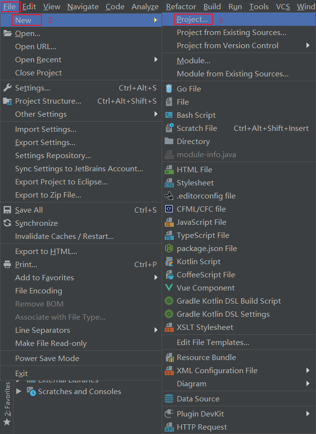
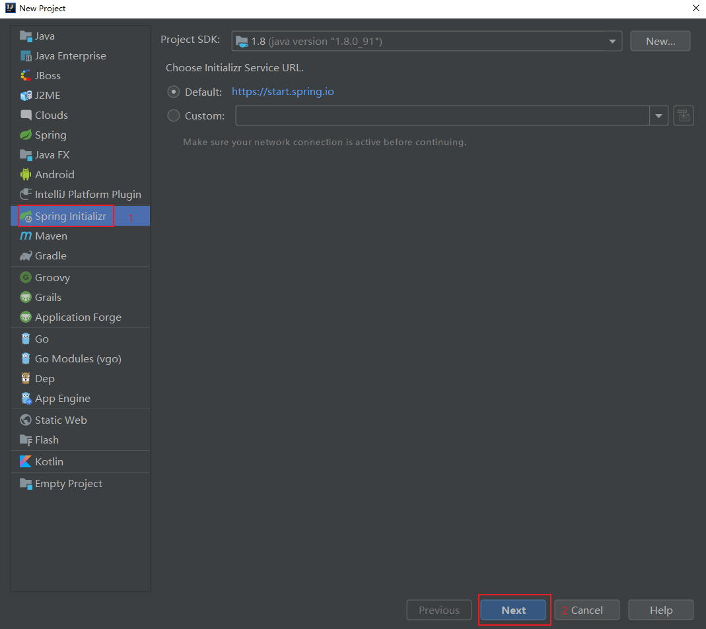
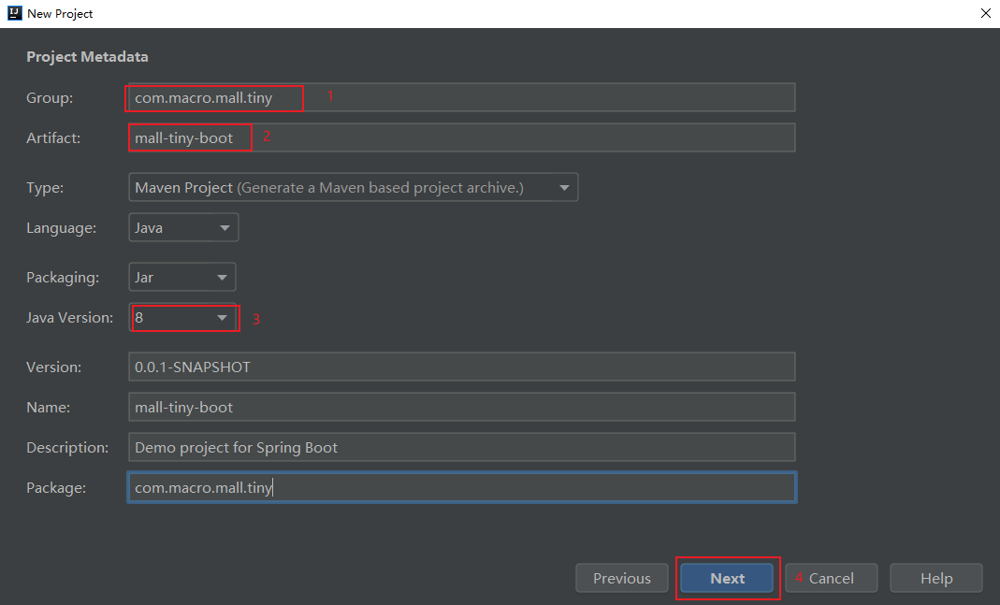
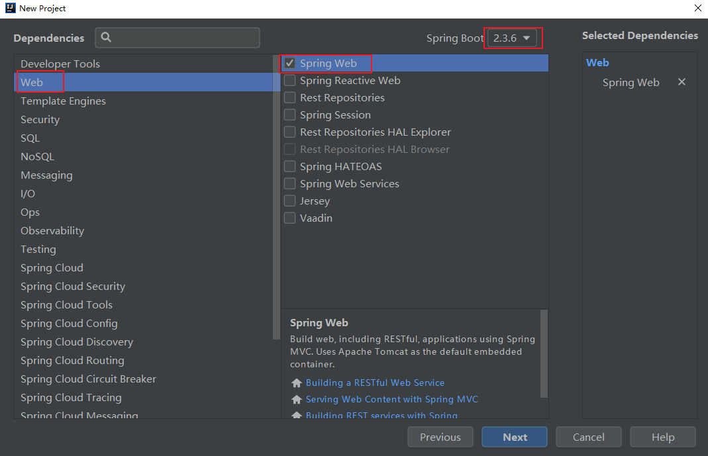
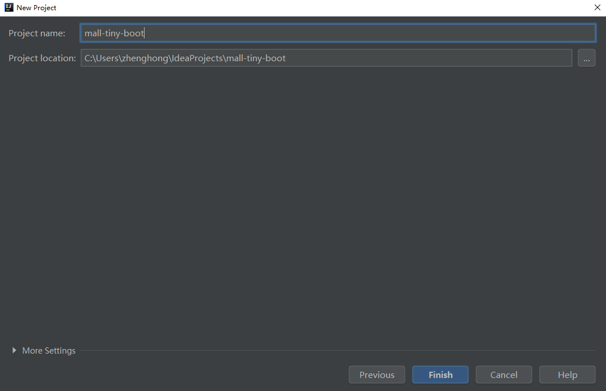

学习不走弯路，[关注公众号](#公众号) 回复「学习路线」，获取mall项目专属学习路线！

# 肝了一周总结的SpringBoot实战教程，太实用了！

> 天天在用SpringBoot，但有些SpringBoot的实用知识点却不是很清楚！最近又对SpringBoot中的实用知识点做了个总结，相信对从Spring过渡到SpringBoot的朋友会很有帮助！

## 前言

首先我们来了解下为什么要有SpringBoot？

Spring作为J2EE的轻量级代替品，让我们无需开发重量级的Enterprise JavaBean（EJB），通过依赖注入和面向切面编程，使用简单的Java对象（POJO）即可实现EJB的功能。

虽然Spring的组件代码是轻量级的，但它的配置却是重量级的。即使后来Spring引入了基于注解的组件扫描和基于Java的配置，让它看上去简洁不少，但Spring还是需要不少配置。除此之外，项目的依赖管理也很麻烦，我们无法确保各个版本的依赖都能兼容。

为了简化Spring中的配置和统一各种依赖的版本，SpringBoot诞生了！

## 简介

SpringBoot从本质上来说就是Spring，它通过了一些自己的特性帮助我们简化了Spring应用程序的开发。主要有以下三个核心特性：

- 自动配置：对于很多Spring应用程序常见的应用功能，SpringBoot能自动提供相关配置，集成功能开发者仅需很少的配置。
- 起步依赖：告诉SpringBoot需要什么功能，它就能引入对应的库，无需考虑该功能依赖库的版本问题。
- Actuator：可以深入了解SpringBoot应用程序内部情况，比如创建了哪些Bean、自动配置的决策、应用程序的状态信息等。

## 开始使用

### 创建应用

> 创建SpringBoot应用的方式有很多种，这里使用最流行的开发工具IDEA来创建应用。

- 首先通过`File->New Project`来创建一个项目；



- 然后选择通过`Spring Initializr`来创建一个SpringBoot应用；



- 填写好Maven项目的`groupId`和`artifactId`及选择好Java版本；



- 选择好起步依赖，这里选择的是开启Web功能的起步依赖；



- 选择好项目的存放位置即可顺利创建一个SpringBoot应用。



### 查看应用

#### 项目结构

一个新创建的SpringBoot应用基本结构如下。

```
mall-tiny-boot
├─pom.xml # Maven构建文件
└─src
   ├─main
   │  ├─java
   │  │  └─MallTinyApplication.java # 应用程序启动类
   │  └─resources
   │     └─application.yml # SpringBoot配置文件
   └─test
       └─java
           └─MallTinyApplicationTests.java # 基本的集成测试类
```

#### 应用启动类

`MallTinyApplication`在SpringBoot应用中有配置和引导的作用，通过`@SpringBootApplication`注解开启组件扫描和自动配置，通过`SpringApplication.run()`引导应用程序启动；

```java
//开启组件扫描和应用装配
@SpringBootApplication
public class MallTinyApplication {

    public static void main(String[] args) {
        //负责引导应用程序启动
        SpringApplication.run(MallTinyApplication.class, args);
    }

}
```

`@SpringBootApplication`注解是三个注解的结合体，拥有以下三个注解的功能：
- `@Configuration`：用于声明Spring中的Java配置；
- `@ComponentScan`：启用组件扫描，当我们声明组件时，会自动发现并注册为Spring应用上下文中的Bean；
- `@EnableAutoConfiguration`：开启SpringBoot自动配置功能，简化配置编写。
    
#### 测试应用

可以使用`@RunWith`和`@SpringBootTest`来创建Spring应用上下文，通过`@Test`注解来声明一个测试方法。

```java
@RunWith(SpringRunner.class)
@SpringBootTest
@Slf4j
public class MallTinyApplicationTests {
    @Autowired
    private PmsBrandService pmsBrandService;

    @Test
    public void contextLoads() {
    }

    @Test
    public void testMethod() {
        List<PmsBrand> brandList = pmsBrandService.listAllBrand();
        log.info("testMethod:{}", brandList);
    }

}
```

#### 编写应用配置

当我们需要微调自动配置的参数时，可以在`application.yml`文件中进行配置，比如微调下端口号。

```yaml
server:
  port: 8088
```

#### 项目构建过程

SpringBoot项目可以使用Maven进行构建，首先我们需要继承`spring-boot-starter-parent`这个父依赖，父依赖可以控制所有SpringBoot官方起步依赖的版本，接下来当我们使用官方起步依赖时，就不用指定版本号了。我们还需要使用SpringBoot的插件，该插件主要用于将应用打包为可执行Jar。

```xml
<?xml version="1.0" encoding="UTF-8"?>
<project xmlns="http://maven.apache.org/POM/4.0.0" xmlns:xsi="http://www.w3.org/2001/XMLSchema-instance"
         xsi:schemaLocation="http://maven.apache.org/POM/4.0.0 http://maven.apache.org/xsd/maven-4.0.0.xsd">
    <modelVersion>4.0.0</modelVersion>
    <groupId>com.macro.mall</groupId>
    <artifactId>mall-tiny-boot</artifactId>
    <version>1.0-SNAPSHOT</version>
    <name>mall-tiny-boot</name>
    <description>Demo project for Spring Boot</description>

    <properties>
        <project.build.sourceEncoding>UTF-8</project.build.sourceEncoding>
        <project.reporting.outputEncoding>UTF-8</project.reporting.outputEncoding>
        <java.version>1.8</java.version>
        <skipTests>true</skipTests>
    </properties>
    
    <!--继承SpringBoot父项目，控制所有依赖版本-->
    <parent>
        <groupId>org.springframework.boot</groupId>
        <artifactId>spring-boot-starter-parent</artifactId>
        <version>2.3.0.RELEASE</version>
        <relativePath/> <!-- lookup parent from repository -->
    </parent>
    <dependencies>
        <!--SpringBoot起步依赖-->
        <dependency>
            <groupId>org.springframework.boot</groupId>
            <artifactId>spring-boot-starter-web</artifactId>
        </dependency>
        <dependency>
            <groupId>org.springframework.boot</groupId>
            <artifactId>spring-boot-starter-actuator</artifactId>
        </dependency>
        <dependency>
            <groupId>org.springframework.boot</groupId>
            <artifactId>spring-boot-starter-test</artifactId>
            <scope>test</scope>
        </dependency>
    </dependencies>

    <build>
        <plugins>
            <plugin>
                <!--SpringBoot插件，可以把应用打包为可执行Jar-->
                <groupId>org.springframework.boot</groupId>
                <artifactId>spring-boot-maven-plugin</artifactId>
            </plugin>
        </plugins>
    </build>

</project>
```

### 使用起步依赖

#### 使用起步依赖的好处

在使用起步依赖之前，我们先来了解下使用起步依赖的好处，当我们使用SpringBoot需要整合Web相关功能时，只需在`pom.xml`中添加一个起步依赖即可。

```xml
<dependency>
    <groupId>org.springframework.boot</groupId>
    <artifactId>spring-boot-starter-web</artifactId>
</dependency>
```

如果是Spring项目的话，我们需要添加很多依赖，还需要考虑各个依赖版本的兼容性问题，是个相当麻烦的事情。


#### 指定基于功能的依赖

当我们需要开发一个Web应用，需要使用MySQL数据库进行存储，使用Swagger生成API文档，添加如下起步依赖即可。需要注意的是只有官方的起步依赖不需要指定版本号，其他的还是需要自行指定的。

```xml
<dependencies>
    <!--SpringBoot Web功能起步依赖-->
    <dependency>
        <groupId>org.springframework.boot</groupId>
        <artifactId>spring-boot-starter-web</artifactId>
    </dependency>
    <dependency>
        <groupId>org.springframework.boot</groupId>
        <artifactId>spring-boot-starter-test</artifactId>
        <scope>test</scope>
    </dependency>
    <!--MyBatis分页插件-->
    <dependency>
        <groupId>com.github.pagehelper</groupId>
        <artifactId>pagehelper-spring-boot-starter</artifactId>
        <version>1.2.10</version>
    </dependency>
    <!--集成druid连接池-->
    <dependency>
        <groupId>com.alibaba</groupId>
        <artifactId>druid-spring-boot-starter</artifactId>
        <version>1.1.10</version>
    </dependency>
    <!--Mysql数据库驱动-->
    <dependency>
        <groupId>mysql</groupId>
        <artifactId>mysql-connector-java</artifactId>
        <version>8.0.15</version>
    </dependency>
    <!--springfox swagger官方Starter-->
    <dependency>
        <groupId>io.springfox</groupId>
        <artifactId>springfox-boot-starter</artifactId>
        <version>3.0.0</version>
    </dependency>
</dependencies>
```

#### 覆盖起步依赖中的库

其实起步依赖和你平时使用的依赖没什么区别，你可以使用Maven的方式来排除不想要的依赖。比如你不想使用tomcat容器，想使用undertow容器，可以在Web功能依赖中排除掉tomcat。

```xml
<dependencies>
    <!--SpringBoot Web功能起步依赖-->
    <dependency>
        <groupId>org.springframework.boot</groupId>
        <artifactId>spring-boot-starter-web</artifactId>
        <exclusions>
            <!--排除tomcat依赖-->
            <exclusion>
                <artifactId>spring-boot-starter-tomcat</artifactId>
                <groupId>org.springframework.boot</groupId>
            </exclusion>
        </exclusions>
    </dependency>
    <!--undertow容器-->
    <dependency>
        <groupId>org.springframework.boot</groupId>
        <artifactId>spring-boot-starter-undertow</artifactId>
    </dependency>
</dependencies>
```

### 使用自动配置

SpringBoot的自动配置是一个运行时（更准确地说，是应用程序启动时）的过程，考虑了众多因素，才决定Spring配置应该用哪个，不该用哪个。

举个例子，当我们使用Spring整合MyBatis的时候，需要完成如下几个步骤：
   - 根据数据库连接配置，配置一个dataSource对象；
   - 根据dataSource对象和SqlMapConfig.xml文件（其中包含mapper.xml文件路径和mapper接口路径配置），配置一个sqlSessionFactory对象。

当我们使用SpringBoot整合MyBatis的时候，会自动创建dataSource和sqlSessionFactory对象，只需我们在`application.yml`和Java配置中添加一些自定义配置即可。

在`application.yml`中配置好数据库连接信息及mapper.xml文件路径。

```yaml
spring:
  datasource:
    url: jdbc:mysql://localhost:3306/mall?useUnicode=true&characterEncoding=utf-8&serverTimezone=Asia/Shanghai
    username: root
    password: root

mybatis:
  mapper-locations:
    - classpath:mapper/*.xml
    - classpath*:com/**/mapper/*.xml
```

使用Java配置，配置好mapper接口路径。

```java
/**
 * MyBatis配置类
 * Created by macro on 2019/4/8.
 */
@Configuration
@MapperScan("com.macro.mall.tiny.mbg.mapper")
public class MyBatisConfig {
}
```

使用自动配置以后，我们整合其他功能的配置大大减少了，可以更加专注程序功能的开发了。

## 自定义配置

### 自定义Bean覆盖自动配置

虽然自动配置很好用，但有时候自动配置的Bean并不能满足你的需要，我们可以自己定义相同的Bean来覆盖自动配置中的Bean。

例如当我们使用Spring Security来保护应用安全时，由于自动配置并不能满足我们的需求，我们需要自定义基于WebSecurityConfigurerAdapter的配置。这里我们自定义了很多配置，比如将基于Session的认证改为使用JWT令牌、配置了一些路径的无授权访问，自定义了登录接口路径，禁用了csrf功能等。

```java
/**
 * SpringSecurity的配置
 * Created by macro on 2018/4/26.
 */
@Configuration
@EnableWebSecurity
@EnableGlobalMethodSecurity(prePostEnabled = true)
public class SecurityConfig extends WebSecurityConfigurerAdapter {
    @Autowired
    private UmsAdminService adminService;
    @Autowired
    private RestfulAccessDeniedHandler restfulAccessDeniedHandler;
    @Autowired
    private RestAuthenticationEntryPoint restAuthenticationEntryPoint;
    @Autowired
    private IgnoreUrlsConfig ignoreUrlsConfig;

    @Override
    protected void configure(HttpSecurity httpSecurity) throws Exception {
        List<String> urls = ignoreUrlsConfig.getUrls();
        String[] urlArray = ArrayUtil.toArray(urls, String.class);
        httpSecurity.csrf()// 由于使用的是JWT，我们这里不需要csrf
                .disable()
                .sessionManagement()// 基于token，所以不需要session
                .sessionCreationPolicy(SessionCreationPolicy.STATELESS)
                .and()
                .authorizeRequests()
                .antMatchers(HttpMethod.GET,urlArray) // 允许对于网站静态资源的无授权访问
                .permitAll()
                .antMatchers("/admin/login")// 对登录注册要允许匿名访问
                .permitAll()
                .antMatchers(HttpMethod.OPTIONS)//跨域请求会先进行一次options请求
                .permitAll()
                .anyRequest()// 除上面外的所有请求全部需要鉴权认证
                .authenticated();
        // 禁用缓存
        httpSecurity.headers().cacheControl();
        // 添加JWT filter
        httpSecurity.addFilterBefore(jwtAuthenticationTokenFilter(), UsernamePasswordAuthenticationFilter.class);
        //添加自定义未授权和未登录结果返回
        httpSecurity.exceptionHandling()
                .accessDeniedHandler(restfulAccessDeniedHandler)
                .authenticationEntryPoint(restAuthenticationEntryPoint);
    }

    @Override
    protected void configure(AuthenticationManagerBuilder auth) throws Exception {
        auth.userDetailsService(userDetailsService())
                .passwordEncoder(passwordEncoder());
    }

    @Bean
    public PasswordEncoder passwordEncoder() {
        return new BCryptPasswordEncoder();
    }

    @Bean
    public UserDetailsService userDetailsService() {
        //获取登录用户信息
        return username -> {
            AdminUserDetails admin = adminService.getAdminByUsername(username);
            if (admin != null) {
                return admin;
            }
            throw new UsernameNotFoundException("用户名或密码错误");
        };
    }

    @Bean
    public JwtAuthenticationTokenFilter jwtAuthenticationTokenFilter() {
        return new JwtAuthenticationTokenFilter();
    }

    @Bean
    @Override
    public AuthenticationManager authenticationManagerBean() throws Exception {
        return super.authenticationManagerBean();
    }

}
```

### 自动配置微调

有时候我们只需要微调下自动配置就能满足需求，并不需要覆盖自动配置的Bean，此时我们可以在`application.yml`属性文件中进行配置。

比如微调下应用运行的端口。

```yaml
server:
  port: 8088
```

比如修改下数据库连接信息。

```yaml
spring:
  datasource:
    url: jdbc:mysql://localhost:3306/mall?useUnicode=true&characterEncoding=utf-8&serverTimezone=Asia/Shanghai
    username: root
    password: root
```

### 读取配置文件的自定义属性

有时候我们会在属性文件中自定义一些属性，然后在程序中使用。此时可以将这些自定义属性映射到一个属性类里来使用。

比如说我们想给Spring Security配置一个白名单，访问这些路径无需授权，我们可以先在`application.yml`中添添加如下配置。

```yaml
secure:
  ignored:
    urls:
      - /
      - /swagger-ui/
      - /*.html
      - /favicon.ico
      - /**/*.html
      - /**/*.css
      - /**/*.js
      - /swagger-resources/**
      - /v2/api-docs/**
```

之后创建一个属性类，使用`@ConfigurationProperties`注解配置好这些属性的前缀，再定义一个`urls`属性与属性文件相对应即可。

```java
/**
 * 用于配置白名单资源路径
 * Created by macro on 2018/11/5.
 */
@Getter
@Setter
@Component
@ConfigurationProperties(prefix = "secure.ignored")
public class IgnoreUrlsConfig {

    private List<String> urls = new ArrayList<>();

}
```

## Actuator

SpringBoot Actuator的关键特性是在应用程序里提供众多Web端点，通过它们了解应用程序运行时的内部状况。

### 端点概览

Actuator提供了大概20个端点，常用端点路径及描述如下：

| 路径            | 请求方式 | 描述                                                        |
| --------------- | -------- | ----------------------------------------------------------- |
| /beans          | GET      | 描述应用程序上下文里全部的Bean，以及它们之间关系            |
| /conditions     | GET      | 描述自动配置报告，记录哪些自动配置生效了，哪些没生效        |
| /env            | GET      | 获取全部环境属性                                            |
| /env/{name}     | GET      | 根据名称获取特定的环境属性                                  |
| /mappings       | GET      | 描述全部的URI路径和控制器或过滤器的映射关系                 |
| /configprops    | GET      | 描述配置属性（包含默认值）如何注入Bean                      |
| /metrics        | GET      | 获取应用程序度量指标，比如JVM和进程信息                     |
| /metrics/{name} | GET      | 获取指定名称的应用程序度量值                                |
| loggers         | GET      | 查看应用程序中的日志级别                                    |
| /threaddump     | GET      | 获取线程活动的快照                                          |
| /health         | GET      | 报告应用程序的健康指标，这些值由HealthIndicator的实现类提供 |
| /shutdown       | POST     | 关闭应用程序                                                |
| /info           | GET      | 获取应用程序的定制信息，这些信息由info打头的属性提供        |

### 查看配置明细

- 直接访问根端点，可以获取到所有端点访问路径，根端点访问地址：http://localhost:8088/actuator

```json
{
    "_links": {
        "self": {
            "href": "http://localhost:8088/actuator",
            "templated": false
        },
        "beans": {
            "href": "http://localhost:8088/actuator/beans",
            "templated": false
        },
        "caches-cache": {
            "href": "http://localhost:8088/actuator/caches/{cache}",
            "templated": true
        },
        "caches": {
            "href": "http://localhost:8088/actuator/caches",
            "templated": false
        },
        "health": {
            "href": "http://localhost:8088/actuator/health",
            "templated": false
        },
        "health-path": {
            "href": "http://localhost:8088/actuator/health/{*path}",
            "templated": true
        },
        "info": {
            "href": "http://localhost:8088/actuator/info",
            "templated": false
        },
        "conditions": {
            "href": "http://localhost:8088/actuator/conditions",
            "templated": false
        },
        "configprops": {
            "href": "http://localhost:8088/actuator/configprops",
            "templated": false
        },
        "env": {
            "href": "http://localhost:8088/actuator/env",
            "templated": false
        },
        "env-toMatch": {
            "href": "http://localhost:8088/actuator/env/{toMatch}",
            "templated": true
        },
        "loggers": {
            "href": "http://localhost:8088/actuator/loggers",
            "templated": false
        },
        "loggers-name": {
            "href": "http://localhost:8088/actuator/loggers/{name}",
            "templated": true
        },
        "heapdump": {
            "href": "http://localhost:8088/actuator/heapdump",
            "templated": false
        },
        "threaddump": {
            "href": "http://localhost:8088/actuator/threaddump",
            "templated": false
        },
        "metrics-requiredMetricName": {
            "href": "http://localhost:8088/actuator/metrics/{requiredMetricName}",
            "templated": true
        },
        "metrics": {
            "href": "http://localhost:8088/actuator/metrics",
            "templated": false
        },
        "scheduledtasks": {
            "href": "http://localhost:8088/actuator/scheduledtasks",
            "templated": false
        },
        "mappings": {
            "href": "http://localhost:8088/actuator/mappings",
            "templated": false
        }
    }
}
```

- 通过`/beans`端点，可以获取到Spring应用上下文中的Bean的信息，比如Bean的类型和依赖属性等，访问地址：http://localhost:8088/actuator/beans

```json
{
	"contexts": {
		"application": {
			"beans": {
				"sqlSessionFactory": {
					"aliases": [],
					"scope": "singleton",
					"type": "org.apache.ibatis.session.defaults.DefaultSqlSessionFactory",
					"resource": "class path resource [org/mybatis/spring/boot/autoconfigure/MybatisAutoConfiguration.class]",
					"dependencies": [
						"dataSource"
					]
				},
				"jdbcTemplate": {
					"aliases": [],
					"scope": "singleton",
					"type": "org.springframework.jdbc.core.JdbcTemplate",
					"resource": "class path resource [org/springframework/boot/autoconfigure/jdbc/JdbcTemplateConfiguration.class]",
					"dependencies": [
						"dataSource",
						"spring.jdbc-org.springframework.boot.autoconfigure.jdbc.JdbcProperties"
					]
				}
			}
		}
	}
}
```

- 通过`/conditions`端点，可以获取到当前应用的自动配置报告，`positiveMatches`表示生效的自动配置，`negativeMatches`表示没有生效的自动配置。

```json
{
	"contexts": {
		"application": {
			"positiveMatches": {
				"DruidDataSourceAutoConfigure": [{
					"condition": "OnClassCondition",
					"message": "@ConditionalOnClass found required class 'com.alibaba.druid.pool.DruidDataSource'"
				}]
			},
			"negativeMatches": {
				"RabbitAutoConfiguration": {
					"notMatched": [{
						"condition": "OnClassCondition",
						"message": "@ConditionalOnClass did not find required class 'com.rabbitmq.client.Channel'"
					}],
					"matched": []
				}
			}
		}
	}
}
```

- 通过`/env`端点，可以获取全部配置属性，包括环境变量、JVM属性、命令行参数和`application.yml`中的属性。

```json
{
	"activeProfiles": [],
	"propertySources": [{
			"name": "systemProperties",
			"properties": {
				"java.runtime.name": {
					"value": "Java(TM) SE Runtime Environment"
				},
				"java.vm.name": {
					"value": "Java HotSpot(TM) 64-Bit Server VM"
				},
				"java.runtime.version": {
					"value": "1.8.0_91-b14"
				}
			}
		},
		{
			"name": "applicationConfig: [classpath:/application.yml]",
			"properties": {
				"server.port": {
					"value": 8088,
					"origin": "class path resource [application.yml]:2:9"
				},
				"spring.datasource.url": {
					"value": "jdbc:mysql://localhost:3306/mall?useUnicode=true&characterEncoding=utf-8&serverTimezone=Asia/Shanghai",
					"origin": "class path resource [application.yml]:6:10"
				},
				"spring.datasource.username": {
					"value": "root",
					"origin": "class path resource [application.yml]:7:15"
				},
				"spring.datasource.password": {
					"value": "******",
					"origin": "class path resource [application.yml]:8:15"
				}
			}
		}
	]
}
```

- 通过`/mappings`端点，可以查看全部的URI路径和控制器或过滤器的映射关系，这里可以看到我们自己定义的`PmsBrandController`和`JwtAuthenticationTokenFilter`的映射关系。

```json
{
	"contexts": {
		"application": {
			"mappings": {
				"dispatcherServlets": {
					"dispatcherServlet": [{
						"handler": "com.macro.mall.tiny.controller.PmsBrandController#createBrand(PmsBrand)",
						"predicate": "{POST /brand/create}",
						"details": {
							"handlerMethod": {
								"className": "com.macro.mall.tiny.controller.PmsBrandController",
								"name": "createBrand",
								"descriptor": "(Lcom/macro/mall/tiny/mbg/model/PmsBrand;)Lcom/macro/mall/tiny/common/api/CommonResult;"
							},
							"requestMappingConditions": {
								"consumes": [],
								"headers": [],
								"methods": [
									"POST"
								],
								"params": [],
								"patterns": [
									"/brand/create"
								],
								"produces": []
							}
						}
					}]
				}
			},
			"servletFilters": [{
				"servletNameMappings": [],
				"urlPatternMappings": [
					"/*",
					"/*",
					"/*",
					"/*",
					"/*"
				],
				"name": "jwtAuthenticationTokenFilter",
				"className": "com.macro.mall.tiny.component.JwtAuthenticationTokenFilter"
			}]
		}
	}
}
```

### 查看运行时度量

- 通过`/metrics`端点，可以获取应用程序度量指标，不过只能获取度量的名称；

```json
{
    "names": [
        "http.server.requests",
        "jvm.buffer.count",
        "jvm.buffer.memory.used",
        "jvm.buffer.total.capacity",
        "jvm.classes.loaded",
        "jvm.classes.unloaded",
        "jvm.gc.live.data.size",
        "jvm.gc.max.data.size",
        "jvm.gc.memory.allocated",
        "jvm.gc.memory.promoted",
        "jvm.gc.pause",
        "jvm.memory.committed",
        "jvm.memory.max",
        "jvm.memory.used",
        "jvm.threads.daemon",
        "jvm.threads.live",
        "jvm.threads.peak",
        "jvm.threads.states",
        "logback.events",
        "process.cpu.usage",
        "process.start.time",
        "process.uptime",
        "system.cpu.count",
        "system.cpu.usage"
    ]
}
```

- 需要添加指标名称才能获取对应的值，比如获取当前JVM使用的内存信息，访问地址：http://localhost:8088/actuator/metrics/jvm.memory.used

```json
{
    "name": "jvm.memory.used",
    "description": "The amount of used memory",
    "baseUnit": "bytes",
    "measurements": [
        {
            "statistic": "VALUE",
            "value": 3.45983088E8
        }
    ],
    "availableTags": [
        {
            "tag": "area",
            "values": [
                "heap",
                "nonheap"
            ]
        },
        {
            "tag": "id",
            "values": [
                "Compressed Class Space",
                "PS Survivor Space",
                "PS Old Gen",
                "Metaspace",
                "PS Eden Space",
                "Code Cache"
            ]
        }
    ]
}
```

- 通过`loggers`端点，可以查看应用程序中的日志级别信息，可以看出我们把`ROOT`范围日志设置为了INFO，而`com.macro.mall.tiny`包范围的设置为了DEBUG。

```json
{
	"levels": [
		"OFF",
		"ERROR",
		"WARN",
		"INFO",
		"DEBUG",
		"TRACE"
	],
	"loggers": {
		"ROOT": {
			"configuredLevel": "INFO",
			"effectiveLevel": "INFO"
		},
		"com.macro.mall.tiny": {
			"configuredLevel": "DEBUG",
			"effectiveLevel": "DEBUG"
		}
	}
}
```

- 通过`/health`端点，可以查看应用的健康指标。

```json
{
    "status": "UP"
}
```

### 关闭应用

通过POST请求`/shutdown`端点可以直接关闭应用，但是需要将`endpoints.shutdown.enabled`属性设置为true才可以使用。 

```json
{
    "message": "Shutting down, bye..."
}
```

### 定制Actuator

有的时候，我们需要自定义一下Actuator的端点才能满足我们的需求。

- 比如说Actuator有些端点默认是关闭的，我们想要开启所有端点，可以这样设置；

```yaml
management:
  endpoints:
    web:
      exposure:
        include: '*'
```

- 比如说我们想自定义Actuator端点的基础路径，比如改为`/monitor`，这样我们我们访问地址就变成了这个：http://localhost:8088/monitor

```yaml
management:
  endpoints:
    web:
      base-path: /monitor
```

## 常用起步依赖

起步依赖不仅能让构建应用的依赖配置更简单，还能根据提供给应用程序的功能将它们组织到一起，这里整理了一些常用的起步依赖。

### 官方依赖

```xml
<dependencies>
    <!--SpringBoot整合Web功能依赖-->
    <dependency>
        <groupId>org.springframework.boot</groupId>
        <artifactId>spring-boot-starter-web</artifactId>
    </dependency>
    <!--SpringBoot整合Actuator功能依赖-->
    <dependency>
        <groupId>org.springframework.boot</groupId>
        <artifactId>spring-boot-starter-actuator</artifactId>
    </dependency>
    <!--SpringBoot整合AOP功能依赖-->
    <dependency>
        <groupId>org.springframework.boot</groupId>
        <artifactId>spring-boot-starter-aop</artifactId>
    </dependency>
    <!--SpringBoot整合测试功能依赖-->
    <dependency>
        <groupId>org.springframework.boot</groupId>
        <artifactId>spring-boot-starter-test</artifactId>
        <scope>test</scope>
    </dependency>
    <!--SpringBoot整合注解处理功能依赖-->
    <dependency>
        <groupId>org.springframework.boot</groupId>
        <artifactId>spring-boot-configuration-processor</artifactId>
        <optional>true</optional>
    </dependency>
    <!--SpringBoot整合Spring Security安全功能依赖-->
    <dependency>
        <groupId>org.springframework.boot</groupId>
        <artifactId>spring-boot-starter-security</artifactId>
    </dependency>
    <!--SpringBoot整合Redis数据存储功能依赖-->
    <dependency>
        <groupId>org.springframework.boot</groupId>
        <artifactId>spring-boot-starter-data-redis</artifactId>
    </dependency>
    <!--SpringBoot整合Elasticsearch数据存储功能依赖-->
    <dependency>
        <groupId>org.springframework.boot</groupId>
        <artifactId>spring-boot-starter-data-elasticsearch</artifactId>
    </dependency>
    <!--SpringBoot整合MongoDB数据存储功能依赖-->
    <dependency>
        <groupId>org.springframework.boot</groupId>
        <artifactId>spring-boot-starter-data-mongodb</artifactId>
    </dependency>
    <!--SpringBoot整合AMQP消息队列功能依赖-->
    <dependency>
        <groupId>org.springframework.boot</groupId>
        <artifactId>spring-boot-starter-amqp</artifactId>
    </dependency>
    <!--SpringBoot整合Quartz定时任务功能依赖-->
    <dependency>
        <groupId>org.springframework.boot</groupId>
        <artifactId>spring-boot-starter-quartz</artifactId>
    </dependency>
    <!--SpringBoot整合JPA数据存储功能依赖-->
    <dependency>
        <groupId>org.springframework.boot</groupId>
        <artifactId>spring-boot-starter-data-jpa</artifactId>
    </dependency>
    <!--SpringBoot整合邮件发送功能依赖-->
    <dependency>
        <groupId>org.springframework.boot</groupId>
        <artifactId>spring-boot-starter-mail</artifactId>
    </dependency>
</dependencies>
```

### 第三方依赖

```xml
<dependencies>
    <!--SpringBoot整合MyBatis数据存储功能依赖-->
    <dependency>
        <groupId>org.mybatis.spring.boot</groupId>
        <artifactId>mybatis-spring-boot-starter</artifactId>
        <version>${mybatis-version.version}</version>
    </dependency>
    <!--SpringBoot整合PageHelper分页功能依赖-->
    <dependency>
        <groupId>com.github.pagehelper</groupId>
        <artifactId>pagehelper-spring-boot-starter</artifactId>
        <version>${pagehelper-starter.version}</version>
    </dependency>
    <!--SpringBoot整合Druid数据库连接池功能依赖-->
    <dependency>
        <groupId>com.alibaba</groupId>
        <artifactId>druid-spring-boot-starter</artifactId>
        <version>${druid.version}</version>
    </dependency>  
    <!--SpringBoot整合Springfox的Swagger API文档功能依赖-->
    <dependency>
        <groupId>io.springfox</groupId>
        <artifactId>springfox-boot-starter</artifactId>
        <version>${springfox-version}</version>
    </dependency>
    <!--SpringBoot整合MyBatis-Plus数据存储功能依赖-->  
    <dependency>
        <groupId>com.baomidou</groupId>
        <artifactId>mybatis-plus-boot-starter</artifactId>
        <version>${mybatis-plus-version}</version>
    </dependency>
    <!--SpringBoot整合Knife4j API文档功能依赖--> 
    <dependency>
        <groupId>com.github.xiaoymin</groupId>
        <artifactId>knife4j-spring-boot-starter</artifactId>
        <version>${knife4j-version}</version>
    </dependency>        
</dependencies>
```

## 项目源码地址

https://github.com/macrozheng/mall-learning/tree/master/mall-tiny-boot

## 公众号

