学习不走弯路，[关注公众号](#公众号) 回复「学习路线」，获取mall项目专属学习路线！

# Swagger界面丑、功能弱怎么破？用Postman增强下就给力了！

> 在使用Swagger的时候，你是否会有这种感觉：提交参数为JSON没法格式化，参数错了查找麻烦，返回结果没法折叠，太长了没法看！Swagger结合Postman使用后这一情况有很大改变，今天我们来讲下如何使用Postman增强Swagger的功能，希望对大家有所帮助！

## Postman使用

Postman是一款非常好用的接口调试工具，界面漂亮且功能强大，对Postman不了解的可以看下[《Postman：API接口调试利器》](https://mp.weixin.qq.com/s/MORhwiRmDd0c44mYn5ZrXA)。

## Swagger结合Postman使用

> 下面介绍下如何将Swagger API导入到Postman中去，然后使用Postman来调试接口。

### Swagger API导入Postman

- 首先我们需要启动使用了Swagger的应用项目，这里以之前的`mall-tiny-swagger`项目为例子，找到`api-docs`路径，访问地址：http://localhost:8088/swagger-ui/

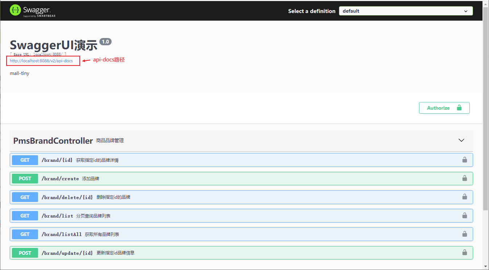

- 什么是Swagger的`api-docs`访问路径？该路径会返回JSON格式数据，应用中Swagger渲染API文档页面的所有数据就是来源于此，Postman也是可以通过这些数据来渲染API文档页面，这里的`api-docs`地址为：http://localhost:8088/v2/api-docs

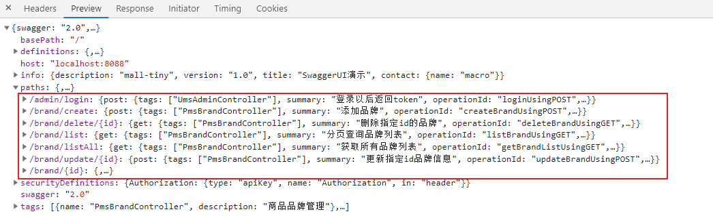

- 在postman中点击`import`按钮，选择`Link`，输入Swagger的`api-docs`路径即可将Swagger生成的接口导入到Postman中去了；

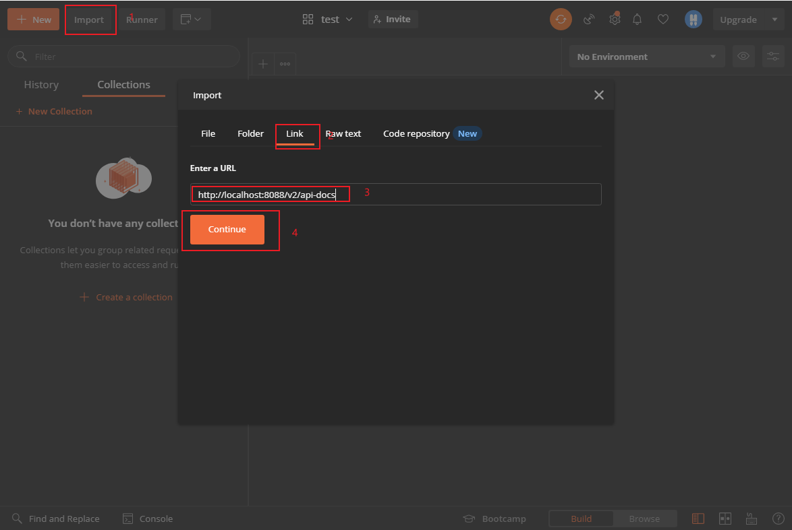

- 直接使用默认选项导入即可，无需修改；

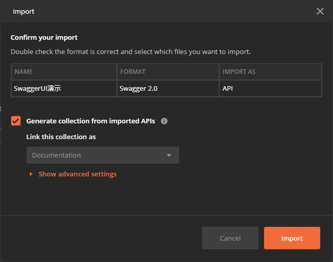

- 导入成功后，Swagger中的接口就会出现在Postman中了，之后就只需要在Postman中改改参数就可以开始调试接口了，是不是很方便！

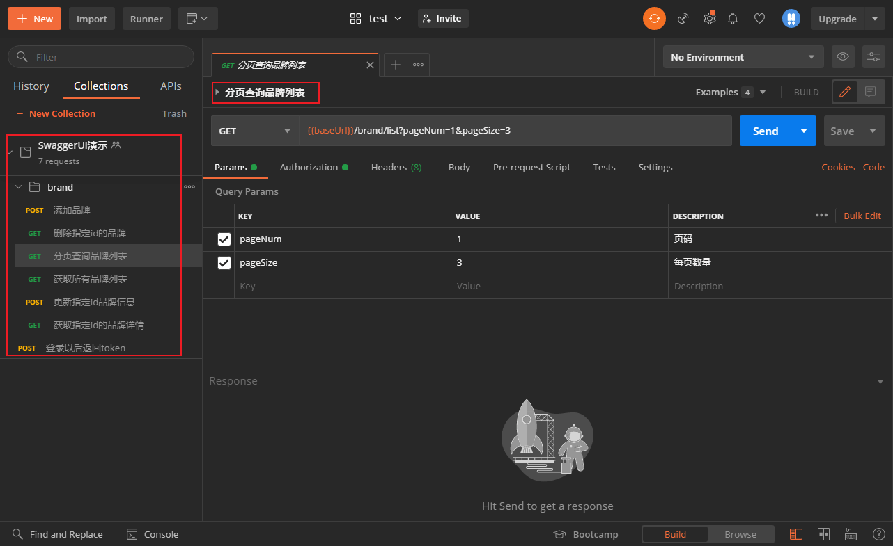

### Postman设置环境变量

- 我们随意找个接口访问下，会发现访问出错了，那是因为`baseUrl`这个环境变量设置有问题，导致了接口无法访问；

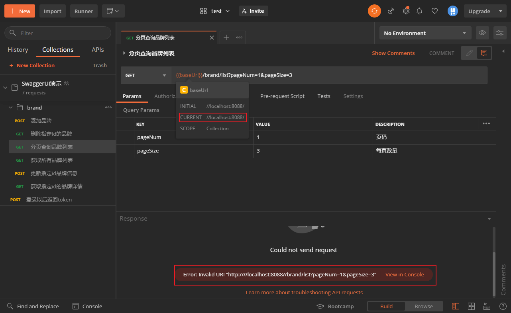

- 我们只要在Postman中设置`baseUrl`这个环境变量，就可以正常访问了；

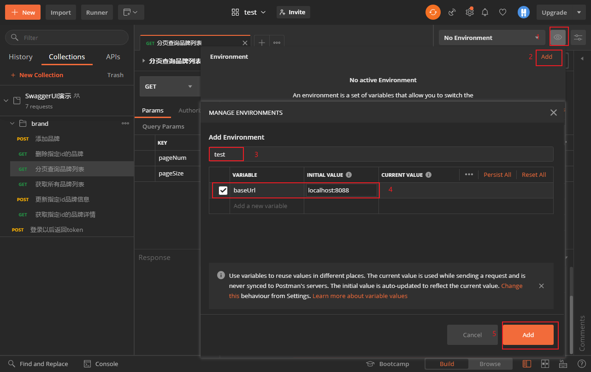

- 添加好环境变量之后，需要选择好环境才会被应用。

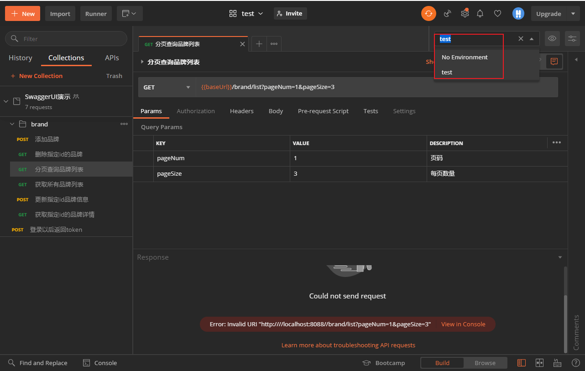

### 访问需要登录认证的接口

- 这时候再次访问接口会发现我们的接口需要登录认证才能正常访问；

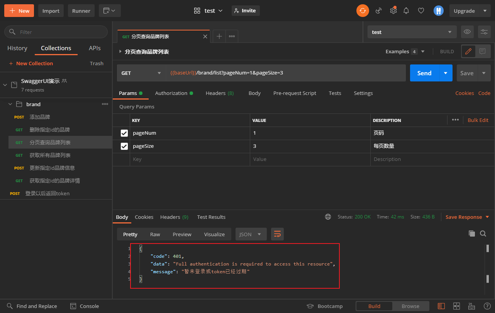

- 我们可以先调用登录接口来获取Token；

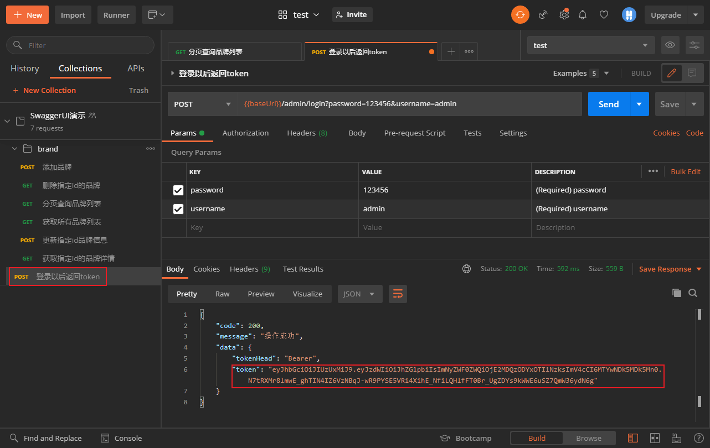

- 给需要登录认证的接口添加`Bearer Token`类型的Token，我们可以发现需要配置一个叫`token`的环境变量；

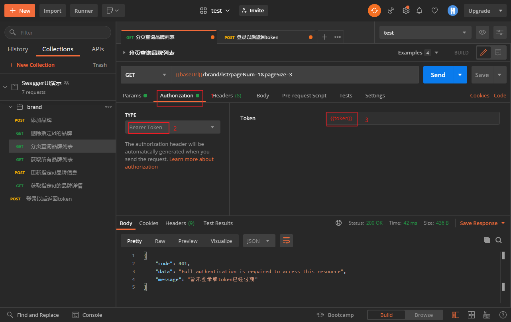

- 在环境变量中添加`token`；

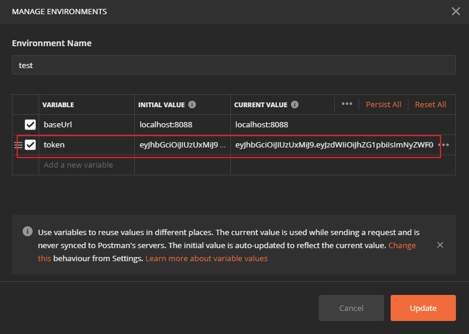

- 添加完环境变量后即可正常访问需要登录认证的接口了。

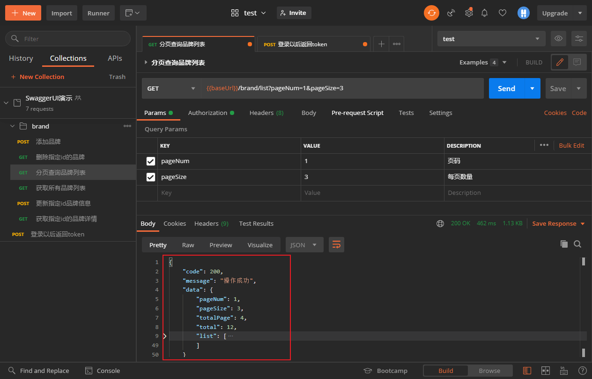

## 有何缺点

> 此种方法使用Postman来调试接口是非常强大的，但是对于文档展示能力有点偏弱。

- 比如说Swagger中的接口对于请求和返回参数都有非常完善的注释信息；

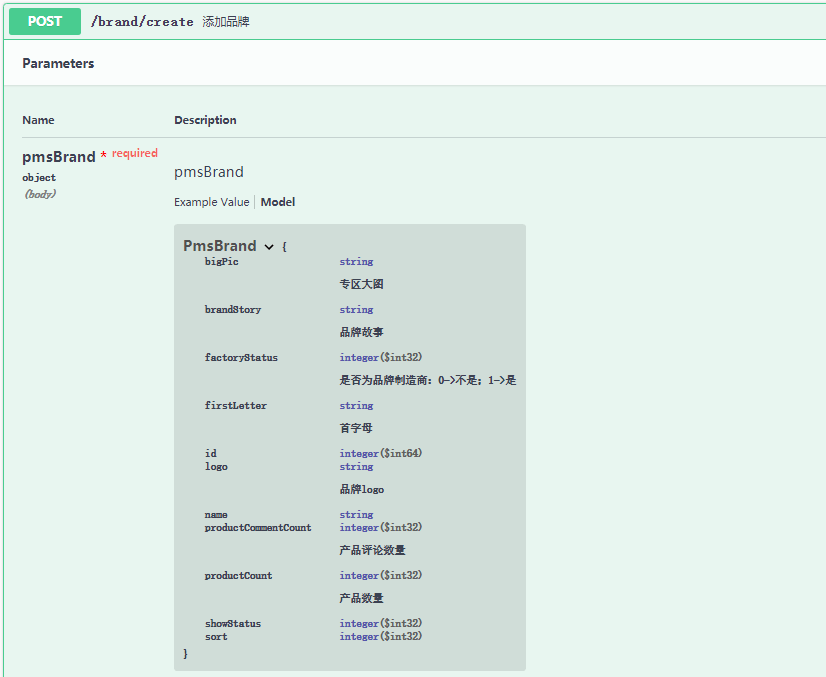

- 而在Postman中，这些文档信息得不到体现，Postman毕竟还只是一个接口调试工具。

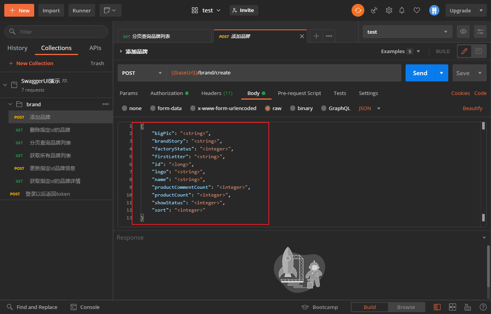

## 总结

Swagger和Postman结合使用比较好，Swagger用来看接口文档信息，Postman用于调试，将Swagger中的接口导入到Postman中可以弥补Swagger在接口调试方面的不足。

## 项目源码地址

https://github.com/macrozheng/mall-learning/tree/master/mall-tiny-swagger

## 公众号

