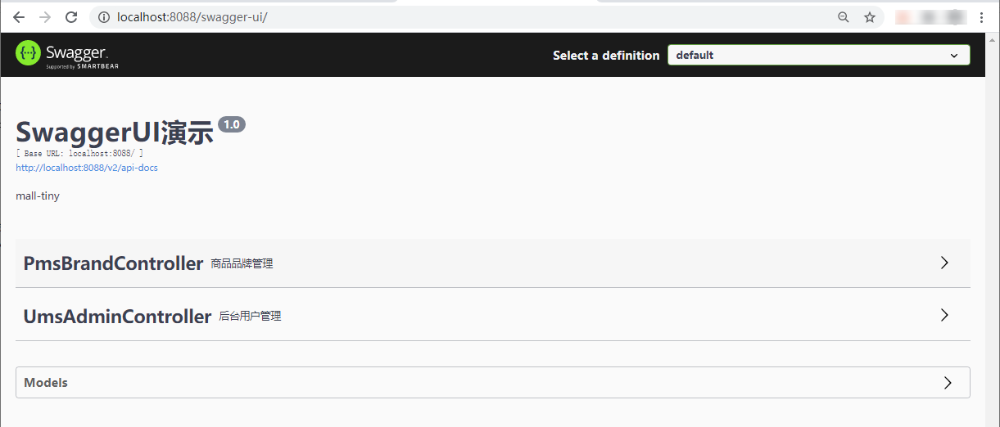
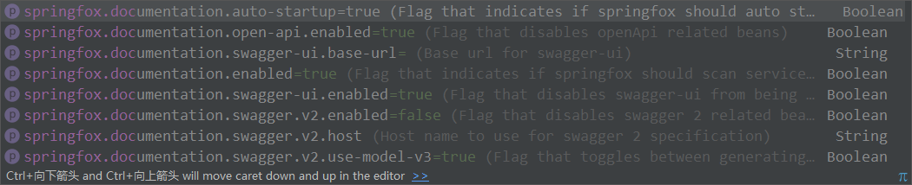
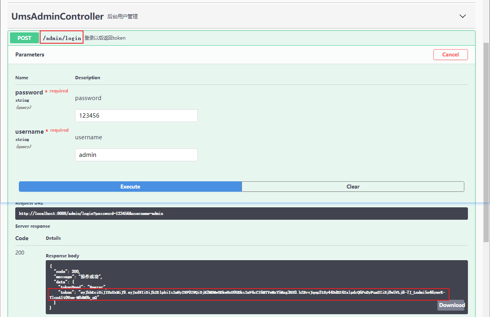
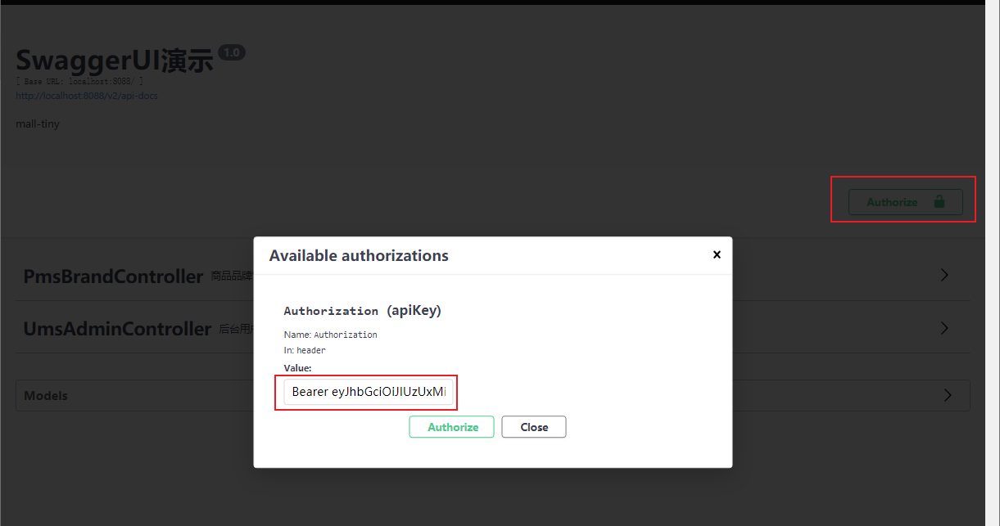

学习不走弯路，[关注公众号](#公众号) 回复「学习路线」，获取mall项目专属学习路线！

# 还在手动整合Swagger？Swagger官方Starter是真的香！

> 之前项目中整合Swagger都是直接通过依赖`springfox-swagger`、`springfox-swagger-ui`两个jar包来实现的，最近发现springfox 3.0.0版本已经有了自己的SpringBoot Starter，使用起来更契合SpringBoot项目，非常方便，推荐给大家！

## 使用官方Starter

> 我们先使用官方Starter来整合Swagger看看是否够简单！

- 首先在`pom.xml`中添加springfox官方Swagger依赖；

```xml
<!--springfox swagger官方Starter-->
<dependency>
    <groupId>io.springfox</groupId>
    <artifactId>springfox-boot-starter</artifactId>
    <version>3.0.0</version>
</dependency>
```

- 添加Swagger的Java配置，配置好Api信息和需要生成接口文档的类扫描路径即可；

```java
/**
 * Swagger2API文档的配置
 */
@Configuration
public class Swagger2Config {
    @Bean
    public Docket createRestApi() {
        return new Docket(DocumentationType.SWAGGER_2)
                .apiInfo(apiInfo())
                .select()
                .apis(RequestHandlerSelectors.basePackage("com.macro.mall.tiny.controller"))
                .paths(PathSelectors.any())
                .build();
    }

    private ApiInfo apiInfo() {
        return new ApiInfoBuilder()
                .title("SwaggerUI演示")
                .description("mall-tiny")
                .contact(new Contact("macro", null, null))
                .version("1.0")
                .build();
    }
}
```

- 访问API文档信息，访问地址：http://localhost:8088/swagger-ui/



- 两步即可搞定SpringBoot集成Swagger，是不是很简单！

## 与之前版本相比

> 之前我们使用的是springfox 2.9.2版本，接下来对比下3.0.0的SpringBoot Starter使用，看看有何不同！

- 旧版本需要依赖`springfox-swagger2`和`springfox-swagger-ui`两个配置，新版本一个Starter就搞定了，而且之前的版本如果不使用新版本的`swagger-models`和`swagger-annotations`依赖，访问接口会出现`NumberFormatException`问题；

````xml
<dependencies>
    <dependency>
        <groupId>io.springfox</groupId>
        <artifactId>springfox-swagger2</artifactId>
        <exclusions>
            <exclusion>
                <groupId>io.swagger</groupId>
                <artifactId>swagger-annotations</artifactId>
            </exclusion>
            <exclusion>
                <groupId>io.swagger</groupId>
                <artifactId>swagger-models</artifactId>
            </exclusion>
        </exclusions>
    </dependency>
    <dependency>
        <groupId>io.springfox</groupId>
        <artifactId>springfox-swagger-ui</artifactId>
    </dependency>
    <!--解决Swagger 2.9.2版本NumberFormatException-->
    <dependency>
        <groupId>io.swagger</groupId>
        <artifactId>swagger-models</artifactId>
        <version>1.6.0</version>
    </dependency>
    <dependency>
        <groupId>io.swagger</groupId>
        <artifactId>swagger-annotations</artifactId>
        <version>1.6.0</version>
    </dependency>
</dependencies>
````

- 新版本去除了一些第三方依赖，包括`guava`，之前使用旧版本时就由于`guava`版本问题导致过依赖冲突，具体可以看下[《给Swagger升级了新版本，没想到居然有这么多坑！》](https://mp.weixin.qq.com/s/GWQRTEBRLGsL7um795ufbQ)；

- 新版本和旧版本文档访问路径发生了变化，新版本为：http://localhost:8088/swagger-ui/ ，旧版本为：http://localhost:8088/swagger-ui.html

- 新版本中新增了一些SpringBoot配置，`springfox.documentation.enabled`配置可以控制是否启用Swagger文档生成功能；



- 比如说我们只想在`dev`环境下启用Swagger文档，而在`prod`环境下不想启用，旧版本我们可以通过`@Profile`注解实现；

```java
@Configuration
@EnableSwagger2
@Profile(value = {"dev"})
public class Swagger2Config {
    
}
```

- 新版本我们在SpringBoot配置文件中进行配置即可，`springfox.documentation.enabled`在`application-dev.yml`配置为true，在`application-prod.yml`中配置为false。

## 整合Spring Security使用

> 我们经常会在项目中使用Spring Security实现登录认证，接下来我们来讲下如何使用Swagger整合Spring Security，实现访问需要登录认证的接口。

- 如何访问需要登录认证的接口？只需在访问接口时添加一个合法的`Authorization`请求头即可，下面是Swagger相关配置；

```java
/**
 * Swagger2API文档的配置
 */
@Configuration
public class Swagger2Config {
    @Bean
    public Docket createRestApi() {
        return new Docket(DocumentationType.SWAGGER_2)
                .apiInfo(apiInfo())
                .select()
                .apis(RequestHandlerSelectors.basePackage("com.macro.mall.tiny.controller"))
                .paths(PathSelectors.any())
                .build()
                //添加登录认证
                .securitySchemes(securitySchemes())
                .securityContexts(securityContexts());
    }

    private ApiInfo apiInfo() {
        return new ApiInfoBuilder()
                .title("SwaggerUI演示")
                .description("mall-tiny")
                .contact(new Contact("macro", null, null))
                .version("1.0")
                .build();
    }

    private List<SecurityScheme> securitySchemes() {
        //设置请求头信息
        List<SecurityScheme> result = new ArrayList<>();
        ApiKey apiKey = new ApiKey("Authorization", "Authorization", "header");
        result.add(apiKey);
        return result;
    }

    private List<SecurityContext> securityContexts() {
        //设置需要登录认证的路径
        List<SecurityContext> result = new ArrayList<>();
        result.add(getContextByPath("/brand/.*"));
        return result;
    }

    private SecurityContext getContextByPath(String pathRegex) {
        return SecurityContext.builder()
                .securityReferences(defaultAuth())
                .forPaths(PathSelectors.regex(pathRegex))
                .build();
    }

    private List<SecurityReference> defaultAuth() {
        List<SecurityReference> result = new ArrayList<>();
        AuthorizationScope authorizationScope = new AuthorizationScope("global", "accessEverything");
        AuthorizationScope[] authorizationScopes = new AuthorizationScope[1];
        authorizationScopes[0] = authorizationScope;
        result.add(new SecurityReference("Authorization", authorizationScopes));
        return result;
    }
}
```

- 我们需要在Spring Security中配置好Swagger静态资源的无授权访问，比如首页访问路径`/swagger-ui/`；

```java
/**
 * SpringSecurity的配置
 * Created by macro on 2018/4/26.
 */
@Configuration
@EnableWebSecurity
@EnableGlobalMethodSecurity(prePostEnabled = true)
public class SecurityConfig extends WebSecurityConfigurerAdapter {
    @Autowired
    private UmsAdminService adminService;
    @Autowired
    private RestfulAccessDeniedHandler restfulAccessDeniedHandler;
    @Autowired
    private RestAuthenticationEntryPoint restAuthenticationEntryPoint;

    @Override
    protected void configure(HttpSecurity httpSecurity) throws Exception {
        httpSecurity.csrf()// 由于使用的是JWT，我们这里不需要csrf
                .disable()
                .sessionManagement()// 基于token，所以不需要session
                .sessionCreationPolicy(SessionCreationPolicy.STATELESS)
                .and()
                .authorizeRequests()
                .antMatchers(HttpMethod.GET, // 允许对于网站静态资源的无授权访问
                        "/",
                        "/swagger-ui/",
                        "/*.html",
                        "/favicon.ico",
                        "/**/*.html",
                        "/**/*.css",
                        "/**/*.js",
                        "/swagger-resources/**",
                        "/v2/api-docs/**"
                )
                .permitAll()
                .antMatchers("/admin/login")// 对登录注册要允许匿名访问
                .permitAll()
                .antMatchers(HttpMethod.OPTIONS)//跨域请求会先进行一次options请求
                .permitAll()
                .anyRequest()// 除上面外的所有请求全部需要鉴权认证
                .authenticated();
        // 省略若干配置......
    }
}
```

- 调用登录接口获取token，账号密码为`admin:123456`；



- 点击`Authorize`按钮后输入`Authorization`请求头，之后就可以访问需要登录认证的接口了。



## 总结

Swagger官方Starter解决了之前整合Swagger的一系列问题，简化了SpringBoot整合Swagger的过程，使用起来更加方便了。同时对于一些复杂的配置使用基本没有变化，一些之前的使用方式依然可以使用！

## 项目源码地址

https://github.com/macrozheng/mall-learning/tree/master/mall-tiny-swagger

## 公众号

