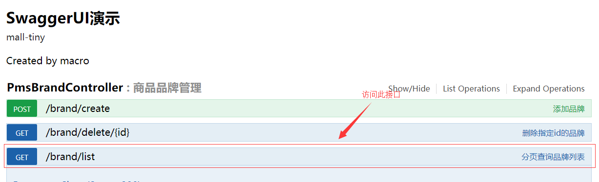

mall项目全套学习教程连载中，[关注公众号](#公众号)第一时间获取。

# SpringBoot应用中使用AOP记录接口访问日志

> 本文主要讲述AOP在mall项目中的应用，通过在controller层建一个切面来实现接口访问的统一日志记录。

## AOP

> AOP为Aspect Oriented Programming的缩写，意为：面向切面编程，通过预编译方式和运行期动态代理实现程序功能的统一维护的一种技术。利用AOP可以对业务逻辑的各个部分进行隔离，从而使得业务逻辑各部分之间的耦合度降低，提高程序的可重用性，同时提高了开发的效率。

### AOP的相关术语

#### 通知（Advice）
通知描述了切面要完成的工作以及何时执行。比如我们的日志切面需要记录每个接口调用时长，就需要在接口调用前后分别记录当前时间，再取差值。

- 前置通知（Before）：在目标方法调用前调用通知功能；
- 后置通知（After）：在目标方法调用之后调用通知功能，不关心方法的返回结果；
- 返回通知（AfterReturning）：在目标方法成功执行之后调用通知功能；
- 异常通知（AfterThrowing）：在目标方法抛出异常后调用通知功能；
- 环绕通知（Around）：通知包裹了目标方法，在目标方法调用之前和之后执行自定义的行为。

#### 连接点（JoinPoint）
通知功能被应用的时机。比如接口方法被调用的时候就是日志切面的连接点。

#### 切点（Pointcut）
切点定义了通知功能被应用的范围。比如日志切面的应用范围就是所有接口，即所有controller层的接口方法。

#### 切面（Aspect）
切面是通知和切点的结合，定义了何时、何地应用通知功能。

#### 引入（Introduction）
在无需修改现有类的情况下，向现有的类添加新方法或属性。

#### 织入（Weaving）
把切面应用到目标对象并创建新的代理对象的过程。

## Spring中使用注解创建切面

### 相关注解

- @Aspect：用于定义切面
- @Before：通知方法会在目标方法调用之前执行
- @After：通知方法会在目标方法返回或抛出异常后执行
- @AfterReturning：通知方法会在目标方法返回后执行
- @AfterThrowing：通知方法会在目标方法抛出异常后执行
- @Around：通知方法会将目标方法封装起来
- @Pointcut：定义切点表达式

### 切点表达式
指定了通知被应用的范围，表达式格式：
```java
execution(方法修饰符 返回类型 方法所属的包.类名.方法名称(方法参数)
```

```java
//com.macro.mall.tiny.controller包中所有类的public方法都应用切面里的通知
execution(public * com.macro.mall.tiny.controller.*.*(..))
//com.macro.mall.tiny.service包及其子包下所有类中的所有方法都应用切面里的通知
execution(* com.macro.mall.tiny.service..*.*(..))
//com.macro.mall.tiny.service.PmsBrandService类中的所有方法都应用切面里的通知
execution(* com.macro.mall.tiny.service.PmsBrandService.*(..))
```

## 添加AOP切面实现接口日志记录

### 添加日志信息封装类WebLog

> 用于封装需要记录的日志信息，包括操作的描述、时间、消耗时间、url、请求参数和返回结果等信息。

```java
package com.macro.mall.tiny.dto;

/**
 * Controller层的日志封装类
 * Created by macro on 2018/4/26.
 */
public class WebLog {
    /**
     * 操作描述
     */
    private String description;

    /**
     * 操作用户
     */
    private String username;

    /**
     * 操作时间
     */
    private Long startTime;

    /**
     * 消耗时间
     */
    private Integer spendTime;

    /**
     * 根路径
     */
    private String basePath;

    /**
     * URI
     */
    private String uri;

    /**
     * URL
     */
    private String url;

    /**
     * 请求类型
     */
    private String method;

    /**
     * IP地址
     */
    private String ip;

    /**
     * 请求参数
     */
    private Object parameter;

    /**
     * 请求返回的结果
     */
    private Object result;

    //省略了getter,setter方法
}

```

### 添加切面类WebLogAspect

> 定义了一个日志切面，在环绕通知中获取日志需要的信息，并应用到controller层中所有的public方法中去。

```java
package com.macro.mall.tiny.component;

import cn.hutool.core.util.StrUtil;
import cn.hutool.core.util.URLUtil;
import cn.hutool.json.JSONUtil;
import com.macro.mall.tiny.dto.WebLog;
import io.swagger.annotations.ApiOperation;
import org.aspectj.lang.JoinPoint;
import org.aspectj.lang.ProceedingJoinPoint;
import org.aspectj.lang.Signature;
import org.aspectj.lang.annotation.*;
import org.aspectj.lang.reflect.MethodSignature;
import org.slf4j.Logger;
import org.slf4j.LoggerFactory;
import org.springframework.core.annotation.Order;
import org.springframework.stereotype.Component;
import org.springframework.util.StringUtils;
import org.springframework.web.bind.annotation.RequestBody;
import org.springframework.web.bind.annotation.RequestParam;
import org.springframework.web.context.request.RequestContextHolder;
import org.springframework.web.context.request.ServletRequestAttributes;

import javax.servlet.http.HttpServletRequest;
import java.lang.reflect.Method;
import java.lang.reflect.Parameter;
import java.util.ArrayList;
import java.util.HashMap;
import java.util.List;
import java.util.Map;

/**
 * 统一日志处理切面
 * Created by macro on 2018/4/26.
 */
@Aspect
@Component
@Order(1)
public class WebLogAspect {
    private static final Logger LOGGER = LoggerFactory.getLogger(WebLogAspect.class);

    @Pointcut("execution(public * com.macro.mall.tiny.controller.*.*(..))")
    public void webLog() {
    }

    @Before("webLog()")
    public void doBefore(JoinPoint joinPoint) throws Throwable {
    }

    @AfterReturning(value = "webLog()", returning = "ret")
    public void doAfterReturning(Object ret) throws Throwable {
    }

    @Around("webLog()")
    public Object doAround(ProceedingJoinPoint joinPoint) throws Throwable {
        long startTime = System.currentTimeMillis();
        //获取当前请求对象
        ServletRequestAttributes attributes = (ServletRequestAttributes) RequestContextHolder.getRequestAttributes();
        HttpServletRequest request = attributes.getRequest();
        //记录请求信息
        WebLog webLog = new WebLog();
        Object result = joinPoint.proceed();
        Signature signature = joinPoint.getSignature();
        MethodSignature methodSignature = (MethodSignature) signature;
        Method method = methodSignature.getMethod();
        if (method.isAnnotationPresent(ApiOperation.class)) {
            ApiOperation apiOperation = method.getAnnotation(ApiOperation.class);
            webLog.setDescription(apiOperation.value());
        }
        long endTime = System.currentTimeMillis();
        String urlStr = request.getRequestURL().toString();
        webLog.setBasePath(StrUtil.removeSuffix(urlStr, URLUtil.url(urlStr).getPath()));
        webLog.setIp(request.getRemoteUser());
        webLog.setMethod(request.getMethod());
        webLog.setParameter(getParameter(method, joinPoint.getArgs()));
        webLog.setResult(result);
        webLog.setSpendTime((int) (endTime - startTime));
        webLog.setStartTime(startTime);
        webLog.setUri(request.getRequestURI());
        webLog.setUrl(request.getRequestURL().toString());
        LOGGER.info("{}", JSONUtil.parse(webLog));
        return result;
    }

    /**
     * 根据方法和传入的参数获取请求参数
     */
    private Object getParameter(Method method, Object[] args) {
        List<Object> argList = new ArrayList<>();
        Parameter[] parameters = method.getParameters();
        for (int i = 0; i < parameters.length; i++) {
            //将RequestBody注解修饰的参数作为请求参数
            RequestBody requestBody = parameters[i].getAnnotation(RequestBody.class);
            if (requestBody != null) {
                argList.add(args[i]);
            }
            //将RequestParam注解修饰的参数作为请求参数
            RequestParam requestParam = parameters[i].getAnnotation(RequestParam.class);
            if (requestParam != null) {
                Map<String, Object> map = new HashMap<>();
                String key = parameters[i].getName();
                if (!StringUtils.isEmpty(requestParam.value())) {
                    key = requestParam.value();
                }
                map.put(key, args[i]);
                argList.add(map);
            }
        }
        if (argList.size() == 0) {
            return null;
        } else if (argList.size() == 1) {
            return argList.get(0);
        } else {
            return argList;
        }
    }
}

```

## 进行接口测试
运行项目并访问：http://localhost:8080/swagger-ui.html



可以看到控制住台中会打印如下日志信息：
```json
{
	"result": {
		"code": 200,
		"data": {
			"total": 11,
			"totalPage": 11,
			"pageSize": 1,
			"list": [{
				"productCommentCount": 100,
				"name": "万和",
				"bigPic": "",
				"logo": "http://macro-oss.oss-cn-shenzhen.aliyuncs.com/mall/images/20180607/timg(5).jpg",
				"showStatus": 1,
				"id": 1,
				"sort": 0,
				"productCount": 100,
				"firstLetter": "W",
				"factoryStatus": 1
			}],
			"pageNum": 1
		},
		"message": "操作成功"
	},
	"basePath": "http://localhost:8080",
	"method": "GET",
	"parameter": [{
		"pageNum": 1
	}, {
		"pageSize": 1
	}],
	"description": "分页查询品牌列表",
	"startTime": 1561273191861,
	"uri": "/brand/list",
	"url": "http://localhost:8080/brand/list",
	"spendTime": 101
}
```

## 项目源码地址

[https://github.com/macrozheng/mall-learning/tree/master/mall-tiny-aop](https://github.com/macrozheng/mall-learning/tree/master/mall-tiny-aop)

## 公众号


