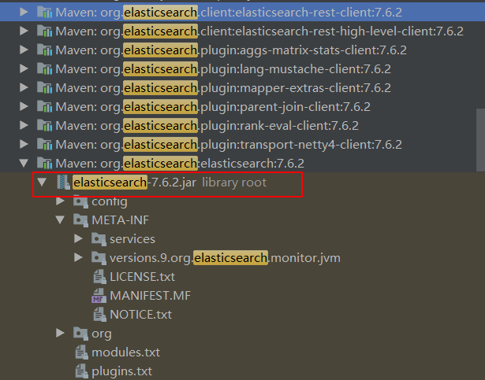
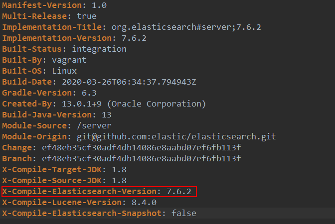
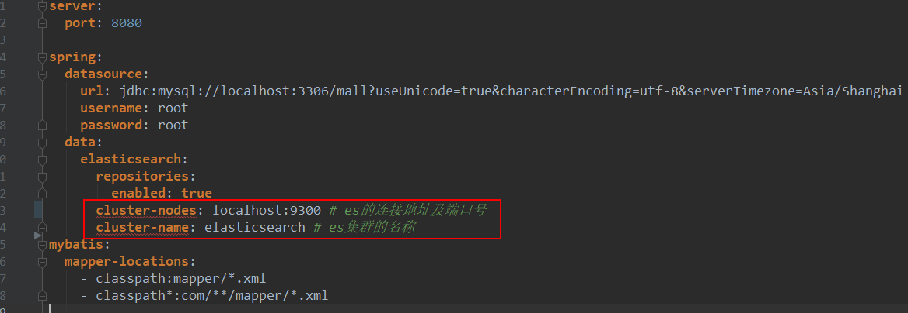
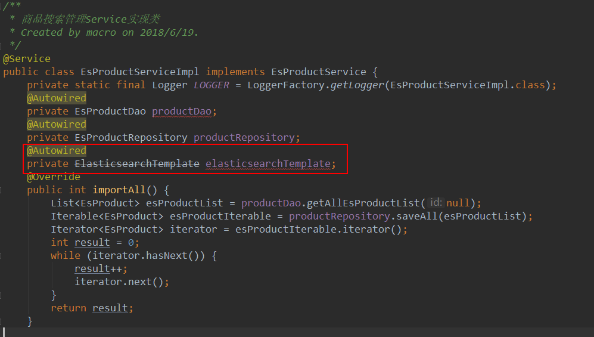
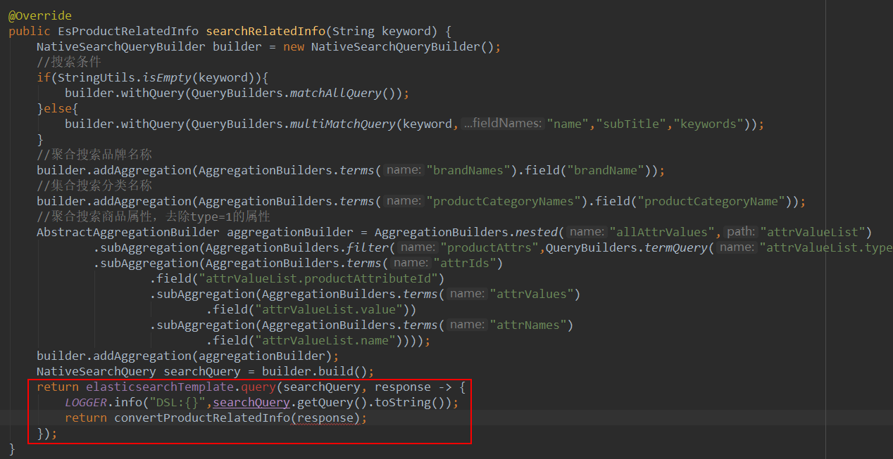
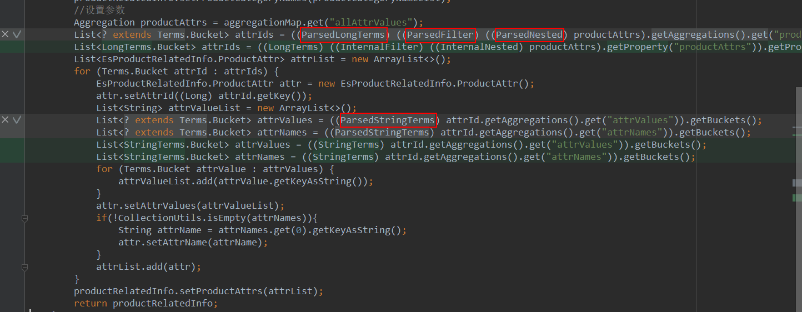
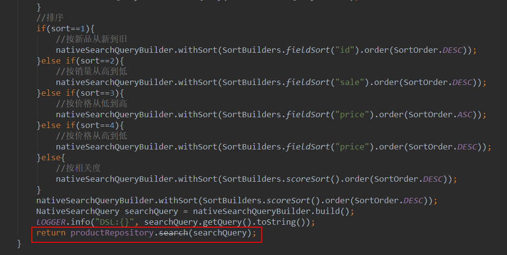

学习不走弯路，[关注公众号](#公众号) 回复「学习路线」，获取mall项目专属学习路线！

# Elasticsearch 升级 7.x 版本后，我感觉掉坑里了！

> 最近想把我的`mall`项目升级下，支持SpringBoot 2.3.0 版本。升级过程中发现需要升级Elasticsearch到`7.x`版本，学习过我的`mall`项目的朋友应该知道，
我用的Elasticsearch是`6.x`版本，升级到`7.x`以后ElasticsearchTemplate都不让用了。本文记录了Elasticsearch从`6.x`升级到`7.x`所遇到的一些问题，给大家排排坑！

## 版本选择

> 既然我们要升级到Elasticsearch`7.x`版本，首先要选择合适的版本。如何选择合适的版本，这里有个小技巧分享给大家。

- 首先我们可以在`pom.xml`中修改SpringBoot依赖的版本为`2.3.0`；

```xml
<parent>
    <groupId>org.springframework.boot</groupId>
    <artifactId>spring-boot-starter-parent</artifactId>
    <version>2.3.0.RELEASE</version>
    <relativePath/> <!-- lookup parent from repository -->
</parent>
```

- 然后在项目的`External Libraries`中搜索`elasticsearch`，可以发现`elasticsearch-7.6.2.jar`这个依赖；



- 然后打开其中的`MANIFEST.MF`文件，通过jar包中的`X-Compile-Elasticsearch-Version`属性，我们可以找到兼容的Elasticsearch版本号为`7.6.2`；



- 之前还有试过两个版本`6.2.2`版本和`7.4.0`版本，发现与SpringBoot 2.3.0 都有兼容性问题，所以选择合适的版本很重要！

- 还有一点值得注意的是，如果你使用了中文分词器（IK Analysis），也要选择对应的版本`7.6.2`，对于使用Kibana和Logstash也是如此。

## 遇到的问题

> 选择好了合适的Elasticsearch版本后，接下来我们来讲讲升级版本遇到的问题了！

- 在`application.yml`中，原来我们用来配置Elasticsearch访问路径和集群名称的配置已经不建议使用了；



- 取而代之的是直接配置Elasticsearch的rest访问地址；

```yaml
spring:
  elasticsearch:
    rest:
      uris: http://localhost:9200
```

- 其实最大的问题还是ElasticsearchTemplate已经过时了，不建议使用了，之前复杂的数据操作用到了它；



- 推荐使用的是ElasticsearchRestTemplate，这大概就是修改`application.yml`中那两个配置的原因了，修改为使用ElasticsearchRestTemplate后，我们可以发现原来ElasticsearchTemplate的`query()`方法已经没有了；



- 可以使用ElasticsearchRestTemplate的`search()`方法来代替，原来的复杂查询将有以下改进；

```java
// 使用ElasticsearchTemplate进行复杂查询
return elasticsearchTemplate.query(searchQuery, response -> {
    LOGGER.info("DSL:{}",searchQuery.getQuery().toString());
    return convertProductRelatedInfo(response);
});
// 使用ElasticsearchRestTemplate进行复杂查询
SearchHits<EsProduct> searchHits = elasticsearchRestTemplate.search(searchQuery, EsProduct.class);
return convertProductRelatedInfo(searchHits);
```

- 我们转换聚合结果对象的方法`convertProductRelatedInfo`也改进下，只是改变了方法参数类型而已；

```java
//改进前
private EsProductRelatedInfo convertProductRelatedInfo(SearchResponse response) {
    //省略方法体代码...
}
//改进后
private EsProductRelatedInfo convertProductRelatedInfo(SearchHits<EsProduct> response) {
    //省略方法体代码...
}
```

- 如果你觉得这样就行了，那你调用下接口就会发现，报了个类型转换异常；

```bash
2020-07-21 14:40:48.154 ERROR 11616 --- [nio-8080-exec-3] o.a.c.c.C.[.[.[/].[dispatcherServlet]    : Servlet.service() for servlet [dispatcherServlet] in context with path [] threw exception [Request processing failed; 
nested exception is java.lang.ClassCastException: org.elasticsearch.search.aggregations.bucket.nested.ParsedNested cannot be cast to org.elasticsearch.search.aggregations.bucket.nested.InternalNested] with root cause

java.lang.ClassCastException: org.elasticsearch.search.aggregations.bucket.nested.ParsedNested cannot be cast to org.elasticsearch.search.aggregations.bucket.nested.InternalNested
	at com.macro.mall.tiny.service.impl.EsProductServiceImpl.convertProductRelatedInfo(EsProductServiceImpl.java:254) ~[classes/:na]
	at com.macro.mall.tiny.service.impl.EsProductServiceImpl.searchRelatedInfo(EsProductServiceImpl.java:229) ~[classes/:na]
	at com.macro.mall.tiny.controller.EsProductController.searchRelatedInfo(EsProductController.java:104) ~[classes/:na]
```

- 我们对该问题进行修复，主要就是原来的`Terms`对象都被改为了`ParsedTerms`相关对象，比如说StringTerms被改为了ParsedStringTerms对象，具体对比如下；



- 我们还发现原来使用的ElasticsearchRepository的`search()`方法也过时了，不建议使用了，我们以前用它做了一些复杂查询；



- 我们可以改用ElasticsearchRestTemplate的`search()`方法来实现，具体实现对比如下；

```java
// ElasticsearchRepository实现复杂搜索
return productRepository.search(searchQuery)
// ElasticsearchRestTemplate实现复杂搜索
SearchHits<EsProduct> searchHits = elasticsearchRestTemplate.search(searchQuery, EsProduct.class);
if(searchHits.getTotalHits()<=0){
    return new PageImpl<>(null,pageable,0);
}
List<EsProduct> searchProductList = searchHits.stream().map(SearchHit::getContent).collect(Collectors.toList());
return new PageImpl<>(searchProductList,pageable,searchHits.getTotalHits());
```

## 总结

Elasticsearch从`6.x`升级到`7.x`改动还真不是一般的大，ElasticsearchTemplate不建议使用了，改为使用ElasticsearchRestTemplate，ElasticsearchRepository实现复杂查询的方法也不建议使用了。从此我们简单的数据操作可以使用ElasticsearchRepository，而复杂的数据操作只能使用ElasticsearchRestTemplate了。

## 项目源码地址

https://github.com/macrozheng/mall-learning/tree/master/mall-tiny-elasticsearch

## 公众号


