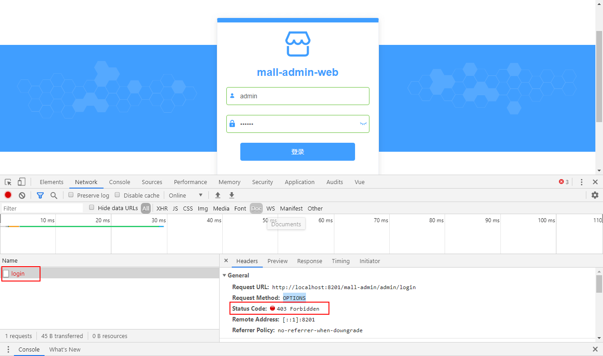
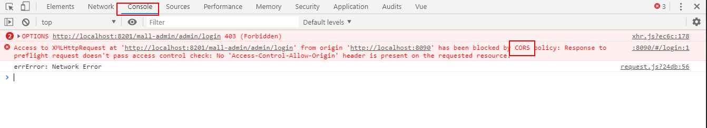
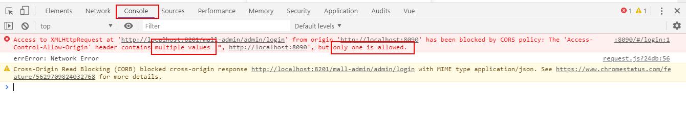
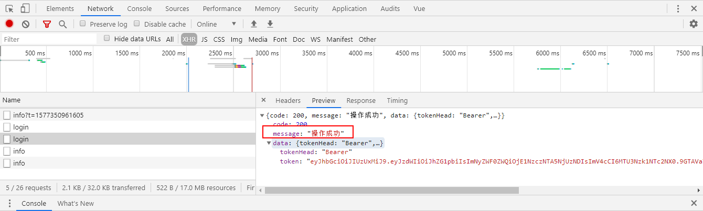

mall项目全套学习教程连载中，[关注公众号](#公众号)第一时间获取。

# 前后端分离项目，引入Spring Cloud Gateway遇到的一个问题！

> 随着项目架构的越来越复杂，引入了新的技术，新的问题也在产生，本文将讲述一个由于网关引起的前端调用问题。

## 问题产生

我的`mall`项目升级到微服务架构以后，加入了基于Spring Cloud Gateway的网关系统，前端调用相关服务时应该统一从网关进行调用，本以为前端直接调用网关没啥问题，后来发现会产生无法调用的情况，下面我们来记录下这个问题以及解决思路。

## 问题重现与解决

> 这里我们以`mall-swarm`中的代码为例来演示下该问题的产生与解决。

- 首先我们先把`mall-registry`、`mall-config`、`mall-gateway`、`mall-admin`这些服务依次启动起来；

- 再启动前端项目`mall-admin-web`；

- 访问登录页面进行登录操作，发现无法登录，`OPTIONS`请求返回状态码`403`，到此我们还看不来是啥问题；



- 我们点开`Console`来看看到底报了啥错，发现了`CORS`这个关键信息，可以确定是产生了跨域问题，网关没有支持跨域；



- 接下来只要让网关支持跨域就可以了，在`mall-gateway`中添加全局跨域配置即可：

```java
/**
 * 全局跨域配置
 * 注意：前端从网关进行调用时需要配置
 * Created by macro on 2019/7/27.
 */
@Configuration
public class GlobalCorsConfig {

    @Bean
    public CorsWebFilter corsFilter() {
        CorsConfiguration config = new CorsConfiguration();
        config.addAllowedMethod("*");
        config.addAllowedOrigin("*");
        config.addAllowedHeader("*");

        UrlBasedCorsConfigurationSource source = new UrlBasedCorsConfigurationSource(new PathPatternParser());
        source.registerCorsConfiguration("/**", config);

        return new CorsWebFilter(source);
    }

}
```

- 重启`mall-gateway`服务，再次进行登录操作，发现`OPTIONS`请求虽然通过了，但是`POST`请求在`Console`中却报错了：



- 分析下该问题，应该是`mall-admin`服务中重复设置了允许跨域的过滤器的问题，只要去除`mall-admin`的全局跨域配置即可；

```java
/**
 * 全局跨域配置
 * 注意：前端从网关进行调用时不需要配置
 * Created by macro on 2019/7/27.
 */
//@Configuration
public class GlobalCorsConfig {

    /**
     * 允许跨域调用的过滤器
     */
    @Bean
    public CorsFilter corsFilter() {
        CorsConfiguration config = new CorsConfiguration();
        //允许所有域名进行跨域调用
        config.addAllowedOrigin("*");
        //允许跨越发送cookie
        config.setAllowCredentials(true);
        //放行全部原始头信息
        config.addAllowedHeader("*");
        //允许所有请求方法跨域调用
        config.addAllowedMethod("*");
        UrlBasedCorsConfigurationSource source = new UrlBasedCorsConfigurationSource();
        source.registerCorsConfiguration("/**", config);
        return new CorsFilter(source);
    }
}
```

- 重新启动`mall-admin`服务后，发现已经可以正常登录了。



## 总结

当前端应用通过网关调用服务时会产生跨域问题，解决方法是在网关服务中进行全局跨域配置，同时相关服务中如果有跨域配置应该去除。

## 项目地址

[https://github.com/macrozheng/mall-swarm](https://github.com/macrozheng/mall-swarm)

## 公众号

