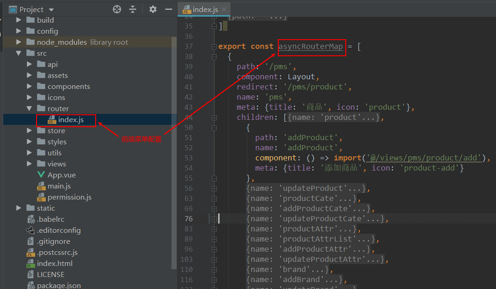
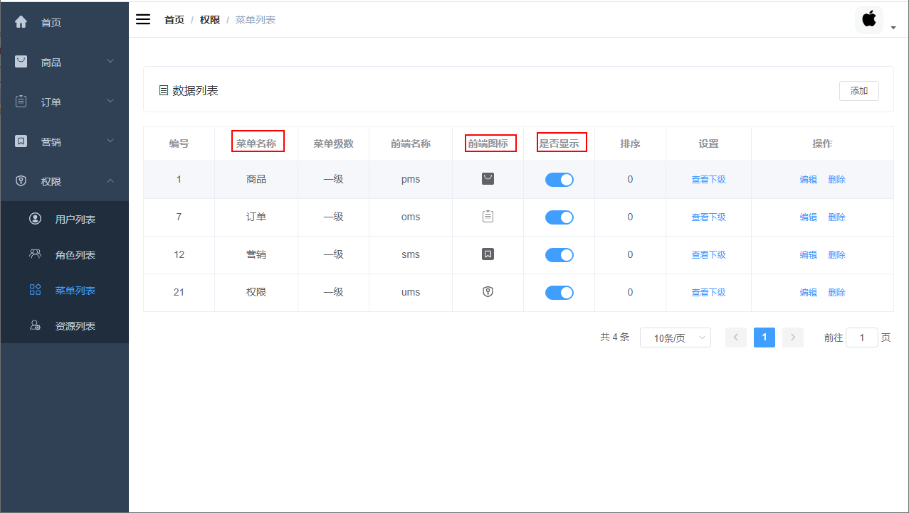
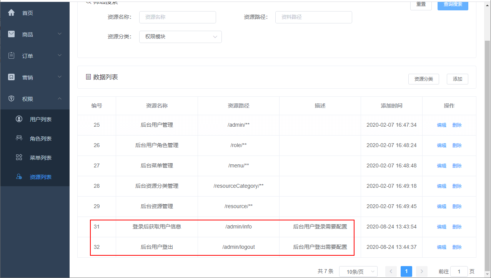
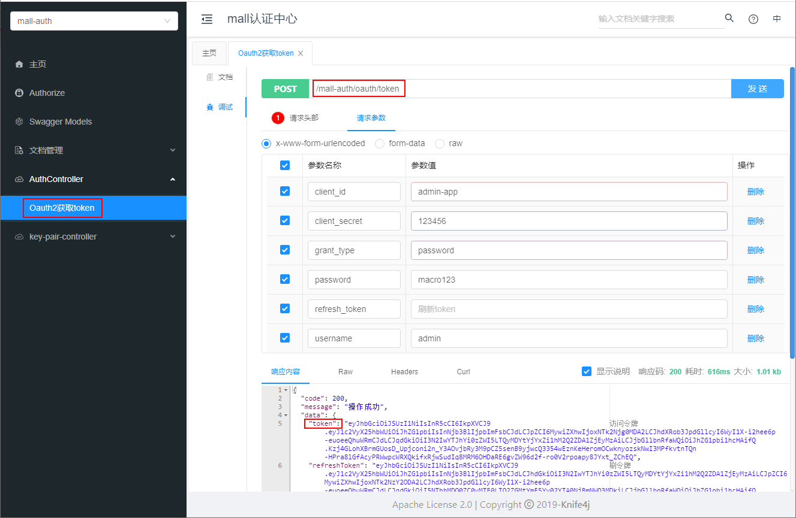

学习不走弯路，[关注公众号](#公众号) 回复「学习路线」，获取mall项目专属学习路线！

# 搞定Mall项目中的权限管理功能，弄懂这些问题就妥了！

> 最近发现很多朋友问我权限管理功能相关的问题，这里整理了下问的比较多的问题，统一答复下！

### mall项目中的权限管理功能是如何实现的？

之前写过几篇文章，包括了权限管理功能介绍、后端实现和前端实现，看一下基本就清楚了！

- [《大家心心念念的权限管理功能，这次安排上了！》](https://mp.weixin.qq.com/s/3TNrPNmxHpFTcAhfjnuP0g)
- [《手把手教你搞定权限管理，结合Spring Security实现接口的动态权限控制！》](https://mp.weixin.qq.com/s/nvKKNSJuIrGuHeJkUeO7rw)
- [《手把手教你搞定权限管理，结合Vue实现菜单的动态权限控制！》](https://mp.weixin.qq.com/s/UXPeJtx-mIvCPjJW3__c6g)

### `ums_permission`表还在使用么？

`ums_permission`表已经不再使用了，不再使用的表还包括`ums_admin_permission_relation`和`ums_role_permission_relation`表，最新版已经移除了相关使用代码。

### mall项目升级代码后`ums_resource`表找不到？

升级代码以后需要同时导入最新版本的SQL脚本，否则会找不到新创建的表，SQL脚本在项目的`document\sql`文件夹下面。

### 只实现了管理后台的权限，移动端权限如何处理的？

移动端只实现了登录认证，暂时不做权限处理。

### 在管理后台添加了一个菜单，为什么前端没有显示？

只有在前端路由中配置了的菜单，在管理后台添加后才会显示，否则没有效果。



### 前端路由中修改了菜单名称，为什么还是原来的名称？

菜单名称、图标、是否隐藏都是由管理后台配置的，当管理后台配置好后，前端修改是无效的。



### mall-swarm项目中的权限管理功能是如何实现的？

采用了基于Oauth2的的统一认证鉴权方式，通过认证服务进行统一认证，然后通过网关来统一校验认证和鉴权。具体可以参考：[《微服务权限终极解决方案，Spring Cloud Gateway + Oauth2 实现统一认证和鉴权！》](https://mp.weixin.qq.com/s/npyZsa4p30PLULxjskxKSA)

### mall和mall-swarm项目中权限管理的实现有何不同？

mall项目实现方式是Spring Security，相当于把安全功能封装成了一个工具包`mall-security`，然后其他模块通过依赖该工具包来实现权限管理，比如`mall-admin`模块。
mall-swarm项目实现方式是Oauth2+Gateway，采用的是统一的认证和鉴权，mall-swarm中的其他模块只需关注自己的相关业务，而无需依赖任何安全工具包，更加适合微服务架构。

### mall-swarm项目对接前端项目时为什么会提示你已经被登出？

一种情况是前端访问后端接口没有走网关，首先需要修改`mall-admin-web`项目的后端接口访问基础路径，修改文件为项目`config`目录下的`dev.env.js`，将`BASE_API`改为从网关访问`mall-admin`服务的路径。

```javascript
'use strict'
const merge = require('webpack-merge')
const prodEnv = require('./prod.env')

module.exports = merge(prodEnv, {
  NODE_ENV: '"development"',
  BASE_API: '"http://localhost:8201/mall-admin"'
})
```

另一种情况是没有更新到最新代码，需要更新到最新代码并导入最新版本的SQL。之前在`mall-gateway`项目中配置白名单的时候把`/mall-admin/admin/info`接口配置进去了，会导致无法登录的情况，需要去除掉，目前已经修复了。

```yaml
secure:
  ignore:
    urls: #配置白名单路径
     - "/mall-admin/admin/info"
```

还有一点需要注意的是由于`/mall-admin/admin/info`接口配置已经不在白名单中了，所以需要登录的用户需要配置该接口的相应资源，否则会无法登录。



### mall-swarm项目如何访问需要登录认证的接口？

由于项目中存在两套不同的用户体系，后台用户和前台用户，认证中心对多用户体系也有所支持。如何访问需要登录的接口，先调用认证中心接口获取token，不同体系下的用户需要传入不同的`client_id`和`client_secret`，后台用户为`admin-app:123456`，前台用户为`portal-app:123456`。



然后将token添加到请求头中，即可访问需要权限的接口了。


当然对原来的登录接口也做了兼容处理，分别会从内部调用认证中心获取Token，依然可以使用。

- 后台用户登录接口：http://localhost:8201/mall-admin/admin/login

- 前台用户登录接口：http://localhost:8201/mall-portal/sso/login


### 只想学习权限管理功能，有没有什么简单的项目可以学习下？

可以直接学习下`mall-tiny`项目，`mall-tiny`是一款基于SpringBoot+MyBatis-Plus的快速开发脚手架，拥有完整的权限管理功能，可对接Vue前端，开箱即用。具体参考[《还在从零开始搭建项目？手撸了款快速开发脚手架！》](https://mp.weixin.qq.com/s/tN3zjoKQxg1U19D4Slih8w)

## 公众号


