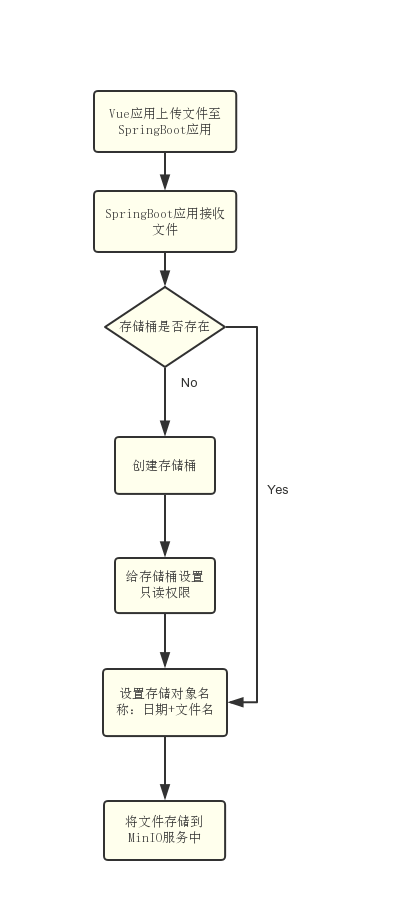
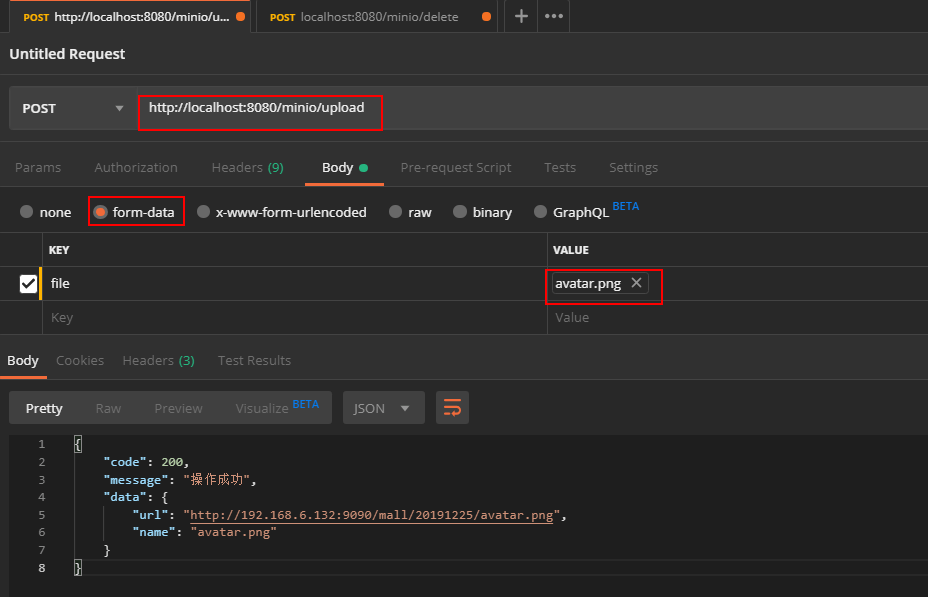
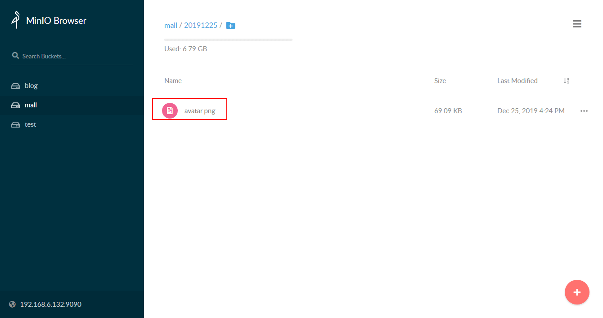
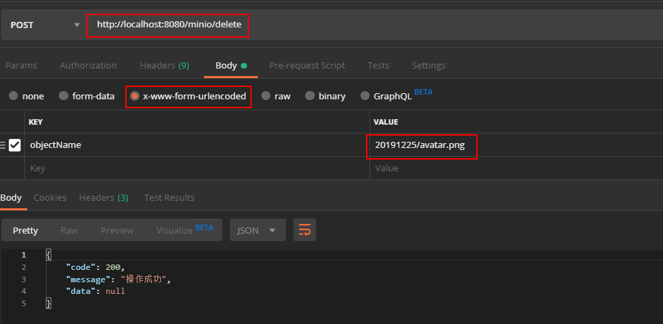
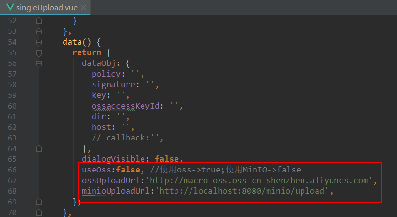
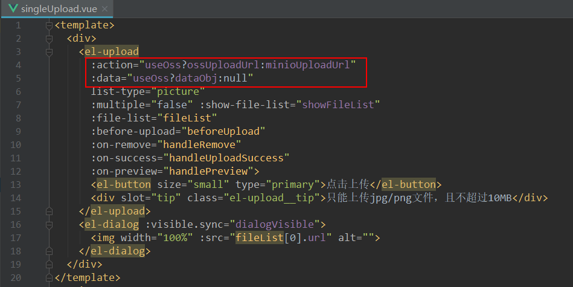
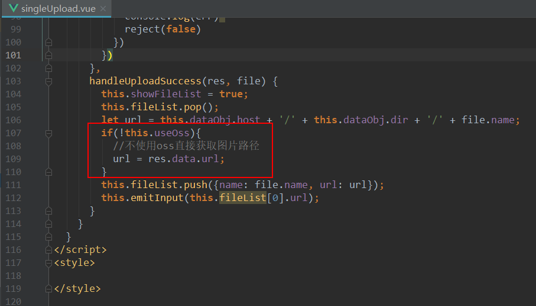
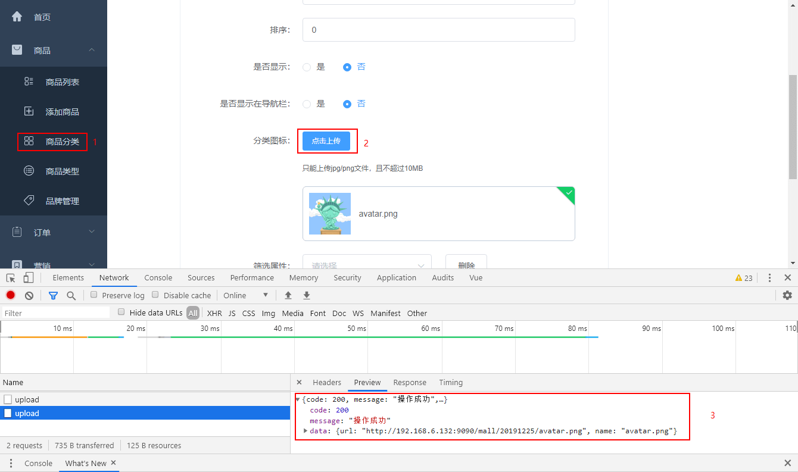

学习不走弯路，[关注公众号](#公众号) 回复「学习路线」，获取mall项目专属学习路线！

# 前后端分离项目，如何优雅实现文件存储！

> 在上一节中我们讲到了使用MinIO来自建对象存储服务，这次我们来讲下MinIO如何结合SpringBoot和Vue来实现文件存储。

## 学前准备

学习本文需要一些MinIO的基础知识，还不了解的小伙伴可以参考下：[Github标星19K+Star，10分钟自建对象存储服务！](https://mp.weixin.qq.com/s/kvLZRqgm1lEITm1j6rzJ0A)

## 结合SpringBoot使用

> 接下来我们将结合SpringBoot来实现一个完整的图片上传与删除操作。

- 上传流程示意图：



- 在pom.xml中添加MinIO的相关依赖：

```xml
<!--MinIO JAVA SDK-->
<dependency>
    <groupId>io.minio</groupId>
    <artifactId>minio</artifactId>
    <version>3.0.10</version>
</dependency>
```

- 在SpringBoot中开启文件上传功能，需要在application.yml添加如下配置：

```yaml
spring:
  servlet:
    multipart:
      enabled: true #开启文件上传
      max-file-size: 10MB #限制文件上传大小为10M
```

- 添加一个`MinioController`控制器用于实现文件的上传和删除操作：

```java
/**
 * Created by macro on 2019/12/25.
 */
@Api(tags = "MinioController", description = "MinIO对象存储管理")
@Controller
@RequestMapping("/minio")
public class MinioController {

    private static final Logger LOGGER = LoggerFactory.getLogger(MinioController.class);
    @Value("${minio.endpoint}")
    private String ENDPOINT;
    @Value("${minio.bucketName}")
    private String BUCKET_NAME;
    @Value("${minio.accessKey}")
    private String ACCESS_KEY;
    @Value("${minio.secretKey}")
    private String SECRET_KEY;

    @ApiOperation("文件上传")
    @RequestMapping(value = "/upload", method = RequestMethod.POST)
    @ResponseBody
    public CommonResult upload(@RequestParam("file") MultipartFile file) {
        try {
            //创建一个MinIO的Java客户端
            MinioClient minioClient = new MinioClient(ENDPOINT, ACCESS_KEY, SECRET_KEY);
            boolean isExist = minioClient.bucketExists(BUCKET_NAME);
            if (isExist) {
                LOGGER.info("存储桶已经存在！");
            } else {
                //创建存储桶并设置只读权限
                minioClient.makeBucket(BUCKET_NAME);
                minioClient.setBucketPolicy(BUCKET_NAME, "*.*", PolicyType.READ_ONLY);
            }
            String filename = file.getOriginalFilename();
            SimpleDateFormat sdf = new SimpleDateFormat("yyyyMMdd");
            // 设置存储对象名称
            String objectName = sdf.format(new Date()) + "/" + filename;
            // 使用putObject上传一个文件到存储桶中
            minioClient.putObject(BUCKET_NAME, objectName, file.getInputStream(), file.getContentType());
            LOGGER.info("文件上传成功!");
            MinioUploadDto minioUploadDto = new MinioUploadDto();
            minioUploadDto.setName(filename);
            minioUploadDto.setUrl(ENDPOINT + "/" + BUCKET_NAME + "/" + objectName);
            return CommonResult.success(minioUploadDto);
        } catch (Exception e) {
            LOGGER.info("上传发生错误: {}！", e.getMessage());
        }
        return CommonResult.failed();
    }

    @ApiOperation("文件删除")
    @RequestMapping(value = "/delete", method = RequestMethod.POST)
    @ResponseBody
    public CommonResult delete(@RequestParam("objectName") String objectName) {
        try {
            MinioClient minioClient = new MinioClient(ENDPOINT, ACCESS_KEY, SECRET_KEY);
            minioClient.removeObject(BUCKET_NAME, objectName);
            return CommonResult.success(null);
        } catch (Exception e) {
            e.printStackTrace();
        }
        return CommonResult.failed();
    }
}
```

- 在application.yml中对MinIO客户端进行配置：

```yaml
# MinIO对象存储相关配置
minio:
  endpoint: http://192.168.6.132:9090 #MinIO服务所在地址
  bucketName: mall #存储桶名称
  accessKey: minioadmin #访问的key
  secretKey: minioadmin #访问的秘钥
```

- 启动我的SpringBoot应用，使用Postman来访问上传接口进行文件上传，上传接口地址：http://localhost:8080/minio/upload



- 上传完成后，我们打开MinIO的管理界面可以看到上传后的图片，也可以通过返回的url来访问图片：



- 我们可以调用删除接口来删除该图片，需要注意的是`objectName`值是存储桶中的图片相对路径，删除文件接口地址：http://localhost:8080/minio/delete




## 结合Vue使用

> 经过上面操作，我们的SpringBoot应用已经可以完成文件上传与删除操作了，接下来我们结合Vue来实现前端上传图片到MinIO中，以`mall-admin-web`中的代码为例。

- 我们的SpringBoot应用需要支持跨域请求，否则Vue前端无法进行接口调用，我们先添加一个全局的跨域请求配置：

```java
/**
 * 全局跨域配置
 * Created by macro on 2019/7/27.
 */
@Configuration
public class GlobalCorsConfig {

    /**
     * 允许跨域调用的过滤器
     */
    @Bean
    public CorsFilter corsFilter() {
        CorsConfiguration config = new CorsConfiguration();
        //允许所有域名进行跨域调用
        config.addAllowedOrigin("*");
        //允许跨越发送cookie
        config.setAllowCredentials(true);
        //放行全部原始头信息
        config.addAllowedHeader("*");
        //允许所有请求方法跨域调用
        config.addAllowedMethod("*");
        UrlBasedCorsConfigurationSource source = new UrlBasedCorsConfigurationSource();
        source.registerCorsConfiguration("/**", config);
        return new CorsFilter(source);
    }
}
```

- `mall-admin-web`的文件上传操作主要是在`singleUpload.vue`和`multiUpload.vue`中，下面我们以`singleUpload.vue`的修改为例。

- 我们需要把原来的OSS上传和现在的MinIO上传做个兼容操作，先在Vue实例的数据对象中添加三个属性：



- 然后根据`useOss`属性设置`el-upload`上传组件的提交地址和提交参数：



- 在`el-upload`上传文件之前的钩子函数中添加如下代码，对于使用MinIO上传的操作不进行获取OSS上传策略的操作；


- 最后在`el-upload`文件上传成功的钩子函数中添加如下代码，对于使用MinIO上传的操作直接从返回结果中获取文件url；



- 运行`mall-admin-web`项目，使用商品分类下的添加功能来测试下文件上传，发现已经可以成功上传，图片也已经可以正常回显：



## 后端项目地址

https://github.com/macrozheng/mall-learning/tree/master/mall-tiny-oss

## 前端项目地址

https://github.com/macrozheng/mall-admin-web

## 公众号


