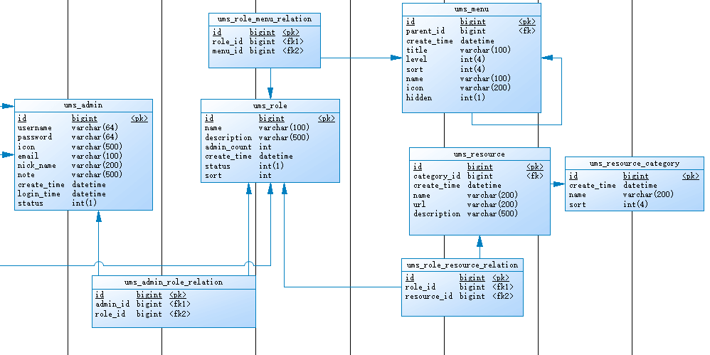

mall项目全套学习教程连载中，[关注公众号](#公众号)第一时间获取。

# 手把手教你搞定权限管理，结合Spring Security实现接口的动态权限控制！

> 权限控管理作为后台管理系统中必要的功能，mall项目中结合Spring Security实现了基于路径的动态权限控制，可以对后台接口访问进行细粒度的控制，今天我们来讲下它的后端实现原理。

## 前置知识

> 学习本文需要一些Spring Security的知识，对Spring Security不太了解的朋友可以看下以下文章。

- [mall整合SpringSecurity和JWT实现认证和授权（一）](https://mp.weixin.qq.com/s/HFAfcSGANrdVJeTmT-7X_A)
- [mall整合SpringSecurity和JWT实现认证和授权（二）](https://mp.weixin.qq.com/s/yO_8nAN-zoCB86ep4nuAOg)
- [仅需四步，整合SpringSecurity+JWT实现登录认证 ！](https://mp.weixin.qq.com/s/4xfdeBHKa_pXabgo41z26g)

## 数据库设计

> 权限管理相关表已经重新设计，将原来的权限拆分成了菜单和资源，菜单管理用于控制前端菜单的显示和隐藏，资源管理用来控制后端接口的访问权限。

### 数据库表结构

> 其中`ums_admin`、`ums_role`、`ums_admin_role_relation`为原来的表，其他均为新增表。



### 数据库表介绍

> 接下来我们将对每张表的用途做个详细介绍。

#### ums_admin

> 后台用户表，定义了后台用户的一些基本信息。

```sql
create table ums_admin
(
   id                   bigint not null auto_increment,
   username             varchar(64) comment '用户名',
   password             varchar(64) comment '密码',
   icon                 varchar(500) comment '头像',
   email                varchar(100) comment '邮箱',
   nick_name            varchar(200) comment '昵称',
   note                 varchar(500) comment '备注信息',
   create_time          datetime comment '创建时间',
   login_time           datetime comment '最后登录时间',
   status               int(1) default 1 comment '帐号启用状态：0->禁用；1->启用',
   primary key (id)
);
```

#### ums_role

> 后台用户角色表，定义了后台用户角色的一些基本信息，通过给后台用户分配角色来实现菜单和资源的分配。

```sql
create table ums_role
(
   id                   bigint not null auto_increment,
   name                 varchar(100) comment '名称',
   description          varchar(500) comment '描述',
   admin_count          int comment '后台用户数量',
   create_time          datetime comment '创建时间',
   status               int(1) default 1 comment '启用状态：0->禁用；1->启用',
   sort                 int default 0,
   primary key (id)
);

```

#### ums_admin_role_relation

> 后台用户和角色关系表，多对多关系表，一个角色可以分配给多个用户。

```sql
create table ums_admin_role_relation
(
   id                   bigint not null auto_increment,
   admin_id             bigint,
   role_id              bigint,
   primary key (id)
);
```

#### ums_menu

> 后台菜单表，用于控制后台用户可以访问的菜单，支持隐藏、排序和更改名称、图标。

```sql
create table ums_menu
(
   id                   bigint not null auto_increment,
   parent_id            bigint comment '父级ID',
   create_time          datetime comment '创建时间',
   title                varchar(100) comment '菜单名称',
   level                int(4) comment '菜单级数',
   sort                 int(4) comment '菜单排序',
   name                 varchar(100) comment '前端名称',
   icon                 varchar(200) comment '前端图标',
   hidden               int(1) comment '前端隐藏',
   primary key (id)
);
```

#### ums_resource

> 后台资源表，用于控制后台用户可以访问的接口，使用了Ant路径的匹配规则，可以使用通配符定义一系列接口的权限。

```sql
create table ums_resource
(
   id                   bigint not null auto_increment,
   category_id          bigint comment '资源分类ID',
   create_time          datetime comment '创建时间',
   name                 varchar(200) comment '资源名称',
   url                  varchar(200) comment '资源URL',
   description          varchar(500) comment '描述',
   primary key (id)
);
```

#### ums_resource_category

> 后台资源分类表，在细粒度进行权限控制时，可能资源会比较多，所以设计了个资源分类的概念，便于给角色分配资源。

```sql
create table ums_resource_category
(
   id                   bigint not null auto_increment,
   create_time          datetime comment '创建时间',
   name                 varchar(200) comment '分类名称',
   sort                 int(4) comment '排序',
   primary key (id)
);
```

#### ums_role_menu_relation

> 后台角色菜单关系表，多对多关系，可以给一个角色分配多个菜单。

```sql
create table ums_role_menu_relation
(
   id                   bigint not null auto_increment,
   role_id              bigint comment '角色ID',
   menu_id              bigint comment '菜单ID',
   primary key (id)
);
```

#### ums_role_resource_relation

> 后台角色资源关系表，多对多关系，可以给一个角色分配多个资源。

```sql
create table ums_role_resource_relation
(
   id                   bigint not null auto_increment,
   role_id              bigint comment '角色ID',
   resource_id          bigint comment '资源ID',
   primary key (id)
);
```

## 结合Spring Security实现

> 实现动态权限是在原`mall-security`模块的基础上进行改造完成的，原实现有不清楚的可以自行参照`前置知识`中的文档来学习。

### 以前的权限控制

> 以前的权限控制是采用Spring Security的默认机制实现的，下面我们以商品模块的代码为例来讲讲实现原理。

- 首先我们在需要权限的接口上使用`@PreAuthorize`注解定义好需要的权限；

```java
/**
 * 商品管理Controller
 * Created by macro on 2018/4/26.
 */
@Controller
@Api(tags = "PmsProductController", description = "商品管理")
@RequestMapping("/product")
public class PmsProductController {
    @Autowired
    private PmsProductService productService;

    @ApiOperation("创建商品")
    @RequestMapping(value = "/create", method = RequestMethod.POST)
    @ResponseBody
    @PreAuthorize("hasAuthority('pms:product:create')")
    public CommonResult create(@RequestBody PmsProductParam productParam, BindingResult bindingResult) {
        int count = productService.create(productParam);
        if (count > 0) {
            return CommonResult.success(count);
        } else {
            return CommonResult.failed();
        }
    }
}
```

- 然后将该权限值存入到权限表中，当用户登录时，将其所拥有的权限查询出来；

```java
/**
 * UmsAdminService实现类
 * Created by macro on 2018/4/26.
 */
@Service
public class UmsAdminServiceImpl implements UmsAdminService {
    @Override
    public UserDetails loadUserByUsername(String username){
        //获取用户信息
        UmsAdmin admin = getAdminByUsername(username);
        if (admin != null) {
            List<UmsPermission> permissionList = getPermissionList(admin.getId());
            return new AdminUserDetails(admin,permissionList);
        }
        throw new UsernameNotFoundException("用户名或密码错误");
    }
}
```

- 之后Spring Security把用户拥有的权限值和接口上注解定义的权限值进行比对，如果包含则可以访问，反之就不可以访问；

- 但是这样做会带来一些问题，我们需要在每个接口上都定义好访问该接口的权限值，而且只能挨个控制接口的权限，无法批量控制。其实每个接口都可以由它的访问路径唯一确定，我们可以使用基于路径的动态权限控制来解决这些问题。

### 基于路径的动态权限控制

> 接下来我们详细介绍下如何使用Spring Security实现基于路径的动态权限。

首先我们需要创建一个过滤器，用于实现动态权限控制，这里需要注意的是`doFilter`方法，对于OPTIONS请求直接放行，否则前端调用会出现跨域问题。对于配置在`IgnoreUrlsConfig`中的白名单路径我也需要直接放行，所有的鉴权操作都会在`super.beforeInvocation(fi)`中进行。

```java
/**
 * 动态权限过滤器，用于实现基于路径的动态权限过滤
 * Created by macro on 2020/2/7.
 */
public class DynamicSecurityFilter extends AbstractSecurityInterceptor implements Filter {

    @Autowired
    private DynamicSecurityMetadataSource dynamicSecurityMetadataSource;
    @Autowired
    private IgnoreUrlsConfig ignoreUrlsConfig;

    @Autowired
    public void setMyAccessDecisionManager(DynamicAccessDecisionManager dynamicAccessDecisionManager) {
        super.setAccessDecisionManager(dynamicAccessDecisionManager);
    }

    @Override
    public void init(FilterConfig filterConfig) throws ServletException {
    }

    @Override
    public void doFilter(ServletRequest servletRequest, ServletResponse servletResponse, FilterChain filterChain) throws IOException, ServletException {
        HttpServletRequest request = (HttpServletRequest) servletRequest;
        FilterInvocation fi = new FilterInvocation(servletRequest, servletResponse, filterChain);
        //OPTIONS请求直接放行
        if(request.getMethod().equals(HttpMethod.OPTIONS.toString())){
            fi.getChain().doFilter(fi.getRequest(), fi.getResponse());
            return;
        }
        //白名单请求直接放行
        PathMatcher pathMatcher = new AntPathMatcher();
        for (String path : ignoreUrlsConfig.getUrls()) {
            if(pathMatcher.match(path,request.getRequestURI())){
                fi.getChain().doFilter(fi.getRequest(), fi.getResponse());
                return;
            }
        }
        //此处会调用AccessDecisionManager中的decide方法进行鉴权操作
        InterceptorStatusToken token = super.beforeInvocation(fi);
        try {
            fi.getChain().doFilter(fi.getRequest(), fi.getResponse());
        } finally {
            super.afterInvocation(token, null);
        }
    }

    @Override
    public void destroy() {
    }

    @Override
    public Class<?> getSecureObjectClass() {
        return FilterInvocation.class;
    }

    @Override
    public SecurityMetadataSource obtainSecurityMetadataSource() {
        return dynamicSecurityMetadataSource;
    }

}

```

在DynamicSecurityFilter中调用super.beforeInvocation(fi)方法时会调用AccessDecisionManager中的decide方法用于鉴权操作，而decide方法中的configAttributes参数会通过SecurityMetadataSource中的getAttributes方法来获取，configAttributes其实就是配置好的访问当前接口所需要的权限，下面是简化版的beforeInvocation源码。

```java
public abstract class AbstractSecurityInterceptor implements InitializingBean,
		ApplicationEventPublisherAware, MessageSourceAware {
    

protected InterceptorStatusToken beforeInvocation(Object object) {
        
        //获取元数据
		Collection<ConfigAttribute> attributes = this.obtainSecurityMetadataSource()
				.getAttributes(object);

		Authentication authenticated = authenticateIfRequired();

		//进行鉴权操作
		try {
			this.accessDecisionManager.decide(authenticated, object, attributes);
		}
		catch (AccessDeniedException accessDeniedException) {
			publishEvent(new AuthorizationFailureEvent(object, attributes, authenticated,
					accessDeniedException));

			throw accessDeniedException;
		}
	}
}
```

知道了鉴权的原理，接下来我们需要自己实现SecurityMetadataSource接口的getAttributes方法，用于获取当前访问路径所需资源。

```java
/**
 * 动态权限数据源，用于获取动态权限规则
 * Created by macro on 2020/2/7.
 */
public class DynamicSecurityMetadataSource implements FilterInvocationSecurityMetadataSource {

    private static Map<String, ConfigAttribute> configAttributeMap = null;
    @Autowired
    private DynamicSecurityService dynamicSecurityService;

    @PostConstruct
    public void loadDataSource() {
        configAttributeMap = dynamicSecurityService.loadDataSource();
    }

    public void clearDataSource() {
        configAttributeMap.clear();
        configAttributeMap = null;
    }

    @Override
    public Collection<ConfigAttribute> getAttributes(Object o) throws IllegalArgumentException {
        if (configAttributeMap == null) this.loadDataSource();
        List<ConfigAttribute>  configAttributes = new ArrayList<>();
        //获取当前访问的路径
        String url = ((FilterInvocation) o).getRequestUrl();
        String path = URLUtil.getPath(url);
        PathMatcher pathMatcher = new AntPathMatcher();
        Iterator<String> iterator = configAttributeMap.keySet().iterator();
        //获取访问该路径所需资源
        while (iterator.hasNext()) {
            String pattern = iterator.next();
            if (pathMatcher.match(pattern, path)) {
                configAttributes.add(configAttributeMap.get(pattern));
            }
        }
        // 未设置操作请求权限，返回空集合
        return configAttributes;
    }

    @Override
    public Collection<ConfigAttribute> getAllConfigAttributes() {
        return null;
    }

    @Override
    public boolean supports(Class<?> aClass) {
        return true;
    }

}
```

由于我们的后台资源规则被缓存在了一个Map对象之中，所以当后台资源发生变化时，我们需要清空缓存的数据，然后下次查询时就会被重新加载进来。这里我们需要修改UmsResourceController类，注入DynamicSecurityMetadataSource，当修改后台资源时，需要调用clearDataSource方法来清空缓存的数据。

```java
/**
 * 后台资源管理Controller
 * Created by macro on 2020/2/4.
 */
@Controller
@Api(tags = "UmsResourceController", description = "后台资源管理")
@RequestMapping("/resource")
public class UmsResourceController {

    @Autowired
    private UmsResourceService resourceService;
    @Autowired
    private DynamicSecurityMetadataSource dynamicSecurityMetadataSource;

    @ApiOperation("添加后台资源")
    @RequestMapping(value = "/create", method = RequestMethod.POST)
    @ResponseBody
    public CommonResult create(@RequestBody UmsResource umsResource) {
        int count = resourceService.create(umsResource);
        dynamicSecurityMetadataSource.clearDataSource();
        if (count > 0) {
            return CommonResult.success(count);
        } else {
            return CommonResult.failed();
        }
    }
 }
```

之后我们需要实现AccessDecisionManager接口来实现权限校验，对于没有配置资源的接口我们直接允许访问，对于配置了资源的接口，我们把访问所需资源和用户拥有的资源进行比对，如果匹配则允许访问。

```java
/**
 * 动态权限决策管理器，用于判断用户是否有访问权限
 * Created by macro on 2020/2/7.
 */
public class DynamicAccessDecisionManager implements AccessDecisionManager {

    @Override
    public void decide(Authentication authentication, Object object,
                       Collection<ConfigAttribute> configAttributes) throws AccessDeniedException, InsufficientAuthenticationException {
        // 当接口未被配置资源时直接放行
        if (CollUtil.isEmpty(configAttributes)) {
            return;
        }
        Iterator<ConfigAttribute> iterator = configAttributes.iterator();
        while (iterator.hasNext()) {
            ConfigAttribute configAttribute = iterator.next();
            //将访问所需资源或用户拥有资源进行比对
            String needAuthority = configAttribute.getAttribute();
            for (GrantedAuthority grantedAuthority : authentication.getAuthorities()) {
                if (needAuthority.trim().equals(grantedAuthority.getAuthority())) {
                    return;
                }
            }
        }
        throw new AccessDeniedException("抱歉，您没有访问权限");
    }

    @Override
    public boolean supports(ConfigAttribute configAttribute) {
        return true;
    }

    @Override
    public boolean supports(Class<?> aClass) {
        return true;
    }

}
```

我们之前在DynamicSecurityMetadataSource中注入了一个DynamicSecurityService对象，它是我自定义的一个动态权限业务接口，其主要用于加载所有的后台资源规则。

```java
/**
 * 动态权限相关业务类
 * Created by macro on 2020/2/7.
 */
public interface DynamicSecurityService {
    /**
     * 加载资源ANT通配符和资源对应MAP
     */
    Map<String, ConfigAttribute> loadDataSource();
}
```

接下来我们需要修改Spring Security的配置类SecurityConfig，当有动态权限业务类时在FilterSecurityInterceptor过滤器前添加我们的动态权限过滤器。这里在创建动态权限相关对象时，还使用了@ConditionalOnBean这个注解，当没有动态权限业务类时就不会创建动态权限相关对象，实现了有动态权限控制和没有这两种情况的兼容。

```java
/**
 * 对SpringSecurity的配置的扩展，支持自定义白名单资源路径和查询用户逻辑
 * Created by macro on 2019/11/5.
 */
public class SecurityConfig extends WebSecurityConfigurerAdapter {

    @Autowired(required = false)
    private DynamicSecurityService dynamicSecurityService;

    @Override
    protected void configure(HttpSecurity httpSecurity) throws Exception {
        ExpressionUrlAuthorizationConfigurer<HttpSecurity>.ExpressionInterceptUrlRegistry registry = httpSecurity
                .authorizeRequests();
        //有动态权限配置时添加动态权限校验过滤器
        if(dynamicSecurityService!=null){
            registry.and().addFilterBefore(dynamicSecurityFilter(), FilterSecurityInterceptor.class);
        }
    }

    @ConditionalOnBean(name = "dynamicSecurityService")
    @Bean
    public DynamicAccessDecisionManager dynamicAccessDecisionManager() {
        return new DynamicAccessDecisionManager();
    }


    @ConditionalOnBean(name = "dynamicSecurityService")
    @Bean
    public DynamicSecurityFilter dynamicSecurityFilter() {
        return new DynamicSecurityFilter();
    }

    @ConditionalOnBean(name = "dynamicSecurityService")
    @Bean
    public DynamicSecurityMetadataSource dynamicSecurityMetadataSource() {
        return new DynamicSecurityMetadataSource();
    }

}

```

这里还有个问题需要提下，当前端跨域访问没有权限的接口时，会出现跨域问题，只需要在没有权限访问的处理类RestfulAccessDeniedHandler中添加允许跨域访问的响应头即可。

````java
/**
 * 自定义返回结果：没有权限访问时
 * Created by macro on 2018/4/26.
 */
public class RestfulAccessDeniedHandler implements AccessDeniedHandler{
    @Override
    public void handle(HttpServletRequest request,
                       HttpServletResponse response,
                       AccessDeniedException e) throws IOException, ServletException {
        response.setHeader("Access-Control-Allow-Origin", "*");
        response.setHeader("Cache-Control","no-cache");
        response.setCharacterEncoding("UTF-8");
        response.setContentType("application/json");
        response.getWriter().println(JSONUtil.parse(CommonResult.forbidden(e.getMessage())));
        response.getWriter().flush();
    }
}
````

当我们其他模块需要动态权限控制时，只要创建一个DynamicSecurityService对象就行了，比如在`mall-admin`模块中我们启用了动态权限功能。

```java
/**
 * mall-security模块相关配置
 * Created by macro on 2019/11/9.
 */
@Configuration
@EnableWebSecurity
@EnableGlobalMethodSecurity(prePostEnabled = true)
public class MallSecurityConfig extends SecurityConfig {

    @Autowired
    private UmsAdminService adminService;
    @Autowired
    private UmsResourceService resourceService;

    @Bean
    public UserDetailsService userDetailsService() {
        //获取登录用户信息
        return username -> adminService.loadUserByUsername(username);
    }

    @Bean
    public DynamicSecurityService dynamicSecurityService() {
        return new DynamicSecurityService() {
            @Override
            public Map<String, ConfigAttribute> loadDataSource() {
                Map<String, ConfigAttribute> map = new ConcurrentHashMap<>();
                List<UmsResource> resourceList = resourceService.listAll();
                for (UmsResource resource : resourceList) {
                    map.put(resource.getUrl(), new org.springframework.security.access.SecurityConfig(resource.getId() + ":" + resource.getName()));
                }
                return map;
            }
        };
    }
}
```

## 权限管理功能演示

具体参考：[大家心心念念的权限管理功能，这次安排上了！](https://mp.weixin.qq.com/s/3TNrPNmxHpFTcAhfjnuP0g)

## 项目源码地址

[https://github.com/macrozheng/mall](https://github.com/macrozheng/mall)

## 公众号

