mall项目全套学习教程连载中，[关注公众号](#公众号)第一时间获取。

# Elasticsearch项目实战，商品搜索功能设计与实现！

> 上次写了一篇[《Elasticsearch快速入门，掌握这些刚刚好！》](https://mp.weixin.qq.com/s/cohWZy_eUOUqbmUxhXzzNA)，带大家学习了下Elasticsearch的基本用法，这次我们来篇实战教程，以`mall`项目中的商品搜索为例，把Elasticsearch用起来！

## 中文分词器

> 由于商品搜索会涉及中文搜索，Elasticsearch需要安装插件才可以支持，我们先来了解下中文分词器，这里使用的是IKAnalyzer。在[《Elasticsearch快速入门，掌握这些刚刚好！》](https://mp.weixin.qq.com/s/cohWZy_eUOUqbmUxhXzzNA)中已经讲过其安装方式，这里直接讲解它的用法。

### 使用IKAnalyzer

- 使用默认分词器，可以发现默认分词器只是将中文逐词分隔，并不符合我们的需求；

```
GET /pms/_analyze
{
  "text": "小米手机性价比很高",
  "tokenizer": "standard"
}
```

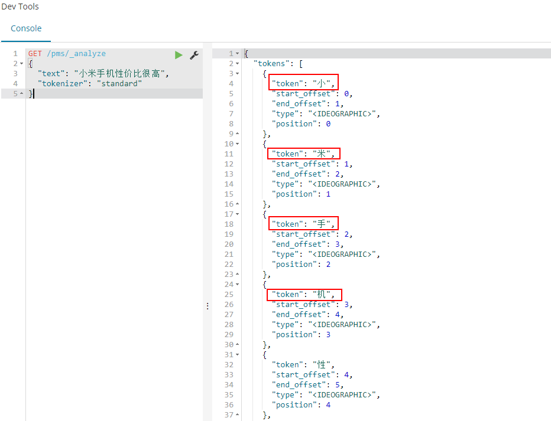

- 使用中文分词器以后，可以将中文文本按语境进行分隔，可以满足我们的需求。

```
GET /pms/_analyze
{
  "text": "小米手机性价比很高",
  "tokenizer": "ik_max_word"
}
```

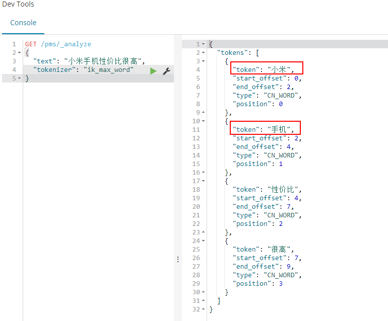

### 在SpringBoot中使用

在SpringBoot中使用Elasticsearch本文不再赘述，直接参考[《mall整合Elasticsearch实现商品搜索》](https://mp.weixin.qq.com/s/op7CTQS5dGOKv5BvRbeFow)即可。这里需要提一下，对于需要进行中文分词的字段，我们直接使用@Field注解将analyzer属性设置为`ik_max_word`即可。

```java
/**
 * 搜索中的商品信息
 * Created by macro on 2018/6/19.
 */
@Document(indexName = "pms", type = "product",shards = 1,replicas = 0)
public class EsProduct implements Serializable {
    private static final long serialVersionUID = -1L;
    @Id
    private Long id;
    @Field(analyzer = "ik_max_word",type = FieldType.Text)
    private String name;
    @Field(analyzer = "ik_max_word",type = FieldType.Text)
    private String subTitle;
    @Field(analyzer = "ik_max_word",type = FieldType.Text)
    private String keywords;
    //省略若干代码......
}
```

## 简单商品搜索

> 我们先来实现一个最简单的商品搜索，搜索商品名称、副标题、关键词中包含指定关键字的商品。

- 使用Query DSL调用Elasticsearch的Restful API实现；

```
POST /pms/product/_search
{
  "from": 0, 
  "size": 2, 
  "query": {
    "multi_match": {
      "query": "小米",
      "fields": [
        "name",
        "subTitle",
        "keywords"
      ]
    }
  }
}
```

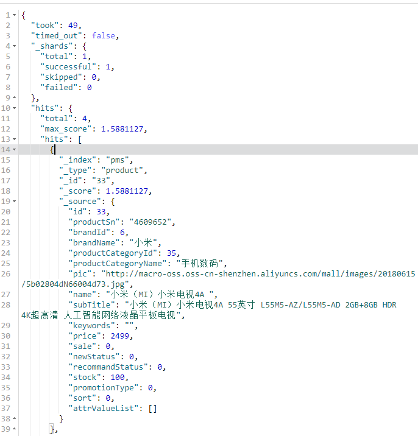

- 在SpringBoot中实现，使用Elasticsearch Repositories的衍生查询来搜索；

```java
/**
 * 商品搜索管理Service实现类
 * Created by macro on 2018/6/19.
 */
@Service
public class EsProductServiceImpl implements EsProductService {
    @Override
    public Page<EsProduct> search(String keyword, Integer pageNum, Integer pageSize) {
        Pageable pageable = PageRequest.of(pageNum, pageSize);
        return productRepository.findByNameOrSubTitleOrKeywords(keyword, keyword, keyword, pageable);
    }
}
```

- 衍生查询其实原理很简单，就是将一定规则方法名称的方法转化为Elasticsearch的Query DSL语句，看完下面这张表你就懂了。

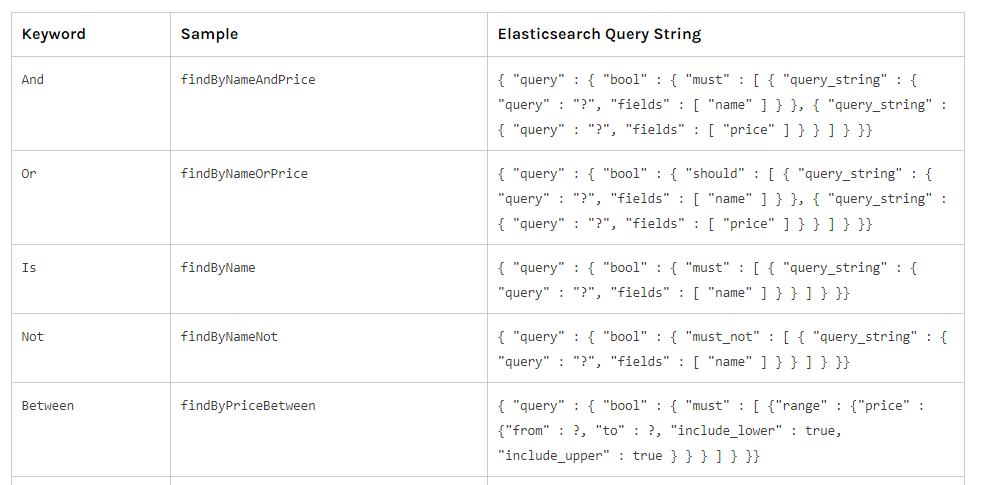

## 综合商品搜索

> 接下来我们来实现一个复杂的商品搜索，涉及到过滤、不同字段匹配权重不同以及可以进行排序。

- 首先来说下我们的需求，按输入的关键字搜索商品名称、副标题和关键词，可以按品牌和分类进行筛选，可以有5种排序方式，默认按相关度进行排序，看下接口文档有助于理解；

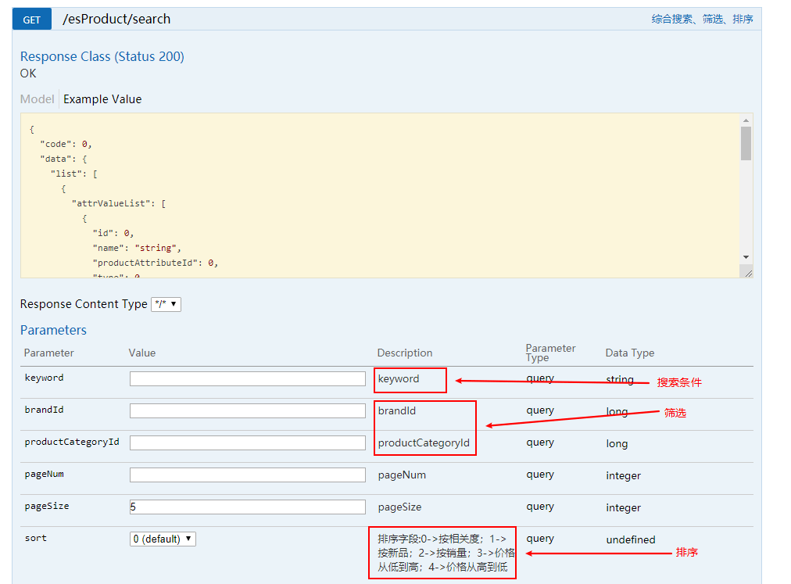

- 这里我们有一点特殊的需求，比如商品名称匹配关键字的的商品我们认为与搜索条件更匹配，其次是副标题和关键字，这时就需要用到`function_score`查询了；

- 在Elasticsearch中搜索到文档的相关性由`_score`字段来表示的，文档的`_score`字段值越高，表示与搜索条件越匹配，而`function_score`查询可以通过设置权重来影响`_score`字段值，使用它我们就可以实现上面的需求了；

- 使用Query DSL调用Elasticsearch的Restful API实现，可以发现商品名称权重设置为了10，商品副标题权重设置为了5，商品关键字设置为了2；

```
POST /pms/product/_search
{
  "query": {
    "function_score": {
      "query": {
        "bool": {
          "must": [
            {
              "match_all": {}
            }
          ],
          "filter": {
            "bool": {
              "must": [
                {
                  "term": {
                    "brandId": 6
                  }
                },
                {
                  "term": {
                    "productCategoryId": 19
                  }
                }
              ]
            }
          }
        }
      },
      "functions": [
        {
          "filter": {
            "match": {
              "name": "小米"
            }
          },
          "weight": 10
        },
        {
          "filter": {
            "match": {
              "subTitle": "小米"
            }
          },
          "weight": 5
        },
        {
          "filter": {
            "match": {
              "keywords": "小米"
            }
          },
          "weight": 2
        }
      ],
      "score_mode": "sum",
      "min_score": 2
    }
  },
  "sort": [
    {
      "_score": {
        "order": "desc"
      }
    }
  ]
}
```

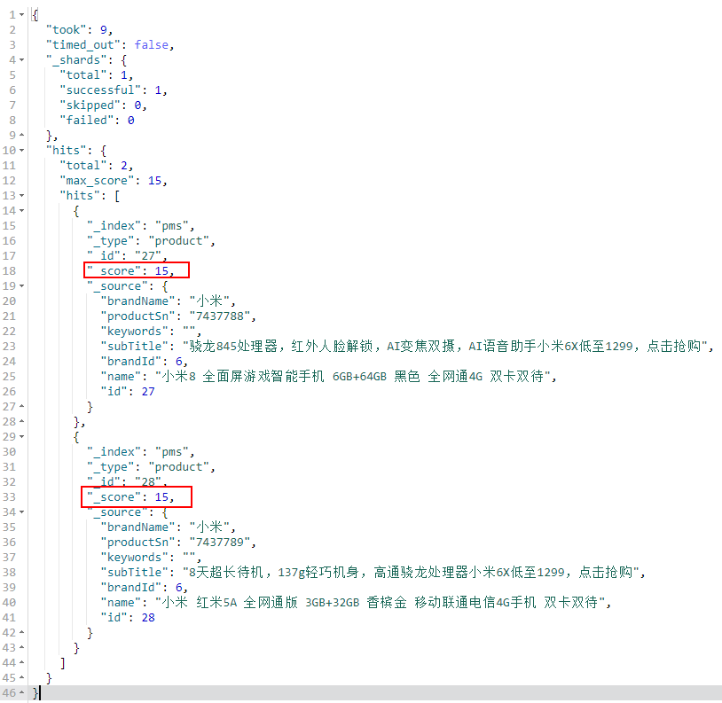

- 在SpringBoot中实现，使用Elasticsearch Repositories的search方法来实现，但需要自定义查询条件QueryBuilder；

```java
/**
 * 商品搜索管理Service实现类
 * Created by macro on 2018/6/19.
 */
@Service
public class EsProductServiceImpl implements EsProductService {
    @Override
    public Page<EsProduct> search(String keyword, Long brandId, Long productCategoryId, Integer pageNum, Integer pageSize,Integer sort) {
        Pageable pageable = PageRequest.of(pageNum, pageSize);
        NativeSearchQueryBuilder nativeSearchQueryBuilder = new NativeSearchQueryBuilder();
        //分页
        nativeSearchQueryBuilder.withPageable(pageable);
        //过滤
        if (brandId != null || productCategoryId != null) {
            BoolQueryBuilder boolQueryBuilder = QueryBuilders.boolQuery();
            if (brandId != null) {
                boolQueryBuilder.must(QueryBuilders.termQuery("brandId", brandId));
            }
            if (productCategoryId != null) {
                boolQueryBuilder.must(QueryBuilders.termQuery("productCategoryId", productCategoryId));
            }
            nativeSearchQueryBuilder.withFilter(boolQueryBuilder);
        }
        //搜索
        if (StringUtils.isEmpty(keyword)) {
            nativeSearchQueryBuilder.withQuery(QueryBuilders.matchAllQuery());
        } else {
            List<FunctionScoreQueryBuilder.FilterFunctionBuilder> filterFunctionBuilders = new ArrayList<>();
            filterFunctionBuilders.add(new FunctionScoreQueryBuilder.FilterFunctionBuilder(QueryBuilders.matchQuery("name", keyword),
                    ScoreFunctionBuilders.weightFactorFunction(10)));
            filterFunctionBuilders.add(new FunctionScoreQueryBuilder.FilterFunctionBuilder(QueryBuilders.matchQuery("subTitle", keyword),
                    ScoreFunctionBuilders.weightFactorFunction(5)));
            filterFunctionBuilders.add(new FunctionScoreQueryBuilder.FilterFunctionBuilder(QueryBuilders.matchQuery("keywords", keyword),
                    ScoreFunctionBuilders.weightFactorFunction(2)));
            FunctionScoreQueryBuilder.FilterFunctionBuilder[] builders = new FunctionScoreQueryBuilder.FilterFunctionBuilder[filterFunctionBuilders.size()];
            filterFunctionBuilders.toArray(builders);
            FunctionScoreQueryBuilder functionScoreQueryBuilder = QueryBuilders.functionScoreQuery(builders)
                    .scoreMode(FunctionScoreQuery.ScoreMode.SUM)
                    .setMinScore(2);
            nativeSearchQueryBuilder.withQuery(functionScoreQueryBuilder);
        }
        //排序
        if(sort==1){
            //按新品从新到旧
            nativeSearchQueryBuilder.withSort(SortBuilders.fieldSort("id").order(SortOrder.DESC));
        }else if(sort==2){
            //按销量从高到低
            nativeSearchQueryBuilder.withSort(SortBuilders.fieldSort("sale").order(SortOrder.DESC));
        }else if(sort==3){
            //按价格从低到高
            nativeSearchQueryBuilder.withSort(SortBuilders.fieldSort("price").order(SortOrder.ASC));
        }else if(sort==4){
            //按价格从高到低
            nativeSearchQueryBuilder.withSort(SortBuilders.fieldSort("price").order(SortOrder.DESC));
        }else{
            //按相关度
            nativeSearchQueryBuilder.withSort(SortBuilders.scoreSort().order(SortOrder.DESC));
        }
        nativeSearchQueryBuilder.withSort(SortBuilders.scoreSort().order(SortOrder.DESC));
        NativeSearchQuery searchQuery = nativeSearchQueryBuilder.build();
        LOGGER.info("DSL:{}", searchQuery.getQuery().toString());
        return productRepository.search(searchQuery);
    }
}
```

## 相关商品推荐

> 当我们查看相关商品的时候，一般底部会有一些商品推荐，这里使用Elasticsearch来简单实现下。

- 首先来说下我们的需求，可以根据指定商品的ID来查找相关商品，看下接口文档有助于理解；

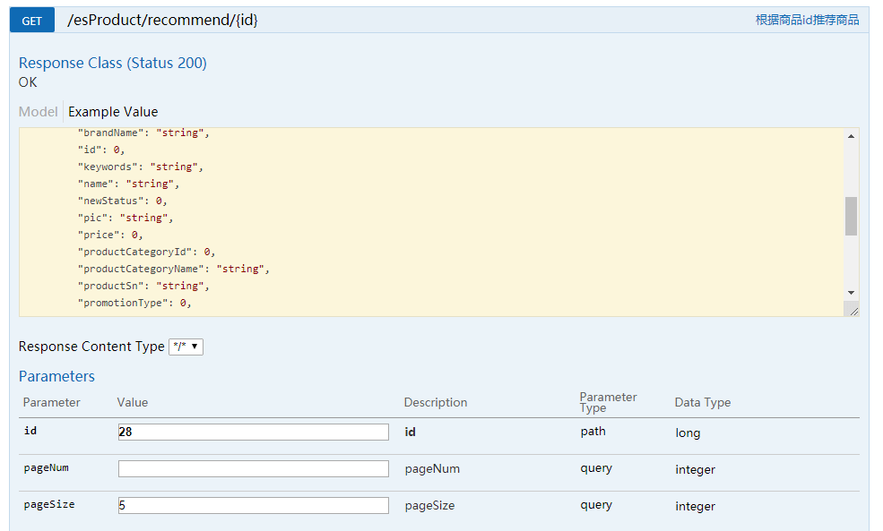

- 这里我们的实现原理是这样的：首先根据ID获取指定商品信息，然后以指定商品的名称、品牌和分类来搜索商品，并且要过滤掉当前商品，调整搜索条件中的权重以获取最好的匹配度；

- 使用Query DSL调用Elasticsearch的Restful API实现；

```
POST /pms/product/_search
{
  "query": {
    "function_score": {
      "query": {
        "bool": {
          "must": [
            {
              "match_all": {}
            }
          ],
          "filter": {
            "bool": {
              "must_not": {
                "term": {
                  "id": 28
                }
              }
            }
          }
        }
      },
      "functions": [
        {
          "filter": {
            "match": {
              "name": "红米5A"
            }
          },
          "weight": 8
        },
        {
          "filter": {
            "match": {
              "subTitle": "红米5A"
            }
          },
          "weight": 2
        },
        {
          "filter": {
            "match": {
              "keywords": "红米5A"
            }
          },
          "weight": 2
        },
        {
          "filter": {
            "term": {
              "brandId": 6
            }
          },
          "weight": 5
        },
        {
          "filter": {
            "term": {
              "productCategoryId": 19
            }
          },
          "weight": 3
        }
      ],
      "score_mode": "sum",
      "min_score": 2
    }
  }
}
```

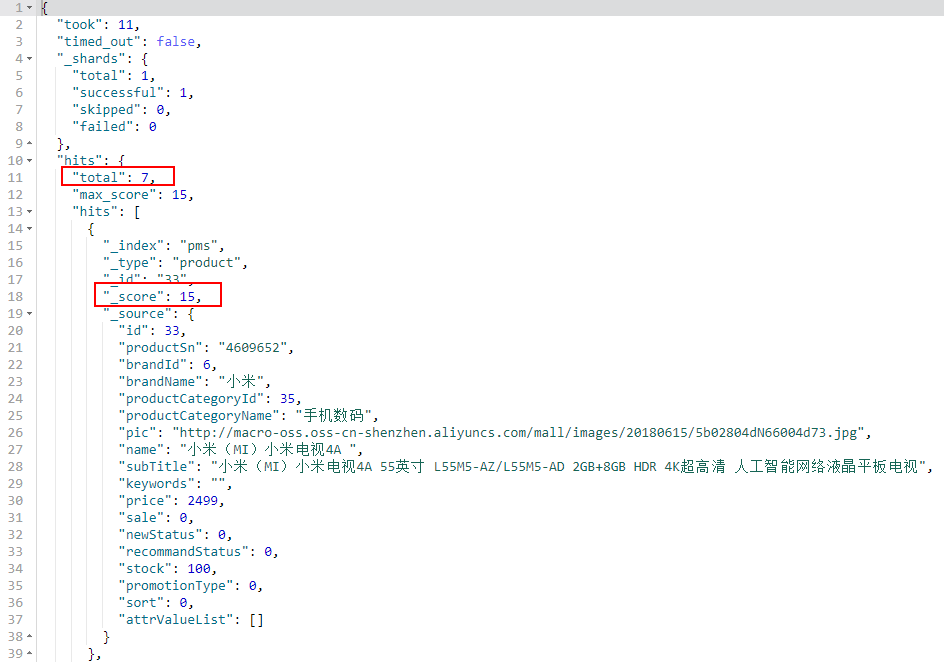

- 在SpringBoot中实现，使用Elasticsearch Repositories的search方法来实现，但需要自定义查询条件QueryBuilder；

```java
/**
 * 商品搜索管理Service实现类
 * Created by macro on 2018/6/19.
 */
@Service
public class EsProductServiceImpl implements EsProductService {
    @Override
    public Page<EsProduct> recommend(Long id, Integer pageNum, Integer pageSize) {
        Pageable pageable = PageRequest.of(pageNum, pageSize);
        List<EsProduct> esProductList = productDao.getAllEsProductList(id);
        if (esProductList.size() > 0) {
            EsProduct esProduct = esProductList.get(0);
            String keyword = esProduct.getName();
            Long brandId = esProduct.getBrandId();
            Long productCategoryId = esProduct.getProductCategoryId();
            //根据商品标题、品牌、分类进行搜索
            List<FunctionScoreQueryBuilder.FilterFunctionBuilder> filterFunctionBuilders = new ArrayList<>();
            filterFunctionBuilders.add(new FunctionScoreQueryBuilder.FilterFunctionBuilder(QueryBuilders.matchQuery("name", keyword),
                    ScoreFunctionBuilders.weightFactorFunction(8)));
            filterFunctionBuilders.add(new FunctionScoreQueryBuilder.FilterFunctionBuilder(QueryBuilders.matchQuery("subTitle", keyword),
                    ScoreFunctionBuilders.weightFactorFunction(2)));
            filterFunctionBuilders.add(new FunctionScoreQueryBuilder.FilterFunctionBuilder(QueryBuilders.matchQuery("keywords", keyword),
                    ScoreFunctionBuilders.weightFactorFunction(2)));
            filterFunctionBuilders.add(new FunctionScoreQueryBuilder.FilterFunctionBuilder(QueryBuilders.matchQuery("brandId", brandId),
                    ScoreFunctionBuilders.weightFactorFunction(5)));
            filterFunctionBuilders.add(new FunctionScoreQueryBuilder.FilterFunctionBuilder(QueryBuilders.matchQuery("productCategoryId", productCategoryId),
                    ScoreFunctionBuilders.weightFactorFunction(3)));
            FunctionScoreQueryBuilder.FilterFunctionBuilder[] builders = new FunctionScoreQueryBuilder.FilterFunctionBuilder[filterFunctionBuilders.size()];
            filterFunctionBuilders.toArray(builders);
            FunctionScoreQueryBuilder functionScoreQueryBuilder = QueryBuilders.functionScoreQuery(builders)
                    .scoreMode(FunctionScoreQuery.ScoreMode.SUM)
                    .setMinScore(2);
            //用于过滤掉相同的商品
            BoolQueryBuilder boolQueryBuilder = new BoolQueryBuilder();
            boolQueryBuilder.mustNot(QueryBuilders.termQuery("id",id));
            //构建查询条件
            NativeSearchQueryBuilder builder = new NativeSearchQueryBuilder();
            builder.withQuery(functionScoreQueryBuilder);
            builder.withFilter(boolQueryBuilder);
            builder.withPageable(pageable);
            NativeSearchQuery searchQuery = builder.build();
            LOGGER.info("DSL:{}", searchQuery.getQuery().toString());
            return productRepository.search(searchQuery);
        }
        return new PageImpl<>(null);
    }
}
```

## 聚合搜索商品相关信息

> 在搜索商品时，经常会有一个筛选界面来帮助我们找到想要的商品，这里使用Elasticsearch来简单实现下。

- 首先来说下我们的需求，可以根据搜索关键字获取到与关键字匹配商品相关的分类、品牌以及属性，下面这张图有助于理解；

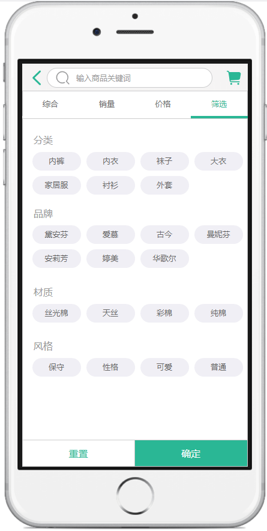

- 这里我们可以使用Elasticsearch的聚合来实现，搜索出相关商品，聚合出商品的品牌、商品的分类以及商品的属性，只要出现次数最多的前十个即可；

- 使用Query DSL调用Elasticsearch的Restful API实现；

```
POST /pms/product/_search
{
  "query": {
    "multi_match": {
      "query": "小米",
      "fields": [
        "name",
        "subTitle",
        "keywords"
      ]
    }
  },
  "size": 0,
  "aggs": {
    "brandNames": {
      "terms": {
        "field": "brandName",
        "size": 10
      }
    },
    "productCategoryNames": {
      "terms": {
        "field": "productCategoryName",
        "size": 10
      }
    },
    "allAttrValues": {
      "nested": {
        "path": "attrValueList"
      },
      "aggs": {
        "productAttrs": {
          "filter": {
            "term": {
              "attrValueList.type": 1
            }
          },
          "aggs": {
            "attrIds": {
              "terms": {
                "field": "attrValueList.productAttributeId",
                "size": 10
              },
              "aggs": {
                "attrValues": {
                  "terms": {
                    "field": "attrValueList.value",
                    "size": 10
                  }
                },
                "attrNames": {
                  "terms": {
                    "field": "attrValueList.name",
                    "size": 10
                  }
                }
              }
            }
          }
        }
      }
    }
  }
}
```

- 比如我们搜索`小米`这个关键字的时候，聚合出了下面的分类和品牌信息；

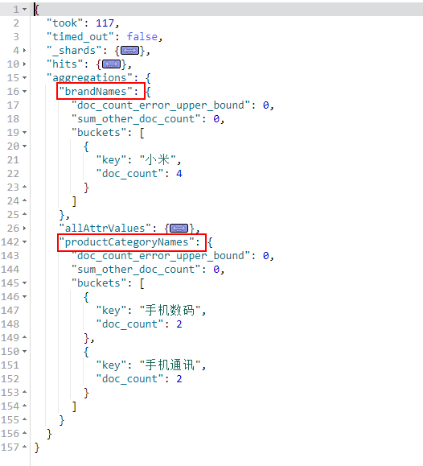

- 聚合出了`屏幕尺寸`为`5.0`和`5.8`的筛选属性信息；

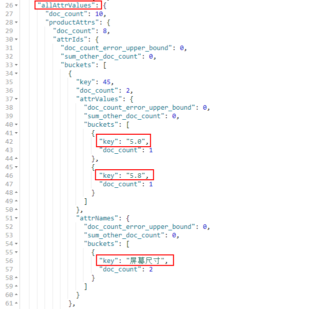

- 在SpringBoot中实现，聚合操作比较复杂，已经超出了Elasticsearch Repositories的使用范围，需要直接使用ElasticsearchTemplate来实现；

```java
/**
 * 商品搜索管理Service实现类
 * Created by macro on 2018/6/19.
 */
@Service
public class EsProductServiceImpl implements EsProductService {
    @Override
    public EsProductRelatedInfo searchRelatedInfo(String keyword) {
        NativeSearchQueryBuilder builder = new NativeSearchQueryBuilder();
        //搜索条件
        if(StringUtils.isEmpty(keyword)){
            builder.withQuery(QueryBuilders.matchAllQuery());
        }else{
            builder.withQuery(QueryBuilders.multiMatchQuery(keyword,"name","subTitle","keywords"));
        }
        //聚合搜索品牌名称
        builder.addAggregation(AggregationBuilders.terms("brandNames").field("brandName"));
        //集合搜索分类名称
        builder.addAggregation(AggregationBuilders.terms("productCategoryNames").field("productCategoryName"));
        //聚合搜索商品属性，去除type=1的属性
        AbstractAggregationBuilder aggregationBuilder = AggregationBuilders.nested("allAttrValues","attrValueList")
                .subAggregation(AggregationBuilders.filter("productAttrs",QueryBuilders.termQuery("attrValueList.type",1))
                .subAggregation(AggregationBuilders.terms("attrIds")
                        .field("attrValueList.productAttributeId")
                        .subAggregation(AggregationBuilders.terms("attrValues")
                                .field("attrValueList.value"))
                        .subAggregation(AggregationBuilders.terms("attrNames")
                                .field("attrValueList.name"))));
        builder.addAggregation(aggregationBuilder);
        NativeSearchQuery searchQuery = builder.build();
        return elasticsearchTemplate.query(searchQuery, response -> {
            LOGGER.info("DSL:{}",searchQuery.getQuery().toString());
            return convertProductRelatedInfo(response);
        });
    }

    /**
     * 将返回结果转换为对象
     */
    private EsProductRelatedInfo convertProductRelatedInfo(SearchResponse response) {
        EsProductRelatedInfo productRelatedInfo = new EsProductRelatedInfo();
        Map<String, Aggregation> aggregationMap = response.getAggregations().getAsMap();
        //设置品牌
        Aggregation brandNames = aggregationMap.get("brandNames");
        List<String> brandNameList = new ArrayList<>();
        for(int i = 0; i<((Terms) brandNames).getBuckets().size(); i++){
            brandNameList.add(((Terms) brandNames).getBuckets().get(i).getKeyAsString());
        }
        productRelatedInfo.setBrandNames(brandNameList);
        //设置分类
        Aggregation productCategoryNames = aggregationMap.get("productCategoryNames");
        List<String> productCategoryNameList = new ArrayList<>();
        for(int i=0;i<((Terms) productCategoryNames).getBuckets().size();i++){
            productCategoryNameList.add(((Terms) productCategoryNames).getBuckets().get(i).getKeyAsString());
        }
        productRelatedInfo.setProductCategoryNames(productCategoryNameList);
        //设置参数
        Aggregation productAttrs = aggregationMap.get("allAttrValues");
        List<LongTerms.Bucket> attrIds = ((LongTerms) ((InternalFilter) ((InternalNested) productAttrs).getProperty("productAttrs")).getProperty("attrIds")).getBuckets();
        List<EsProductRelatedInfo.ProductAttr> attrList = new ArrayList<>();
        for (Terms.Bucket attrId : attrIds) {
            EsProductRelatedInfo.ProductAttr attr = new EsProductRelatedInfo.ProductAttr();
            attr.setAttrId((Long) attrId.getKey());
            List<String> attrValueList = new ArrayList<>();
            List<StringTerms.Bucket> attrValues = ((StringTerms) attrId.getAggregations().get("attrValues")).getBuckets();
            List<StringTerms.Bucket> attrNames = ((StringTerms) attrId.getAggregations().get("attrNames")).getBuckets();
            for (Terms.Bucket attrValue : attrValues) {
                attrValueList.add(attrValue.getKeyAsString());
            }
            attr.setAttrValues(attrValueList);
            if(!CollectionUtils.isEmpty(attrNames)){
                String attrName = attrNames.get(0).getKeyAsString();
                attr.setAttrName(attrName);
            }
            attrList.add(attr);
        }
        productRelatedInfo.setProductAttrs(attrList);
        return productRelatedInfo;
    }
}
```

## 参考资料

> 关于Spring Data Elasticsearch的具体使用可以参考官方文档。

https://docs.spring.io/spring-data/elasticsearch/docs/3.2.6.RELEASE/reference/html/#reference

## 项目地址

[https://github.com/macrozheng/mall](https://github.com/macrozheng/mall)

## 公众号

