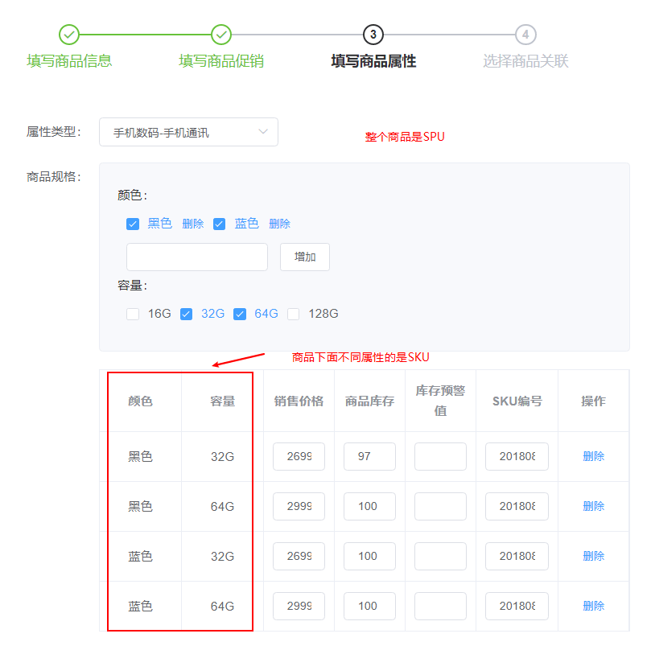
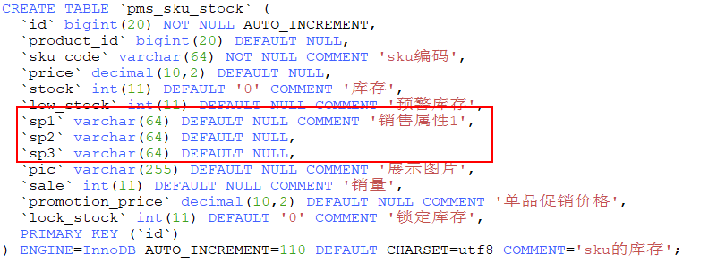
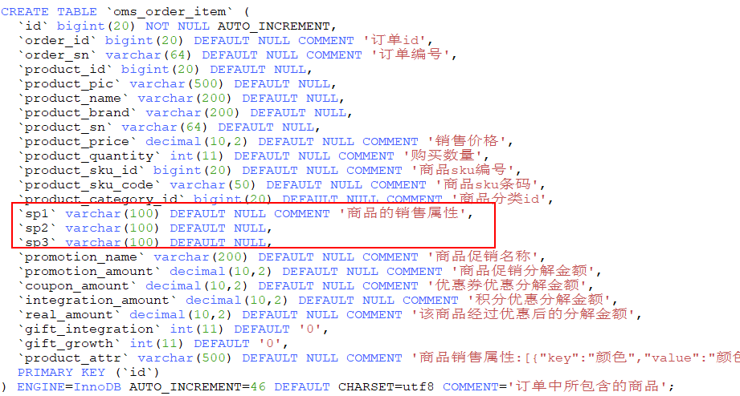
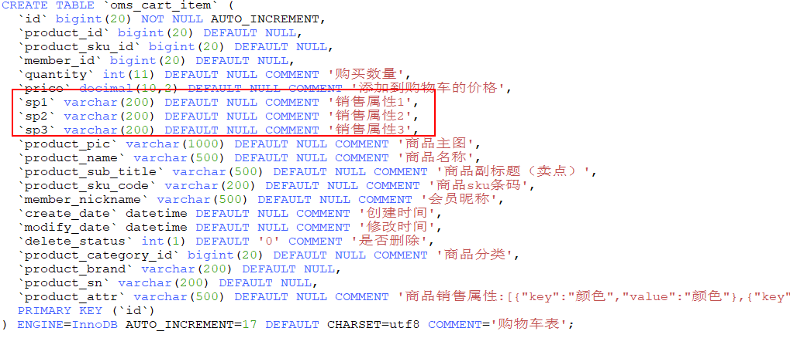
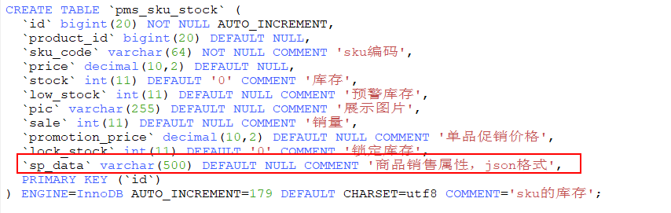
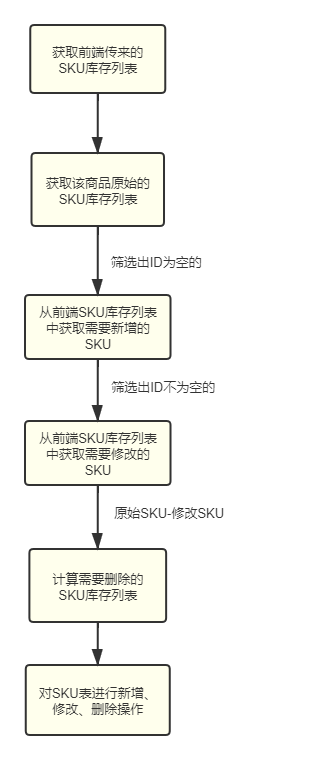

mall项目全套学习教程连载中，[关注公众号](#公众号)第一时间获取。

# 商品SKU功能设计与优化

> 原来的商品SKU设计存在着两个问题，一个是SKU表设计上面比较固化，无法扩展。另一个是当修改了商品信息之后，商品SKU的ID会发生变化，由于购物车表和订单商品表都关联了商品SKU的ID，这样就会导致匹配不上。最近对这两个问题做了点优化，下面来聊聊优化的思路。

## 商品的SPU和SKU

> 首先我们来了解下商品SPU和SKU的概念，可能很多没有接触过电商的朋友都不了解。

- SPU（Standard Product Unit ）:指的是标准商品单位，商品信息聚合的最小单位，是一组可复用、易检索的标准化信息的集合，该集合描述了一个商品的特性；
- SKU（Stock Keeping Unit）:库存量单位，是物理上不可分割的最小存货单元。

举个例子：比如说现在有个手机商品叫小米8，小米8有不同的属性，比如有它有黑色和蓝色的，有32G和64G版本的。此时`小米8`就是一个SPU，而`小米8黑色64G`就是一个SKU。



## 商品的SKU设计

### 以前的设计

商品的SKU信息是存储在`pms_sku_stock`表中的，使用sp1、sp2、sp3这三个属性来存储商品的销售属性，这样做很不灵活，也难以扩展。



这种做法也带来了后续的问题，比如我们的购物车和订单都会需要存储销售属性，这样的话都会需要添加sp1、sp2、sp3的属性。





### 改进后的设计

由于商品的销售属性是动态的，没法确定到底有多少个，此时我们可以改用JSON格式来存储，在`pms_sku_stock`表中添加了`sp_data`字段。



`sp_data`存储的就是一个JSON数组，比如颜色为黑色，容量为32G的手机存储信息如下。

```json
[
    {
        "key": "颜色",
        "value": "黑色"
    },
    {
        "key": "容量",
        "value": "32G"
    }
]
```

这样修改以后，在原来的购物车表`oms_cart_item`和订单商品表`oms_order_item`中就都可以用JSON格式来存储销售属性了，使用的是`product_attr`字段。

## 商品关联SKU的修改

### 以前的做法

商品的SKU信息作为商品的关联信息，在修改商品信息时会同时进行修改。以前的做法是直接删除该商品的所有SKU信息，再重新添加。这样就会导致商品SKU中的ID被修改，由于在购物车和订单商品中关联了商品SKU的ID，就会导致原来的ID失效的问题。下面是原来修改商品中SKU信息的代码。

```java
/**
 * 商品管理Service实现类
 * Created by macro on 2018/4/26.
 */
@Service
public class PmsProductServiceImpl implements PmsProductService {
    
        @Override
        public int update(Long id, PmsProductParam productParam) {
            //省略若干代码...
            //删除该商品关联的SKU
            PmsSkuStockExample skuStockExample = new PmsSkuStockExample();
            skuStockExample.createCriteria().andProductIdEqualTo(id);
            skuStockMapper.deleteByExample(skuStockExample);
            handleSkuStockCode(productParam.getSkuStockList(),id);
            //插入传入的所有SKU
            relateAndInsertList(skuStockDao, productParam.getSkuStockList(), id);
        }
}
```

### 改进后的做法

首先我们需要和前端约定下，新增的商品SKU信息不传ID，要修改的商品SKU信息传ID，删除的直接不传SKU信息。然后我们可以根据传入的SKU信息来确定需要新增、修改、删除的SKU信息，这样就可以做到在更新商品SKU信息时，不改变原来商品SKU的ID了，具体流程如下。



具体代码实现如下：

```java
/**
 * 商品管理Service实现类
 * Created by macro on 2018/4/26.
 */
@Service
public class PmsProductServiceImpl implements PmsProductService {
    private void handleUpdateSkuStockList(Long id, PmsProductParam productParam) {
        //当前的sku信息
        List<PmsSkuStock> currSkuList = productParam.getSkuStockList();
        //当前没有sku直接删除
        if(CollUtil.isEmpty(currSkuList)){
            PmsSkuStockExample skuStockExample = new PmsSkuStockExample();
            skuStockExample.createCriteria().andProductIdEqualTo(id);
            skuStockMapper.deleteByExample(skuStockExample);
            return;
        }
        //获取初始sku信息
        PmsSkuStockExample skuStockExample = new PmsSkuStockExample();
        skuStockExample.createCriteria().andProductIdEqualTo(id);
        List<PmsSkuStock> oriStuList = skuStockMapper.selectByExample(skuStockExample);
        //获取新增sku信息
        List<PmsSkuStock> insertSkuList = currSkuList.stream().filter(item->item.getId()==null).collect(Collectors.toList());
        //获取需要更新的sku信息
        List<PmsSkuStock> updateSkuList = currSkuList.stream().filter(item->item.getId()!=null).collect(Collectors.toList());
        List<Long> updateSkuIds = updateSkuList.stream().map(PmsSkuStock::getId).collect(Collectors.toList());
        //获取需要删除的sku信息
        List<PmsSkuStock> removeSkuList = oriStuList.stream().filter(item-> !updateSkuIds.contains(item.getId())).collect(Collectors.toList());
        handleSkuStockCode(insertSkuList,id);
        handleSkuStockCode(updateSkuList,id);
        //新增sku
        if(CollUtil.isNotEmpty(insertSkuList)){
            relateAndInsertList(skuStockDao, insertSkuList, id);
        }
        //删除sku
        if(CollUtil.isNotEmpty(removeSkuList)){
            List<Long> removeSkuIds = removeSkuList.stream().map(PmsSkuStock::getId).collect(Collectors.toList());
            PmsSkuStockExample removeExample = new PmsSkuStockExample();
            removeExample.createCriteria().andIdIn(removeSkuIds);
            skuStockMapper.deleteByExample(removeExample);
        }
        //修改sku
        if(CollUtil.isNotEmpty(updateSkuList)){
            for (PmsSkuStock pmsSkuStock : updateSkuList) {
                skuStockMapper.updateByPrimaryKeySelective(pmsSkuStock);
            }
        }

    }
}
```

## 总结

如果我们要在数据库中存储一些格式不固定的属性时，可以采用JSON的形式进行存储。对于关联属性的修改，可以通过一些逻辑操作来实现不改变原有ID的修改。

## 项目源码地址

[https://github.com/macrozheng/mall](https://github.com/macrozheng/mall)

## 公众号


