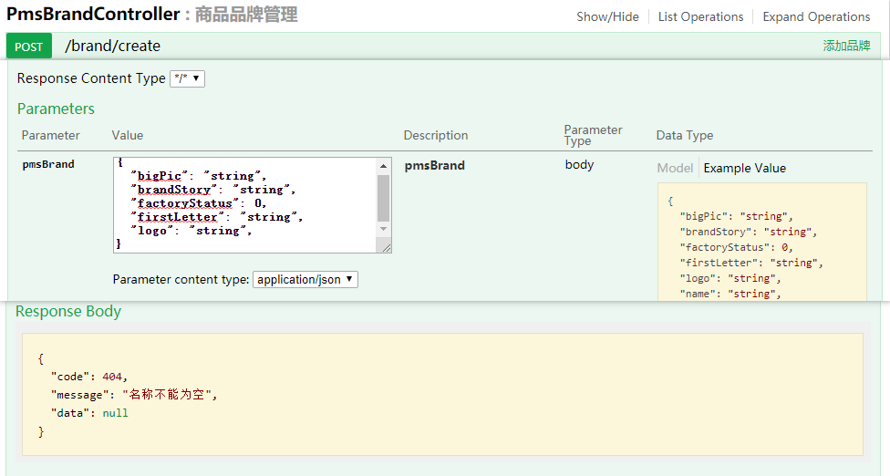
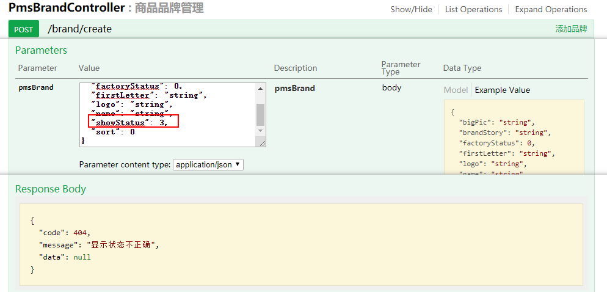
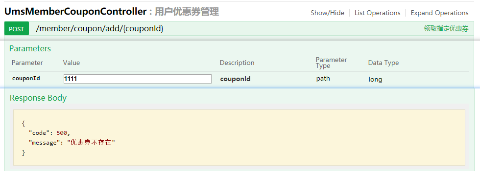

mall项目全套学习教程连载中，[关注公众号](#公众号)第一时间获取。

# SpringBoot中处理校验逻辑的两种方式，真的很机智！

> 平时在开发接口的时候，常常会需要对参数进行校验，这里提供两种处理校验逻辑的方式。一种是使用Hibernate Validator来处理，另一种是使用全局异常来处理，下面我们讲下这两种方式的用法。

## Hibernate Validator

> Hibernate Validator是SpringBoot内置的校验框架，只要集成了SpringBoot就自动集成了它，我们可以通过在对象上面使用它提供的注解来完成参数校验。

### 常用注解

> 我们先来了解下常用的注解，对Hibernate Validator所提供的校验功能有个印象。

- @Null：被注释的属性必须为null；
- @NotNull：被注释的属性不能为null；
- @AssertTrue：被注释的属性必须为true；
- @AssertFalse：被注释的属性必须为false；
- @Min：被注释的属性必须大于等于其value值；
- @Max：被注释的属性必须小于等于其value值；
- @Size：被注释的属性必须在其min和max值之间；
- @Pattern：被注释的属性必须符合其regexp所定义的正则表达式；
- @NotBlank：被注释的字符串不能为空字符串；
- @NotEmpty：被注释的属性不能为空；
- @Email：被注释的属性必须符合邮箱格式。

### 使用方式

> 接下来我们以添加品牌接口的参数校验为例来讲解下Hibernate Validator的使用方法，其中涉及到一些AOP的知识，不了解的朋友可以参考下[《SpringBoot应用中使用AOP记录接口访问日志》](https://mp.weixin.qq.com/s/mNujRjejQ1bITveFI6gkcg)。

- 首先我们需要在添加品牌接口的参数`PmsBrandParam`中添加校验注解，用于确定属性的校验规则及校验失败后需要返回的信息；

```java
/**
 * 品牌传递参数
 * Created by macro on 2018/4/26.
 */
public class PmsBrandParam {
    @ApiModelProperty(value = "品牌名称",required = true)
    @NotEmpty(message = "名称不能为空")
    private String name;
    @ApiModelProperty(value = "品牌首字母")
    private String firstLetter;
    @ApiModelProperty(value = "排序字段")
    @Min(value = 0, message = "排序最小为0")
    private Integer sort;
    @ApiModelProperty(value = "是否为厂家制造商")
    @FlagValidator(value = {"0","1"}, message = "厂家状态不正确")
    private Integer factoryStatus;
    @ApiModelProperty(value = "是否进行显示")
    @FlagValidator(value = {"0","1"}, message = "显示状态不正确")
    private Integer showStatus;
    @ApiModelProperty(value = "品牌logo",required = true)
    @NotEmpty(message = "品牌logo不能为空")
    private String logo;
    @ApiModelProperty(value = "品牌大图")
    private String bigPic;
    @ApiModelProperty(value = "品牌故事")
    private String brandStory;

   //省略若干Getter和Setter方法...
}
```

- 然后在添加品牌的接口中添加@Validated注解，并注入一个BindingResult参数；

```java
/**
 * 品牌功能Controller
 * Created by macro on 2018/4/26.
 */
@Controller
@Api(tags = "PmsBrandController", description = "商品品牌管理")
@RequestMapping("/brand")
public class PmsBrandController {
    @Autowired
    private PmsBrandService brandService;

    @ApiOperation(value = "添加品牌")
    @RequestMapping(value = "/create", method = RequestMethod.POST)
    @ResponseBody
    public CommonResult create(@Validated @RequestBody PmsBrandParam pmsBrand, BindingResult result) {
        CommonResult commonResult;
        int count = brandService.createBrand(pmsBrand);
        if (count == 1) {
            commonResult = CommonResult.success(count);
        } else {
            commonResult = CommonResult.failed();
        }
        return commonResult;
    }
}
```

- 然后在整个Controller层创建一个切面，在其环绕通知中获取到注入的BindingResult对象，通过hasErrors方法判断校验是否通过，如果有错误信息直接返回错误信息，验证通过则放行；

```java
/**
 * HibernateValidator错误结果处理切面
 * Created by macro on 2018/4/26.
 */
@Aspect
@Component
@Order(2)
public class BindingResultAspect {
    @Pointcut("execution(public * com.macro.mall.controller.*.*(..))")
    public void BindingResult() {
    }

    @Around("BindingResult()")
    public Object doAround(ProceedingJoinPoint joinPoint) throws Throwable {
        Object[] args = joinPoint.getArgs();
        for (Object arg : args) {
            if (arg instanceof BindingResult) {
                BindingResult result = (BindingResult) arg;
                if (result.hasErrors()) {
                    FieldError fieldError = result.getFieldError();
                    if(fieldError!=null){
                        return CommonResult.validateFailed(fieldError.getDefaultMessage());
                    }else{
                        return CommonResult.validateFailed();
                    }
                }
            }
        }
        return joinPoint.proceed();
    }
}
```

- 此时我们访问添加品牌的接口，不传入`name`字段，就会返回`名称不能为空`的错误信息；



### 自定义注解

> 有时候框架提供的校验注解并不能满足我们的需要，此时我们就需要自定义校验注解。比如还是上面的添加品牌，此时有个参数`showStatus`，我们希望它只能是0或者1，不能是其他数字，此时可以使用自定义注解来实现该功能。

- 首先自定义一个校验注解类FlagValidator，然后添加@Constraint注解，使用它的validatedBy属性指定校验逻辑的具体实现类；

```java
/**
 * 用户验证状态是否在指定范围内的注解
 * Created by macro on 2018/4/26.
 */
@Documented
@Retention(RetentionPolicy.RUNTIME)
@Target({ElementType.FIELD,ElementType.PARAMETER})
@Constraint(validatedBy = FlagValidatorClass.class)
public @interface FlagValidator {
    String[] value() default {};

    String message() default "flag is not found";

    Class<?>[] groups() default {};

    Class<? extends Payload>[] payload() default {};
}
```

- 然后创建FlagValidatorClass作为校验逻辑的具体实现类，实现ConstraintValidator接口，这里需要指定两个泛型参数，第一个需要指定为你自定义的校验注解类，第二个指定为你要校验属性的类型，isValid方法中就是具体的校验逻辑。

```java
/**
 * 状态标记校验器
 * Created by macro on 2018/4/26.
 */
public class FlagValidatorClass implements ConstraintValidator<FlagValidator,Integer> {
    private String[] values;
    @Override
    public void initialize(FlagValidator flagValidator) {
        this.values = flagValidator.value();
    }

    @Override
    public boolean isValid(Integer value, ConstraintValidatorContext constraintValidatorContext) {
        boolean isValid = false;
        if(value==null){
            //当状态为空时使用默认值
            return true;
        }
        for(int i=0;i<values.length;i++){
            if(values[i].equals(String.valueOf(value))){
                isValid = true;
                break;
            }
        }
        return isValid;
    }
}
```

- 接下来我们就可以在传参对象中使用该注解了；

```java
/**
 * 品牌传递参数
 * Created by macro on 2018/4/26.
 */
public class PmsBrandParam {

    @ApiModelProperty(value = "是否进行显示")
    @FlagValidator(value = {"0","1"}, message = "显示状态不正确")
    private Integer showStatus;

   //省略若干Getter和Setter方法...
}
```

- 最后我们测试下该注解，调用接口是传入`showStatus=3`，会返回`显示状态不正确`的错误信息。



### 优缺点

这种方式的优点是可以使用注解来实现参数校验，不需要一些重复的校验逻辑，但是也有一些缺点，比如需要在Controller的方法中额外注入一个BindingResult对象，只支持一些简单的校验，涉及到要查询数据库的校验就无法满足了。

## 全局异常处理

> 使用全局异常处理来处理校验逻辑的思路很简单，首先我们需要通过@ControllerAdvice注解定义一个全局异常的处理类，然后自定义一个校验异常，当我们在Controller中校验失败时，直接抛出该异常，这样就可以达到校验失败返回错误信息的目的了。

### 使用到的注解

@ControllerAdvice：类似于@Component注解，可以指定一个组件，这个组件主要用于增强@Controller注解修饰的类的功能，比如说进行全局异常处理。

@ExceptionHandler：用来修饰全局异常处理的方法，可以指定异常的类型。

### 使用方式

- 首先我们需要自定义一个异常类`ApiException`，当我们校验失败时抛出该异常：

```java
/**
 * 自定义API异常
 * Created by macro on 2020/2/27.
 */
public class ApiException extends RuntimeException {
    private IErrorCode errorCode;

    public ApiException(IErrorCode errorCode) {
        super(errorCode.getMessage());
        this.errorCode = errorCode;
    }

    public ApiException(String message) {
        super(message);
    }

    public ApiException(Throwable cause) {
        super(cause);
    }

    public ApiException(String message, Throwable cause) {
        super(message, cause);
    }

    public IErrorCode getErrorCode() {
        return errorCode;
    }
}
```

- 然后创建一个断言处理类`Asserts`，用于抛出各种`ApiException`；

```java
/**
 * 断言处理类，用于抛出各种API异常
 * Created by macro on 2020/2/27.
 */
public class Asserts {
    public static void fail(String message) {
        throw new ApiException(message);
    }

    public static void fail(IErrorCode errorCode) {
        throw new ApiException(errorCode);
    }
}
```

- 然后再创建我们的全局异常处理类`GlobalExceptionHandler`，用于处理全局异常，并返回封装好的CommonResult对象；

```java
/**
 * 全局异常处理
 * Created by macro on 2020/2/27.
 */
@ControllerAdvice
public class GlobalExceptionHandler {

    @ResponseBody
    @ExceptionHandler(value = ApiException.class)
    public CommonResult handle(ApiException e) {
        if (e.getErrorCode() != null) {
            return CommonResult.failed(e.getErrorCode());
        }
        return CommonResult.failed(e.getMessage());
    }
}
```

- 这里拿用户领取优惠券的代码为例，我们先对比下改进前后的代码，首先看Controller层代码。改进后只要Service中的方法执行成功就表示领取优惠券成功，因为领取不成功的话会直接抛出ApiException从而返回错误信息；

```java
/**
 * 用户优惠券管理Controller
 * Created by macro on 2018/8/29.
 */
@Controller
@Api(tags = "UmsMemberCouponController", description = "用户优惠券管理")
@RequestMapping("/member/coupon")
public class UmsMemberCouponController {
    @Autowired
    private UmsMemberCouponService memberCouponService;
    
    //改进前
    @ApiOperation("领取指定优惠券")
    @RequestMapping(value = "/add/{couponId}", method = RequestMethod.POST)
    @ResponseBody
    public CommonResult add(@PathVariable Long couponId) {
        return memberCouponService.add(couponId);
    }
    
    //改进后
    @ApiOperation("领取指定优惠券")
    @RequestMapping(value = "/add/{couponId}", method = RequestMethod.POST)
    @ResponseBody
    public CommonResult add(@PathVariable Long couponId) {
        memberCouponService.add(couponId);
        return CommonResult.success(null,"领取成功");
    }    
}
```

- 再看下Service接口中的代码，区别在于返回结果，改进后返回的是void。其实CommonResult的作用本来就是为了把Service中获取到的数据封装成统一返回结果，改进前的做法违背了这个原则，改进后的做法解决了这个问题；

```java
/**
 * 用户优惠券管理Service
 * Created by macro on 2018/8/29.
 */
public interface UmsMemberCouponService {
    /**
     * 会员添加优惠券（改进前）
     */
    @Transactional
    CommonResult add(Long couponId);

    /**
     * 会员添加优惠券（改进后）
     */
    @Transactional
    void add(Long couponId);
}
```

- 再看下Service实现类中的代码，可以看到原先校验逻辑中返回CommonResult的逻辑都改成了调用Asserts的fail方法来实现；

```java
/**
 * 会员优惠券管理Service实现类
 * Created by macro on 2018/8/29.
 */
@Service
public class UmsMemberCouponServiceImpl implements UmsMemberCouponService {
    @Autowired
    private UmsMemberService memberService;
    @Autowired
    private SmsCouponMapper couponMapper;
    @Autowired
    private SmsCouponHistoryMapper couponHistoryMapper;
    @Autowired
    private SmsCouponHistoryDao couponHistoryDao;
    
    //改进前
    @Override
    public CommonResult add(Long couponId) {
        UmsMember currentMember = memberService.getCurrentMember();
        //获取优惠券信息，判断数量
        SmsCoupon coupon = couponMapper.selectByPrimaryKey(couponId);
        if(coupon==null){
            return CommonResult.failed("优惠券不存在");
        }
        if(coupon.getCount()<=0){
            return CommonResult.failed("优惠券已经领完了");
        }
        Date now = new Date();
        if(now.before(coupon.getEnableTime())){
            return CommonResult.failed("优惠券还没到领取时间");
        }
        //判断用户领取的优惠券数量是否超过限制
        SmsCouponHistoryExample couponHistoryExample = new SmsCouponHistoryExample();
        couponHistoryExample.createCriteria().andCouponIdEqualTo(couponId).andMemberIdEqualTo(currentMember.getId());
        long count = couponHistoryMapper.countByExample(couponHistoryExample);
        if(count>=coupon.getPerLimit()){
            return CommonResult.failed("您已经领取过该优惠券");
        }
        //省略领取优惠券逻辑...
        return CommonResult.success(null,"领取成功");
    }
    
    //改进后
     @Override
     public void add(Long couponId) {
         UmsMember currentMember = memberService.getCurrentMember();
         //获取优惠券信息，判断数量
         SmsCoupon coupon = couponMapper.selectByPrimaryKey(couponId);
         if(coupon==null){
             Asserts.fail("优惠券不存在");
         }
         if(coupon.getCount()<=0){
             Asserts.fail("优惠券已经领完了");
         }
         Date now = new Date();
         if(now.before(coupon.getEnableTime())){
             Asserts.fail("优惠券还没到领取时间");
         }
         //判断用户领取的优惠券数量是否超过限制
         SmsCouponHistoryExample couponHistoryExample = new SmsCouponHistoryExample();
         couponHistoryExample.createCriteria().andCouponIdEqualTo(couponId).andMemberIdEqualTo(currentMember.getId());
         long count = couponHistoryMapper.countByExample(couponHistoryExample);
         if(count>=coupon.getPerLimit()){
             Asserts.fail("您已经领取过该优惠券");
         }
         //省略领取优惠券逻辑...
     }
}
```

- 这里我们输入一个没有的优惠券ID来测试下该功能，会返回`优惠券不存在`的错误信息。



### 优缺点

使用全局异常来处理校验逻辑的优点是比较灵活，可以处理复杂的校验逻辑。缺点是我们需要重复编写校验代码，不像使用Hibernate Validator那样只要使用注解就可以了。不过我们可以在上面的`Asserts`类中添加一些工具方法来增强它的功能，比如判断是否为空和判断长度等都可以自己实现。

## 总结

我们可以两种方法一起结合使用，比如简单的参数校验使用Hibernate Validator来实现，而一些涉及到数据库操作的复杂校验使用全局异常处理的方式来实现。

## 项目源码地址

[https://github.com/macrozheng/mall](https://github.com/macrozheng/mall)

## 公众号

