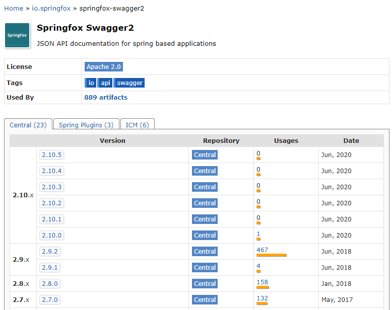
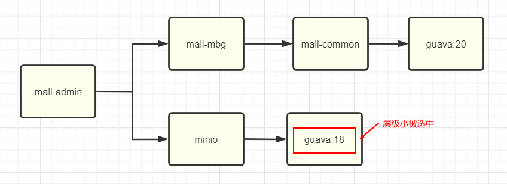
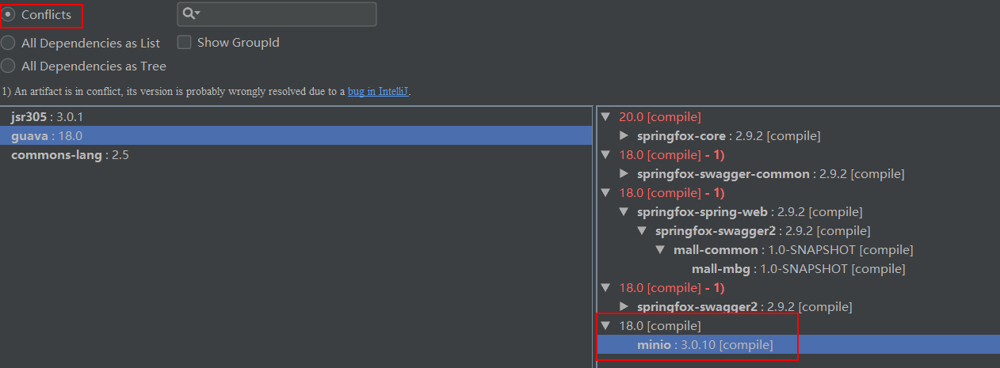
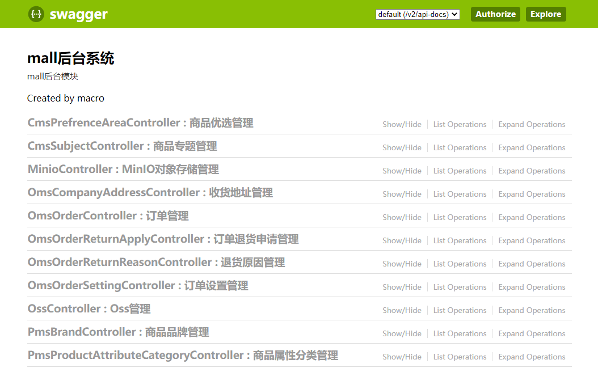
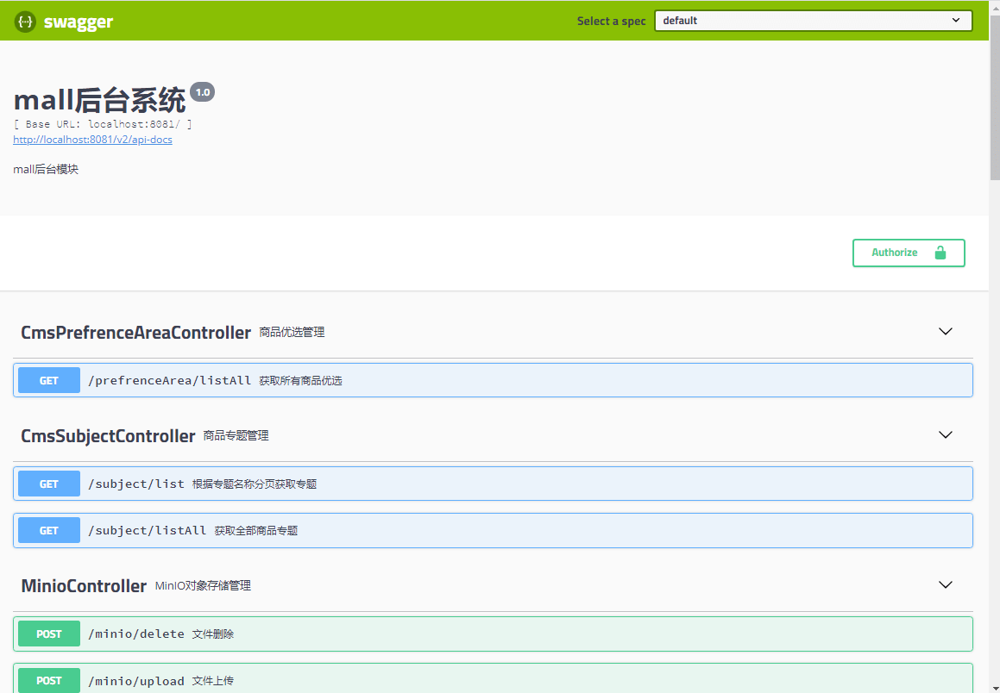

学习不走弯路，[关注公众号](#公众号) 回复「学习路线」，获取mall项目专属学习路线！

# 给Swagger升级了新版本，没想到居然有这么多坑！

> 看着`mall`项目中古老的Swagger API文档样式，这次我终于下定决心要给它升个级了。升级过程中遇到了好多坑，不过只要用好Maven，这些都不是个事！

## 选择升级版本

首先我们选择下需要升级的版本，直接去Maven仓库看下，哪个版本使用的比较多。虽然有最新版本`2.10.x`，但是几乎没什么人用，而上一个版本`2.9.x`使用的人却很多，看样子还是`2.9.x`版本比较稳定，我们选择升级到`2.9.2`版本。



## 升级Swagger

> 接下来我们就可以开始升级Swagger版本了，原来项目里用的是`2.7.0`版本。

- 由于`mall`项目使用父项目来统一管理依赖，所以只要修改父项目中的Swagger依赖版本即可，父项目的pom.xml在项目根目录下；

```xml
<properties>
    <swagger2.version>2.9.2</swagger2.version>
</properties>
```

- 运行`mall-admin`项目发现无法启动，报错信息如下，有个依赖里面的某个方法找不到了，一看是`guava`里面的，估计是版本的问题；

```
***************************
APPLICATION FAILED TO START
***************************

Description:

An attempt was made to call a method that does not exist. The attempt was made from the following location:

    springfox.documentation.schema.DefaultModelDependencyProvider.dependentModels(DefaultModelDependencyProvider.java:79)

The following method did not exist:

    com.google.common.collect.FluentIterable.concat(Ljava/lang/Iterable;Ljava/lang/Iterable;)Lcom/google/common/collect/FluentIterable;

The method's class, com.google.common.collect.FluentIterable, is available from the following locations:

    jar:file:/C:/Users/macrozheng/.m2/repository/com/google/guava/guava/18.0/guava-18.0.jar!/com/google/common/collect/FluentIterable.class

It was loaded from the following location:

    file:/C:/Users/macrozheng/.m2/repository/com/google/guava/guava/18.0/guava-18.0.jar


Action:

Correct the classpath of your application so that it contains a single, compatible version of com.google.common.collect.FluentIterable


Process finished with exit code 1

```

- 当有好几个依赖都使用了不同版本的`guava`包时，Maven是如何选择的呢？Maven是按照就近原则选择的，层级越是浅的依赖越会被选择；



- 此时推荐使用`Maven Helper`这款IDEA插件，直接查看`mall-admin`项目是否存在依赖冲突，guava版本果然冲突了；



- 通过观察可以发现`minio`这个依赖层级最浅，所以使用的是它的guava版本，直接排除掉即可；

```xml
<dependency>
    <groupId>io.minio</groupId>
    <artifactId>minio</artifactId>
    <exclusions>
        <exclusion>
            <artifactId>guava</artifactId>
            <groupId>com.google.guava</groupId>
        </exclusion>
    </exclusions>
</dependency>
```

- 排除完成后发现guava的依赖冲突已经不见了，再次运行`mall-admin`项目，发现已经可以正常运行了；


- 当我们访问Swagger文档时，又发现了一个问题，会报NumberFormatException异常；

```
java.lang.NumberFormatException: For input string: ""
	at java.lang.NumberFormatException.forInputString(NumberFormatException.java:65)
	at java.lang.Long.parseLong(Long.java:601)
	at java.lang.Long.valueOf(Long.java:803)
	at io.swagger.models.parameters.AbstractSerializableParameter.getExample(AbstractSerializableParameter.java:412)
```

- 原因是当我们使用@ApiModelProperty注解时，作为Long数据类型，如果你不添加`example`属性，默认值是空字符串，空字符串转型自然就会报NumberFormatException异常；

```java
/**
 * 修改订单费用信息参数
 * Created by macro on 2018/10/29.
 */
@Getter
@Setter
public class OmsMoneyInfoParam {
    @ApiModelProperty(value = "订单ID",example = "1")
    private Long orderId;
}
```

- 我们已经使用了很多@ApiModelProperty注解，要一个个添加那是不可能的，不过使用新版本的`swagger-annotations`和`swagger-models`依赖包就可以解决了，于是我们的Swagger依赖变成了下面这样的；

```xml
<dependencies>
    <dependency>
        <groupId>io.springfox</groupId>
        <artifactId>springfox-swagger2</artifactId>
        <exclusions>
            <exclusion>
                <groupId>io.swagger</groupId>
                <artifactId>swagger-annotations</artifactId>
            </exclusion>
            <exclusion>
                <groupId>io.swagger</groupId>
                <artifactId>swagger-models</artifactId>
            </exclusion>
        </exclusions>
    </dependency>
    <dependency>
        <groupId>io.springfox</groupId>
        <artifactId>springfox-swagger-ui</artifactId>
    </dependency>
    <!--解决Swagger 2.9.2版本NumberFormatException-->
    <dependency>
        <groupId>io.swagger</groupId>
        <artifactId>swagger-models</artifactId>
        <version>1.6.0</version>
    </dependency>
    <dependency>
        <groupId>io.swagger</groupId>
        <artifactId>swagger-annotations</artifactId>
        <version>1.6.0</version>
    </dependency>
</dependencies>
```

- 再次运行`mall-admin`发现该问题已经解决了，我们在maven中一发现不合适的依赖就排除掉，然后引入合适版本的依赖，这样做真的好么？

- 其实我们可以利用Maven项目的继承特性，直接在父项目中规定好依赖的版本，这样子项目的依赖版本就能统一了；

- 先把原来`pom.xml`中排除guava和swagger的配置给去除了，然后修改根目录下的pom.xml文件，指定版本号；

```xml
<properties>
    <swagger2.version>2.9.2</swagger2.version>
    <swagger-models.version>1.6.0</swagger-models.version>
    <swagger-annotations.version>1.6.0</swagger-annotations.version>
    <guava.version>20.0</guava.version>
</properties>
```

- 在父项目的依赖管理节点下添加需要统一管理的相关依赖，至此Swagger版本升级完成；

```xml
<dependencyManagement>
    <dependencies>
        <!--Swagger-UI API文档生产工具-->
        <dependency>
            <groupId>io.springfox</groupId>
            <artifactId>springfox-swagger2</artifactId>
            <version>${swagger2.version}</version>
        </dependency>
        <dependency>
            <groupId>io.springfox</groupId>
            <artifactId>springfox-swagger-ui</artifactId>
            <version>${swagger2.version}</version>
        </dependency>
        <!--解决Swagger 2.9.2版本NumberFormatException-->
        <dependency>
            <groupId>io.swagger</groupId>
            <artifactId>swagger-models</artifactId>
            <version>${swagger-models.version}</version>
        </dependency>
        <dependency>
            <groupId>io.swagger</groupId>
            <artifactId>swagger-annotations</artifactId>
            <version>${swagger-annotations.version}</version>
        </dependency>
        <!--统一Guava版本防止冲突-->
        <dependency>
            <groupId>com.google.guava</groupId>
            <artifactId>guava</artifactId>
            <version>${guava.version}</version>
        </dependency>
    </dependencies>
</dependencyManagement>
```

- 当我们配置好Token访问需要权限的接口时，会发现品牌、商品、商品分类下的接口有权限访问，其他提示无权限，那是因为我们使用了如下配置来配置需要登录认证的路径；

```java
@Configuration
@EnableSwagger2
public class Swagger2Config {

    private List<SecurityContext> securityContexts() {
        //设置需要登录认证的路径
        List<SecurityContext> result = new ArrayList<>();
        result.add(getContextByPath("/brand/.*"));
        result.add(getContextByPath("/product/.*"));
        result.add(getContextByPath("/productCategory/.*"));
        return result;
    }
}
```

- 修改为全部路径即可，这个和旧版有点不同，旧版访问所有接口都会在头信息中带Token，而新版只会对配置的路径带Token。

```java
@Configuration
@EnableSwagger2
public class Swagger2Config {
    private List<SecurityContext> securityContexts() {
        //设置需要登录认证的路径
        List<SecurityContext> result = new ArrayList<>();
        result.add(getContextByPath("/*/.*"));
        return result;
    }
}
```

## 新老版本界面对比

> Swagger升级到2.9.2版本后界面瞬间变得美观了，让我们对新老界面来个对比。

### 老版本



### 新版本



## 项目源码地址

https://github.com/macrozheng/mall

## 公众号


